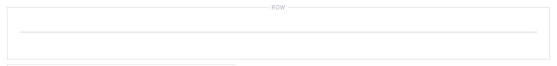
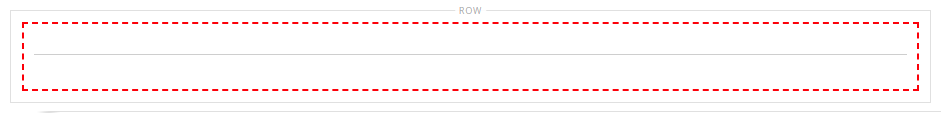
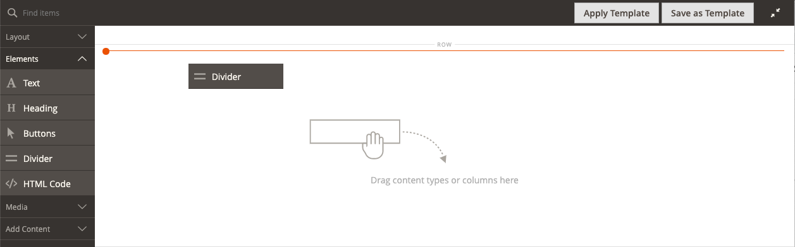
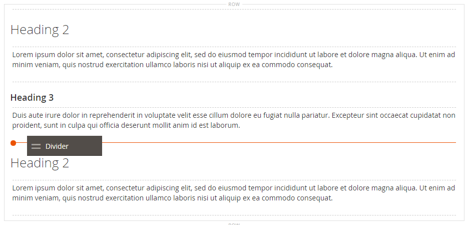
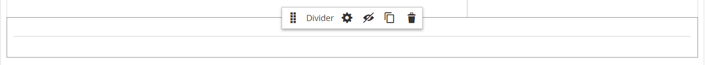
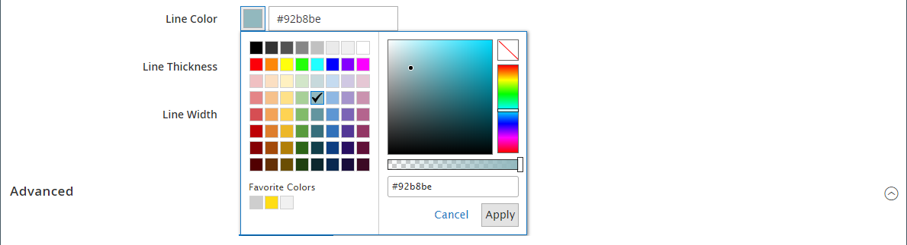
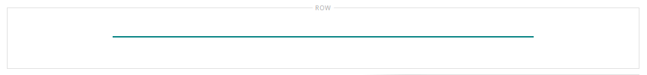
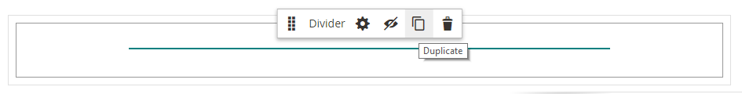
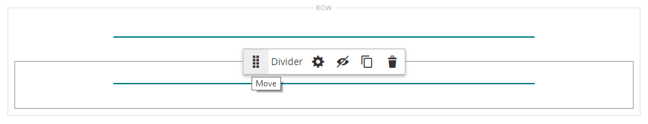
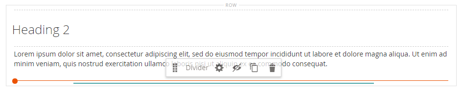

# 要素 – ディバイダ

_Divider_ コンテンツ タイプを使用して、[[!DNL Page Builder]  ステージ ](workspace.md#stage)のコンテンツのセクション間にルールを視覚的な区切りとして追加します。 境界線の色、太さ、幅を指定できます。 また、整列の制御、余白とパディングの設定、コンテナの境界線の形式を行うこともできます。 デフォルトでは、区切り記号は、コンテナの全幅を拡張するヘアライン規則で、パディングを許可します。

{width="500" zoomable="yes"}

ほとんどの区切りコンテナは表示されませんが、次の例では、区切り記号、パディング、コンテナ間の関係を確認できるように、コンテナに赤い破線が表示されています。 区切り記号の上下のパディングを調整して、エレメント間の間隔を制御できます。

{width="500" zoomable="yes"}

{{$include /help/_includes/page-builder-save-timeout.md}}

## 区切りツール ボックス

| ツール | アイコン | 説明 |
| ---- | --------------------| ------------|
| 移動 | {width="25"} | 区切りコンテナをページ上の別の有効な場所に移動します。 |
| （ラベル） | 区切り記号 | 現在のコンテナをディバイダ要素として識別します。 |
| 設定 | {width="25"} | ディバイダを編集ページが開き、ディバイダとそのコンテナのプロパティを変更できます。 |
| 非表示 | {width="25"} | ディバイダーコンテナを非表示にします。 |
| 表示 | {width="25"} | 非表示の仕切りコンテナを表示します。 |
| 重複 | {width="25"} | ディバイダーコンテナのコピーを作成します。 |
| 削除 | {width="25"} | 分割コンテナとそのコンテンツをステージから削除します。 |

{style="table-layout:auto"}

{{$include /help/_includes/page-builder-hidden-element-note.md}}

## 区切り記号を追加

1. [!DNL Page Builder] パネルで、**[!UICONTROL Elements]**&#x200B;を展開し、**[!UICONTROL Divider]** プレースホルダーをステージ上の行、列、またはタブ セットにドラッグします。

   ステージ上の別のコンテンツコンテナの前または後に区切りを配置する場合は、赤いガイドラインを参照してください。

   {width="600" zoomable="yes"}

   次の例では、区切り記号はテキストの新しいセクションの先頭をマークします。

   {width="500" zoomable="yes"}

1. 新しいディバイダの設定を指定するには、次の手順に従います。

## 区切り記号の設定の変更

1. 分割コンテナにカーソルを合わせてツールボックスを表示し、_設定_ （{width="20"}）アイコンを選択します。

   {width="500" zoomable="yes"}

1. 次のいずれかの方法を使用して区切り記号&#x200B;**[!UICONTROL Line Color]**&#x200B;を変更します。

   - 有効な[HTML カラー名](https://en.wikipedia.org/wiki/Web_colors)を入力してください。 例：`Teal`。
   - 16進数カラー値を入力します。 例：`#008080`。

   完了したら、**[!UICONTROL Apply]**&#x200B;をクリックします。

   {width="600" zoomable="yes"}

1. **[!UICONTROL Line Thickness]**&#x200B;をピクセル単位で入力します。

1. 測定単位を示すには、**[!UICONTROL Line Width]**&#x200B;の後に`px`または`%`を入力します。

   {width="600" zoomable="yes"}

1. 必要に応じて&#x200B;_[!UICONTROL Advanced]_設定を更新します。

   - 親コンテナ内の区切り記号の位置を制御するには、**[!UICONTROL Alignment]**&#x200B;を選択します。

     | オプション | 説明 |
     | ------ | ----------- |
     | `Default` | 現在のテーマのスタイルシートで指定されている整列のデフォルト設定を適用します。 |
     | `Left` | 親コンテナの左端に沿ってリストを整列させ、指定されたパディングを許可します。 |
     | `Center` | 親コンテナの中央にリストを整列させ、指定された任意のパディングを許可します。 |
     | `Right` | 親コンテナの右端に沿ってブロックを整列させ、指定されたパディングを許可します。 |

     {style="table-layout:auto"}

     次の例では、区切り記号に中央揃えを使用するようにオプションが設定されています。

     {width="600" zoomable="yes"}

   - 分割コンテナのすべての4つの側面に適用される&#x200B;**[!UICONTROL Border]** スタイルを設定します。

     | オプション | 説明 |
     | ------ | ----------- |
     | `Default` | 関連付けられたスタイルシートで指定されたデフォルトの境界線スタイルを適用します。 |
     | `None` | コンテナの境界を表示しません。 |
     | `Dotted` | コンテナの境界線が点線で表示されます。 |
     | `Dashed` | コンテナの境界線が破線で表示されます。 |
     | `Solid` | コンテナの境界線が実線として表示されます。 |
     | `Double` | コンテナの境界線が2行で表示されます。 |
     | `Groove` | コンテナの境界線は、溝付き線として表示されます。 |
     | `Ridge` | コンテナの境界線は、うね付きの線として表示されます。 |
     | `Inset` | コンテナの境界線がインセット線として表示されます。 |
     | `Outset` | コンテナの境界線がアウトセット線として表示されます。 |

     {style="table-layout:auto"}

   - `None`以外の境界線スタイルを設定する場合は、境界線の表示オプションを完了します。

     | オプション | 説明 |
     | ------ |------------ |
     | [!UICONTROL Border Color] | 色見本を選択するか、カラーピッカーをクリックするか、有効なカラー名または同等の16進数値を入力して、カラーを指定します。 |
     | [!UICONTROL Border Width] | 境界線の幅のピクセル数を入力します。 |
     | [!UICONTROL Border Radius] | 境界線の各隅を丸めるために使用する半径のサイズを定義するピクセル数を入力します。 |

     {style="table-layout:auto"}

   - （オプション）現在のスタイルシートから&#x200B;**[!UICONTROL CSS classes]**&#x200B;の名前を指定して、コンテナに適用します。

     複数のクラス名はスペースで区切ります。

   - **[!UICONTROL Margins and Padding]**&#x200B;の値をピクセル単位で入力して、区切りコンテナの外側の余白と内側の余白を決定します。

     対応する値をダイアグラムに入力します。

     | コンテナ領域 | 説明 |
     | -------------- | ----------- |
     | [!UICONTROL Margins] | コンテナのすべての側面の外側のエッジに適用される空白スペースの量。 オプション：`Top` / `Right` / `Bottom` / `Left` |
     | [!UICONTROL Padding] | コンテナのすべての側面の内側エッジに適用される空白スペースの量。 オプション：`Top` / `Right` / `Bottom` / `Left` |

     {style="table-layout:auto"}

1. 完了したら、**[!UICONTROL Save]**&#x200B;をクリックして設定を適用し、[!DNL Page Builder] ワークスペースに戻ります。

   {width="500" zoomable="yes"}

## 区切り記号の複製

特定の設定を持つ書式設定されたディバイダの場合は、新しいプレースホルダーで始めるのではなく、複製を作成する方が効率的です。

1. 分割コンテナにカーソルを合わせてツールボックスを表示し、_複製_ （{width="20"}）アイコンを選択します。

   重複するディバイダーコンテナが元のコンテナのすぐ下に表示されます。

   {width="500" zoomable="yes"}

1. 新しいディバイダーコンテナにカーソルを合わせてツールボックスを表示し、_移動_ （{width="20"}）アイコンを選択します。

   {width="500" zoomable="yes"}

1. 赤いガイドラインが新しい位置を示すまで、区切り記号を選択してドラッグします。

   各コンテナの上下の境界線は、区切り線を移動すると破線として表示されます。

   {width="500" zoomable="yes"}

<!-- Last updated from includes: 2023-09-11 14:30:19 -->
