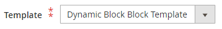

# コンテンツを追加 – 動的ブロック

動的ブロック コンテンツタイプを使用して、既存の [ 動的ブロック ](../content-design/dynamic-blocks.md) を [[!DNL Page Builder] stage](workspace.md#stage) に追加します。

{width="700" zoomable="yes"}

{{$include /help/_includes/page-builder-save-timeout.md}}

## ダイナミック ブロック ツールボックス

| ツール | アイコン | 説明 |
| --------- | ------------- | ----------------- |
| 移動 | {width="25"} | ブロックコンテナとその内容をステージ上の別の位置に移動します。 |
| 設定 | {width="25"} | _ブロックを編集_ ページが開きます。このページで、ブロックを選択し、コンテナのプロパティを変更できます。 |
| Hide | {width="25"} | 現在のブロックコンテナとそのコンテンツを非表示にします。 |
| 表示 | {width="25"} | 非表示のブロックコンテナとその内容を表示します。 |
| 複製 | {width="25"} | ブロックコンテナとその内容のコピーを作成します。 |
| 削除 | {width="25"} | ブロックコンテナとそのコンテンツをステージから削除します。 |

{style="table-layout:auto"}

{{$include /help/_includes/page-builder-hidden-element-note.md}}

## ステージに既存のダイナミックブロックを追加

1. ターゲットページ、ブロック、製品またはカテゴリの [!DNL Page Builder] ワークスペースに移動します。

1. [!DNL Page Builder] パネルで **[!UICONTROL Add Content]** を展開し、**[!UICONTROL Dynamic Block]** プレースホルダーをステージにドラッグします。

   {width="600" zoomable="yes"}

1. 空のダイナミックブロックコンテナにカーソルを合わせてツールボックスを表示し、_設定_ （{width="20"}）アイコンを選択します。

   {width="600" zoomable="yes"}

1. _ダイナミックブロックを編集_ ページで「**[!UICONTROL Select Dynamic Block]**」をクリックし、リストを使用してブロックを選択します。

   {width="600" zoomable="yes"}

   リストで、挿入するダイナミック ブロックを見つけて、[**[!UICONTROL Select]**] をクリックします。 次に、「**[!UICONTROL Add Selected]**」をクリックします。

   {width="600" zoomable="yes"}

   ダイナミック ブロック情報の概要が下に表示されます。

   {width="600" zoomable="yes"}

1. **[!UICONTROL Template]** を次のいずれかに設定します。

   | オプション | 説明 |
   | ------ | ----------- |
   | `Dynamic Block Block Template` | スタンドアロン ブロックを追加します。 |
   | `Dynamic Block Inline Template` | ブロックの内容をテキストに挿入します。 |

   {style="table-layout:auto"}

   {width="200"}

1. 必要に応じて、詳細設定を完了します。

1. 完了したら、「**[!UICONTROL Save]**」をクリックして設定を適用し、[!DNL Page Builder] ワークスペースに戻ります。

### 詳細設定

1. 親コンテナ内のダイナミック ブロックの位置をコントロールするには、**[!UICONTROL Alignment]** のいずれかを選択します。

   | オプション | 説明 |
   | ------ | ----------- |
   | `Default` | 現在のテーマのスタイル シートで指定されている線形の既定の設定を適用します。 |
   | `Left` | 親コンテナの左罫線に沿ってリストを配置します。指定したパディングはすべて許可されます。 |
   | `Center` | 親コンテナの中央にリストを揃えます。指定したパディングに対する許容値を使用します。 |
   | `Right` | 親コンテナの右端に沿ってブロックを配置します。指定したパディングは許可されます。 |

   {style="table-layout:auto"}

1. ダイナミック ブロック コンテナの 4 つの側面すべてに適用される **[!UICONTROL Border]** スタイルを設定します。

   | オプション | 説明 |
   | ------ | ----------- |
   | `Default` | 関連付けられたスタイル シートで指定されている既定の罫線スタイルを適用します。 |
   | `None` | コンテナの境界線の表示はしません。 |
   | `Dotted` | コンテナの境界線は点線で表示されます。 |
   | `Dashed` | コンテナの境界線は破線で表示されます。 |
   | `Solid` | コンテナの境界線は実線で表示されます。 |
   | `Double` | コンテナの境界線は二重線で表示されます。 |
   | `Groove` | コンテナの境界線は溝付き線で表示されます。 |
   | `Ridge` | コンテナの境界線は、境界線として表示されます。 |
   | `Inset` | コンテナの境界線は、インセットされた線として表示されます。 |
   | `Outset` | コンテナの境界線は、先頭行として表示されます。 |

   {style="table-layout:auto"}

1. `None` 以外の境界線のスタイルを設定する場合は、境界線の表示オプションを完了します。

   | オプション | 説明 |
   | ------ |------------ |
   | [!UICONTROL Border Color] | 見本を選択するか、カラーピッカーをクリックするか、有効なカラー名または同等の 16 進数値を入力して、カラーを指定します。 |
   | [!UICONTROL Border Width] | 境界線の幅のピクセル数を入力します。 |
   | [!UICONTROL Border Radius] | ピクセル数を入力して、境界線の各コーナーを丸めるために使用する半径のサイズを定義します。 |

   {style="table-layout:auto"}

1. （オプション）コンテナに適用する現在のスタイルシートの **[!UICONTROL CSS classes]** の名前を指定します。

   複数のクラス名はスペースで区切ります。

1. ダイナミックブロックコンテナの外側の余白と内側のパディングを決定する **[!UICONTROL Margins and Padding]** の値をピクセル単位で入力します。

   対応する値を図に入力します。

   | コンテナ領域 | 説明 |
   | -------------- | ----------- |
   | [!UICONTROL Margins] | コンテナのすべての側面の外側の端に適用される空白スペースの量。 オプション：`Top`/`Right`/`Bottom`/`Left` |
   | [!UICONTROL Padding] | コンテナのすべての側面の内側の端に適用される空白のスペースの量です。 オプション：`Top`/`Right`/`Bottom`/`Left` |

   {style="table-layout:auto"}

## ダイナミック ブロック コンテナ設定を編集

1. 動的ブロックコンテナにカーソルを合わせてツールボックスを表示し、_設定_ （{width="20"}）アイコンを選択します。

   {width="500" zoomable="yes"}

1. 必要に応じて、次のようにダイナミック ブロックを変更します。

   - 「**[!UICONTROL Select Dynamic Block]**」をクリックします。

     {width="20"}

   - アクティブなダイナミック ブロックの一覧で、追加するブロックの **[!UICONTROL Select]** をクリックします。

1. 必要に応じて、残りの設定を更新します。

1. 完了したら、「**[!UICONTROL Save]**」をクリックして設定を適用し、[!DNL Page Builder] ワークスペースに戻ります。

## ダイナミック ブロックを複製する

1. 動的ブロックコンテナにカーソルを合わせてツールボックスを表示し、_複製_ （{width="20"}）アイコンを選択します。

   複製は、元の画像のすぐ下に表示されます。

   {width="500" zoomable="yes"}

1. 新しい動的ブロックを別の位置に移動するには、そのコンテナの上にマウスポインターを置き、ツールボックスの _移動_ （{width="20"}）を選択します。

1. ダイナミック ブロックを選択し、新しい位置に赤いガイドラインが表示されるまでドラッグします。

   ダイナミック ブロックを移動すると、各コンテナの上部と下部の境界が破線で表示されます。

## ステージからダイナミックブロックを削除

1. 動的ブロックコンテナにカーソルを合わせてツールボックスを表示し、_削除_ （{width="20"}）アイコンを選択します。

1. 確認を求めるメッセージが表示されたら、「**[!UICONTROL OK]**」をクリックします。

<!-- Last updated from includes: 2023-09-11 14:30:19 -->
