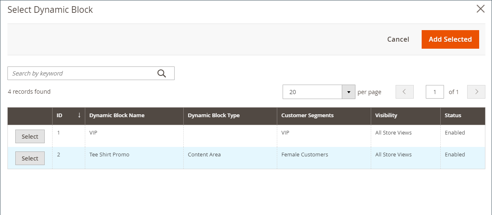
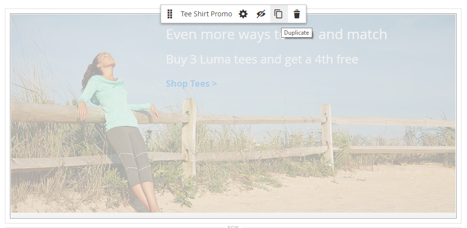

# コンテンツを追加 – 動的ブロック

動的ブロックのコンテンツタイプを使用して、既存の[動的ブロック ](../content-design/dynamic-blocks.md)を[[!DNL Page Builder]  ステージ ](workspace.md#stage)に追加します。

{width="700" zoomable="yes"}

{{$include /help/_includes/page-builder-save-timeout.md}}

## 動的ブロックツールボックス

| ツール | アイコン | 説明 |
| --------- | ------------- | ----------------- |
| 移動 | {width="25"} | ブロックコンテナとそのコンテンツをステージ上の別の位置に移動します。 |
| 設定 | {width="25"} | _ブロックを編集_ ページを開きます。このページでは、ブロックを選択してコンテナのプロパティを変更できます。 |
| 非表示 | {width="25"} | 現在のブロックコンテナとそのコンテンツを非表示にします。 |
| 表示 | {width="25"} | 非表示のブロックコンテナとそのコンテンツを表示します。 |
| 重複 | {width="25"} | ブロックコンテナとそのコンテンツのコピーを作成します。 |
| 削除 | {width="25"} | ブロックコンテナとそのコンテンツをステージから削除します。 |

{style="table-layout:auto"}

{{$include /help/_includes/page-builder-hidden-element-note.md}}

## 既存のダイナミックブロックをステージに追加

1. 対象ページ、ブロック、製品、またはカテゴリの[!DNL Page Builder] ワークスペースに移動します。

1. [!DNL Page Builder] パネルで、**[!UICONTROL Add Content]**&#x200B;を展開し、**[!UICONTROL Dynamic Block]** プレースホルダーをステージにドラッグします。

   {width="600" zoomable="yes"}

1. 空の動的ブロックコンテナにカーソルを合わせてツールボックスを表示し、_設定_ （{width="20"}）アイコンを選択します。

   {width="600" zoomable="yes"}

1. _動的ブロックを編集_ ページで、**[!UICONTROL Select Dynamic Block]**&#x200B;をクリックし、リストを使用してブロックを選択します。

   {width="600" zoomable="yes"}

   リストで、挿入する動的ブロックを見つけて、**[!UICONTROL Select]**&#x200B;をクリックします。 次に、**[!UICONTROL Add Selected]**&#x200B;をクリックします。

   {width="600" zoomable="yes"}

   ダイナミックブロック情報の概要を以下に示します。

   {width="600" zoomable="yes"}

1. **[!UICONTROL Template]**&#x200B;を次のいずれかに設定します：

   | オプション | 説明 |
   | ------ | ----------- |
   | `Dynamic Block Block Template` | スタンドアロンブロックを追加します。 |
   | `Dynamic Block Inline Template` | ブロックの内容をテキストに挿入します。 |

   {style="table-layout:auto"}

   {width="200"}

1. 必要に応じて、詳細設定を行います。

1. 完了したら、**[!UICONTROL Save]**&#x200B;をクリックして設定を適用し、[!DNL Page Builder] ワークスペースに戻ります。

### 詳細設定

1. 親コンテナ内の動的ブロックの位置を制御するには、**[!UICONTROL Alignment]**&#x200B;を選択します。

   | オプション | 説明 |
   | ------ | ----------- |
   | `Default` | 現在のテーマのスタイルシートで指定されている整列のデフォルト設定を適用します。 |
   | `Left` | 親コンテナの左端に沿ってリストを整列させ、指定されたパディングを許可します。 |
   | `Center` | 親コンテナの中央にリストを整列させ、指定された任意のパディングを許可します。 |
   | `Right` | 親コンテナの右端に沿ってブロックを整列させ、指定されたパディングを許可します。 |

   {style="table-layout:auto"}

1. 動的ブロックコンテナのすべての4つの側面に適用される&#x200B;**[!UICONTROL Border]** スタイルを設定します。

   | オプション | 説明 |
   | ------ | ----------- |
   | `Default` | 関連付けられたスタイルシートで指定されたデフォルトの境界線スタイルを適用します。 |
   | `None` | コンテナの境界を表示しません。 |
   | `Dotted` | コンテナの境界線が点線で表示されます。 |
   | `Dashed` | コンテナの境界線が破線で表示されます。 |
   | `Solid` | コンテナの境界線が実線として表示されます。 |
   | `Double` | コンテナの境界線が2行で表示されます。 |
   | `Groove` | コンテナの境界線は、溝付き線として表示されます。 |
   | `Ridge` | コンテナの境界線は、うね付きの線として表示されます。 |
   | `Inset` | コンテナの境界線がインセット線として表示されます。 |
   | `Outset` | コンテナの境界線がアウトセット線として表示されます。 |

   {style="table-layout:auto"}

1. `None`以外の境界線スタイルを設定する場合は、境界線の表示オプションを完了します。

   | オプション | 説明 |
   | ------ |------------ |
   | [!UICONTROL Border Color] | 色見本を選択するか、カラーピッカーをクリックするか、有効なカラー名または同等の16進数値を入力して、カラーを指定します。 |
   | [!UICONTROL Border Width] | 境界線の幅のピクセル数を入力します。 |
   | [!UICONTROL Border Radius] | 境界線の各隅を丸めるために使用する半径のサイズを定義するピクセル数を入力します。 |

   {style="table-layout:auto"}

1. （オプション）現在のスタイルシートから&#x200B;**[!UICONTROL CSS classes]**&#x200B;の名前を指定して、コンテナに適用します。

   複数のクラス名はスペースで区切ります。

1. **[!UICONTROL Margins and Padding]**&#x200B;の値をピクセル単位で入力して、ダイナミックブロックコンテナの外側の余白と内側の余白を決定します。

   対応する値をダイアグラムに入力します。

   | コンテナ領域 | 説明 |
   | -------------- | ----------- |
   | [!UICONTROL Margins] | コンテナのすべての側面の外側のエッジに適用される空白スペースの量。 オプション：`Top` / `Right` / `Bottom` / `Left` |
   | [!UICONTROL Padding] | コンテナのすべての側面の内側エッジに適用される空白スペースの量。 オプション：`Top` / `Right` / `Bottom` / `Left` |

   {style="table-layout:auto"}

## 動的ブロックコンテナ設定の編集

1. 動的ブロックコンテナにカーソルを合わせてツールボックスを表示し、_設定_ （{width="20"}）アイコンを選択します。

   {width="500" zoomable="yes"}

1. 必要に応じて、ダイナミックブロックを変更します。

   - **[!UICONTROL Select Dynamic Block]**&#x200B;をクリックします。

     {width="20"}

   - アクティブな動的ブロックのリストで、追加するブロックの&#x200B;**[!UICONTROL Select]**&#x200B;をクリックします。

1. 必要に応じて、残りの設定を更新します。

1. 完了したら、**[!UICONTROL Save]**&#x200B;をクリックして設定を適用し、[!DNL Page Builder] ワークスペースに戻ります。

## 動的ブロックの複製

1. 動的ブロックコンテナにカーソルを合わせてツールボックスを表示し、_複製_ （{width="20"}）アイコンを選択します。

   複製はオリジナルのすぐ下に表示されます。

   {width="500" zoomable="yes"}

1. 新しいダイナミックブロックを別の位置に移動するには、そのコンテナにカーソルを合わせ、ツールボックスで&#x200B;_移動_ （{width="20"}）を選択します。

1. 新しい位置に赤いガイドラインが表示されるまで、ダイナミックブロックを選択してドラッグします。

   各コンテナの上下の境界線は、ダイナミックブロックを移動すると破線で表示されます。

## ステージからダイナミックブロックを削除

1. 動的ブロックコンテナにカーソルを合わせてツールボックスを表示し、_削除_ （{width="20"}）アイコンを選択します。

1. 確認を求められたら、**[!UICONTROL OK]**&#x200B;をクリックします。

<!-- Last updated from includes: 2023-09-11 14:30:19 -->
