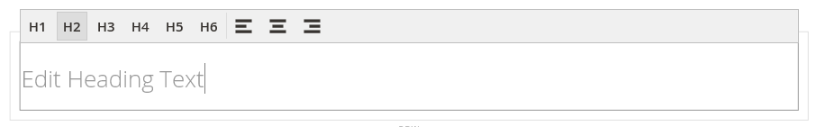
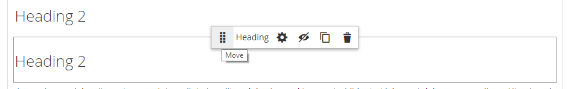

# 要素 – 見出し

見出しレベルは、コンテンツを整理し、検索エンジンが各ページのインデックスを作成するのに役立つ階層を確立します。 _ステージ_ で [[!DNL Page Builder]  見出し ](workspace.md#stage) コンテンツタイプを使用して、見出しレベルが H1～H6 のテキストコンテナをステージに追加します。 見出しは、現在のテーマに関連付けられているスタイルシートに従って書式設定されます。

[ セクションの ](workspace.md) コンテンツ見出し _[!UICONTROL Content]_&#x200B;フィールドを使用して、ページの上部に H1 見出しを追加できます。 ただし、このフィールドは以前の [!DNL Commerce] バージョンのレガシーで、古いコンテンツをサポートするために提供されています。 このフィールドでは、[!DNL Page Builder] の高度な機能を利用できません。 「コンテンツ見出し」フィールドを空白のままにし、[!DNL Page Builder] 見出しコンテンツタイプを使用して、任意のレベルの見出しをページに追加することをお勧めします。

次の例では、Luma テーマでフォーマットされている場合に、コンテンツの見出しと見出しのコンテンツタイプがどのように表示されるかを示しています。

{width="700" zoomable="yes"}

見出しは、_パネルの_ 要素 [!DNL Page Builder] セクションから、ステージの行、列、タブセットにドラッグできます。 見出しのレベルと配置は、ステージ上のエディターツールバーから、または _設定_ （{width="20"}） コントロールを使用して制御できます。

{{$include /help/_includes/page-builder-save-timeout.md}}

## 見出しエディター

{width="500" zoomable="yes"}

## 見出しコンテナツールボックス

すべてのコンテンツコンテナと同様に、コンテナにカーソルを合わせると、ツールボックスが表示されます。

{width="500" zoomable="yes"}

| ツール | アイコン | 説明 |
| --------- | ----------------- | ---------------------- |
| 移動 | {width="25"} | 見出しコンテナをページ上の別の有効な場所に移動します。 |
| （ラベル） | 見出し | 現在のコンテナを見出しとして識別します。 |
| 設定 | {width="25"} | 見出しを編集ページを開きます。このページで、コンテナのプロパティを変更できます。 |
| Hide | {width="25"} | 見出しコンテナを非表示にします。 |
| 表示 | {width="25"} | 非表示の見出しコンテナを表示します。 |
| 複製 | {width="25"} | 見出しコンテナをコピーします。 |
| 削除 | {width="25"} | 見出しコンテナとそのコンテンツをステージから削除します。 |

{style="table-layout:auto"}

{{$include /help/_includes/page-builder-hidden-element-note.md}}

## 見出しの追加

1. [!DNL Page Builder] パネルで **[!UICONTROL Elements]** を展開し、**[!UICONTROL Heading]** プレースホルダーをステージ上の行、列またはタブセットにドラッグします。

   {width="600" zoomable="yes"}

1. エディターで、`Edit Heading Text` プレースホルダーに見出しテキストを入力します。

   既定では、見出しテキストにはレベル 2 （H2）の見出しタイプが割り当てられます。

   {width="500" zoomable="yes"}

1. ツールバーで、H1 から H6 までの適切な見出しタイプを選択します。

1. 必要に応じて、配置を変更します。

## ヘッダー設定の編集

1. 見出しコンテナにカーソルを合わせてツールボックスを表示し、「_設定_」（{width="20"}）アイコンを選択します。

   {width="500" zoomable="yes"}

1. 必要に応じて、見出しコンテンツ（**[!UICONTROL Heading Type]** および **[!UICONTROL Heading Text]**）を更新します。

   このコンテンツは、見出しエディターで更新することもできます。

1. 必要に応じて、_[!UICONTROL Advanced]_&#x200B;設定を更新します。

   - 親コンテナ内の見出しの位置を制御するには、**[!UICONTROL Alignment]** のいずれかを選択します。

     | オプション | 説明 |
     | ------ | ----------- |
     | `Default` | 現在のテーマのスタイル シートで指定されている線形の既定の設定を適用します。 |
     | `Left` | 親コンテナの左罫線に沿ってリストを配置します。指定したパディングはすべて許可されます。 |
     | `Center` | 親コンテナの中央にリストを揃えます。指定したパディングに対する許容値を使用します。 |
     | `Right` | 親コンテナの右端に沿ってブロックを配置します。指定したパディングは許可されます。 |

     {style="table-layout:auto"}

   - 見出しコンテナの 4 つの辺すべてに適用する **[!UICONTROL Border]** スタイルを設定します。

     | オプション | 説明 |
     | ------ | ----------- |
     | `Default` | 関連付けられたスタイル シートで指定されている既定の罫線スタイルを適用します。 |
     | `None` | コンテナの境界線の表示はしません。 |
     | `Dotted` | コンテナの境界線は点線で表示されます。 |
     | `Dashed` | コンテナの境界線は破線で表示されます。 |
     | `Solid` | コンテナの境界線は実線で表示されます。 |
     | `Double` | コンテナの境界線は二重線で表示されます。 |
     | `Groove` | コンテナの境界線は溝付き線で表示されます。 |
     | `Ridge` | コンテナの境界線は、境界線として表示されます。 |
     | `Inset` | コンテナの境界線は、インセットされた線として表示されます。 |
     | `Outset` | コンテナの境界線は、先頭行として表示されます。 |

     {style="table-layout:auto"}

   - `None` 以外の境界線のスタイルを設定する場合は、境界線の表示オプションを完了します。

     | オプション | 説明 |
     | ------ |------------ |
     | [!UICONTROL Border Color] | 見本を選択するか、カラーピッカーをクリックするか、有効なカラー名または同等の 16 進数値を入力して、カラーを指定します。 |
     | [!UICONTROL Border Width] | 境界線の幅のピクセル数を入力します。 |
     | [!UICONTROL Border Radius] | ピクセル数を入力して、境界線の各コーナーを丸めるために使用する半径のサイズを定義します。 |

     {style="table-layout:auto"}

   - （オプション）コンテナに適用する現在のスタイルシートの **[!UICONTROL CSS classes]** の名前を指定します。

     複数のクラス名はスペースで区切ります。

   - 見出しコンテナの外側の余白と内側のパディングを決定する **[!UICONTROL Margins and Padding]** の値をピクセル単位で入力します。

     対応する値を図に入力します。

     | コンテナ領域 | 説明 |
     | -------------- | ----------- |
     | [!UICONTROL Margins] | コンテナのすべての側面の外側の端に適用される空白スペースの量。 オプション：`Top`/`Right`/`Bottom`/`Left` |
     | [!UICONTROL Padding] | コンテナのすべての側面の内側の端に適用される空白のスペースの量です。 オプション：`Top`/`Right`/`Bottom`/`Left` |

     {style="table-layout:auto"}

1. 完了したら、「**[!UICONTROL Save]**」をクリックして設定を適用し、[!DNL Page Builder] ワークスペースに戻ります。

## 見出しの複製

特定の設定を持つ書式設定された見出しの場合は、新しいプレースホルダーでやり直すよりも、見出しを複製する方が効率的です。

1. 見出しコンテナにカーソルを合わせてツールボックスを表示し、_複製_ （{width="20"}）アイコンを選択します。

   複製は、元の画像のすぐ下に表示されます。

   {width="500" zoomable="yes"}

1. 新しい見出しコンテナにポインタを合わせてツールボックスを表示し、_移動_ （{width="20"}）アイコンを選択します。

   {width="500" zoomable="yes"}

1. 見出しを選択してドラッグし、赤いガイドラインが新しい位置を示すようにします。

   見出しを移動すると、各コンテナの上部と下部の境界線が破線で表示されます。

   {width="500" zoomable="yes"}

1. 見出しレベルを変更する場合は、見出しテキストをクリックし、エディターツールバーで新しいレベルを選択します。

   {width="500" zoomable="yes"}

<!-- Last updated from includes: 2023-09-11 14:30:19 -->
