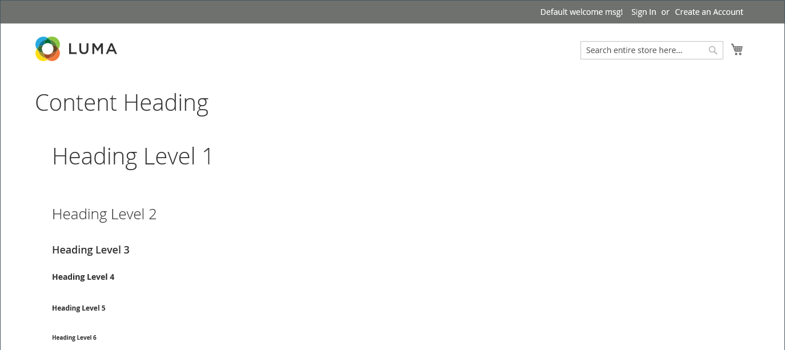
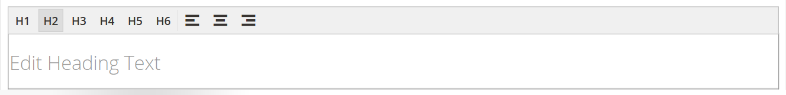
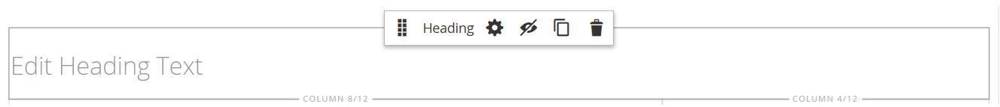
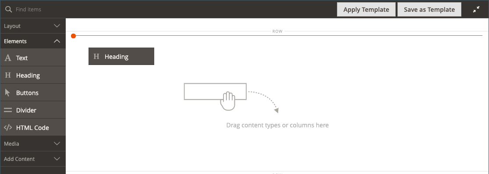
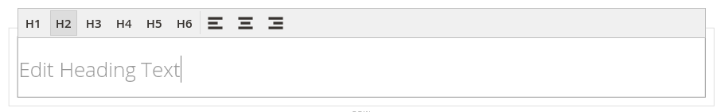
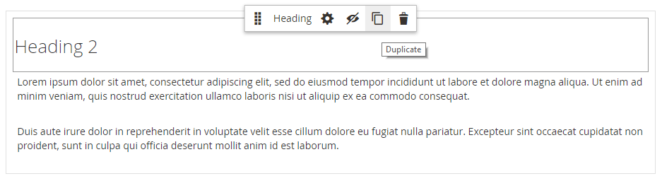
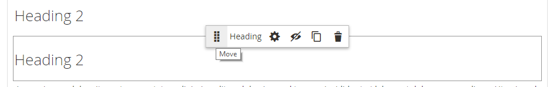
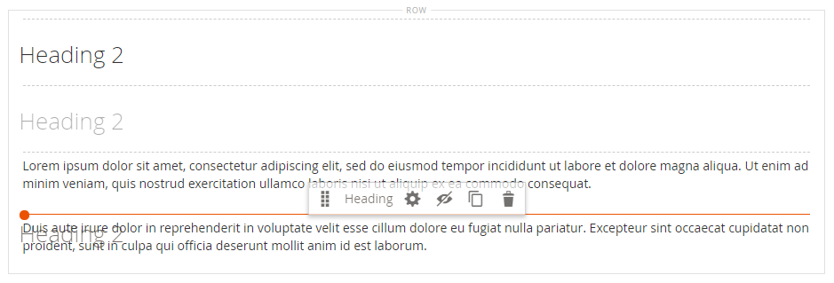
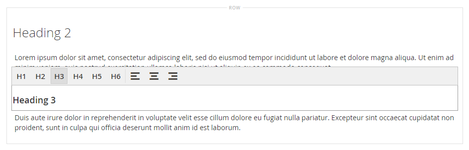

# 要素 – 見出し

見出しレベル：コンテンツを整理し、検索エンジンが各ページにインデックスを作成するのに役立つ階層を確立します。 [[!DNL Page Builder]  ステージ &#x200B;](workspace.md#stage)の&#x200B;_見出し_ コンテンツタイプを使用して、見出しレベルがH1からH6のテキストコンテナをステージに追加します。 見出しは、現在のテーマに関連付けられているスタイルシートに従って書式設定されます。

「_[!UICONTROL Content]_」セクションの「[&#x200B; コンテンツ見出し](workspace.md)」フィールドを使用して、ページの上部にH1見出しを追加できます。 ただし、フィールドは以前の[!DNL Commerce] バージョンのレガシーであり、古いコンテンツをサポートするために提供されています。 このフィールドは[!DNL Page Builder]の高度な機能を利用していません。 「コンテンツの見出し」フィールドを空白のままにし、[!DNL Page Builder]見出しコンテンツタイプを使用して、任意のレベルの見出しをページに追加することをお勧めします。

次の例は、Luma テーマでフォーマットされたコンテンツ見出しと見出しコンテンツタイプがどのように表示されるかを示しています。

{width="700" zoomable="yes"}

見出しを[!DNL Page Builder] パネルの&#x200B;_要素_ セクションから、ステージ上の行、列、またはタブ セットにドラッグできます。 見出しレベルと整列は、ステージのエディターツールバーから、または&#x200B;_設定_ （{width="20"}）コントロールを使用して制御できます。

{{$include /help/_includes/page-builder-save-timeout.md}}

## 見出しエディタ

{width="500" zoomable="yes"}

## 見出しコンテナツールボックス

すべてのコンテンツコンテナと同様に、コンテナにカーソルを合わせると、ツールボックスが表示されます。

{width="500" zoomable="yes"}

| ツール | アイコン | 説明 |
| --------- | ----------------- | ---------------------- |
| 移動 | {width="25"} | 見出しコンテナをページ上の別の有効な場所に移動します。 |
| （ラベル） | 見出し | 現在のコンテナを見出しとして識別します。 |
| 設定 | {width="25"} | 「見出しを編集」ページが開き、コンテナのプロパティを変更できます。 |
| 非表示 | {width="25"} | 見出しコンテナを非表示にします。 |
| 表示 | {width="25"} | 非表示の見出しコンテナを表示します。 |
| 重複 | {width="25"} | 見出しコンテナのコピーを作成します。 |
| 削除 | {width="25"} | 見出しコンテナとそのコンテンツをステージから削除します。 |

{style="table-layout:auto"}

{{$include /help/_includes/page-builder-hidden-element-note.md}}

## 見出しの追加

1. [!DNL Page Builder] パネルで、**[!UICONTROL Elements]**&#x200B;を展開し、**[!UICONTROL Heading]** プレースホルダーをステージ上の行、列、またはタブ セットにドラッグします。

   {width="600" zoomable="yes"}

1. エディターで、`Edit Heading Text` プレースホルダーに見出しテキストを入力します。

   デフォルトでは、見出しテキストにはレベル 2 （H2）の見出しタイプが割り当てられます。

   見出しエディターの{width="500" zoomable="yes"}

1. ツールバーで、H1とH6の間の適切な見出しタイプを選択します。

1. 必要に応じて、整列を変更します。

## ヘッダー設定の編集

1. 見出しコンテナにカーソルを合わせてツールボックスを表示し、_設定_ （{width="20"}）アイコンを選択します。

   {width="500" zoomable="yes"}

1. 必要に応じて、見出しコンテンツ （**[!UICONTROL Heading Type]**&#x200B;および&#x200B;**[!UICONTROL Heading Text]**）を更新します。

   見出しエディターでこのコンテンツを更新することもできます。

1. 必要に応じて&#x200B;_[!UICONTROL Advanced]_&#x200B;設定を更新します。

   - 親コンテナ内での見出しの位置を制御するには、**[!UICONTROL Alignment]**&#x200B;を選択します。

     | オプション | 説明 |
     | ------ | ----------- |
     | `Default` | 現在のテーマのスタイルシートで指定されている整列のデフォルト設定を適用します。 |
     | `Left` | 親コンテナの左端に沿ってリストを整列させ、指定されたパディングを許可します。 |
     | `Center` | 親コンテナの中央にリストを整列させ、指定された任意のパディングを許可します。 |
     | `Right` | 親コンテナの右端に沿ってブロックを整列させ、指定されたパディングを許可します。 |

     {style="table-layout:auto"}

   - 見出しコンテナのすべての4つの側面に適用される&#x200B;**[!UICONTROL Border]** スタイルを設定します。

     | オプション | 説明 |
     | ------ | ----------- |
     | `Default` | 関連付けられたスタイルシートで指定されたデフォルトの境界線スタイルを適用します。 |
     | `None` | コンテナの境界を表示しません。 |
     | `Dotted` | コンテナの境界線が点線で表示されます。 |
     | `Dashed` | コンテナの境界線が破線で表示されます。 |
     | `Solid` | コンテナの境界線が実線として表示されます。 |
     | `Double` | コンテナの境界線が2行で表示されます。 |
     | `Groove` | コンテナの境界線は、溝付き線として表示されます。 |
     | `Ridge` | コンテナの境界線は、うね付きの線として表示されます。 |
     | `Inset` | コンテナの境界線がインセット線として表示されます。 |
     | `Outset` | コンテナの境界線がアウトセット線として表示されます。 |

     {style="table-layout:auto"}

   - `None`以外の境界線スタイルを設定する場合は、境界線の表示オプションを完了します。

     | オプション | 説明 |
     | ------ |------------ |
     | [!UICONTROL Border Color] | 色見本を選択するか、カラーピッカーをクリックするか、有効なカラー名または同等の16進数値を入力して、カラーを指定します。 |
     | [!UICONTROL Border Width] | 境界線の幅のピクセル数を入力します。 |
     | [!UICONTROL Border Radius] | 境界線の各隅を丸めるために使用する半径のサイズを定義するピクセル数を入力します。 |

     {style="table-layout:auto"}

   - （オプション）現在のスタイルシートから&#x200B;**[!UICONTROL CSS classes]**&#x200B;の名前を指定して、コンテナに適用します。

     複数のクラス名はスペースで区切ります。

   - **[!UICONTROL Margins and Padding]**&#x200B;の値をピクセル単位で入力して、見出しコンテナの外側の余白と内側の余白を決定します。

     対応する値をダイアグラムに入力します。

     | コンテナ領域 | 説明 |
     | -------------- | ----------- |
     | [!UICONTROL Margins] | コンテナのすべての側面の外側のエッジに適用される空白スペースの量。 オプション：`Top` / `Right` / `Bottom` / `Left` |
     | [!UICONTROL Padding] | コンテナのすべての側面の内側エッジに適用される空白スペースの量。 オプション：`Top` / `Right` / `Bottom` / `Left` |

     {style="table-layout:auto"}

1. 完了したら、**[!UICONTROL Save]**&#x200B;をクリックして設定を適用し、[!DNL Page Builder] ワークスペースに戻ります。

## 見出しの複製

特定の設定を持つ書式設定された見出しの場合は、新しいプレースホルダーで最初からやり直すよりも、見出しを複製する方が効率的です。

1. 見出しコンテナにカーソルを合わせてツールボックスを表示し、_複製_ （{width="20"}）アイコンを選択します。

   複製はオリジナルのすぐ下に表示されます。

   {width="500" zoomable="yes"}

1. 新しい見出しコンテナにカーソルを合わせてツールボックスを表示し、_移動_ （{width="20"}）アイコンを選択します。

   {width="500" zoomable="yes"}

1. 赤いガイドラインが新しい位置を示すまで、見出しを選択してドラッグします。

   各コンテナの上下の境界線は、見出しの移動中に破線として表示されます。

   {width="500" zoomable="yes"}

1. 見出しレベルを変更する場合は、見出しテキストをクリックし、エディターツールバーで新しいレベルを選択します。

   {width="500" zoomable="yes"}

<!-- Last updated from includes: 2023-09-11 14:30:19 -->
