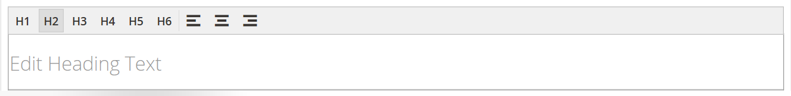

# エレメント — 見出し

見出しレベルは、コンテンツを整理し、検索エンジンが各ページのインデックスを作成するのに役立つ階層を確立します。 以下を使用します。 _見出し_ コンテンツタイプ [[!DNL Page Builder] ステージ](workspace.md#stage) を使用して、見出しレベルが H1 から H6 のテキストコンテナをステージに追加します。 見出しは、現在のテーマに関連付けられているスタイルシートに従って書式設定されます。

The [コンテンツ見出し](workspace.md) フィールド _[!UICONTROL Content]_セクションを使用して、ページの上部に H1 見出しを追加できます。 ただし、このフィールドは以前の [!DNL Commerce] 古いコンテンツをサポートするためのバージョンおよびが提供されています。 このフィールドでは [!DNL Page Builder]の高度な機能。 「コンテンツの見出し」フィールドは空白のままにし、 [!DNL Page Builder] 見出しコンテンツタイプ：任意のレベルの見出しをページに追加します。

次の例では、Luma テーマで書式設定した場合に、「コンテンツの見出し」と「見出し」コンテンツタイプがどのように表示されるかを示します。

{width="700" zoomable="yes"}

見出しは、 _要素_ のセクション [!DNL Page Builder] パネルをステージ上の行、列またはタブセットにドラッグします。 見出しのレベルと整列は、ステージ上のエディターツールバーから、または _設定_ ( {width="20"} ) コントロールを使用します。

{{$include /help/_includes/page-builder-save-timeout.md}}

## 見出しエディター

{width="500" zoomable="yes"}

## 見出しコンテナツールボックス

すべてのコンテンツコンテナと同様に、コンテナの上にマウスポインターを置くとツールボックスが表示されます。

{width="500" zoomable="yes"}

| ツール | アイコン | 説明 |
| --------- | ----------------- | ---------------------- |
| 移動 | {width="25"} | 見出しコンテナをページ上の別の有効な場所に移動します。 |
| （ラベル） | 見出し | 現在のコンテナを見出しとして識別します。 |
| 設定 | {width="25"} | 「見出しを編集」ページが開き、コンテナのプロパティを変更できます。 |
| 非表示 | {width="25"} | 見出しコンテナを非表示にします。 |
| 表示 | {width="25"} | 非表示の見出しコンテナを表示します。 |
| 複製 | {width="25"} | 見出しコンテナのコピーを作成します。 |
| 削除 | {width="25"} | ステージから見出しコンテナとその内容を削除します。 |

{style="table-layout:auto"}

{{$include /help/_includes/page-builder-hidden-element-note.md}}

## 見出しを追加

1. Adobe Analytics の [!DNL Page Builder] パネル、展開 **[!UICONTROL Elements]** をクリックし、 **[!UICONTROL Heading]** プレースホルダーをステージ上の行、列またはタブセットに追加します。

   {width="600" zoomable="yes"}

1. エディターで、 `Edit Heading Text` プレースホルダー。

   デフォルトでは、見出しテキストにはレベル 2(H2) の見出しタイプが割り当てられます。

   {width="500" zoomable="yes"}

1. ツールバーで、H1 と H6 の間の適切な見出しタイプを選択します。

1. 必要に応じて、位置揃えを変更します。

## ヘッダー設定を編集

1. 見出しコンテナの上にマウスポインターを置いてツールボックスを表示し、 _設定_ ( {width="20"} ) アイコンをクリックします。

   {width="500" zoomable="yes"}

1. 見出しのコンテンツ (**[!UICONTROL Heading Type]** および **[!UICONTROL Heading Text]**) をクリックします。

   見出しエディターでこのコンテンツを更新することもできます。

1. を更新します。 _[!UICONTROL Advanced]_必要に応じて設定します。

   - 親コンテナ内での見出しの位置を制御するには、 **[!UICONTROL Alignment]**:

     | オプション | 説明 |
     | ------ | ----------- |
     | `Default` | 現在のテーマのスタイルシートで指定された位置揃えの既定の設定を適用します。 |
     | `Left` | リストを親コンテナの左側の境界線に沿って揃えます。指定されたパディングの値を使用します。 |
     | `Center` | 指定されたパディングを許容して、親コンテナの中央にリストを揃えます。 |
     | `Right` | 指定されたパディングの値を使用して、親コンテナの右側の境界線に沿ってブロックを揃えます。 |

     {style="table-layout:auto"}

   - を設定します。 **[!UICONTROL Border]** スタイルを見出しコンテナの 4 つの側面すべてに適用します。

     | オプション | 説明 |
     | ------ | ----------- |
     | `Default` | 関連するスタイルシートで指定された既定の罫線のスタイルを適用します。 |
     | `None` | コンテナの境界線を表示しません。 |
     | `Dotted` | コンテナの境界線は点線で表示されます。 |
     | `Dashed` | コンテナの境界線は破線で表示されます。 |
     | `Solid` | コンテナの境界線は実線で表示されます。 |
     | `Double` | コンテナの境界線は二重線で表示されます。 |
     | `Groove` | コンテナ境界は溝付きの線として表示されます。 |
     | `Ridge` | コンテナの境界線は、稜線として表示されます。 |
     | `Inset` | コンテナの境界線は、挿入線として表示されます。 |
     | `Outset` | コンテナの境界線は、アウトセット行として表示されます。 |

     {style="table-layout:auto"}

   - 次の条件を満たさない境界線のスタイルを設定した場合： `None`、境界線の表示オプションを設定します。

     | オプション | 説明 |
     | ------ |------------ |
     | [!UICONTROL Border Color] | スウォッチを選択するか、カラーピッカーをクリックするか、有効なカラー名または同等の 16 進値を入力して、カラーを指定します。 |
     | [!UICONTROL Border Width] | 境界線の幅のピクセル数を入力します。 |
     | [!UICONTROL Border Radius] | ピクセル数を入力して、境界線の各隅を囲むために使用する半径のサイズを定義します。 |

     {style="table-layout:auto"}

   - （オプション） **[!UICONTROL CSS classes]** 現在のスタイルシートからコンテナに適用します。

     複数のクラス名はスペースで区切ります。

   - 次の値をピクセル単位で入力します。 **[!UICONTROL Margins and Padding]** を使用して、見出しコンテナの外側の余白と内側の余白を指定します。

     ダイアグラムに対応する値を入力します。

     | コンテナ領域 | 説明 |
     | -------------- | ----------- |
     | [!UICONTROL Margins] | コンテナのすべての側面の外側の端に適用される空白の量。 オプション： `Top` / `Right` / `Bottom` / `Left` |
     | [!UICONTROL Padding] | コンテナのすべての側面の内側の端に適用される空白の量。 オプション： `Top` / `Right` / `Bottom` / `Left` |

     {style="table-layout:auto"}

1. 完了したら、「 **[!UICONTROL Save]** 設定を適用し、に戻るには、次の手順に従います。 [!DNL Page Builder] ワークスペース。

## 見出しを複製

特定の設定で書式設定された見出しの場合、新しいプレースホルダーで始め直すよりも、見出しを複製する方が効率的です。

1. 見出しコンテナの上にマウスポインターを置いてツールボックスを表示し、 _複製_ ( {width="20"} ) アイコンをクリックします。

   複製は元の画像のすぐ下に表示されます。

   {width="500" zoomable="yes"}

1. 新しい見出しコンテナの上にマウスポインターを置いてツールボックスを表示し、 _移動_ ( {width="20"} ) アイコンをクリックします。

   {width="500" zoomable="yes"}

1. 見出しを選択し、赤いガイドラインが新しい位置を示すまでドラッグします。

   各コンテナの上と下の境界線は、見出しを移動する際に破線で表示されます。

   {width="500" zoomable="yes"}

1. 見出しレベルを変更する場合は、見出しテキストをクリックし、エディターツールバーで新しいレベルを選択します。

   {width="500" zoomable="yes"}
