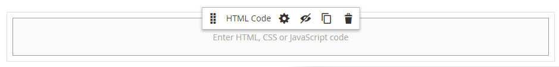
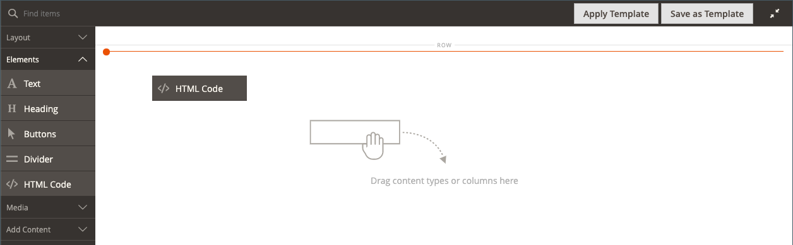
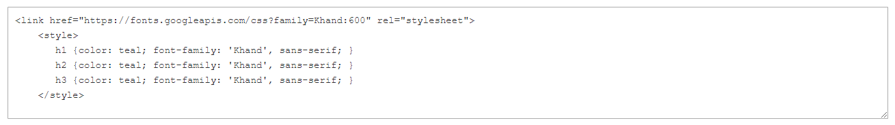
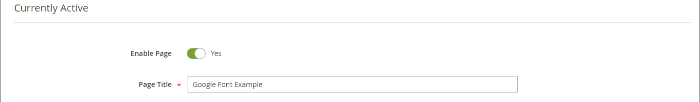
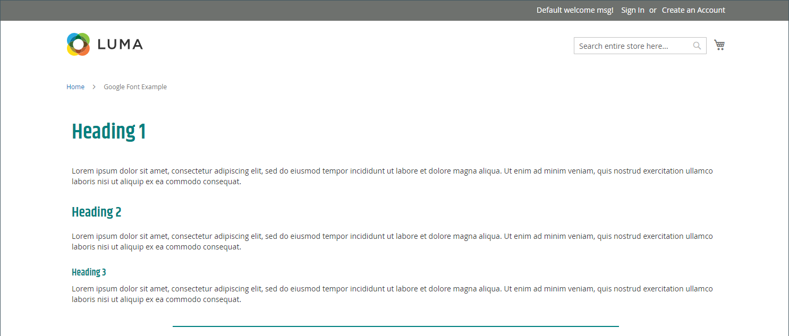
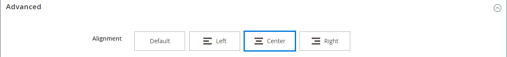

# Elements - HTML Code

_HTML コード_ コンテンツ タイプを使用して、[[!DNL Page Builder]  ステージ &#x200B;](workspace.md#stage)にHTML、CSS、JavaScript コードのスニペットを追加します。 例えば、カスタム HTMLを追加したり、ページ上の要素に適用できるCSS クラスを宣言したりできます。 また、サードパーティプロバイダーから受け取ったロゴ、ボタン、バナーのコードスニペットを追加することもできます。

## HTML Code toolbox

{width="500" zoomable="yes"}

| ツール | アイコン | 説明 |
| --------- | ---------- | ----------------- |
| 移動 | {width="25"} | HTML コードコンテナをページ上の別の有効な場所に移動します。 |
| 設定 | {width="25"} | HTML コードを編集ページが開き、コンテナのプロパティを変更できます。 |
| 非表示 | {width="25"} | HTML Code コンテナを非表示にします。 |
| 表示 | {width="25"} | 非表示のHTML Code コンテナを表示します。 |
| 重複 | {width="25"} | HTML Code コンテナのコピーを作成します。 |
| 削除 | {width="25"} | ステージからHTML Code コンテナとそのコンテンツを削除します。 |

{{$include /help/_includes/page-builder-hidden-element-note.md}}

## HTML コードを追加

次の例は、[Google Font](https://fonts.google.com/) コードを埋め込み、現在のスタイルシートを上書きするカスタム見出しクラスを宣言する方法を示しています。

### 手順1:Google フォントの選択

1. [Google Fonts](https://fonts.google.com/) サイトにアクセスし、使用するフォントファミリーを選択します。

1. ページの`<head>` セクションに埋め込む生成されたコードをコピーし、テキストエディターに一時的に貼り付けます。

   - フォントコードを埋め込む
   - CSS ルール

1. 各見出しクラスにフォントファミリルールを追加し、`<style>` タグで見出しクラスを囲みます。

   このコードは[!DNL Page Builder]に貼り付けられています。

   ```html
   <style>
      h1 {color: teal; font-family: 'Khand', sans-serif; }
      h2 {color: teal; font-family: 'Khand', sans-serif; }
      h3 {color: teal; font-family: 'Khand', sans-serif; }
   </style>
   ```

### 手順2：ページにコードを追加する

1. ストアの&#x200B;_管理者_ サイドバーで、**[!UICONTROL Content]** > _[!UICONTROL Elements]_>**[!UICONTROL Pages]**&#x200B;に移動します。

1. フォントを使用できるページを見つけ、編集モードで開きます。

1. 下にスクロールして、**[!UICONTROL Content]** セクションを展開します。

1. [!DNL Page Builder] パネルで、**[!UICONTROL Elements]**&#x200B;を展開し、**[!UICONTROL HTML Code]** プレースホルダーをステージ上の行、列、またはタブ セットにドラッグします。

   赤いガイドラインを使用して、行、列、またはタブセット内の別のコンテンツコンテナの前または後に区切りを配置します。

   {width="600" zoomable="yes"}

1. HTML コンテナにカーソルを合わせてツールボックスを表示し、_設定_ （{width="20"}）アイコンを選択します。

1. テキストボックスに、用意した埋め込みGoogle Fonts コードとスタイル宣言を貼り付けます。

   読みやすくするために、いくつかのスペースを入力してコードをインデントできます。

   {width="500" zoomable="yes"}

1. 必要に応じて、残りの設定を更新します（詳細については、[HTML コード設定の変更](#html-settings)を参照）。

1. 右上隅の「**[!UICONTROL Save]**」をクリックして設定を適用し、[!DNL Page Builder] ワークスペースに戻ります。

   新しいフォントは、ページをブラウザーで表示したときにレンダリングされます。

### 手順3：ページのプレビュー

1. _[!UICONTROL Currently Active]_&#x200B;セクションで、**[!UICONTROL Enable Page]**&#x200B;を`Yes`に設定します。

   {width="600" zoomable="yes"}

1. 右上隅の&#x200B;**[!UICONTROL Save]**&#x200B;矢印をクリックし、**[!UICONTROL Save & Close]**&#x200B;を選択します。

1. グリッドでページを検索し、_[!UICONTROL Actions]_&#x200B;列の&#x200B;**[!UICONTROL View]**&#x200B;を選択します。

   {width="700" zoomable="yes"}

## HTML コード設定の変更 {#html-settings}

1. HTML コンテナにカーソルを合わせてツールボックスを表示し、_設定_ （{width="20"}）アイコンを選択します。

1. テキストボックスで、必要に応じてコードを編集します。

   HTML、CSS、JavaScript コードがサポートされています。 ページの`<head>` セクションに属するコードスニペットは、ここに入力できます。

   エディターには、コードに特殊要素を挿入するためのボタンも用意されています。

   | ボタン | 説明 |
   | ------ | ----------- |
   | ウィジェットを挿入… | クリックして、HTML テキストボックスのカーソル位置にウィジェットを挿入します。 |
   | 画像を挿入… | クリックすると、HTMLのテキストボックス内のカーソル位置に、アップロードした画像またはギャラリーの画像が挿入されます。 |
   | 変数を挿入… | クリックして、HTML テキストボックスのカーソル位置に変数を挿入します。 |

1. 必要に応じて&#x200B;_[!UICONTROL Advanced]_&#x200B;設定を更新します。

   - 親コンテナ内のコードの位置を制御するには、**[!UICONTROL Alignment]**&#x200B;を選択します。

     | オプション | 説明 |
     | ------ | ----------- |
     | `Default` | 現在のテーマのスタイルシートで指定されている整列のデフォルト設定を適用します。 |
     | `Left` | 親コンテナの左端に沿ってリストを整列させ、指定されたパディングを許可します。 |
     | `Center` | 親コンテナの中央にリストを整列させ、指定された任意のパディングを許可します。 |
     | `Right` | 親コンテナの右端に沿ってブロックを整列させ、指定されたパディングを許可します。 |

     次の例では、オプションは、レンダリングされたコードブロックに中央揃えを使用するように設定されています。

     {width="600" zoomable="yes"}

   - コードコンテナのすべての4つの側面に適用される&#x200B;**[!UICONTROL Border]** スタイルを設定します。

     | オプション | 説明 |
     | ------ | ----------- |
     | `Default` | 関連付けられたスタイルシートで指定されたデフォルトの境界線スタイルを適用します。 |
     | `None` | コンテナの境界を表示しません。 |
     | `Dotted` | コンテナの境界線が点線で表示されます。 |
     | `Dashed` | コンテナの境界線が破線で表示されます。 |
     | `Solid` | コンテナの境界線が実線として表示されます。 |
     | `Double` | コンテナの境界線が2行で表示されます。 |
     | `Groove` | コンテナの境界線は、溝付き線として表示されます。 |
     | `Ridge` | コンテナの境界線は、うね付きの線として表示されます。 |
     | `Inset` | コンテナの境界線がインセット線として表示されます。 |
     | `Outset` | コンテナの境界線がアウトセット線として表示されます。 |

   - `None`以外の境界線スタイルを設定する場合は、境界線の表示オプションを完了します。

     | オプション | 説明 |
     | ------ |------------ |
     | [!UICONTROL Border Color] | 色見本を選択するか、カラーピッカーをクリックするか、有効なカラー名または同等の16進数値を入力して、カラーを指定します。 |
     | [!UICONTROL Border Width] | 境界線の幅のピクセル数を入力します。 |
     | [!UICONTROL Border Radius] | 境界線の各隅を丸めるために使用する半径のサイズを定義するピクセル数を入力します。 |

     {style="table-layout:auto"}

   - （オプション）現在のスタイルシートから&#x200B;**[!UICONTROL CSS classes]**&#x200B;の名前を指定して、コンテナに適用します。

     複数のクラス名はスペースで区切ります。

   - **[!UICONTROL Margins and Padding]**&#x200B;の値をピクセル単位で入力して、コードコンテナの外側の余白と内側の余白を決定します。

     対応する値をダイアグラムに入力します。

     | コンテナ領域 | 説明 |
     | -------------- | ----------- |
     | [!UICONTROL Margins] | コンテナのすべての側面の外側のエッジに適用される空白スペースの量。 オプション：`Top` / `Right` / `Bottom` / `Left` |
     | [!UICONTROL Padding] | コンテナのすべての側面の内側エッジに適用される空白スペースの量。 オプション：`Top` / `Right` / `Bottom` / `Left` |


<!-- Last updated from includes: 2023-09-11 14:30:19 -->
