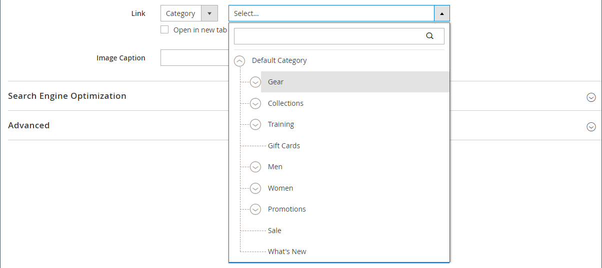

# メディア – 画像

_Image_ コンテンツタイプを使用して、JPG、GIFまたは PNG 画像を [[!DNL Page Builder] stage](workspace.md#stage) に追加します。 デフォルトのデスクトップイメージに加えて、モバイルデバイス用のセカンダリイメージを指定できます。 画像の下に表示されるキャプションを追加し、画像を任意の URL、製品、カテゴリまたはページにリンクすることもできます。

>[!TIP]
>
>[Adobe Stock Integration](../content-design/adobe-stock.md) を使用して、[Adobe Stock&rbrace; から提供される数百万のアセットの中から適切なアセットを見つけて保存でき ](https://stock.adobe.com) す。 Adobe Stock アセットを検索、調整、ギャラリーに保存する方法について詳しくは、[Adobe Stock画像の使用 ](../content-design/adobe-stock-manage.md) を参照してください。

{{$include /help/_includes/page-builder-save-timeout.md}}

## 画像ツールボックス

画像コンテナにカーソルを合わせると、画像ツールボックスが表示されます。

{width="500" zoomable="yes"}

| ツール | アイコン | 説明 |
|--- |--- |--- |
| 移動 | {width="25"} | 画像をステージ上の別の位置に移動します。 |
| （ラベル） | 画像 | 現在のコンテンツコンテナを画像として識別します。 画像コンテナにカーソルを合わせると、ツールボックスが表示されます。 |
| 設定 | {width="25"} | _画像を編集_ ページが開きます。このページで、画像とコンテナのプロパティを変更できます。 |
| Hide | {width="25"} | 現在の画像を非表示にします。 |
| 表示 | {width="25"} | 非表示の画像を表示します。 |
| 複製 | {width="25"} | 画像のコピーを作成します。 |
| 削除 | {width="25"} | ステージから画像を削除します。 |
| 新しい画像をアップロード |  | ローカルファイルシステムからギャラリーに画像をアップロードします。 |
| ギャラリーから選択 |  | ギャラリーから既存の画像を選択します。 |

{style="table-layout:auto"}

{{$include /help/_includes/page-builder-hidden-element-note.md}}

## 画像を追加

1. [!DNL Page Builder] パネルで **[!UICONTROL Media]** を展開し、**[!UICONTROL Image]** プレースホルダーをターゲットコンテナにドラッグします。

   行、列、タブに画像を追加できます。 次の例では、画像を空の列にドラッグします。

   {width="600" zoomable="yes"}

1. 次のいずれかの方法を使用して画像アセットを追加します。

   {width="500" zoomable="yes"}

   >[!NOTE]
   >
   >最大ファイルサイズは 4 MB です。 サポートされているファイルタイプは、JPG、GIF、PNG です。

   - _&#x200B;**新しい画像をアップロード**&#x200B;_：この方法を使用して、システムから新しい画像ファイルをアップロードします。

      - 「**[!UICONTROL Upload Image]**」をクリックします。

      - 画像を見つけて選択し、ギャラリーとターゲットコンテナに追加します。

     別の方法として、システムから画像ファイルをドラッグして、_カメラ_ （{width="20"}）アイコンの上にドロップすることもできます。

   - _&#x200B;**既存のアセットを選択**&#x200B;_：メディアストレージ/ギャラリーから既存の画像アセットを選択する場合は、この方法を使用します。

      - 「**[!UICONTROL Select from Gallery]**」をクリックします。

      - ツリーを使用して画像に移動します。

      - サムネールをクリックし、「**[!UICONTROL Add Selected]**」をクリックします。

        {width="600" zoomable="yes"}

   - _&#x200B;**Adobe Stock画像を検索して選択**&#x200B;_:Adobe Stock内から画像を検索する場合に使用します。

     >[!NOTE]
     >
     >この方法を使用するには、管理者向けに設定された [&#128279;](../content-design/adobe-stock.md)0&rbrace;Adobe Stock統合 &rbrace; が必要です。

      - 「**[!UICONTROL Search Adobe Stock]**」をクリックして画像を検索します。

      - プレビューまたはライセンス済み画像をギャラリーに保存します。

        Adobe Stock Assets の操作について詳しくは、[Adobe Stock画像の使用 ](../content-design/adobe-stock-manage.md) を参照してください。

      - ギャラリーでアセットのサムネールを選択し、「**[!UICONTROL Add Selected]**」をクリックします。

   画像がターゲットコンテナのプレースホルダーの場所に表示されます。 背景画像とは異なり、画像を現在のコンテナ内の別の位置に移動したり、別のコンテナに移動したりできます。

   >[!NOTE]
   >
   >[ バナー ](banner.md) および [ スライダー ](slider.md) コンテンツタイプには、画像を追加するための _画像のアップロード_ および _ギャラリーから選択_ オプションも含まれています。

   {width="500" zoomable="yes"}

## 画像設定の変更

1. 画像コンテナにカーソルを合わせてツールボックスを表示し、_設定_ （{width="20"}）アイコンを選択します。
ファイル名、サイズ、およびファイルサイズが現在の画像の下に表示されます。

   {width="600" zoomable="yes"}

1. 現在の **[!UICONTROL Image]** を変更するには、次のいずれかの操作を行います。

   - _&#x200B;**新しい画像をアップロード**&#x200B;_：この方法を使用して、システムから新しい画像ファイルをアップロードします。

      - 「**[!UICONTROL Upload Image]**」をクリックします。

      - 画像を見つけて選択し、ギャラリーとターゲットコンテナに追加します。

   - _&#x200B;**既存のアセットを選択**&#x200B;_：メディアストレージ/ギャラリーから既存の画像アセットを選択する場合は、この方法を使用します。

      - 「**[!UICONTROL Select from Gallery]**」をクリックします。

      - ツリーを使用して画像に移動します。

      - サムネールをクリックし、「**[!UICONTROL Add Selected]**」をクリックします。

        {width="600" zoomable="yes"}

   - **Adobe Stock画像を検索して選択**:Adobe Stock内から画像を検索する場合に使用します。

     >[!NOTE]
     >
     >この方法を使用するには、管理者向けに設定された [&#128279;](../content-design/adobe-stock.md)0&rbrace;Adobe Stock統合 &rbrace; が必要です。

      - 「**[!UICONTROL Search Adobe Stock]**」をクリックして画像を検索します。

      - プレビューまたはライセンス済み画像をギャラリーに保存します。

        Adobe Stock Assets の操作について詳しくは、[Adobe Stock画像の使用 ](../content-design/adobe-stock-manage.md) を参照してください。

      - ギャラリーでアセットのサムネールを選択し、「**[!UICONTROL Add Selected]**」をクリックします。

1. **[!UICONTROL Mobile Image]** を追加するには、前の手順で説明したのと同じ方法を使用して、モバイルデバイスでの表示に使用する画像を選択します。

   {width="600" zoomable="yes"}

1. 必要に応じて、画像の **[!UICONTROL Link]** を指定します。

   リンクは、顧客が画像をクリックすると表示される宛先ページです。 次の 3 つのリンクタイプのいずれかを使用できます。

   - **[!UICONTROL URL]** – 相対 URL または完全修飾 URL へのリンク。

   - **[!UICONTROL Product]** – 製品名または SKU に基づいて宛先ページを識別します。 部分的または完全な名前に基づいて、名前で製品を検索します。 検索結果リストから製品を選択します。

     {width="600" zoomable="yes"}

   - **[!UICONTROL Category]** - カテゴリツリー内の特定のカテゴリまたはサブカテゴリとして宛先ページを識別します。 名前の一部または全部に基づいてカテゴリを検索します。 表示されたツリーの展開セクションからカテゴリを選択します。

     {width="600" zoomable="yes"}

   - **[!UICONTROL Page]** – 宛先ページを特定のコンテンツページとして識別します。 名前の一部または全部に基づいてページを検索します。 検索結果リストからページを選択します。

     {width="600" zoomable="yes"}

   訪問者がストアから移動できないようにするには、「**[!UICONTROL Open in new tab]**」チェックボックスを選択します。 このチェックボックスをオフにすると、リンクされた宛先は同じブラウザータブで開くので、訪問者をストアから効果的に移動できます。

1. **[!UICONTROL Image Caption]** を追加するには、画像の下に表示するテキストを入力します。

   キャプションの形式は、現在のテーマに関連付けられているスタイルシートによって決まります。

   通常、キャプションは画像の下に表示され、訪問者や検索エンジンに画像に関する情報を提供します。 サイトが複数の言語で使用可能な場合は、同じ画像を使用しても、キャプションは翻訳できます。 HTMLすると、`<figcaption>` タグは `<figure>` タグのサブセットです。`<figcaption>This is the image caption</figcaption>`

1. 必要に応じて、その他の設定を更新します。

   - [検索エンジンの最適化](#search-engine-optimization)
   - [詳細](#advanced)

1. 完了したら、「**[!UICONTROL Save]**」をクリックして設定を適用し、[!DNL Page Builder] ワークスペースに戻ります。

## 画像の移動

1. 画像コンテナにカーソルを合わせてツールボックスを表示し、_移動_ （{width="20"}）アイコンを選択します。

   {width="500" zoomable="yes"}

1. 画像を選択して、赤いガイドラインのすぐ下の新しい位置にドラッグします。

   {width="500" zoomable="yes"}

## 画像を削除

1. 画像コンテナにカーソルを合わせてツールボックスを表示し、「_削除_」（{width="20"}）アイコンを選択します。

1. 確認を求めるメッセージが表示されたら、「**[!UICONTROL OK]**」をクリックします。

## 検索エンジンの最適化

これらの設定のテキストは、検索エンジンに表示され、ページのインデックス作成方法が改善されます。

- **[!UICONTROL Alternative Text]** しくは、表示するデジタルアクセシビリティツールの _alt_ テキストの説明を入力します。

  代替テキストの使用は、アクセシビリティのベストプラクティスであり、一部のロケールでは法律で義務付けられています。 HTMLすると、`alt` 属性は `image` タグのサブセットです。`<image title="tooltip" alt="description" src="image.jpg">`

- **[!UICONTROL Title Attribute]**：マウスオーバーしたときにツールヒントとして表示するテキストを入力します。

  ベストプラクティスとして、説明的でキーワードの多いタイトルを選択すると、検索エンジンによる画像のインデックス作成方法が改善されます。 HTMLすると、`title` 属性は `image` タグのサブセットです。`<image title="tooltip" alt="description" src="image.jpg">`

## [!UICONTROL Advanced]

- コンテナに追加される画像の水平方向の位置を制御するには、**[!UICONTROL Alignment]** を選択します。

  | オプション | 説明 |
  | ------ | ----------- |
  | `Default` | 現在のテーマのスタイル シートで指定されている線形の既定の設定を適用します。 |
  | `Left` | 指定したパディングを考慮して、画像コンテナの左境界線に沿って画像コンテンツを配置します。 |
  | `Center` | 指定したパディングを許可して、画像コンテナの中央に画像コンテンツを揃えます。 |
  | `Right` | 指定したパディングを考慮して、画像コンテナの右端に沿って画像コンテンツを配置します。 |

  {style="table-layout:auto"}

- 画像コンテナの 4 つの辺すべてに適用する **[!UICONTROL Border]** スタイルを設定します。

  | オプション | 説明 |
  | ------ | ----------- |
  | `Default` | 関連付けられたスタイル シートで指定されている既定の罫線スタイルを適用します。 |
  | `None` | コンテナの境界線の表示はしません。 |
  | `Dotted` | コンテナの境界線は点線で表示されます。 |
  | `Dashed` | コンテナの境界線は破線で表示されます。 |
  | `Solid` | コンテナの境界線は実線で表示されます。 |
  | `Double` | コンテナの境界線は二重線で表示されます。 |
  | `Groove` | コンテナの境界線は溝付き線で表示されます。 |
  | `Ridge` | コンテナの境界線は、境界線として表示されます。 |
  | `Inset` | コンテナの境界線は、インセットされた線として表示されます。 |
  | `Outset` | コンテナの境界線は、先頭行として表示されます。 |

  {style="table-layout:auto"}

- `None` 以外の境界線のスタイルを設定する場合は、境界線の表示オプションを完了します。

  {width="600" zoomable="yes"}

  | オプション | 説明 |
  | ------ |------------ |
  | [!UICONTROL Border Color] | 見本を選択するか、カラーピッカーをクリックするか、有効なカラー名または同等の 16 進数値を入力して、カラーを指定します。 |
  | [!UICONTROL Border Width] | 境界線の幅のピクセル数を入力します。 |
  | [!UICONTROL Border Radius] | ピクセル数を入力して、境界線の各コーナーを丸めるために使用する半径のサイズを定義します。 |

  {style="table-layout:auto"}

- （オプション）画像コンテナに適用する現在のスタイルシートの **[!UICONTROL CSS classes]** の名前を指定します。

  複数のクラス名はスペースで区切ります。

- 画像コンテナの外側の余白と内側のパディングを指定する **[!UICONTROL Margins and Padding]** の値をピクセル単位で入力します。

  対応する各値を画像コンテナ図に入力します。

  | コンテナ領域 | 説明 |
  | -------------- | ----------- |
  | [!UICONTROL Margins] | コンテナのすべての側面の外側の端に適用される空白スペースの量。 |
  | [!UICONTROL Padding] | コンテナのすべての側面の内側の端に適用される空白のスペースの量です。 |

  {style="table-layout:auto"}
