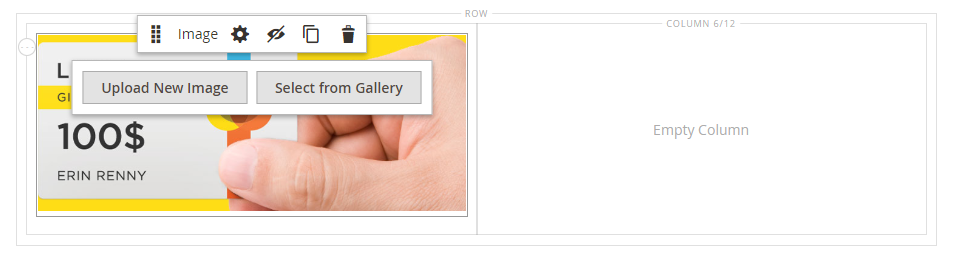
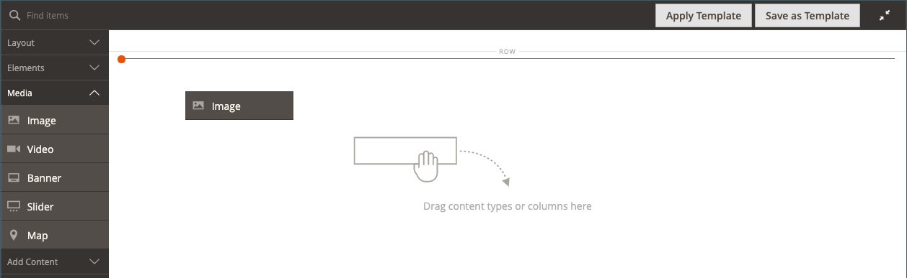
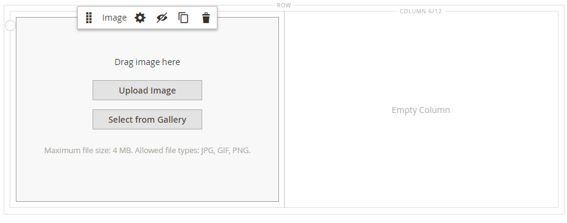
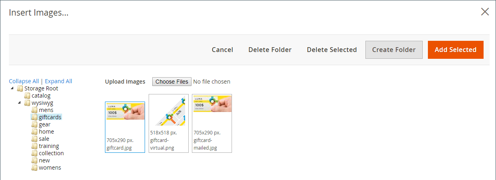
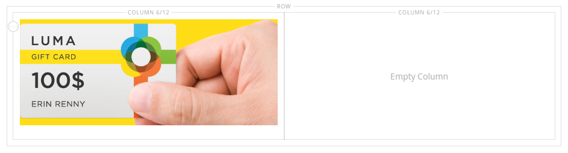
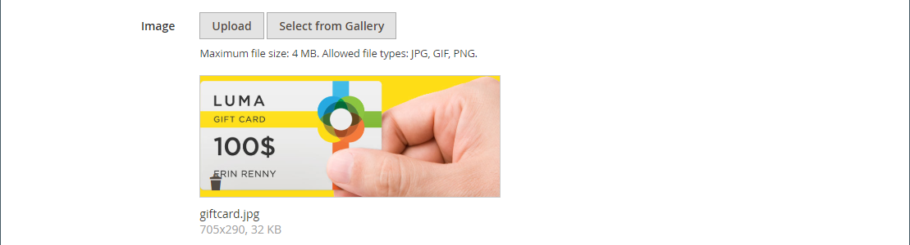
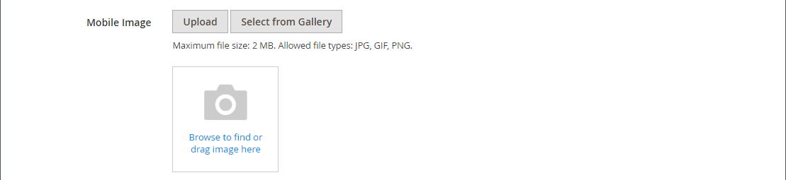
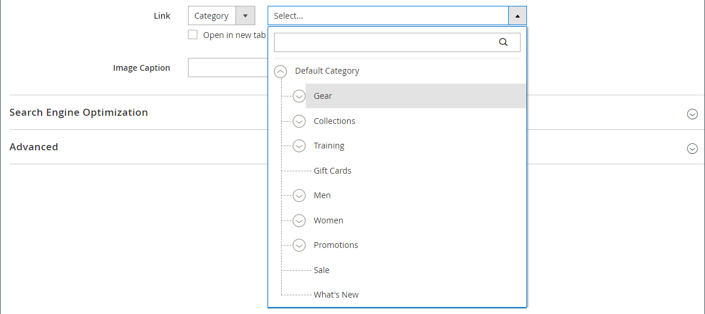
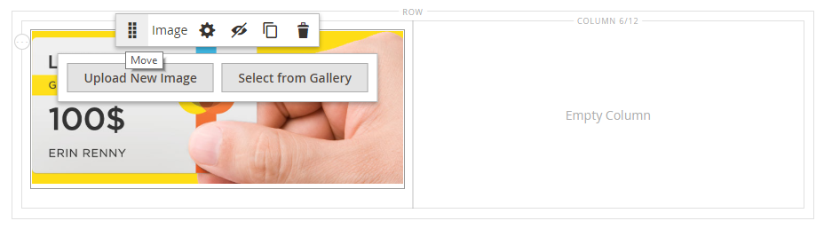
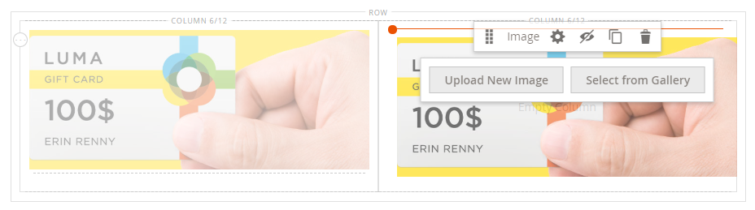

# メディア – 画像

_画像_ コンテンツタイプを使用して、JPG、GIF、またはPNG画像を[[!DNL Page Builder]  ステージ ](workspace.md#stage)に追加します。 デフォルトのデスクトップ画像に加えて、モバイルデバイス用のセカンダリ画像を指定できます。 画像の下に表示されるキャプションを追加し、画像をURL、製品、カテゴリ、またはページにリンクすることもできます。

>[!TIP]
>
>[Adobe Stock統合](../content-design/adobe-stock.md)を使用して、[Adobe Stock](https://stock.adobe.com)が提供する数百万のアセットの中から適切なアセットを見つけて保存できます。 Adobe Stock アセットを検索、調整、およびギャラリーに保存する方法について詳しくは、[Adobe Stock画像の使用](../content-design/adobe-stock-manage.md)を参照してください。

{{$include /help/_includes/page-builder-save-timeout.md}}

## 画像ツールボックス

画像コンテナにカーソルを合わせると、画像ツールボックスが表示されます。

{width="500" zoomable="yes"}

| ツール | アイコン | 説明 |
|--- |--- |--- |
| 移動 | {width="25"} | 画像をステージ上の別の位置に移動します。 |
| （ラベル） | 画像 | 現在のコンテンツコンテナを画像として識別します。 画像コンテナにカーソルを合わせると、ツールボックスが表示されます。 |
| 設定 | {width="25"} | 画像とコンテナのプロパティを変更できる&#x200B;_画像を編集_ ページを開きます。 |
| 非表示 | {width="25"} | 現在の画像を非表示にします。 |
| 表示 | {width="25"} | 非表示の画像を表示します。 |
| 重複 | {width="25"} | 画像のコピーを作成します。 |
| 削除 | {width="25"} | ステージから画像を削除します。 |
| 新しい画像をアップロード |  | ローカルファイルシステムからギャラリーに画像をアップロードします。 |
| ギャラリーから選択 |  | ギャラリーから既存の画像を選択します。 |

{style="table-layout:auto"}

{{$include /help/_includes/page-builder-hidden-element-note.md}}

## 画像を追加

1. [!DNL Page Builder] パネルで、**[!UICONTROL Media]**&#x200B;を展開し、**[!UICONTROL Image]** プレースホルダーをターゲットコンテナにドラッグします。

   行、列、またはタブに画像を追加できます。 次の例では、画像を空の列にドラッグします。

   {width="600" zoomable="yes"}

1. 画像アセットを追加するには、次のいずれかの方法を使用します。

   {width="500" zoomable="yes"}

   >[!NOTE]
   >
   >最大ファイルサイズは4 MBです。 サポートされているファイル形式は、JPG、GIF、PNGです。

   - _**新しい画像をアップロード**_：この方法を使用して、システムから新しい画像ファイルをアップロードします。

      - **[!UICONTROL Upload Image]**&#x200B;をクリックします。

      - 画像を見つけて選択し、ギャラリーとターゲットコンテナに追加します。

     代わりに、システムから画像ファイルをドラッグして、_カメラ_ （{width="20"}）アイコンにドロップすることもできます。

   - _**既存のアセットを選択**_：この方法を使用して、メディアストレージ/ギャラリーから既存の画像アセットを選択します。

      - **[!UICONTROL Select from Gallery]**&#x200B;をクリックします。

      - ツリーを使用して画像に移動します。

      - サムネールをクリックし、**[!UICONTROL Add Selected]**&#x200B;をクリックします。

        {width="600" zoomable="yes"}

   - _**Adobe Stock画像を検索して選択**_：この方法を使用して、Adobe Stockから画像を検索します。

     >[!NOTE]
     >
     >この方法では、管理者用に設定された[Adobe Stock統合](../content-design/adobe-stock.md)が必要です。

      - **[!UICONTROL Search Adobe Stock]**&#x200B;をクリックし、画像を検索します。

      - プレビューまたはライセンスされた画像をギャラリーに保存します。

        Adobe Stock Assetsの操作について詳しくは、[Adobe Stock Imagesの使用](../content-design/adobe-stock-manage.md)を参照してください。

      - ギャラリーでアセットのサムネールを選択し、**[!UICONTROL Add Selected]**&#x200B;をクリックします。

   画像は、プレースホルダーの場所にあるターゲットコンテナに表示されます。 背景画像とは異なり、画像を現在のコンテナ内の別の位置または別のコンテナに移動できます。

   >[!NOTE]
   >
   >[ バナー](banner.md)および[ スライダー](slider.md)のコンテンツタイプには、_画像のアップロード_&#x200B;および&#x200B;_ギャラリーから選択_&#x200B;のオプションも含まれています。

   {width="500" zoomable="yes"}

## 画像設定の変更

1. 画像コンテナにカーソルを合わせてツールボックスを表示し、_設定_ （{width="20"}）アイコンを選択します。
ファイル名、サイズ、ファイルサイズは、現在の画像の下に表示されます。

   {width="600" zoomable="yes"}

1. 現在の&#x200B;**[!UICONTROL Image]**&#x200B;を変更するには、次のいずれかの操作を行います。

   - _**新しい画像をアップロード**_：この方法を使用して、システムから新しい画像ファイルをアップロードします。

      - **[!UICONTROL Upload Image]**&#x200B;をクリックします。

      - 画像を見つけて選択し、ギャラリーとターゲットコンテナに追加します。

   - _**既存のアセットを選択**_：この方法を使用して、メディアストレージ/ギャラリーから既存の画像アセットを選択します。

      - **[!UICONTROL Select from Gallery]**&#x200B;をクリックします。

      - ツリーを使用して画像に移動します。

      - サムネールをクリックし、**[!UICONTROL Add Selected]**&#x200B;をクリックします。

        {width="600" zoomable="yes"}

   - **Adobe Stock画像を検索して選択**：この方法を使用して、Adobe Stockから画像を検索します。

     >[!NOTE]
     >
     >この方法では、管理者用に設定された[Adobe Stock統合](../content-design/adobe-stock.md)が必要です。

      - **[!UICONTROL Search Adobe Stock]**&#x200B;をクリックし、画像を検索します。

      - プレビューまたはライセンスされた画像をギャラリーに保存します。

        Adobe Stock Assetsの操作について詳しくは、[Adobe Stock Imagesの使用](../content-design/adobe-stock-manage.md)を参照してください。

      - ギャラリーでアセットのサムネールを選択し、**[!UICONTROL Add Selected]**&#x200B;をクリックします。

1. **[!UICONTROL Mobile Image]**&#x200B;を追加するには、前の手順で説明したのと同じ方法を使用して、モバイルデバイスでの表示に使用する画像を選択します。

   {width="600" zoomable="yes"}

1. 必要に応じて、画像の&#x200B;**[!UICONTROL Link]**&#x200B;を指定します。

   リンクは、顧客が画像をクリックしたときに表示される宛先ページです。 次の3つのリンクタイプのいずれかを使用できます。

   - **[!UICONTROL URL]** – 相対URLまたは完全修飾URLのいずれかにリンクします。

   - **[!UICONTROL Product]** – 製品名またはSKUに基づいて宛先ページを識別します。 部分的または完全な名前に基づいて、製品を名前で検索します。 検索結果リストから商品を選択します。

     {width="600" zoomable="yes"}

   - **[!UICONTROL Category]** – 宛先ページをカテゴリ ツリー内の特定のカテゴリまたはサブカテゴリとして識別します。 部分的または完全な名前に基づいてカテゴリを検索します。 表示されたツリーの展開されたセクションからカテゴリを選択します。

     {width="600" zoomable="yes"}

   - **[!UICONTROL Page]** – 宛先ページを特定のコンテンツ ページとして識別します。 部分的または完全な名前に基づいてページを検索します。 検索結果リストからページを選択します。

     {width="600" zoomable="yes"}

   訪問者がストアから離れるのを防ぐ場合は、**[!UICONTROL Open in new tab]** チェックボックスを選択します。 チェックボックスをオフにすると、リンクされた宛先が同じブラウザータブで開き、訪問者をストアから効果的に移動させることができます。

1. **[!UICONTROL Image Caption]**&#x200B;を追加するには、画像の下に表示するテキストを入力します。

   キャプションの形式は、現在のテーマに関連付けられているスタイルシートによって決まります。

   キャプションは通常、画像の下に表示され、訪問者と検索エンジンに画像に関する情報を提供します。 サイトが複数の言語で利用できる場合は、同じ画像を使用しながら、キャプションを翻訳します。 HTMLでは、`<figcaption>` タグは`<figure>` タグのサブセットです。`<figcaption>This is the image caption</figcaption>`

1. 必要に応じて、他の設定を更新します。

   - [検索エンジン最適化](#search-engine-optimization)
   - [アドバンス](#advanced)

1. 完了したら、**[!UICONTROL Save]**&#x200B;をクリックして設定を適用し、[!DNL Page Builder] ワークスペースに戻ります。

## 画像を移動

1. 画像コンテナにカーソルを合わせてツールボックスを表示し、_移動_ （{width="20"}）アイコンを選択します。

   {width="500" zoomable="yes"}

1. 赤いガイドラインのすぐ下にある新しい位置に画像を選択してドラッグします。

   {width="500" zoomable="yes"}

## 画像を削除

1. 画像コンテナにカーソルを合わせてツールボックスを表示し、_削除_ （{width="20"}）アイコンを選択します。

1. 確認を求められたら、**[!UICONTROL OK]**&#x200B;をクリックします。

## 検索エンジン最適化

これらの設定のテキストは、検索エンジンに表示され、ページのインデックス作成方法を改善します。

- 「**[!UICONTROL Alternative Text]**」に、表示するデジタルアクセシビリティツールの&#x200B;_alt_ テキスト説明を入力します。

  代替テキストの使用はアクセシビリティのベストプラクティスであり、一部のロケールでは法律で義務付けられています。 HTMLでは、`alt`属性は`image` タグ `<image title="tooltip" alt="description" src="image.jpg">`のサブセットです。

- **[!UICONTROL Title Attribute]**&#x200B;の場合、マウスオーバーにツールチップとして表示するテキストを入力します。

  ベストプラクティスとして、説明的でキーワードが豊富なタイトルを選択して、検索エンジンによる画像のインデックス付け方法を改善します。 HTMLでは、`title`属性は`image` タグ `<image title="tooltip" alt="description" src="image.jpg">`のサブセットです。

## [!UICONTROL Advanced]

- コンテナに追加された画像の水平方向の配置を制御するには、**[!UICONTROL Alignment]**&#x200B;を選択します。

  | オプション | 説明 |
  | ------ | ----------- |
  | `Default` | 現在のテーマのスタイルシートで指定されている整列のデフォルト設定を適用します。 |
  | `Left` | 画像コンテナの左端に沿って画像コンテンツを整列させ、指定された任意のパディングを許可します。 |
  | `Center` | 指定したパディングを許可して、画像コンテナの中央に画像コンテンツを整列させます。 |
  | `Right` | 画像コンテンツを画像コンテナの右端に沿って、指定された任意のパディングを許可して整列させます。 |

  {style="table-layout:auto"}

- 画像コンテナのすべての4つの側面に適用される&#x200B;**[!UICONTROL Border]** スタイルを設定します。

  | オプション | 説明 |
  | ------ | ----------- |
  | `Default` | 関連付けられたスタイルシートで指定されたデフォルトの境界線スタイルを適用します。 |
  | `None` | コンテナの境界を表示しません。 |
  | `Dotted` | コンテナの境界線が点線で表示されます。 |
  | `Dashed` | コンテナの境界線が破線で表示されます。 |
  | `Solid` | コンテナの境界線が実線として表示されます。 |
  | `Double` | コンテナの境界線が2行で表示されます。 |
  | `Groove` | コンテナの境界線は、溝付き線として表示されます。 |
  | `Ridge` | コンテナの境界線は、うね付きの線として表示されます。 |
  | `Inset` | コンテナの境界線がインセット線として表示されます。 |
  | `Outset` | コンテナの境界線がアウトセット線として表示されます。 |

  {style="table-layout:auto"}

- `None`以外の境界線スタイルを設定する場合は、境界線の表示オプションを完了します。

  {width="600" zoomable="yes"}

  | オプション | 説明 |
  | ------ |------------ |
  | [!UICONTROL Border Color] | 色見本を選択するか、カラーピッカーをクリックするか、有効なカラー名または同等の16進数値を入力して、カラーを指定します。 |
  | [!UICONTROL Border Width] | 境界線の幅のピクセル数を入力します。 |
  | [!UICONTROL Border Radius] | 境界線の各隅を丸めるために使用する半径のサイズを定義するピクセル数を入力します。 |

  {style="table-layout:auto"}

- （オプション）画像コンテナに適用する現在のスタイルシートから&#x200B;**[!UICONTROL CSS classes]**&#x200B;の名前を指定します。

  複数のクラス名はスペースで区切ります。

- **[!UICONTROL Margins and Padding]**&#x200B;の値をピクセル単位で入力して、画像コンテナの外側の余白と内側の余白を指定します。

  画像コンテナダイアグラムに対応する各値を入力します。

  | コンテナ領域 | 説明 |
  | -------------- | ----------- |
  | [!UICONTROL Margins] | コンテナのすべての側面の外側のエッジに適用される空白スペースの量。 |
  | [!UICONTROL Padding] | コンテナのすべての側面の内側エッジに適用される空白スペースの量。 |

  {style="table-layout:auto"}

<!-- Last updated from includes: 2023-09-11 14:30:19 -->
