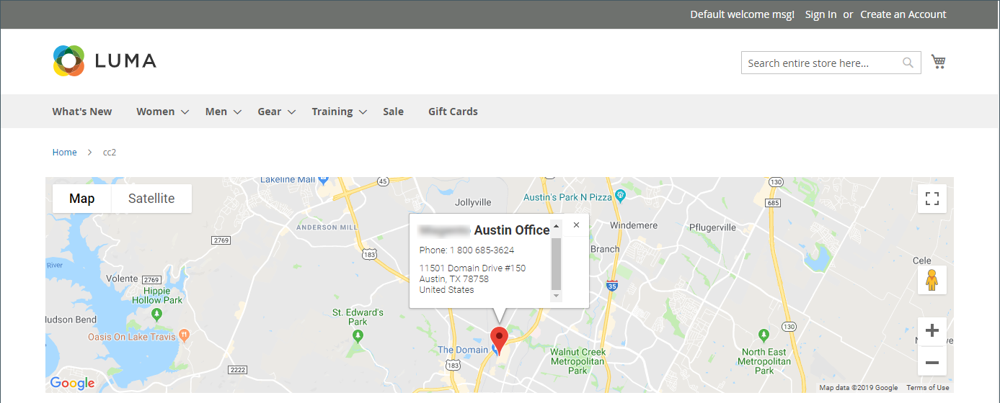
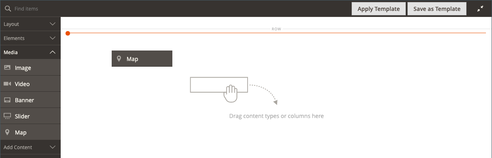
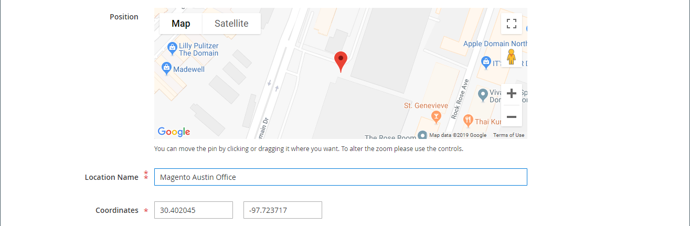
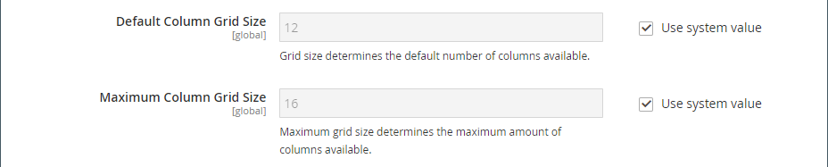

# メディア – マップ

_Map_ コンテンツ タイプを使用して、[[!DNL Google Maps] Platform](https://cloud.google.com/maps-platform/)から[[!DNL Page Builder]  ステージ &#x200B;](workspace.md#stage)へのマップを追加します。 例えば、ブロックにマップを追加し、そのブロックを[About Us](../content-design/pages.md#about-us)および[Contact Us](../getting-started/store-details.md#contact-us-form) ページに追加できます。

[!DNL Google Maps] Platformを最大限に活用するには、マップをカスタマイズし、店舗の場所を強調表示して、Google [Places](https://cloud.google.com/maps-platform/places/)を使用して、店舗に関する豊富な情報をすべての[!DNL Google Maps]に追加します。

## Google マップを埋め込むメリット

1. バイヤーにビジネスに関する全情報（電話番号、web サイト、レビュー、星評価など）をサイト上で提供します。

1. Googleの地図は通常、近くの観光スポット、公園、レストランなどをハイライト表示します。 この情報は、顧客が物理的な場所を決定し、旅行を計画するのに役立ちます。

1. 新しいブラウザーウィンドウを開いてサイトを離れることなく、実店舗のアドレスを簡単に見つけることができます。

1. 実店舗がチェーン展開されている場合、サイトにGoogleマップを追加することで、強調されている商品の形でブランド認知度と信頼性を高めることができます。

{width="700" zoomable="yes"}を含むマップ

{{$include /help/_includes/page-builder-save-timeout.md}}

## マップツールボックス

マップコンテナにカーソルを合わせると、マップツールボックスが表示されます。

| ツール | アイコン | 説明 |
|--- |--- |--- |
| 移動 | {width="25"} | マップをステージ上の別の位置に移動します。 |
| （ラベル） | [!UICONTROL Map] | 現在のコンテンツコンテナをマップとして識別します。 マップコンテナにカーソルを合わせると、ツールボックスが表示されます。 |
| 設定 | {width="25"} | マップを編集ページが開き、マップとコンテナのプロパティを変更できます。 |
| 非表示 | {width="25"} | 現在のマップを非表示にします。 |
| 表示 | {width="25"} | 非表示マップを表示します。 |
| 重複 | {width="25"} | マップのコピーを作成します。 |
| 削除 | {width="25"} | ステージからマップを削除します。 |

{style="table-layout:auto"}

{{$include /help/_includes/page-builder-hidden-element-note.md}}

## 管理者用に[!DNL Google Maps]を設定

マップを追加する前に、まず[!DNL Google Maps] Platformの無料体験版として[&#x200B; アカウント &#x200B;](https://cloud.google.com/maps-platform/user-guide/)を開く必要があります。 無料体験期間は12か月で、300 ドルのクレジットが含まれています。 お客様がクレジットを使用した場合、Googleはお客様の許可なくアカウントに請求することはありません。

### 手順1: [!DNL Google Maps] API キーを取得する

既に[!DNL Google Maps] キーがあるかどうかに応じて、次のいずれかの手順を使用して、設定に必要なAPI キーを取得します。 [!DNL Google Maps] キーを設定するには、アカウントの課金を有効にするための権限を持ったサイト管理者である必要があります。 [!DNL Google Maps] Platform アカウントを設定する準備ができていない場合は、この手順をスキップして、プレースホルダーマップを今すぐ使用できます。

1. [Google Cloud Platform Console](https://cloud.google.com/console/google/maps-apis/overview)に移動します。

1. プロジェクト ドロップダウンをクリックし、API キーを追加するプロジェクトを選択または作成します。

1. API資格情報を設定するには、[!DNL Google Maps] ドキュメントの[手順](https://developers.google.com/maps/documentation/javascript/get-api-key)に従ってください。

1. API キーをクリップボードにコピーします。

### 手順2: [!DNL Commerce]で[!DNL Google Maps]を設定する

1. _管理者_ サイドバーで、**[!UICONTROL Stores]** > _[!UICONTROL Settings]_>**[!UICONTROL Configuration]**&#x200B;に移動します。

1. _[!UICONTROL General]_&#x200B;の下の左側のパネルで、**[!UICONTROL Content Management]**&#x200B;を選択します。

1.  **[!UICONTROL Advanced Content Tools]**&#x200B;を展開します。

   {width="600" zoomable="yes"}

   コンテンツ管理の詳細ツール設定オプションについて詳しくは、[設定リファレンスガイド &#x200B;](../configuration-reference/general/content-management.md)を参照してください。

1. **[!UICONTROL Google Maps API Key]**&#x200B;の場合、手順1でコピーしたキーを貼り付けます。

1. **[!UICONTROL Test Key]**&#x200B;をクリックします。

   キーに問題がある場合は、[!DNL Google Maps] Platform サイトに戻って問題を解決してください。 次に、もう一度試してください。

1. キーを確認したら、**[!UICONTROL Save Config]**&#x200B;をクリックします。

## ステージにマップを追加する

1. [!DNL Page Builder] ワークスペースへのページ、ブロック、または動的ブロックを開きます。

1. [!DNL Page Builder] パネルで、**[!UICONTROL Media]**&#x200B;を展開し、**[!UICONTROL Map]** プレースホルダーをステージにドラッグします。

   {width="600" zoomable="yes"}

   [!DNL Google Maps] Platformがストア用に設定されている場合、ストアの場所のマップが表示されます。

   ![[!DNL Google Maps]](./assets/pb-tutorial2-google-map.png){width="600" zoomable="yes"}

   [!DNL Google Maps] Platformがまだストア用に設定されていない場合は、代わりにプレースホルダーマップが表示されます。

   ![[!DNL Google Maps] プレースホルダー](./assets/pb-tutorial2-media-map-not-configured.png){width="600" zoomable="yes"}

## カスタムマップの場所の追加

1. マップコンテナにカーソルを合わせてツールボックスを表示し、_設定_ （{width="20"}）アイコンを選択します。

1. _[!UICONTROL Edit Map]_&#x200B;ページの右上隅にある「**[!UICONTROL Add Location]**」をクリックします。

1. マップ上のピンに関連付ける&#x200B;**[!UICONTROL Location Name]**&#x200B;を入力します。

1. カスタム位置に使用する位置座標を収集します。

   または、**[!UICONTROL Position]** ボックスで、表示されたマップ内のピンをドラッグすることもできます。

   必要に応じて、新しいブラウザーウィンドウで[[!DNL Google Maps]](https://www.google.com/maps)に移動し、次のいずれかの方法を使用して座標を取得します。

   {width="600" zoomable="yes"}

   **方法1:** URLからのコピー

   - 左上隅の&#x200B;**[!UICONTROL Search]** ボックスにアドレスを入力し、_検索_ （{width="20"}）アイコンをクリックします。

   - URL内の座標をコピーし、メモ帳に貼り付けます。

   **方法2:** 「ここに何があります？」からのコピー

   - 地図上の位置を示す赤いピンを右クリックし、メニューから「**[!UICONTROL What's here?]**」を選択します。

   - 表示されたラベルで、座標を含むテキストをコピーし、テキストをメモ帳に貼り付けます。

1. 各&#x200B;**[!UICONTROL Coordinates]** ボックスに、コンマを含めずに数値を入力します。

   マップ上で使用可能な残りの情報を入力することもできます。

1. マップの場所に関連付ける他の情報を入力します。

   | オプション | 説明 |
   | ------ | ----------- |
   | [!UICONTROL Phone Number] | 場所の電話番号。 |
   | [!UICONTROL Street Address] | 場所の住所。 |
   | [!UICONTROL City] | 場所の市区町村。 |
   | [!UICONTROL Region/State] | 場所の地域または状態。 |
   | [!UICONTROL Zip/Postal Code] | 場所の郵便番号。 |
   | [!UICONTROL Country] | 場所の国。 |
   | [!UICONTROL Comment] | 含めるコメントはすべて。 |

   {style="table-layout:auto"}

1. 完了したら、**[!UICONTROL Save]**&#x200B;をクリックします。

   新しい場所がマップと&#x200B;_[!UICONTROL Edit Map]_&#x200B;ページのマップ場所グリッドに表示されます。

   ![[!DNL Page Builder] - マップの場所グリッド &#x200B;](./assets/pb-media-maps-settings-add-location-grid.png){width="600" zoomable="yes"}

## マップのスタイル設定 {#styling}

[!DNL Google Maps] Platform スタイルウィザードを使用して、6つの定義済みテーマのいずれかを適用するか、カスタムテーマを作成します。 マップスタイルプロパティまたはスタイル設定されたマップへのリンクを含むJSON ファイルを生成できます。

### マップスタイルの変更

1. _管理者_ サイドバーで、**[!UICONTROL Stores]** > _[!UICONTROL Settings]_>**[!UICONTROL Configuration]**&#x200B;に移動します。

1. _[!UICONTROL General]_&#x200B;の下の左側のパネルで、**[!UICONTROL Content Management]**&#x200B;を選択します。

1.  **[!UICONTROL Advanced Content Tools]**&#x200B;を展開します。

1. **[!UICONTROL Google Maps Style]** テキストボックスで、[&#x200B; マップスタイルの作成](https://mapstyle.withgoogle.com/)をクリックします。

   このアクションを実行すると、[[!DNL Google Maps] Platform Styling Wizard](https://mapstyle.withgoogle.com/)が別のタブで開き、[!DNL Google Maps] Platform プロジェクトのスタイルを定義できます。

1. **[!UICONTROL Create a Style]**&#x200B;をクリックし、指定された手順に従います。

   完了したら、**[!UICONTROL Finish]**&#x200B;をクリックします。

1. 完成したスタイルをJSON コードまたはURLとしてエクスポートして、[!DNL Commerce]設定に追加できるようにします。

   - **JSON**：生成されたJSON コードが表示されているボックスの下にある「**[!UICONTROL Copy JSON]**」をクリックします。

   - **[!UICONTROL URL]**：生成されたURLを含むボックスの下で、**[!UICONTROL Copy URL]**&#x200B;をクリックします。

1. 管理者ブラウザータブに戻り、生成されたコードまたはURLを&#x200B;**Google マップスタイル** ボックスに貼り付けます。

   URLを使用している場合は、`YOUR_API_KEY` プレースホルダーを[!DNL Google Maps] API キーに置き換えます。 このURLは、スタイル設定されたGoogle マップにリンクします。

1. 右上隅の「**[!UICONTROL Save Config]**」をクリックします。

### マップ設定の変更

1. マップコンテナにカーソルを合わせてツールボックスを表示し、_設定_ （{width="20"}）アイコンを選択します。

1. 必要に応じて基本設定を変更します。

   | オプション | 説明 |
   | ------ | ----------- |
   | [!UICONTROL Height] | 表示されるマップの高さをピクセル単位で指定します。 |
   | [!UICONTROL Show Controls] | 標準のGoogle マップコントロールが表示されるかどうかを指定します。 |

   {style="table-layout:auto"}

1. 必要に応じて&#x200B;_[!UICONTROL Advanced]_&#x200B;設定を変更します。

   - コンテナに追加されたマップコンテンツの水平方向の配置を制御するには、**[!UICONTROL Alignment]**&#x200B;を選択します。

     | オプション | 説明 |
     | ------ | ----------- |
     | `Default` | 現在のテーマのスタイルシートで指定されている整列のデフォルト設定を適用します。 |
     | `Left` | マップコンテナの左端に沿ってコンテンツを整列させ、指定されたパディングを許可します。 |
     | `Center` | 指定されたパディングを許可して、マップコンテナの中央にあるコンテンツを整列させます。 |
     | `Right` | マップコンテナの右端に沿ってコンテンツを整列させ、指定されたパディングを許可します。 |

     {style="table-layout:auto"}

   - マップコンテナのすべての4つの側面に適用される&#x200B;**[!UICONTROL Border]** スタイルを設定します。

     | オプション | 説明 |
     | ------ | ----------- |
     | `Default` | 関連付けられたスタイルシートで指定されたデフォルトの境界線スタイルを適用します。 |
     | `None` | コンテナの境界を表示しません。 |
     | `Dotted` | コンテナの境界線が点線で表示されます。 |
     | `Dashed` | コンテナの境界線が破線で表示されます。 |
     | `Solid` | コンテナの境界線が実線として表示されます。 |
     | `Double` | コンテナの境界線が2行で表示されます。 |
     | `Groove` | コンテナの境界線は、溝付き線として表示されます。 |
     | `Ridge` | コンテナの境界線は、うね付きの線として表示されます。 |
     | `Inset` | コンテナの境界線がインセット線として表示されます。 |
     | `Outset` | コンテナの境界線がアウトセット線として表示されます。 |

     {style="table-layout:auto"}

   - `None`以外の境界線スタイルを設定する場合は、境界線の表示オプションを完了します。

     {width="600" zoomable="yes"}

     | オプション | 説明 |
     | ------ |------------ |
     | [!UICONTROL Border Color] | 色見本を選択するか、カラーピッカーをクリックするか、有効なカラー名または同等の16進数値を入力して、カラーを指定します。 |
     | [!UICONTROL Border Width] | 境界線の幅のピクセル数を入力します。 |
     | [!UICONTROL Border Radius] | 境界線の各隅を丸めるために使用する半径のサイズを定義するピクセル数を入力します。 |

     {style="table-layout:auto"}

   - （オプション）現在のスタイルシートから&#x200B;**[!UICONTROL CSS classes]**&#x200B;の名前を指定して、マップコンテナに適用します。

     複数のクラス名はスペースで区切ります。

   - **[!UICONTROL Margins and Padding]**&#x200B;の値をピクセル単位で入力して、マップコンテナの外側の余白と内側の余白を指定します。

     対応する各値をマップコンテナダイアグラムに入力します。

     | コンテナ領域 | 説明 |
     | -------------- | ----------- |
     | [!UICONTROL Margins] | コンテナのすべての側面の外側のエッジに適用される空白スペースの量。 |
     | [!UICONTROL Padding] | コンテナのすべての側面の内側エッジに適用される空白スペースの量。 |

     {style="table-layout:auto"}

     >[!NOTE]
     >
     >パディングは、マップ コンテンツ タイプでは使用できません。

1. 完了したら、**[!UICONTROL Save]**&#x200B;をクリックして設定を適用し、[!DNL Page Builder] ワークスペースに戻ります。

### グリッドサイズの変更

グリッド サイズは、[!DNL Page Builder]段階の[列](column.md)に関連するマップのサイズを決定します。 デフォルトでは、マップの幅は12列、最大16列です。

1. _管理者_ サイドバーで、**[!UICONTROL Stores]** > _[!UICONTROL Settings]_>**[!UICONTROL Configuration]**&#x200B;に移動します。

1. _[!UICONTROL General]_&#x200B;の下の左側のパネルで、**[!UICONTROL Content Management]**&#x200B;を選択します。

1.  **[!UICONTROL Advanced Content Tools]**&#x200B;を展開します。

1. 必要に応じて、グリッドオプションを更新します。

   >[!NOTE]
   >
   >必要に応じて、**[!UICONTROL Use system value]** チェックボックスをオフにして、これらの設定を変更します。

   - **[!UICONTROL Default Column Grid Size]**&#x200B;に、グリッドのデフォルトサイズに新しい値を入力します。

   - **[!UICONTROL Maximum Column Grid Size]**&#x200B;に、デフォルトの最大グリッドサイズの新しい値を入力します。

   {width="600" zoomable="yes"}

1. 完了したら、**[!UICONTROL Save Config]**&#x200B;をクリックします。

<!-- Last updated from includes: 2023-09-11 14:30:19 -->
