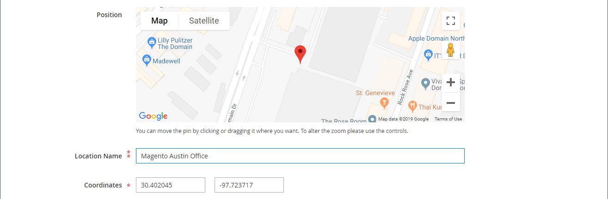

# メディア — マップ

以下を使用します。 _マップ_ マップを追加するコンテンツタイプ [[!DNL Google Maps] Platform][1] から [[!DNL Page Builder] ステージ](workspace.md#stage). たとえば、ブロックにマップを追加し、次にブロックを [会社概要](../content-design/pages.md#about-us) および [お問い合わせ](../getting-started/store-details.md#contact-us-form) ページ。

を最大限に活用するには [!DNL Google Maps] Platform では、マップをカスタマイズし、ストアの場所をハイライト表示して、Googleを使用できます。 [場所][2] ストアに関する豊富な情報をすべての [!DNL Google Maps].

## Googleマップを埋め込むメリット

1. お客様のサイト上のビジネス（電話番号、Web サイト、レビュー、星評価など）に関するすべての情報を、購入者に提供します。

1. Googleの地図は、通常、近くのアトラクションや公園、レストランなどを見どころとしています。 この情報は、顧客が物理的な場所を特定し、旅行の計画を立てる際に役立ちます。

1. 新しいブラウザーウィンドウを開いてサイトを離れる必要なく、顧客が物理ストアのアドレスを簡単に見つけられるようにします。

1. 物理店舗のチェーンがある場合は、サイトにGoogleマップを追加すると、ブランドの認知度と信頼性を高めるのに役立ちます。

{width="700" zoomable="yes"}

{{$include /help/_includes/page-builder-save-timeout.md}}

## Map toolbox

マップコンテナの上にマウスポインターを置くと、マップツールボックスが表示されます。

| ツール | アイコン | 説明 |
|--- |--- |--- |
| 移動 | {width="25"} | マップをステージ上の別の位置に移動します。 |
| （ラベル） | [!UICONTROL Map] | 現在のコンテンツコンテナをマップとして識別します。 マップコンテナの上にマウスポインターを置くと、ツールボックスが表示されます。 |
| 設定 | {width="25"} | [ マップを編集 ] ページが開き、マップとコンテナのプロパティを変更できます。 |
| 非表示 | {width="25"} | 現在のマップを非表示にします。 |
| 表示 | {width="25"} | 非表示のマップを表示します。 |
| 複製 | {width="25"} | マップのコピーを作成します。 |
| 削除 | {width="25"} | ステージからマップを削除します。 |

{style="table-layout:auto"}

{{$include /help/_includes/page-builder-hidden-element-note.md}}

## 設定 [!DNL Google Maps] 管理者の

マップを追加する前に、まず [アカウント][3] ～を無料で試してみるために [!DNL Google Maps] プラットフォーム。 無料体験版は 12 か月続き、300 ドルのクレジットが含まれます。 クレジットを使い果たした場合、Googleはお客様の許可なしにアカウントを請求しません。

### 手順 1: [!DNL Google Maps] API キー

既に [!DNL Google Maps] キーを設定する場合は、次のいずれかの手順を使用して、設定に必要な API キーを取得します。 次の手順で [!DNL Google Maps] キーを押すには、アカウントの請求を有効にする権限を持つサイト管理者である必要があります。 まだ [!DNL Google Maps] Platform アカウントを使用する場合は、この手順をスキップして、プレースホルダーマップを使用できます。

1. 次に移動： [Google Cloud Platform コンソール](https://cloud.google.com/console/google/maps-apis/overview).

1. 「プロジェクト」ドロップダウンをクリックし、API キーを追加するプロジェクトを選択または作成します。

1. API 資格情報を設定するには、 [instructions][4] （内） [!DNL Google Maps] ドキュメント。

1. API キーをクリップボードにコピーします。

### 手順 2：設定 [!DNL Google Maps] in [!DNL Commerce]

1. Adobe Analytics の _管理者_ サイドバー、移動 **[!UICONTROL Stores]** > _[!UICONTROL Settings]_>**[!UICONTROL Configuration]**.

1. の下の左側のパネル _[!UICONTROL General]_を選択します。**[!UICONTROL Content Management]**.

1. 展開  **[!UICONTROL Advanced Content Tools]**.

   {width="600" zoomable="yes"}

   コンテンツ管理の高度なツールの設定オプションについて詳しくは、 [設定リファレンスガイド](../configuration-reference/general/content-management.md).

1. の場合 **[!UICONTROL Google Maps API Key]**&#x200B;で、手順 1 でコピーしたキーを貼り付けます。

1. クリック **[!UICONTROL Test Key]**.

   キーに問題がある場合は、に戻ります。 [!DNL Google Maps] 問題を解決する Platform サイト。 その後、再度お試しください。

1. 鍵が確認されたら、 **[!UICONTROL Save Config]**.

## ステージにマップを追加

1. ページ、ブロック、または動的ブロックを開き、 [!DNL Page Builder] ワークスペース。

1. Adobe Analytics の [!DNL Page Builder] パネル、展開 **[!UICONTROL Media]** をクリックし、 **[!UICONTROL Map]** プレースホルダーをステージに追加します。

   {width="600" zoomable="yes"}

   次の場合 [!DNL Google Maps] ストアに対してプラットフォームが設定されているので、ストアの場所のマップが表示されます。

   ![[!DNL Google Maps]](./assets/pb-tutorial2-google-map.png){width="600" zoomable="yes"}

   次の場合 [!DNL Google Maps] お使いのストアに対してまだ Platform が設定されていません。代わりにプレースホルダーマップが表示されます。

   ![[!DNL Google Maps] プレースホルダー](./assets/pb-tutorial2-media-map-not-configured.png){width="600" zoomable="yes"}

## カスタムマップの場所を追加する

1. マップコンテナの上にマウスポインターを置いてツールボックスを表示し、 _設定_ ( {width="20"} ) アイコンをクリックします。

1. をクリックします。 _[!UICONTROL Edit Map]_ページ、クリック&#x200B;**[!UICONTROL Add Location]**.

1. 次を入力します。 **[!UICONTROL Location Name]** マップ上のピンに関連付ける

1. カスタム位置に使用する位置座標を収集します。

   または、 **[!UICONTROL Position]** ボックスをクリックすると、表示されているマップにピンをドラッグできます。

   必要に応じて、に移動します。 [[!DNL Google Maps]][5] 新しいブラウザウィンドウで、次のいずれかの方法を使用して座標を取得します。

   {width="600" zoomable="yes"}

   **メソッド 1:** URL からコピー

   - 左上隅に、 **[!UICONTROL Search]** ボックスで _検索_ ( {width="20"} ) アイコンをクリックします。

   - URL 内の座標をコピーして、メモ帳に貼り付けます。

   **方法 2:** 「What&#39;s here?」からコピー

   - マップ上の位置を示す赤いピンを右クリックし、を選択します。 **[!UICONTROL What's here?]** 」と入力します。

   - 表示されたラベルで、座標を含むテキストをコピーし、テキストをメモ帳に貼り付けます。

1. 各 **[!UICONTROL Coordinates]** ボックス。

   また、マップ上で使用可能にする残りの情報も入力できます。

1. マップの場所に関連付ける他の情報を競合します。

   | オプション | 説明 |
   | ------ | ----------- |
   | [!UICONTROL Phone Number] | 場所の電話番号。 |
   | [!UICONTROL Street Address] | 場所の住所。 |
   | [!UICONTROL City] | 場所の市区町村。 |
   | [!UICONTROL Region/State] | 場所の地域または都道府県。 |
   | [!UICONTROL Zip/Postal Code] | 場所の郵便番号。 |
   | [!UICONTROL Country] | 場所の国。 |
   | [!UICONTROL Comment] | 含めるコメント。 |

   {style="table-layout:auto"}

1. 完了したら、「 **[!UICONTROL Save]**.

   新しい位置がマップおよび _[!UICONTROL Edit Map]_ページに貼り付けます。

   ![[!DNL Page Builder]  — 位置グリッドをマップ](./assets/pb-media-maps-settings-add-location-grid.png){width="600" zoomable="yes"}

## マップのスタイルを設定する {#styling}

以下を使用します。 [!DNL Google Maps] プラットフォームスタイル設定ウィザード：6 つの定義済みテーマの 1 つを適用するか、カスタムテーマを作成します。 マップスタイルのプロパティまたはスタイル設定されたマップへのリンクを含む JSON ファイルを生成できます。

### マップスタイルを変更する

1. Adobe Analytics の _管理者_ サイドバー、移動 **[!UICONTROL Stores]** > _[!UICONTROL Settings]_>**[!UICONTROL Configuration]**.

1. の下の左側のパネル _[!UICONTROL General]_を選択します。**[!UICONTROL Content Management]**.

1. 展開  **[!UICONTROL Advanced Content Tools]**.

1. の下 **[!UICONTROL Google Maps Style]** テキストボックスで、 [マップスタイルを作成][6].

   このアクションを実行すると、 [[!DNL Google Maps] プラットフォームスタイル設定ウィザード][6] 別のタブで、 [!DNL Google Maps] Platform プロジェクト。

1. クリック **[!UICONTROL Create a Style]** と、指示に従います。

   完了したら、「 **[!UICONTROL Finish]**.

1. 完成したスタイルを JSON コードまたは URL として書き出し、 [!DNL Commerce] 設定。

   - **JSON**：生成された JSON コードのボックスの下で、 **[!UICONTROL Copy JSON]**.

   - **[!UICONTROL URL]**：生成された URL を含むボックスの下で、 **[!UICONTROL Copy URL]**.

1. 「管理ブラウザー」タブに戻り、生成したコードまたは URL を **Google Maps スタイル** ボックス。

   URL を使用している場合は、 `YOUR_API_KEY` のプレースホルダーを [!DNL Google Maps] API キー。 この URL は、スタイル設定されたGoogleマップにリンクします。

1. 右上隅で、 **[!UICONTROL Save Config]**.

### マップ設定の変更

1. マップコンテナの上にマウスポインターを置いてツールボックスを表示し、 _設定_ ( {width="20"} ) アイコンをクリックします。

1. 必要に応じて基本設定を変更します。

   | オプション | 説明 |
   | ------ | ----------- |
   | [!UICONTROL Height] | 表示されるマップの高さをピクセル単位で指定します。 |
   | [!UICONTROL Show Controls] | 標準のGoogle Map コントロールを表示するかどうかを指定します。 |

   {style="table-layout:auto"}

1. を変更します。 _[!UICONTROL Advanced]_必要に応じて設定します。

   - コンテナに追加されるマップコンテンツの水平方向の位置を制御するには、 **[!UICONTROL Alignment]**:

     | オプション | 説明 |
     | ------ | ----------- |
     | `Default` | 現在のテーマのスタイルシートで指定された位置揃えの既定の設定を適用します。 |
     | `Left` | 指定されたパディングを許容して、マップコンテナの左の境界線に沿ってコンテンツを揃えます。 |
     | `Center` | 指定されたパディングを許容して、マップコンテナの中央にコンテンツを揃えます。 |
     | `Right` | 指定されたパディングを許容して、マップコンテナの右の境界線に沿ってコンテンツを揃えます。 |

     {style="table-layout:auto"}

   - を設定します。 **[!UICONTROL Border]** マップコンテナの 4 つの側面すべてに適用されるスタイル：

     | オプション | 説明 |
     | ------ | ----------- |
     | `Default` | 関連するスタイルシートで指定された既定の罫線のスタイルを適用します。 |
     | `None` | コンテナの境界線を表示しません。 |
     | `Dotted` | コンテナの境界線は点線で表示されます。 |
     | `Dashed` | コンテナの境界線は破線で表示されます。 |
     | `Solid` | コンテナの境界線は実線で表示されます。 |
     | `Double` | コンテナの境界線は二重線で表示されます。 |
     | `Groove` | コンテナ境界は溝付きの線として表示されます。 |
     | `Ridge` | コンテナの境界線は、稜線として表示されます。 |
     | `Inset` | コンテナの境界線は、挿入線として表示されます。 |
     | `Outset` | コンテナの境界線は、アウトセット行として表示されます。 |

     {style="table-layout:auto"}

   - 次の条件を満たさない境界線のスタイルを設定した場合： `None`、境界線の表示オプションを設定します。

     {width="600" zoomable="yes"}

     | オプション | 説明 |
     | ------ |------------ |
     | [!UICONTROL Border Color] | スウォッチを選択するか、カラーピッカーをクリックするか、有効なカラー名または同等の 16 進値を入力して、カラーを指定します。 |
     | [!UICONTROL Border Width] | 境界線の幅のピクセル数を入力します。 |
     | [!UICONTROL Border Radius] | ピクセル数を入力して、境界線の各隅を囲むために使用する半径のサイズを定義します。 |

     {style="table-layout:auto"}

   - （オプション） **[!UICONTROL CSS classes]** 現在のスタイルシートからマップコンテナに適用します。

     複数のクラス名はスペースで区切ります。

   - 次の値をピクセル単位で入力します。 **[!UICONTROL Margins and Padding]** を使用して、マップコンテナの外側の余白と内側のパディングを指定します。

     マップコンテナ図で、対応する各値を入力します。

     | コンテナ領域 | 説明 |
     | -------------- | ----------- |
     | [!UICONTROL Margins] | コンテナのすべての側面の外側の端に適用される空白の量。 |
     | [!UICONTROL Padding] | コンテナのすべての側面の内側の端に適用される空白の量。 |

     {style="table-layout:auto"}

     >[!NOTE]
     >
     >マップコンテンツタイプではパディングを使用できません。

1. 完了したら、「 **[!UICONTROL Save]** 設定を適用し、に戻るには、次の手順に従います。 [!DNL Page Builder] ワークスペース。

### グリッドサイズの変更

グリッドサイズによって、 [列](column.md) の [!DNL Page Builder] ステージ。 デフォルトでは、マップの幅は 12 列で、最大 16 列です。

1. Adobe Analytics の _管理者_ サイドバー、移動 **[!UICONTROL Stores]** > _[!UICONTROL Settings]_>**[!UICONTROL Configuration]**.

1. の下の左側のパネル _[!UICONTROL General]_を選択します。**[!UICONTROL Content Management]**.

1. 展開  **[!UICONTROL Advanced Content Tools]**.

1. 必要に応じてグリッドオプションを更新します。

   >[!NOTE]
   >
   >必要に応じて、 **[!UICONTROL Use system value]** チェックボックスを使用して、これらの設定を変更できます。

   - の場合 **[!UICONTROL Default Column Grid Size]**&#x200B;を使用する場合は、グリッドのデフォルトサイズの新しい値を入力します。

   - の場合 **[!UICONTROL Maximum Column Grid Size]**&#x200B;を使用する場合は、デフォルトの最大グリッドサイズの新しい値を入力します。

   {width="600" zoomable="yes"}

1. 完了したら、「 **[!UICONTROL Save Config]**.

[1]: https://cloud.google.com/maps-platform/
[2]: https://cloud.google.com/maps-platform/places/
[3]: https://cloud.google.com/maps-platform/user-guide/
[4]: https://developers.google.com/maps/documentation/javascript/get-api-key
[5]: https://www.google.com/maps
[6]: https://mapstyle.withgoogle.com/
