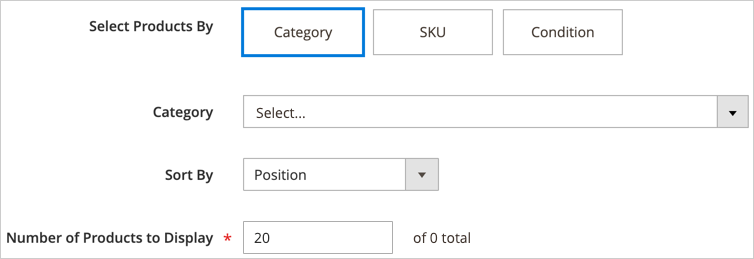

# コンテンツを追加 – 製品

_製品_ コンテンツタイプを使用して、グリッドまたはカルーセルレイアウトを使用して、製品のリストを [[!DNL Page Builder]  ステージ ](workspace.md#stage) に追加します。 [ コンテンツを追加 – ブロック ](block.md) ツールを使用して、[!DNL Page Builder] のステージにブロックを配置してから、ブロック内に製品リストを配置します。 または、製品リストをページの行に直接追加できます。

## 製品カルーセル使用のガイドライン

製品カルーセルは、製品を紹介するための強力で魅力的な方法を提供します。 これを最大限に活用するには、次のガイドラインに従うことをお勧めします。

- 行、タブ、1 列レイアウトなどのページ幅コンテナに製品カルーセルを直接追加できます。 ページ幅レイアウトを使用すると、製品のレスポンシブな表示を最適に行うことができます。 [!DNL Page Builder] は、コンテナの幅ではなく、ページの幅に応じて表示される製品の数を減らします。

- 幅の狭い列に製品カルーセルを追加しないでください。 前述したよう [!DNL Page Builder]、デフォルトでは、列の幅ではなくページの幅に基づいて、表示する製品数が決定されます。

- 製品カルーセルを継続的に自動スクロールする場合は、**[!UICONTROL Autoplay]** と **[!UICONTROL Infinite Loop]** の両方を `Yes` に設定します。 自動再生を `Yes` に、無限ループを `No` に設定すると、自動スクロールは商品リストの最後で停止します。

- カルーセル内で一度に 1 つの製品をハイライト、中央揃え、スクロールするには、**[!UICONTROL Carousel Mode]** を `Continuous` に設定します。 その他の製品は、リストに表示されますが、中央にある製品をハイライト表示するために透明になります。

  {width="600"}

- カルーセル内で一度に最大 5 つの製品を表示およびスクロールするには、**[!UICONTROL Carousel Mode]** を `Default` に設定します。

  {width="600"}

次の手順は、製品リストをブロックに追加する方法を示しています。 その後、[ ウィジェット ](../content-design/widgets.md) を使用して、ストアの任意のページの特定の場所にブロックを配置できます。

{{$include /help/_includes/page-builder-save-timeout.md}}

## 製品ツールボックス

| ツール | アイコン | 説明 |
| --------- | ------------- | ----------------- |
| 移動 | {width="25"} | products コンテナとそのコンテンツをステージ上の別の位置に移動します。 |
| 設定 | {width="25"} | _商品を編集_ ページを開きます。このページで、商品リストを選択し、コンテナのプロパティを変更できます。 |
| Hide | {width="25"} | 現在の製品コンテナとそのコンテンツを非表示にします。 |
| 表示 | {width="25"} | 非表示の製品コンテナとその内容を表示します。 |
| 複製 | {width="25"} | products コンテナとそのコンテンツのコピーを作成します。 |
| 削除 | {width="25"} | product コンテナとそのコンテンツをステージから削除します。 |

{style="table-layout:auto"}

{{$include /help/_includes/page-builder-hidden-element-note.md}}

## 商品リストブロックの作成

1. _管理者_ サイドバーで、**[!UICONTROL Content]**/_[!UICONTROL Elements]_/**[!UICONTROL Blocks]**に移動します。

1. 「**[!UICONTROL Add New Block]**」をクリックします。

1. **[!UICONTROL Block Title]** と **[!UICONTROL Identifier]** を入力します。

1. ブロックを使用できる **[!UICONTROL Store View]** を選択します。

1. 下にスクロールして、コンテンツプレビュー領域の **[!UICONTROL Edit with Page Builder]** または内側をクリックして、[!DNL Page Builder] ワークスペースを開きます。

1. [!DNL Page Builder] パネルで **[!UICONTROL Add Content]** を展開し、**[!UICONTROL Products]** プレースホルダーをステージにドラッグします。

   {width="600" zoomable="yes"}

## 製品リストコンテナの設定

空の _Products_ コンテナにポインタを合わせてツールボックスを表示し、_設定_ （{width="20"}） アイコンをクリックします。

{width="500" zoomable="yes"}

次の節に従って _設定_ を完了します。

### 外観

1. 製品リストがページ上にどのように表示されるかを決定するには、次のいずれかの外観タイプを選択します。

   | タイプ | 説明 |
   | ---- | ----------- |
   | 製品グリッド | 製品をグリッドに表示します。グリッドには、デフォルトで 1 行あたり 5 つの製品が表示され、**[!UICONTROL Number of Products to Display]** 設定で入力した数の表示に必要な数の行が表示されます。 |
   | 製品カルーセル | カルーセル（スライダーとも呼ばれます）内の製品を表示します。 カルーセルには、スライドごとに最大 5 つの製品が表示されます。   **応答性アラート**：この外観を選択した場合は、Products コンテンツタイプを、レスポンシブな行、タブ、または 1 列のレイアウトに直接追加し、小さい画面で左右に表示される製品が少なくなるようにすることをお勧めします。 ページの幅よりも狭いコンテンツタイプ（幅が狭い列など）にカルーセルを追加すると、画面サイズに関係なく、カルーセルにはコンテナで許可された数よりも多くの商品がスライドごとに表示されます。 |

   {style="table-layout:auto"}

   {width="300"}

   製品カルーセルを選択する場合は、[ カルーセル設定 ](#carousel-settings) も設定する必要があります。

1. **[!UICONTROL Select Products By]** しくは、製品の選択方法を選択します。

   商品は、カテゴリ、SKU、条件で選択できます。 これらのオプションは相互に排他的です。 例えば、「カテゴリ」オプションを選択せず、カテゴリセレクターを使用してから「条件」オプションに切り替えて条件を追加することができません。 製品は、これら 3 つのオプションのうち _1_ に設定した項目にのみ基づいて選択されます。

   - **[!UICONTROL Category]** – 選択したカテゴリを使用する製品を表示するには、このオプションを選択します。

     {width="500"}

     このオプションを選択すると、**[!UICONTROL Category]** セレクターが表示されます。 矢印をクリックしてドリルダウンし、表示する製品のカテゴリを選択します。 例えば、[!DNL Commerce] のサンプルデータでドリルインし、_Women/Tops/Tees_ を選択すると、そのカテゴリのすべての製品が表示されます。

     {width="500"}

   - **[!UICONTROL SKU]** - 1 つ以上の SKU を使用して製品を表示する場合は、このオプションを選択します

     このオプションを選択すると、表示する SKU のコンマ区切りのリストを入力する必要がある、**[!UICONTROL Product SKUs]** のテキストボックスが表示されます。

     {width="500"}

   - **[!UICONTROL Condition]** – 定義した 1 つ以上の条件に従って製品を表示する場合は、このオプションを選択します。

     選択した場合、製品の選択に条件を追加するためのツールを使用できます。 例えば、性別が「Unisex」に設定されている製品のみを選択できます。

     {width="500"}

     >[!NOTE]
     >
     >「カテゴリ」または「SKU」オプションを選択すると、`Position` の **[!UICONTROL Sort By]** のオプションが表示されます。 この並べ替えオプションを使用すると、製品はカタログに表示されるのと同じ順序で表示されます。 
     >
     >「カテゴリ」オプションの場合、位置で並べ替えると、カタログに表示されるのと同じ順序で製品が表示されます。 SKU オプションの場合、位置で並べ替えると、「**[!UICONTROL Product SKUs]**」テキストボックスに入力した順序で製品が表示されます。

1. **[!UICONTROL Sort By]** に、リスト内の製品の並べ替え順を選択します。

   | オプション | 説明 |
   | ------ | ----------- |
   | `Position` （カテゴリオプションと SKU オプションのみ） | 「カテゴリ」オプションを選択すると、「位置」には、カタログ内の位置と同じ順序で製品が表示されます。 「SKU」オプションを選択すると、「位置」には、「製品 SKU」テキストボックス内の SKU と同じ順序で製品が表示されます。 |
   | `Newest products first` | 商品をカタログに追加された日付順に並べ替え、最新のエントリ日を先頭にする商品を表示します。 |
   | `Oldest products first` | 商品をカタログに追加された日付順に並べ、エントリ日が最も古い商品が最初に表示されます。 |
   | `Name: A - Z` | アルファベット順に商品を並べ替えます。 |
   | `Name: Z - A` | アルファベットの逆の順序で商品を並べ替えます。 |
   | `SKU: ascending` | 商品を SKU 順にアルファベット順に並べ替えます。 |
   | `SKU: descending` | 商品を SKU 順に逆英数字の順序で並べ替えます。 |
   | `Stock: low stock first` | 利用可能な在庫の少ない順に商品を並べ替えます。 |
   | `Stock: high stock first` | 利用可能な在庫の多い順に商品を並べ替えます。 |
   | `Price: high to low` | 商品を高値から安値に並べ替えます。 |
   | `Price: low to high` | 商品を最低価格から最高価格に並べ替えます。 |

   {style="table-layout:auto"}

   {width="300"}

1. カルーセルまたはグリッドに **[!UICONTROL Number of Products to Display]** を入力します。

   値は、`1` ～ `999` の範囲で指定します。 デフォルトは、グリッドの場合は `5`、カルーセルの場合は `20` です。

   >[!NOTE]
   >
   >カテゴリ、SKU または条件設定の一部の製品が、製品グリッドまたはカルーセルに表示されない場合があります。 例えば、無効な製品、非表示とマークされた製品、在庫切れの製品、別の web サイトに割り当てられた製品は表示されません。

   >[!IMPORTANT]
   >
   >設定可能、グループ化およびバンドル（動的価格）製品の価格は、管理者で定義されていません。 したがって、製品が価格でフィルタリングされている場合、これらの製品は **[!UICONTROL Preview]** に表示されません。 価格でご注文された場合、これらの商品は **[!UICONTROL Preview]** で正しく注文できません。

### カルーセル設定

1. カルーセル内での製品の表示方法を決定するには、**[!UICONTROL Carousel Mode]** のオプションを選択します。

   | オプション | 説明 |
   | ------ | ----------- |
   | `Default` | カルーセルには、デフォルトでスライドあたり 5 つの製品が表示され、必要に応じてカルーセルの数が減ります。 |
   | `Continuous` | カルーセルには、デフォルトでスライドあたり 5 つの製品（製品の半分が左右に表示）が表示されますが、無限ループで一度に 1 つの製品を中央に配置してスクロールします。 中央の商品の左右にある商品は、中央の商品がハイライト表示されるように淡色表示されます。 |

   {style="table-layout:auto"}

   これら 2 つのモードを切り替えても、**[!UICONTROL Infinite Loop]** 設定は常に連続モードで `Yes` に設定され、フィールドが無効になっている場合を除き、その他のカルーセル設定は保持されます。

   {width="600" zoomable="yes"}

1. 必要に応じて、**[!UICONTROL Autoplay]** オプションを `Yes` に設定します。

   自動再生を有効にすると、ページが読み込まれたときに、カルーセルが自動的にスクロールを開始します。 デフォルト設定（`No`）のままにした場合、顧客はスライドナビゲーション（ドットまたは矢印）をクリックして各スライドを順番に表示する必要があります。

   この機能を有効にした場合は、**[!UICONTROL Autoplay Speed]** と入力して、各スライド間の遅延をミリ秒単位で指定します。 デフォルト値は `4000` （4 秒）です。

1. 必要に応じて、**[!UICONTROL Infinite Loop]** オプションを `Yes` に設定します。

   無限ループを有効にすると、ページが開いている間、スライド ショーは無限に再生されます。 初期設定（`No`）のままにすると、スライドショーは 1 回だけ再生されます。

   >[!NOTE]
   >
   >**[!UICONTROL Infinite Loop]** を `No` に設定し、**[!UICONTROL Autoplay]** を `Yes` に設定すると、表示される製品の数の最後で自動再生が停止します。

1. 必要に応じて、**[!UICONTROL Show Arrows]** オプションを `Yes` に設定します。

   このオプションを有効にすると、各スライドに _次へ_ と _前へ_ のナビゲーション矢印が左右に表示されます。 デフォルト設定（`No`）のままにすると、ナビゲーション矢印はスライドに表示されません。

1. 必要に応じて、**[!UICONTROL Show Dots]** オプションを `No` に設定します。

   デフォルト設定（`Yes`）に設定すると、カルーセルスライダーの下部にナビゲーションドットが表示されます。 この設定を無効にした場合、カルーセルスライダーにナビゲーションドットは表示されません。

### 詳細

1. 親コンテナ内の商品リストの位置を制御するには、**[!UICONTROL Alignment]** のいずれかを選択します。

   | オプション | 説明 |
   | ------ | ----------- |
   | `Default` | 現在のテーマのスタイル シートで指定されている線形の既定の設定を適用します。 |
   | `Left` | 親コンテナの左罫線に沿ってリストを配置します。指定したパディングはすべて許可されます。 |
   | `Center` | 親コンテナの中央にリストを揃えます。指定したパディングに対する許容値を使用します。 |
   | `Right` | 親コンテナの右端に沿ってリストを配置します。指定したパディングは許可されます。 |

   {style="table-layout:auto"}

1. Products コンテナの 4 つの側面すべてに適用される **[!UICONTROL Border]** スタイルを設定します。

   | オプション | 説明 |
   | ------ | ----------- |
   | `Default` | 関連付けられたスタイル シートで指定されている既定の罫線スタイルを適用します。 |
   | `None` | コンテナの境界線の表示はしません。 |
   | `Dotted` | コンテナの境界線は点線で表示されます。 |
   | `Dashed` | コンテナの境界線は破線で表示されます。 |
   | `Solid` | コンテナの境界線は実線で表示されます。 |
   | `Double` | コンテナの境界線は二重線で表示されます。 |
   | `Groove` | コンテナの境界線は溝付き線で表示されます。 |
   | `Ridge` | コンテナの境界線は、境界線として表示されます。 |
   | `Inset` | コンテナの境界線は、インセットされた線として表示されます。 |
   | `Outset` | コンテナの境界線は、先頭行として表示されます。 |

   {style="table-layout:auto"}

1. `None` 以外の境界線のスタイルを設定する場合は、境界線の表示オプションを完了します。

   | オプション | 説明 |
   | ------ |------------ |
   | [!UICONTROL Border Color] | 見本を選択するか、カラーピッカーをクリックするか、有効なカラー名または同等の 16 進数値を入力して、カラーを指定します。 |
   | [!UICONTROL Border Width] | 境界線の幅のピクセル数を入力します。 |
   | [!UICONTROL Border Radius] | ピクセル数を入力して、境界線の各コーナーを丸めるために使用する半径のサイズを定義します。 |

   {style="table-layout:auto"}

1. （オプション）コンテナに適用する現在のスタイルシートの **[!UICONTROL CSS classes]** の名前を指定します。

   複数のクラス名はスペースで区切ります。

1. Products コンテナの外側の余白と内側のパディングを決定する **[!UICONTROL Margins and Padding]** の値をピクセル単位で入力します。

   対応する値を図に入力します。

   | コンテナ領域 | 説明 |
   | -------------- | ----------- |
   | [!UICONTROL Margins] | コンテナのすべての側面の外側の端に適用される空白スペースの量。 オプション：`Top`/`Right`/`Bottom`/`Left` |
   | [!UICONTROL Padding] | コンテナのすべての側面の内側の端に適用される空白のスペースの量です。 オプション：`Top`/`Right`/`Bottom`/`Left` |

## ステージでの保存とプレビュー

右上隅にある「**[!UICONTROL Save]**」をクリックして設定を適用し、[!DNL Page Builder] ワークスペースに戻ります。

製品カルーセルを設定した場合は、次の例のようになります。

{width="600"}

[ ウィジェット ](../content-design/widgets.md) を使用して、このブロックをストア内の表示する場所に配置できるようになりました。 または、[ コンテンツを追加 – ブロック ](block.md) を使用して、既存のページ、タブ、ブロックにブロックを追加できます。
