# コンテンツを追加 – 製品

「_製品_」コンテンツタイプを使用して、グリッドまたはカルーセルレイアウトを使用して、製品のリストを[[!DNL Page Builder]  ステージ &#x200B;](workspace.md#stage)に追加します。 [&#x200B; コンテンツを追加 – ブロック &#x200B;](block.md) ツールを使用して[!DNL Page Builder] ステージにブロックを配置し、そのブロック内に製品リストを配置します。 または、製品リストをページの行に直接追加することもできます。

## 製品カルーセルの使用に関するガイドライン

商品カルーセルは、商品をアピールするための強力で魅力的な方法を提供します。 それを最大限に活用するには、次のガイドラインをお勧めします。

- 行、タブ、1列レイアウトなどのページ幅のコンテナに、製品カルーセルを直接追加できます。 ページ幅のレイアウトを使用することで、商品のレスポンシブな表示を最適にできます。 [!DNL Page Builder]は、コンテナの幅ではなく、ページの幅に応じて表示される製品数を減らします。

- 製品カルーセルを狭い列に追加しないでください。 前述したように、[!DNL Page Builder]はデフォルトで、列幅ではなくページ幅に基づいて表示する製品数を決定します。

- 製品カルーセルを継続的に自動スクロールする場合は、**[!UICONTROL Autoplay]**&#x200B;と&#x200B;**[!UICONTROL Infinite Loop]**&#x200B;の両方を`Yes`に設定します。 自動再生が`Yes`に設定されているのに無限ループが`No`に設定されている場合、自動スクロールは製品リストの最後に停止します。

- **[!UICONTROL Carousel Mode]**&#x200B;を`Continuous`に設定すると、カルーセル内で一度に1つの商品をハイライト、中央揃え、スクロールできます。 他の製品はリストに表示されますが、中央の製品をハイライト表示するには透明です。

  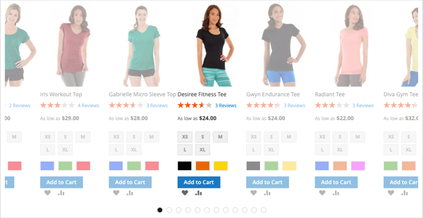{width="600"}

- カルーセル内で一度に最大5個の商品を表示してスクロールするには、**[!UICONTROL Carousel Mode]**&#x200B;を`Default`に設定します。

  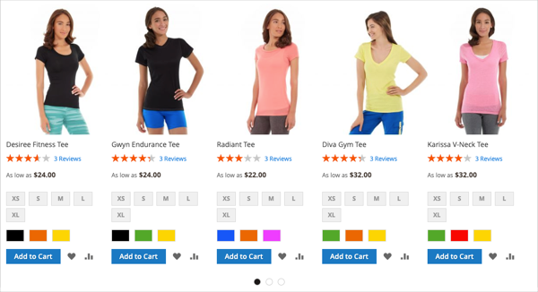{width="600"}

次の手順は、製品リストをブロックに追加する方法を示しています。 次に、[&#x200B; ウィジェット &#x200B;](../content-design/widgets.md)を使用して、ストア内の任意のページの特定の場所にブロックを配置できます。

{{$include /help/_includes/page-builder-save-timeout.md}}

## 製品ツールボックス

| ツール | アイコン | 説明 |
| --------- | ------------- | ----------------- |
| 移動 | {width="25"} | 製品コンテナとそのコンテンツをステージ上の別の位置に移動します。 |
| 設定 | {width="25"} | _製品の編集_ ページを開きます。このページでは、製品リストを選択し、コンテナのプロパティを変更できます。 |
| 非表示 | {width="25"} | 現在の製品コンテナとそのコンテンツを非表示にします。 |
| 表示 | {width="25"} | 非表示の製品コンテナとそのコンテンツを表示します。 |
| 重複 | {width="25"} | 製品コンテナとそのコンテンツのコピーを作成します。 |
| 削除 | {width="25"} | 製品コンテナとそのコンテンツをステージから削除します。 |

{style="table-layout:auto"}

{{$include /help/_includes/page-builder-hidden-element-note.md}}

## 製品リストブロックの作成

1. _管理者_ サイドバーで、**[!UICONTROL Content]** > _[!UICONTROL Elements]_>**[!UICONTROL Blocks]**&#x200B;に移動します。

1. **[!UICONTROL Add New Block]**&#x200B;をクリックします。

1. **[!UICONTROL Block Title]**&#x200B;と&#x200B;**[!UICONTROL Identifier]**&#x200B;を入力します。

1. ブロックを利用できる&#x200B;**[!UICONTROL Store View]**&#x200B;を選択します。

1. 下にスクロールして&#x200B;**[!UICONTROL Edit with Page Builder]**&#x200B;またはコンテンツプレビュー領域内をクリックし、[!DNL Page Builder] ワークスペースを開きます。

1. [!DNL Page Builder] パネルで、**[!UICONTROL Add Content]**&#x200B;を展開し、**[!UICONTROL Products]** プレースホルダーをステージにドラッグします。

   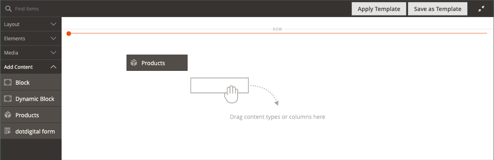{width="600" zoomable="yes"}

## 製品リストコンテナの設定

空の&#x200B;_製品_ コンテナにカーソルを合わせてツールボックスを表示し、_設定_ （{width="20"}）アイコンをクリックします。

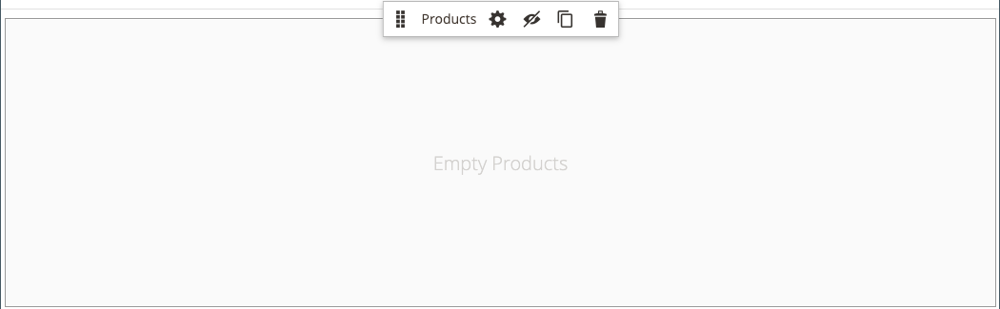{width="500" zoomable="yes"}

次のセクションに従って、_設定_&#x200B;を完了します。

### アピアランス

1. 製品リストをページ上でどのように表示するかを決めるには、次のいずれかの外観タイプを選択します。

   | タイプ | 説明 |
   | ---- | ----------- |
   | 商品グリッド | 1行につき5つの商品を表示するグリッド内の商品を表示します（デフォルト）。このグリッドには、**[!UICONTROL Number of Products to Display]**&#x200B;設定で入力した数を表示するために必要な数の行が表示されます。 |
   | 製品カルーセル | カルーセル内の商品を表示します（スライダーとも呼ばれます）。 カルーセルには、スライドごとに最大5つの商品が表示されます。   **応答性アラート**：このアピアランスを選択する場合は、「製品」コンテンツタイプを、レスポンシブな行、タブ、または1列レイアウトに直接追加することをお勧めします。小さな画面では、側面に表示される製品の数が少なくなります。 ページの幅よりも狭いコンテンツタイプ（狭い列など）にカルーセルを追加すると、画面サイズに関係なく、コンテナが許可するよりも多くの製品がスライドごとに表示されます。 |

   {style="table-layout:auto"}

   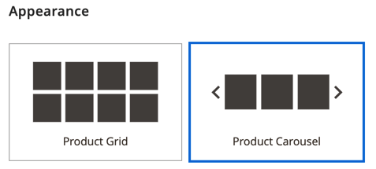{width="300"}

   製品カルーセルを選択する場合は、[&#x200B; カルーセル設定](#carousel-settings)も設定する必要があります。

1. **[!UICONTROL Select Products By]**&#x200B;の場合、商品の選択方法を選択します。

   カテゴリー、SKU、条件ごとに商品を選択できます。 これらのオプションは相互に排他的です。 例えば、「カテゴリ」オプションを選択して「カテゴリ」セレクターを使用し、「条件」オプションに切り替えて条件を追加することはできません。 製品は、これら3つのオプションのうち&#x200B;_1_&#x200B;に設定した内容に基づいて選択されます。

   - **[!UICONTROL Category]** – 選択したカテゴリを使用して製品を表示するには、このオプションを選択します。

     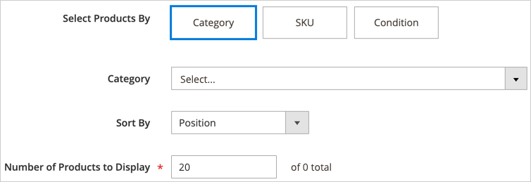{width="500"}

     このオプションを選択すると、**[!UICONTROL Category]** セレクターが表示されます。 矢印をクリックし、ドリルダウンして、表示する製品のカテゴリを選択します。 例えば、[!DNL Commerce]のサンプルデータでは、_女性/ トップス / ティー_&#x200B;をドリルインして選択すると、そのカテゴリのすべての製品が表示されます。

     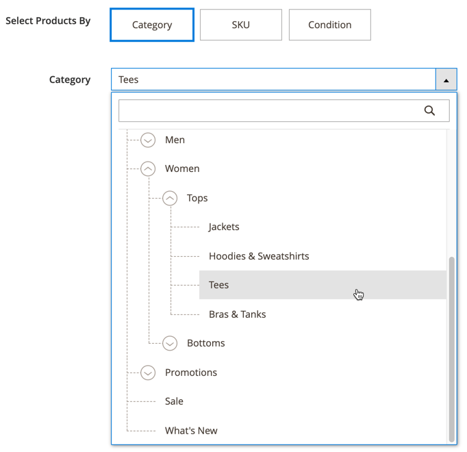{width="500"}

   - **[!UICONTROL SKU]** - 1つ以上のSKUを使用して製品を表示するには、このオプションを選択します

     このオプションを選択すると、表示するSKUのコンマ区切りリストを入力する必要がある&#x200B;**[!UICONTROL Product SKUs]** テキストボックスが表示されます。

     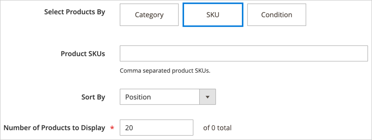{width="500"}

   - **[!UICONTROL Condition]** – 定義した1つ以上の条件に従って製品を表示するには、このオプションを選択します。

     選択すると、製品の選択範囲に条件を追加するために使用できるツールがあります。 例えば、「性別」が「ユニセックス」に設定されている商品のみを選択できます。

     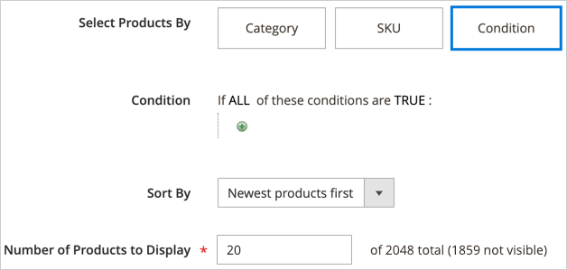{width="500"}

     >[!NOTE]
     >
     >カテゴリまたはSKU オプションを選択すると、`Position`の&#x200B;**[!UICONTROL Sort By]** オプションが提供されます。 この並べ替えオプションを使用すると、商品はカタログと同じ順序で表示されます。 
     >
     >「カテゴリ」オプションの場合、位置で並べ替えると、商品がカタログと同じ順序で表示されます。 SKU オプションの場合、位置で並べ替えると、**[!UICONTROL Product SKUs]** テキストボックスに入力した順序で商品が表示されます。

1. **[!UICONTROL Sort By]**&#x200B;の場合、リスト内の商品の並べ替え順序を選択します。

   | オプション | 説明 |
   | ------ | ----------- |
   | `Position` （カテゴリおよびSKU オプションのみ） | 「カテゴリ」オプションを選択すると、「位置」には、商品がカタログ内の商品と同じ順序で表示されます。 「SKU」オプションを選択すると、「位置」には、製品SKUのテキストボックス内のSKUと同じ順序で製品が表示されます。 |
   | `Newest products first` | カタログに追加された日付で商品を並べ替え、最新の入力日が最初の商品を表示します。 |
   | `Oldest products first` | カタログに追加された日付で商品を並べ替え、最初に最も古い入力日を持つ商品を表示します。 |
   | `Name: A - Z` | 商品をアルファベット順に並べ替えます。 |
   | `Name: Z - A` | 商品をアルファベットの逆順に並べ替えます。 |
   | `SKU: ascending` | 商品を英数字でSKU順に並べ替えます。 |
   | `SKU: descending` | 商品を英数字の逆順でSKU別に並べ替えます。 |
   | `Stock: low stock first` | 商品を最小在庫から高在庫に分類します。 |
   | `Stock: high stock first` | 在庫が最も多い順に並べ替えます。 |
   | `Price: high to low` | 商品を最高の価格から最低の価格に分類します。 |
   | `Price: low to high` | 商品を最低価格から最高価格にソートします。 |

   {style="table-layout:auto"}

   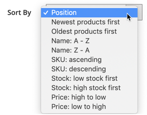{width="300"}

1. カルーセルまたはグリッドに&#x200B;**[!UICONTROL Number of Products to Display]**&#x200B;を入力します。

   値は`1`から`999`までです。 デフォルトは、グリッドの`5`、カルーセルの`20`です。

   >[!NOTE]
   >
   >カテゴリ、SKU、条件の設定の一部の製品が、製品グリッドまたはカルーセルに表示されない場合があります。 例えば、無効な商品、非表示とマークされた商品、在庫切れの商品、別のweb サイトに割り当てられた商品は表示されません。

   >[!IMPORTANT]
   >
   >設定可能な製品、グループ化された製品、バンドルされた製品（動的な価格）の価格は、管理者で定義されていません。 したがって、商品が価格でフィルタリングされている場合、これらの商品は&#x200B;**[!UICONTROL Preview]**&#x200B;に表示されません。 価格で注文した場合、これらの製品は&#x200B;**[!UICONTROL Preview]**&#x200B;で正しく注文できません。

### カルーセル設定

1. カルーセル内での製品の表示方法を指定するには、**[!UICONTROL Carousel Mode]**&#x200B;を選択します。

   | オプション | 説明 |
   | ------ | ----------- |
   | `Default` | カルーセルには、デフォルトでスライドごとに5つの商品が表示され、必要に応じてレスポンシブにその数を減らします。 |
   | `Continuous` | カルーセルには、デフォルトでスライドごとに5つの商品が表示されますが（商品の半分が左右に表示されます）、一度に1つの商品を中心にして無限ループでスクロールします。 中央揃え商品の左右の商品がグレー表示され、中央揃え商品がハイライト表示されます。 |

   {style="table-layout:auto"}

   これらの2つのモードを切り替えると、連続モードで常に`Yes`に設定され、フィールドが無効になっている&#x200B;**[!UICONTROL Infinite Loop]**&#x200B;設定を除き、他のカルーセル設定が保持されます。

   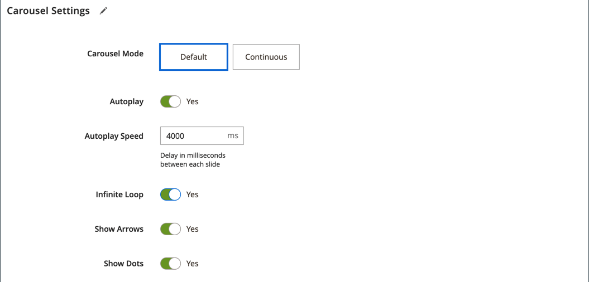{width="600" zoomable="yes"}

1. 必要に応じて、**[!UICONTROL Autoplay]** オプションを`Yes`に設定します。

   自動再生が有効になっている場合、ページの読み込み時にカルーセルが自動的にスクロールし始めます。 既定の設定（`No`）を終了すると、お客様はスライド ナビゲーション （ドットまたは矢印）をクリックして、各スライドを順番に表示する必要があります。

   この機能を有効にする場合は、**[!UICONTROL Autoplay Speed]**&#x200B;と入力して、各スライド間の遅延をミリ秒単位で指定します。 デフォルト値は`4000` （4秒）です。

1. 必要に応じて、**[!UICONTROL Infinite Loop]** オプションを`Yes`に設定します。

   無限ループが有効になっている場合、ページが開いている間、スライドショーが無期限に再生されます。 既定の設定（`No`）を終了すると、スライド ショーは1回だけ再生されます。

   >[!NOTE]
   >
   >**[!UICONTROL Infinite Loop]**&#x200B;を`No`に、**[!UICONTROL Autoplay]**&#x200B;を`Yes`に設定した場合、自動再生は表示される製品数の最後で停止します。

1. 必要に応じて、**[!UICONTROL Show Arrows]** オプションを`Yes`に設定します。

   このオプションが有効になっている場合、各スライドの左側と右側に&#x200B;_次_&#x200B;と&#x200B;_前_&#x200B;のナビゲーション矢印が表示されます。 既定の設定（`No`）を終了すると、スライドにナビゲーション矢印が表示されません。

1. 必要に応じて、**[!UICONTROL Show Dots]** オプションを`No`に設定します。

   デフォルト設定（`Yes`）に設定すると、ナビゲーションドットがカルーセルスライダーの下部に表示されます。 この設定を無効にすると、カルーセルスライダーにナビゲーションドットが表示されません。

### アドバンス

1. 親コンテナ内の製品リストの位置を制御するには、**[!UICONTROL Alignment]**&#x200B;を選択します。

   | オプション | 説明 |
   | ------ | ----------- |
   | `Default` | 現在のテーマのスタイルシートで指定されている整列のデフォルト設定を適用します。 |
   | `Left` | 親コンテナの左端に沿ってリストを整列させ、指定されたパディングを許可します。 |
   | `Center` | 親コンテナの中央にリストを整列させ、指定された任意のパディングを許可します。 |
   | `Right` | 親コンテナの右端に沿ってリストを整列させ、指定されたパディングを許可します。 |

   {style="table-layout:auto"}

1. 製品コンテナのすべての4つの側面に適用される&#x200B;**[!UICONTROL Border]** スタイルを設定します。

   | オプション | 説明 |
   | ------ | ----------- |
   | `Default` | 関連付けられたスタイルシートで指定されたデフォルトの境界線スタイルを適用します。 |
   | `None` | コンテナの境界を表示しません。 |
   | `Dotted` | コンテナの境界線が点線で表示されます。 |
   | `Dashed` | コンテナの境界線が破線で表示されます。 |
   | `Solid` | コンテナの境界線が実線として表示されます。 |
   | `Double` | コンテナの境界線が2行で表示されます。 |
   | `Groove` | コンテナの境界線は、溝付き線として表示されます。 |
   | `Ridge` | コンテナの境界線は、うね付きの線として表示されます。 |
   | `Inset` | コンテナの境界線がインセット線として表示されます。 |
   | `Outset` | コンテナの境界線がアウトセット線として表示されます。 |

   {style="table-layout:auto"}

1. `None`以外の境界線スタイルを設定する場合は、境界線の表示オプションを完了します。

   | オプション | 説明 |
   | ------ |------------ |
   | [!UICONTROL Border Color] | 色見本を選択するか、カラーピッカーをクリックするか、有効なカラー名または同等の16進数値を入力して、カラーを指定します。 |
   | [!UICONTROL Border Width] | 境界線の幅のピクセル数を入力します。 |
   | [!UICONTROL Border Radius] | 境界線の各隅を丸めるために使用する半径のサイズを定義するピクセル数を入力します。 |

   {style="table-layout:auto"}

1. （オプション）現在のスタイルシートから&#x200B;**[!UICONTROL CSS classes]**&#x200B;の名前を指定して、コンテナに適用します。

   複数のクラス名はスペースで区切ります。

1. **[!UICONTROL Margins and Padding]**&#x200B;の値をピクセル単位で入力して、製品コンテナの外側の余白と内側の余白を決定します。

   対応する値をダイアグラムに入力します。

   | コンテナ領域 | 説明 |
   | -------------- | ----------- |
   | [!UICONTROL Margins] | コンテナのすべての側面の外側のエッジに適用される空白スペースの量。 オプション：`Top` / `Right` / `Bottom` / `Left` |
   | [!UICONTROL Padding] | コンテナのすべての側面の内側エッジに適用される空白スペースの量。 オプション：`Top` / `Right` / `Bottom` / `Left` |

## ステージでの保存とプレビュー

右上隅の「**[!UICONTROL Save]**」をクリックして設定を適用し、[!DNL Page Builder] ワークスペースに戻ります。

製品カルーセルを設定した場合は、次の例のようになります。

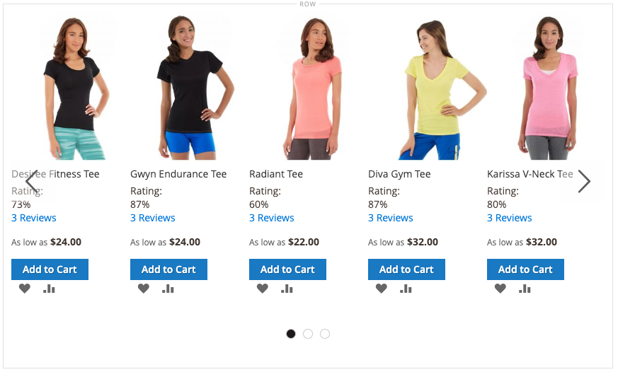{width="600"}

[&#x200B; ウィジェット &#x200B;](../content-design/widgets.md)を使用して、このブロックをストアに表示する場所に配置できるようになりました。 または、[&#x200B; コンテンツを追加 – ブロック &#x200B;](block.md)を使用して、ブロックを既存のページ、タブ、またはブロックに追加できます。

<!-- Last updated from includes: 2023-09-11 14:30:19 -->
