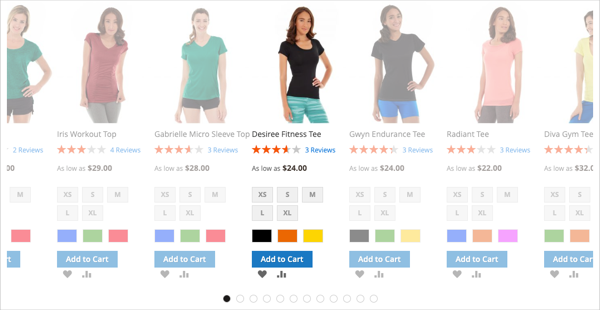
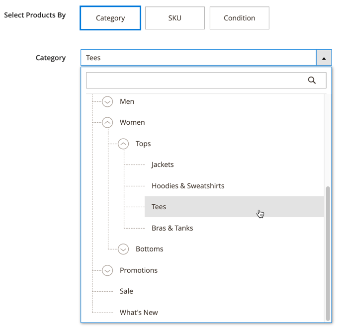

# コンテンツを追加 — 製品

以下を使用します。 _製品_ 製品のリストを [[!DNL Page Builder] ステージ](workspace.md#stage)（グリッドレイアウトまたはカルーセルレイアウトを使用） 以下を使用します。 [コンテンツを追加 — ブロック](block.md) ブロックを [!DNL Page Builder] をステージングして、ブロック内に製品リストを配置します。 または、ページ上の行に製品リストを直接追加できます。

## 製品カルーセルの使用に関するガイドライン

製品カルーセルは、製品を表示するための強力で魅力的な方法を提供します。 最大限に活用するには、次のガイドラインに従うことをお勧めします。

- 行、タブ、1 列レイアウトなど、ページ幅のコンテナに製品カルーセルを直接追加します。 ページの幅のレイアウトを使用すると、製品に最も適したレスポンシブ表示が実現されます。 [!DNL Page Builder] は、コンテナの幅ではなく、ページの幅に応じて表示される製品数を減らします。

- 狭い列に製品カルーセルを追加しないでください。 前述の通り [!DNL Page Builder]デフォルトでは、は、列の幅ではなく、ページの幅に基づいて、表示する製品の数を決定します。

- 製品カルーセルで連続的に自動スクロールを行う場合は、 **[!UICONTROL Autoplay]** および **[!UICONTROL Infinite Loop]** から `Yes`. 自動再生が `Yes` しかし、無限ループは `No`の場合、自動スクロールは製品リストの最後で停止します。

- を設定します。 **[!UICONTROL Carousel Mode]** から `Continuous` カルーセル内で一度に 1 つの製品をハイライト、中央に配置、スクロールします。 その他の製品はリストに表示されますが、中央に配置された製品をハイライトするために透明です。

  {width="600"}

- カルーセル内で一度に最大 5 つの製品を表示およびスクロールするには、「 **[!UICONTROL Carousel Mode]** に設定 `Default`.

  {width="600"}

次の手順は、ブロックに製品リストを追加する方法を示しています。 その後、 [widget](../content-design/widgets.md) をクリックして、ストア内のページの特定の場所にブロックを配置します。

{{$include /help/_includes/page-builder-save-timeout.md}}

## 製品ツールボックス

| ツール | アイコン | 説明 |
| --------- | ------------- | ----------------- |
| 移動 | {width="25"} | 製品コンテナとその内容をステージ上の別の位置に移動します。 |
| 設定 | {width="25"} | を開きます。 _製品を編集_ ページに表示されます。このページでは、製品リストを選択し、コンテナのプロパティを変更できます。 |
| 非表示 | {width="25"} | 現在の製品コンテナとその内容を非表示にします。 |
| 表示 | {width="25"} | 非表示の製品コンテナとそのコンテンツを表示します。 |
| 複製 | {width="25"} | 製品コンテナとその内容のコピーを作成します。 |
| 削除 | {width="25"} | ステージから製品コンテナとその内容を削除します。 |

{style="table-layout:auto"}

{{$include /help/_includes/page-builder-hidden-element-note.md}}

## 製品リストブロックの作成

1. 次の日： _管理者_ サイドバー、移動 **[!UICONTROL Content]** > _[!UICONTROL Elements]_>**[!UICONTROL Blocks]**.

1. クリック **[!UICONTROL Add New Block]**.

1. 次を入力します。 **[!UICONTROL Block Title]** および **[!UICONTROL Identifier]**.

1. を選択します。 **[!UICONTROL Store View]** ブロックを使用できる場所。

1. 下にスクロールして、 **[!UICONTROL Edit with Page Builder]** または、コンテンツプレビュー領域内で [!DNL Page Builder] ワークスペース。

1. Adobe Analytics の [!DNL Page Builder] パネル、展開 **[!UICONTROL Add Content]** をクリックし、 **[!UICONTROL Products]** プレースホルダーをステージに追加します。

   {width="600" zoomable="yes"}

## 製品リストコンテナの設定

空の _製品_ ツールボックスを表示するコンテナで、 _設定_ ({width="20"} ) アイコンをクリックします。

{width="500" zoomable="yes"}

次を完了： _設定_ 以下の節に従ってください。

### 外観

1. 製品リストをページに表示する方法を決定するには、次の外観のタイプの 1 つを選択します。

   | タイプ | 説明 |
   | ---- | ----------- |
   | 製品グリッド | 1 行に 5 つの製品を表示するグリッド内の製品を表示します（デフォルト）。また、 **[!UICONTROL Number of Products to Display]** 設定。 |
   | 製品カルーセル | カルーセル内の製品を表示します（スライダーとも呼ばれます）。 カルーセルには、1 スライドにつき最大 5 つの製品が表示されます。   **応答性アラート**：この外観を選択する場合、製品コンテンツタイプをレスポンシブな行、タブ、1 列のレイアウトのいずれかに直接追加し、小さい画面で 1 辺あたり少ない製品数で表示するのが最適です。 ページの幅より狭いコンテンツタイプ（狭い列など）にこのコンテンツを追加すると、画面サイズに関係なく、カルーセルにはコンテナで許可されている数よりも多くの製品がスライドごとに表示されます。 |

   {style="table-layout:auto"}

   {width="300"}

   製品カルーセルを選択した場合は、 [カルーセル設定](#carousel-settings).

1. の場合 **[!UICONTROL Select Products By]**、製品を選択する方法を選択します。

   カテゴリ別、SKU 別または条件別に製品を選択できます。 これらのオプションは相互に排他的です。 例えば、「カテゴリ」オプションを選択してカテゴリセレクターを使用し、「条件」オプションに切り替えて、条件を追加することはできません。 製品は、に設定した内容に基づいて選択されます _1 つ_ の 3 つのオプションが選択されます。

   - **[!UICONTROL Category]**  — 選択したカテゴリを使用して製品を表示するには、このオプションを選択します。

     {width="500"}

     このオプションを選択すると、 **[!UICONTROL Category]** セレクター。 矢印をクリックし、ドリルダウンして表示する製品のカテゴリを選択します。 例えば、 [!DNL Commerce] サンプル・データ、ドリル・インおよび選択 _女性/トップス/ティー_ そのカテゴリのすべての製品が表示されます。

     {width="500"}

   - **[!UICONTROL SKU]** - 1 つ以上の SKU を使用して製品を表示するには、このオプションを選択します

     このオプションを選択すると、 **[!UICONTROL Product SKUs]** テキストボックスに値を入力します。このボックスには、表示する SKU のコンマ区切りリストを入力する必要があります。

     {width="500"}

   - **[!UICONTROL Condition]**  — このオプションは、定義した 1 つ以上の条件に従って製品を表示する場合に選択します。

     選択すると、製品選択に条件を追加するツールが使用できます。 例えば、「性別」が「ユニセックス」に設定された製品のみを選択できます。

     {width="500"}

     >[!NOTE]
     >
     >「カテゴリ」または「SKU 」オプションを選択すると、 **[!UICONTROL Sort By]** 選択肢 `Position`. この並べ替えオプションを使用すると、商品はカタログで表示されるのと同じ順序で表示されます。 
     >
     >「カテゴリ」オプションでは、位置で並べ替えると、カタログに表示されるのと同じ順序で商品が表示されます。 「SKU」オプションでは、位置で並べ替えると、 **[!UICONTROL Product SKUs]** テキストボックス。

1. の場合 **[!UICONTROL Sort By]**」で、リスト内の製品の並べ替え順を選択します。

   | オプション | 説明 |
   | ------ | ----------- |
   | `Position` （カテゴリおよび SKU オプションのみ） | [ カテゴリ ] オプションを選択すると、[ 位置 ] には、カタログ内の位置と同じ順序で商品が表示されます。 「SKU」オプションを選択すると、「位置」には、「製品 SKU」テキストボックス内の SKU と同じ順序で製品が表示されます。 |
   | `Newest products first` | カタログに追加された日付で商品を並べ替え、最も新しいエントリ日の商品が最初に表示されます。 |
   | `Oldest products first` | カタログに追加された日付で商品を並べ替え、最も古いエントリ日の商品が最初に表示されます。 |
   | `Name: A - Z` | 商品をアルファベット順に並べ替えます。 |
   | `Name: Z - A` | 商品を逆アルファベット順に並べ替えます。 |
   | `SKU: ascending` | 商品を英数字順に SKU 順に並べ替えます。 |
   | `SKU: descending` | 製品を SKU 順に逆英数字順に並べ替えます。 |
   | `Stock: low stock first` | 製品を最も低い在庫から最も高い在庫に並べ替えます。 |
   | `Stock: high stock first` | 製品を最大在庫から最小在庫に並べ替えます。 |
   | `Price: high to low` | 最高価格から最低価格の製品を並べ替えます。 |
   | `Price: low to high` | 最低価格から最高価格の製品を並べ替えます。 |

   {style="table-layout:auto"}

   {width="300"}

1. 次を入力します。 **[!UICONTROL Number of Products to Display]** （カルーセルまたはグリッド）。

   値は次の値から取得できます： `1` から `999`. デフォルトはです。 `5` グリッドと `20` カルーセル用。

   >[!NOTE]
   >
   >「カテゴリ」、「SKU」、「条件」の設定にある一部の製品が、製品グリッドやカルーセルに表示されない場合があります。 例えば、無効な製品、非表示とマークされた製品、在庫切れの製品、別の Web サイトに割り当てられた製品は表示されません。

   >[!IMPORTANT]
   >
   >設定可能、グループ化、バンドル（動的価格）製品の価格は、管理画面では定義されません。 したがって、これらの製品は **[!UICONTROL Preview]** （製品が価格でフィルタリングされている場合）。 これらの製品は、 **[!UICONTROL Preview]** 価格で注文した場合

### カルーセル設定

1. カルーセル内での商品の表示方法を指定するには、 **[!UICONTROL Carousel Mode]**:

   | オプション | 説明 |
   | ------ | ----------- |
   | `Default` | カルーセルには、デフォルトでスライド 1 つにつき 5 つの製品が表示され、必要に応じてその数を減らします。 |
   | `Continuous` | カルーセルには、デフォルトでスライド 1 つにつき 5 つの製品が表示されます（製品の半分が右と左に表示されます）が、無限ループで一度に 1 つの製品を中央に配置し、スクロールします。 中央にある製品の左右の製品は淡色表示になり、中央の製品がハイライト表示されます。 |

   {style="table-layout:auto"}

   これらの 2 つのモードを切り替えても、他のカルーセル設定は保持されます ( ただし、 **[!UICONTROL Infinite Loop]** 設定（常に次の値に設定） `Yes` 連続モードの場合、フィールドは無効です。

   {width="600" zoomable="yes"}

1. 必要に応じて、 **[!UICONTROL Autoplay]** 選択肢 `Yes`.

   自動再生が有効な場合、ページが読み込まれると、カルーセルが自動的にスクロールを開始します。 デフォルト設定 (`No`を参照 ) の場合は、スライドナビゲーション（ドットまたは矢印）をクリックして各スライドを順に表示する必要があります。

   この機能を有効にする場合は、 **[!UICONTROL Autoplay Speed]** ：各スライド間の遅延をミリ秒単位で指定します。 デフォルト値は `4000` （4 秒）。

1. 必要に応じて、 **[!UICONTROL Infinite Loop]** 選択肢 `Yes`.

   無限ループを有効にすると、ページを開いている間、スライドショーが無期限に再生されます。 デフォルト設定 (`No`) の場合、スライドショーは 1 回だけ再生されます。

   >[!NOTE]
   >
   >次の場合、 **[!UICONTROL Infinite Loop]** から `No` および **[!UICONTROL Autoplay]** に設定 `Yes`に設定すると、自動再生は表示する製品数の終わりに停止します。

1. 必要に応じて、 **[!UICONTROL Show Arrows]** 選択肢 `Yes`.

   このオプションを有効にすると、各スライドに以下の内容が含まれます。 _次へ_ および _前_ 左右のナビゲーション矢印。 デフォルト設定 (`No`) をクリックした場合、スライドにはナビゲーション矢印は表示されません。

1. 必要に応じて、 **[!UICONTROL Show Dots]** 選択肢 `No`.

   デフォルト設定 (`Yes`) をクリックすると、カルーセルスライダーの下部にナビゲーションドットが表示されます。 この設定を無効にした場合、カルーセルスライダーにはナビゲーションドットは表示されません。

### 詳細

1. 親コンテナ内での製品リストの位置を制御するには、 **[!UICONTROL Alignment]**:

   | オプション | 説明 |
   | ------ | ----------- |
   | `Default` | 現在のテーマのスタイルシートで指定された位置揃えの既定の設定を適用します。 |
   | `Left` | リストを親コンテナの左側の境界線に沿って揃えます。指定されたパディングの値を使用します。 |
   | `Center` | 指定されたパディングを許容して、親コンテナの中央にリストを揃えます。 |
   | `Right` | 指定されたパディングを許容して、親コンテナの右側の境界線に沿ってリストを揃えます。 |

   {style="table-layout:auto"}

1. を設定します。 **[!UICONTROL Border]** 「製品」コンテナの 4 つの側面すべてに適用されるスタイル。

   | オプション | 説明 |
   | ------ | ----------- |
   | `Default` | 関連するスタイルシートで指定された既定の罫線のスタイルを適用します。 |
   | `None` | コンテナの境界線を表示しません。 |
   | `Dotted` | コンテナの境界線は点線で表示されます。 |
   | `Dashed` | コンテナの境界線は破線で表示されます。 |
   | `Solid` | コンテナの境界線は実線で表示されます。 |
   | `Double` | コンテナの境界線は二重線で表示されます。 |
   | `Groove` | コンテナ境界は溝付きの線として表示されます。 |
   | `Ridge` | コンテナの境界線は、稜線として表示されます。 |
   | `Inset` | コンテナの境界線は、挿入線として表示されます。 |
   | `Outset` | コンテナの境界線は、アウトセット行として表示されます。 |

   {style="table-layout:auto"}

1. 次の条件を満たさない境界線のスタイルを設定した場合： `None`、境界線の表示オプションを設定します。

   | オプション | 説明 |
   | ------ |------------ |
   | [!UICONTROL Border Color] | スウォッチを選択するか、カラーピッカーをクリックするか、有効なカラー名または同等の 16 進値を入力して、カラーを指定します。 |
   | [!UICONTROL Border Width] | 境界線の幅のピクセル数を入力します。 |
   | [!UICONTROL Border Radius] | ピクセル数を入力して、境界線の各隅を囲むために使用する半径のサイズを定義します。 |

   {style="table-layout:auto"}

1. （オプション） **[!UICONTROL CSS classes]** 現在のスタイルシートからコンテナに適用します。

   複数のクラス名はスペースで区切ります。

1. 次の値をピクセル単位で入力します。 **[!UICONTROL Margins and Padding]** を使用して、「製品」コンテナの外側の余白と内側の余白を指定します。

   ダイアグラムに対応する値を入力します。

   | コンテナ領域 | 説明 |
   | -------------- | ----------- |
   | [!UICONTROL Margins] | コンテナのすべての側面の外側の端に適用される空白の量。 オプション： `Top` / `Right` / `Bottom` / `Left` |
   | [!UICONTROL Padding] | コンテナのすべての側面の内側の端に適用される空白の量。 オプション： `Top` / `Right` / `Bottom` / `Left` |

## ステージ上で保存およびプレビュー

右上隅で、 **[!UICONTROL Save]** 設定を適用し、に戻るには、次の手順に従います。 [!DNL Page Builder] ワークスペース。

製品カルーセルを設定した場合は、次の例のようになります。

{width="600"}

これで、 [widget](../content-design/widgets.md) をクリックして、このブロックをストアに表示する任意の場所に配置します。 または、 [コンテンツを追加 — ブロック](block.md) をクリックして、既存のページ、タブ、ブロックにブロックを追加します。
