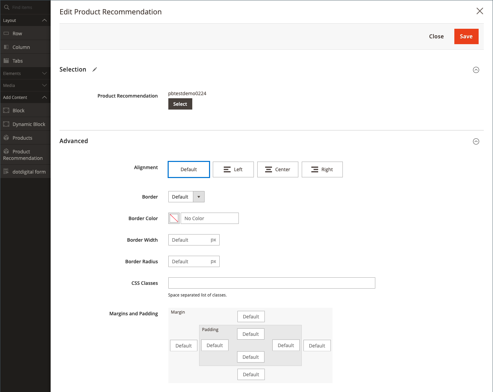

# コンテンツを追加 — 製品Recommendations

以下を使用します。 _製品Recommendations_ 既存のアクティブなコンテンツタイプを追加する [レコメンデーション単位](https://experienceleague.adobe.com/en/docs/commerce-merchant-services/product-recommendations/admin/create) から [[!DNL Page Builder] ステージ](workspace.md#stage) CMS ページ、ブロック、動的ブロックの場合。

>[!NOTE]
>
>The [!DNL Page Builder] _製品Recommendations_ コンテンツタイプは、Adobe Commerce 2.4.4 以降でサポートされ、 [製品のRecommendationsメタパッケージバージョン 3.0.x 以降](https://commercemarketplace.adobe.com/magento-product-recommendations.html). 追加するには [!DNL Page Builder] 製品Recommendations、 [インストール情報を見る](https://experienceleague.adobe.com/en/docs/commerce-merchant-services/product-recommendations/getting-started/install-configure). **このコンテンツタイプは、Magento Open Sourceには使用できません。**

{{$include /help/_includes/page-builder-save-timeout.md}}

## Product Recommendations toolbox

| ツール | アイコン | 説明 |
| --- | --| --- |
| 移動 | {width="25"} | 製品レコメンデーションコンテナとそのコンテンツをステージ上の別の位置に移動します。 |
| 設定 | {width="25"} | 製品レコメンデーションを編集ページが開きます。このページで、レコメンデーション単位を選択し、コンテナのプロパティを変更できます。 |
| 非表示 | {width="25"} | 現在の製品レコメンデーションコンテナとその内容を非表示にします。 |
| 表示 | {width="25"} | 非表示の製品レコメンデーションコンテナとそのコンテンツを表示します。 |
| 複製 | {width="25"} | 製品レコメンデーションコンテナとそのコンテンツの複製を作成します。 |
| 削除 | {width="25"} | 製品レコメンデーションコンテナとその内容をステージから削除します。 |

{style="table-layout:auto"}

{{$include /help/_includes/page-builder-hidden-element-note.md}}

## 既存のレコメンデーション単位の追加

1. 既に [レコメンデーションユニットの作成](https://experienceleague.adobe.com/en/docs/commerce-merchant-services/product-recommendations/admin/create) （の） [!DNL Page Builder] ページタイプ。

>[!NOTE]
>
>レコメンデーション単位は、 [!DNL Page Builder] デフォルトのストア表示でのみページタイプ。

1. ページ、ブロック、またはダイナミックブロックを編集モードで開きます。

1. を展開します。 _[!UICONTROL Content]_「 」セクションで、「 」をクリックします。**[!UICONTROL Edit with Page Builder]**または、コンテンツプレビュー領域内で [!DNL Page Builder] ワークスペース。

1. Adobe Analytics の [!DNL Page Builder] 下のパネル _[!UICONTROL Layout]_、**[!UICONTROL Row]**プレースホルダーをステージに追加します。

1. Adobe Analytics の [!DNL Page Builder] 下のパネル _[!UICONTROL Add Content]_、**[!UICONTROL Product Recommendation]**プレースホルダーを行に追加します。

   {width="600" zoomable="yes"}

1. 次のいずれかの操作を行います。

   - クリック **[!UICONTROL Edit Product Recommendation]**.
   - 空のコンテナの上にマウスポインターを置いてツールボックスを表示し、 _設定_ () アイコンをクリックします。

   {width="600" zoomable="yes"}

1. Adobe Analytics の _[!UICONTROL Selection]_セクションで、**[!UICONTROL Select]**.

1. アクティブな製品レコメンデーションのリストで、追加するレコメンデーション単位を含む行を探し、「 」をクリックします **[!UICONTROL Select]** 」と入力します。

   {width="600" zoomable="yes"}

1. 右上隅で、 **[!UICONTROL Add Selected]**.

   選択した製品のレコメンデーションの名前が _[!UICONTROL Selection]_のセクション_[!UICONTROL Edit Product Recommendation]_ ページに貼り付けます。

1. 必要に応じて、 [詳細設定](#advanced-settings).

   {width="600" zoomable="yes"}

1. 完了したら、次の手順を実行します。

   - 最大化されたブラウザウィンドウを使用する場合は、 _全画面表示を閉じる_ () アイコンをクリックします。

   - クリック **[!UICONTROL Save]** 設定を適用し、に戻るには、次の手順に従います。 [!DNL Page Builder] ワークスペース。

   ステージに戻ると、製品プレースホルダーの画像がコンテナに表示されます。

## レコメンデーション単位設定の編集

1. レコメンデーションユニットコンテナの上にマウスポインターを置いてツールボックスを表示し、 _設定_ () アイコンをクリックします。

   {width="600" zoomable="yes"}

1. 必要に応じて、 [詳細設定](#advanced-settings).

1. 完了したら、「 **[!UICONTROL Save]** 設定を適用し、に戻るには、次の手順に従います。 [!DNL Page Builder] ワークスペース。

## レコメンデーション単位の複製

1. レコメンデーションユニットコンテナの上にマウスポインターを置いてツールボックスを表示し、 _複製_ () アイコンをクリックします。

   複製は元の画像のすぐ下に表示されます。

1. 複製されたレコメンデーションユニットを新しい位置に移動するには、コンテナの上にマウスポインターを置いて、 _移動_ () アイコンをクリックします。

1. レコメンデーション単位を選択し、赤いガイドラインが新しい位置に表示されるまでドラッグします。

   レコメンデーション単位を移動すると、各コンテナの上と下の境界線が破線で表示されます。

## ステージからレコメンデーションユニットを削除します

1. レコメンデーションユニットコンテナの上にマウスポインターを置いて、 _削除_ ( ) アイコンをクリックします。

1. 確認するメッセージが表示されたら、「 **[!UICONTROL OK]**.

## 詳細設定

1. 親コンテナ内での Product Recommendationsユニットの位置を制御するには、 **[!UICONTROL Alignment]**:

   | オプション | 説明 |
   | ------ | ----------- |
   | `Default` | 現在のテーマのスタイルシートで指定された位置揃えの既定の設定を適用します。 |
   | `Left` | 単位を親コンテナの左の境界線に沿って揃えます。指定されたパディングの値を使用します。 |
   | `Center` | 単位を親コンテナの中央に揃え、指定されたパディングを許容します。 |
   | `Right` | 単位を親コンテナの右側の境界線に沿って揃えます。指定されたパディングの値を使用します。 |

   {style="table-layout:auto"}

1. を設定します。 **[!UICONTROL Border]** 製品のRecommendationsユニットの 4 つの側面すべてに適用されるスタイル：

   | オプション | 説明 |
   | ------ | ----------- |
   | `Default` | 関連するスタイルシートで指定された既定の罫線のスタイルを適用します。 |
   | `None` | 単位の境界線を表示しません。 |
   | `Dotted` | 単位の境界線は点線で表示されます。 |
   | `Dashed` | 単位の境界線は破線で表示されます。 |
   | `Solid` | 単位境界は実線で表示されます。 |
   | `Double` | 単位の境界線は二重線で表示されます。 |
   | `Groove` | 単位境界は溝付きの線として表示されます。 |
   | `Ridge` | 単位の境界は、稜線として表示されます。 |
   | `Inset` | 単位の境界線は、インセット線として表示されます。 |
   | `Outset` | 単位の境界線は、アウトセット線として表示されます。 |

   {style="table-layout:auto"}

1. 次の条件を満たさない境界線のスタイルを設定した場合： `None`、境界線の表示オプションを設定します。

   | オプション | 説明 |
   | ------ |------------ |
   | [!UICONTROL Border Color] | スウォッチを選択するか、カラーピッカーをクリックするか、有効なカラー名または同等の 16 進値を入力して、カラーを指定します。 |
   | [!UICONTROL Border Width] | 境界線の幅のピクセル数を入力します。 |
   | [!UICONTROL Border Radius] | ピクセル数を入力して、境界線の各隅を囲むために使用する半径のサイズを定義します。 |

   {style="table-layout:auto"}

1. （オプション） **[!UICONTROL CSS classes]** 現在のスタイルシートから単位に適用する。

   複数のクラス名はスペースで区切ります。

1. 次の値をピクセル単位で入力します。 **[!UICONTROL Margins and Padding]** 単位の外側の余白と内側の余白を決定します。

   ダイアグラムに対応する値を入力します。

   | コンテナ領域 | 説明 |
   | ------ | ----------- |
   | [!UICONTROL Margins] | 単位のすべての辺の外側の端に適用される空白の量。 オプション： `Top` / `Right` / `Bottom` / `Left` |
   | [!UICONTROL Padding] | 単位のすべての辺の内側の端に適用される空白の量。 オプション： `Top` / `Right` / `Bottom` / `Left` |

   {style="table-layout:auto"}
