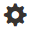
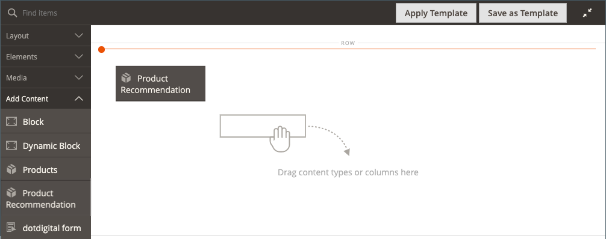
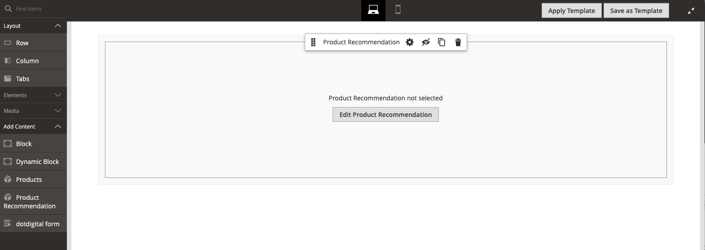
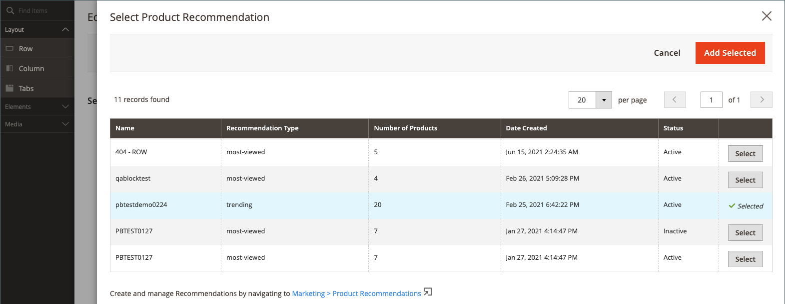
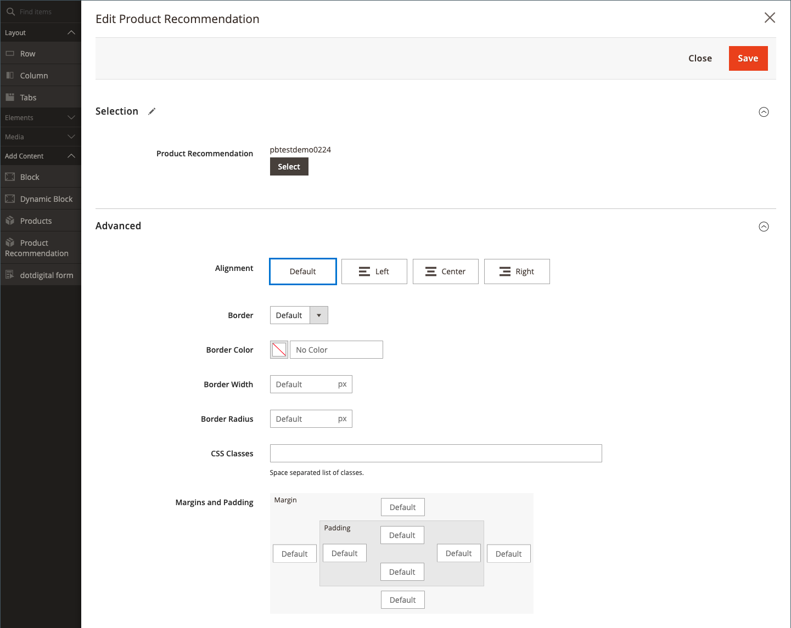
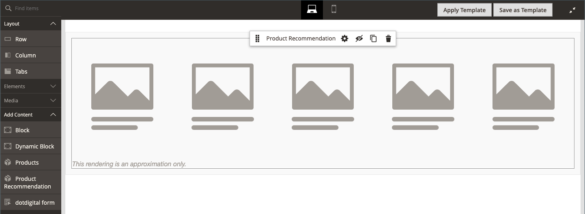

# コンテンツを追加 – 商品レコメンデーション

_商品レコメンデーション_ コンテンツタイプを使用して、既存のアクティブな[ レコメンデーションユニット ](https://experienceleague.adobe.com/en/docs/commerce/product-recommendations/admin/create)をCMS ページ、ブロック、または動的ブロックの[[!DNL Page Builder]  ステージ ](workspace.md#stage)に追加します。

>[!NOTE]
>
>[!DNL Page Builder] _商品レコメンデーション_ コンテンツタイプは、Adobe Commerce 2.4.4以降でサポートされており、[商品レコメンデーション メタパッケージ バージョン 3.0.x以降](https://commercemarketplace.adobe.com/magento-product-recommendations.html)で利用できます。 製品レコメンデーションの[!DNL Page Builder] サポートを追加するには、[ インストール情報](https://experienceleague.adobe.com/en/docs/commerce/product-recommendations/getting-started/install-configure)を参照してください。 **このコンテンツタイプは、Magento Open Sourceでは使用できません。**

{{$include /help/_includes/page-builder-save-timeout.md}}

## 商品レコメンデーションツールボックス

| ツール | アイコン | 説明 |
| --- | --| --- |
| 移動 | {width="25"} | 商品レコメンデーションコンテナとそのコンテンツをステージ上の別の位置に移動します。 |
| 設定 | {width="25"} | 商品レコメンデーションを編集ページが開きます。レコメンデーションユニットを選択し、コンテナのプロパティを変更できます。 |
| 非表示 | {width="25"} | 現在の商品レコメンデーションコンテナとそのコンテンツを非表示にします。 |
| 表示 | {width="25"} | 非表示の商品レコメンデーションコンテナとそのコンテンツを表示します。 |
| 重複 | {width="25"} | 商品レコメンデーションコンテナとそのコンテンツの複製コピーを作成します。 |
| 削除 | {width="25"} | 製品レコメンデーションコンテナとそのコンテンツをステージから削除します。 |

{style="table-layout:auto"}

{{$include /help/_includes/page-builder-hidden-element-note.md}}

## 既存のレコメンデーションユニットの追加

1. [!DNL Page Builder] ページタイプのレコメンデーションユニット ](https://experienceleague.adobe.com/en/docs/commerce/product-recommendations/admin/create)を既に[作成していることを確認してください。

>[!NOTE]
>
>[!DNL Page Builder] ページタイプのレコメンデーションユニットは、デフォルトのストアビューでのみ作成できます。

1. 編集モードでページ、ブロック、またはダイナミックブロックを開きます。

1. _[!UICONTROL Content]_セクションを展開し、**[!UICONTROL Edit with Page Builder]**またはコンテンツプレビュー領域内をクリックして、[!DNL Page Builder] ワークスペースを開きます。

1. _[!UICONTROL Layout]_の下の[!DNL Page Builder] パネルで、**[!UICONTROL Row]**プレースホルダーをステージにドラッグします。

1. _[!UICONTROL Add Content]_の下の[!DNL Page Builder] パネルで、**[!UICONTROL Product Recommendation]**プレースホルダーを行にドラッグします。

   {width="600" zoomable="yes"}

1. 次のいずれかの操作を行います。

   - **[!UICONTROL Edit Product Recommendation]**&#x200B;をクリックします。
   - 空のコンテナにカーソルを合わせてツールボックスを表示し、_設定_ （）アイコンをクリックします。

   {width="600" zoomable="yes"}

1. _[!UICONTROL Selection]_セクションで、**[!UICONTROL Select]**をクリックします。

1. アクティブな製品レコメンデーションのリストで、追加するレコメンデーションユニットを含む行を見つけ、最後の列の&#x200B;**[!UICONTROL Select]**&#x200B;をクリックします。

   {width="600" zoomable="yes"}

1. 右上隅の「**[!UICONTROL Add Selected]**」をクリックします。

   選択した製品レコメンデーションの名前が&#x200B;_[!UICONTROL Edit Product Recommendation]_ページの_[!UICONTROL Selection]_ セクションに表示されます。

1. [詳細設定](#advanced-settings)に必要な変更を加えます。

   {width="600" zoomable="yes"}

1. 完了したら、次の操作を行います。

   - 最大化されたブラウザーウィンドウで作業する場合は、ワークスペースの右上隅にある&#x200B;_フルスクリーンを閉じる_ （）アイコンをクリックします。

   - **[!UICONTROL Save]**&#x200B;をクリックして設定を適用し、[!DNL Page Builder] ワークスペースに戻ります。

   ステージに戻ると、製品プレースホルダー画像がコンテナに表示されます。

## レコメンデーションユニット設定の編集

1. レコメンデーション単位コンテナにカーソルを合わせてツールボックスを表示し、_設定_ （）アイコンをクリックします。

   {width="600" zoomable="yes"}

1. [詳細設定](#advanced-settings)に必要な変更を加えます。

1. 完了したら、**[!UICONTROL Save]**&#x200B;をクリックして設定を適用し、[!DNL Page Builder] ワークスペースに戻ります。

## レコメンデーションユニットの複製

1. レコメンデーション単位コンテナにカーソルを合わせてツールボックスを表示し、ツールボックス内の&#x200B;_重複_ （）アイコンをクリックします。

   複製はオリジナルのすぐ下に表示されます。

1. 複製されたレコメンデーションユニットを新しい位置に移動するには、コンテナにカーソルを合わせて、ツールボックスの&#x200B;_移動_ （）アイコンをクリックします。

1. 新しい位置に赤いガイドラインが表示されるまで、レコメンデーションユニットを選択してドラッグします。

   レコメンデーションユニットを移動すると、各コンテナの上下の境界線が破線で表示されます。

## ステージからレコメンデーションユニットを削除する

1. レコメンデーション単位コンテナにカーソルを合わせ、ツールボックスの&#x200B;_削除_ （）アイコンをクリックします。

1. 確認を求められたら、**[!UICONTROL OK]**&#x200B;をクリックします。

## 詳細設定

1. 親コンテナ内の商品レコメンデーションユニットの位置を制御するには、**[!UICONTROL Alignment]**&#x200B;を選択します。

   | オプション | 説明 |
   | ------ | ----------- |
   | `Default` | 現在のテーマのスタイルシートで指定されている整列のデフォルト設定を適用します。 |
   | `Left` | 親コンテナの左端に沿って単位を整列させ、指定されたパディングを許可します。 |
   | `Center` | 親コンテナの中央にユニットを配置し、指定されたパディングを許可します。 |
   | `Right` | 親コンテナの右端に沿って単位を整列させ、指定されたパディングを許可します。 |

   {style="table-layout:auto"}

1. 商品レコメンデーションユニットの4つの側面すべてに適用される&#x200B;**[!UICONTROL Border]** スタイルを設定します。

   | オプション | 説明 |
   | ------ | ----------- |
   | `Default` | 関連付けられたスタイルシートで指定されたデフォルトの境界線スタイルを適用します。 |
   | `None` | 単位の境界を表示しません。 |
   | `Dotted` | 単位境界は点線で表示されます。 |
   | `Dashed` | 単位の境界線は破線で表示されます。 |
   | `Solid` | 単位境界は実線として表示されます。 |
   | `Double` | 単位の境界線が2行で表示されます。 |
   | `Groove` | 単位の境界線は、溝付き線として表示されます。 |
   | `Ridge` | 単位の境界線は、うね付きの線として表示されます。 |
   | `Inset` | 単位の境界線はインセット線として表示されます。 |
   | `Outset` | 単位の境界線はアウトセット線として表示されます。 |

   {style="table-layout:auto"}

1. `None`以外の境界線スタイルを設定する場合は、境界線の表示オプションを完了します。

   | オプション | 説明 |
   | ------ |------------ |
   | [!UICONTROL Border Color] | 色見本を選択するか、カラーピッカーをクリックするか、有効なカラー名または同等の16進数値を入力して、カラーを指定します。 |
   | [!UICONTROL Border Width] | 境界線の幅のピクセル数を入力します。 |
   | [!UICONTROL Border Radius] | 境界線の各隅を丸めるために使用する半径のサイズを定義するピクセル数を入力します。 |

   {style="table-layout:auto"}

1. （オプション）現在のスタイルシートから&#x200B;**[!UICONTROL CSS classes]**&#x200B;の名前を指定して、単位に適用します。

   複数のクラス名はスペースで区切ります。

1. **[!UICONTROL Margins and Padding]**&#x200B;の値をピクセル単位で入力して、単位の外側の余白と内側の余白を決定します。

   対応する値をダイアグラムに入力します。

   | コンテナ領域 | 説明 |
   | ------ | ----------- |
   | [!UICONTROL Margins] | ユニットのすべての側面の外側のエッジに適用される空白スペースの量。 オプション：`Top` / `Right` / `Bottom` / `Left` |
   | [!UICONTROL Padding] | ユニットのすべての側面の内側エッジに適用される空白スペースの量。 オプション：`Top` / `Right` / `Bottom` / `Left` |

   {style="table-layout:auto"}

<!-- Last updated from includes: 2023-09-11 14:30:19 -->
