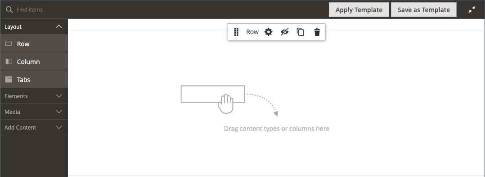
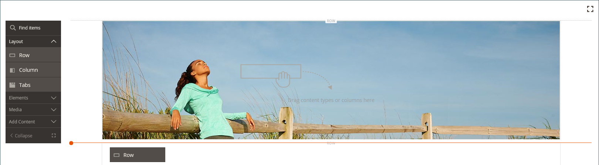
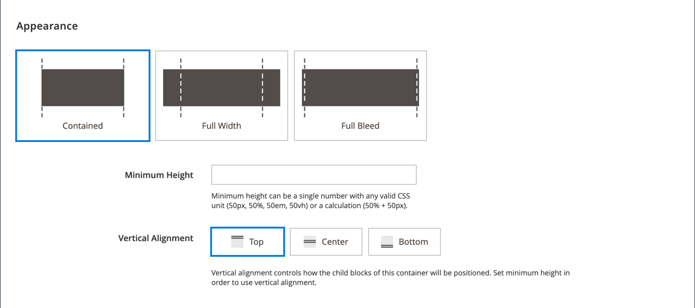
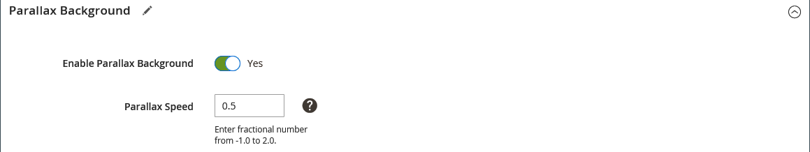
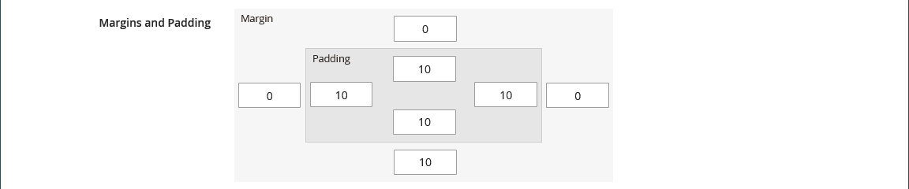

# レイアウト – 行

_行_ コンテンツタイプを使用して、[[!DNL Page Builder]  ステージ &#x200B;](workspace.md#stage)に行を追加します。

{{$include /help/_includes/page-builder-save-timeout.md}}

## 行ツールボックス

行のコンテナにカーソルを合わせると、行のツールボックスが表示されます。 このツールボックスには、行を移動、非表示、複製、編集、削除するオプションが含まれています。 設定の選択によって、行の外観、背景、レイアウトが決まります。 追加のコンテンツ要素は、左側の[!DNL Page Builder] パネルから行にドラッグできます。

{width="600" zoomable="yes"}

| ツール | アイコン | 説明 |
| --------- | ---------- | ----------- |
| 移動 | {width="25"} | ステージ上の他の行に関連して、行を別の位置に移動します。 |
| （ラベル） | [!UICONTROL Row] | 現在のコンテンツコンテナを行として識別します。 コンテナにカーソルを合わせると、ツールボックスが表示されます。 |
| 設定 | {width="25"} | 「行を編集」ページが開き、コンテナのプロパティを変更できます。 |
| 非表示 | {width="25"} | 現在の行を非表示にします。 |
| 表示 | {width="25"} | 非表示の行を表示します。 |
| 重複 | {width="25"} | 行のコピーを作成します。 |
| 削除 | {width="25"} | 行コンテナとそのコンテンツをステージから削除します。 |

{style="table-layout:auto"}

{{$include /help/_includes/page-builder-hidden-element-note.md}}

## 行を追加

1. _[!UICONTROL Layout]_&#x200B;の下の[!DNL Page Builder] パネルで、新しい&#x200B;**[!UICONTROL Row]**&#x200B;を1行目のすぐ下のステージにドラッグします。

1. 行を書式設定するには、行コンテナにカーソルを合わせてツールボックスを表示し、_設定_ （{width="20"}）アイコンを選択します。

   使用可能な設定の詳細については、次の節を参照してください。

   {width="600" zoomable="yes"}

## 行の設定の変更

1. 行コンテナにカーソルを合わせてツールボックスを表示し、_設定_ （{width="20"}）アイコンを選択します。

   {width="600" zoomable="yes"}

1. 使用可能な設定の更新について詳しくは、次の節を参照してください。

1. 完了したら、**[!UICONTROL Save]**&#x200B;をクリックして設定を適用し、[!DNL Page Builder] ワークスペースに戻ります。

## アピアランス

_アピアランス_&#x200B;設定を使用して、行にコンテンツがどのように表示されるかを指定します。

{width="600" zoomable="yes"}

- コンテンツ領域のコンテナと幅に関連して、背景色や背景画像がどのように表示されるかを決定するには、次の整列を選択します。

  | オプション | 説明 |
  | ------ | ----------- |
  | [!UICONTROL Contained] | 背景色または画像は、テーマで定義される最大ページ幅に制限されます。 |
  | [!UICONTROL Full Width] | テーマで定義される最大ページ幅にコンテンツを制限します。 背景色や画像は制限されず、行の幅が広がります。 |
  | [!UICONTROL Full Bleed] | コンテンツと背景画像および/またはカラーは制限されず、行の幅を広げます。 完全ブリードは、レイアウトをサポートする[&#x200B; テーマ &#x200B;](../content-design/themes.md)でのみ使用できます。 |

  {style="table-layout:auto"}

- 行の&#x200B;**[!UICONTROL Minimum Height]**&#x200B;を入力します。 この値は、有効なCSS単位（`100px`、`50%`、`50em`、`100vh`など）または計算（`100vh - 237px`など）を含む数値にできます。

  例えば、行の最小の高さを設定して、ページ全体の高さを伸ばすことができ、ページ全体の背景画像やビデオに対して魅力的なオプションを提供します。

- 行に追加されたコンテンツコンテナ（上、中央、下）を整列させるには、**[!UICONTROL Vertical Alignment]**&#x200B;設定を選択します。

## 背景

行の背景表示を定義するための多くのオプションがあります。 シンプルなカラーまたは背景画像を適用し、より洗練された効果を管理できます。

### 背景色

色見本を選択するか、カラーピッカーをクリックするか、有効なカラー名または同等の16進数値を入力して、背景色を指定します。 この設定により、行の背景色が決まります。 カラーの不透明度を調整することもできます。

{width="200"}

値は、次の3つの方法のいずれかで設定できます。

- `White`などの定義済みのカラー名
- カラーの16進数カラー値（`#ffffff`など）
- カラーのrgba値。不透明度パーセント（`rgba(255, 255, 255, 0.75)`など）

カラーを選択する場合は、「_カラーなし_」ボックスの左側にあるスウォッチをクリックします。

{width="600" zoomable="yes"}

カラーボックスをクリックしてカラーピッカーを再度開くと、スライダーの下のボックスに、現在の赤、緑、青、アルファの値（rgba）が表示されます。 最後の数値は、現在の不透明度の割合を10進数で示しています。 スライダーを使用して不透明度を調整したり、必要な小数値を入力したりできます。

{width="600" zoomable="yes"}

>[!NOTE]
>
>[!DNL Page Builder]は、様々な不透明度を持つ背景の作成に使用できる背景画像で、透明レイヤー（_アルファチャンネル_）もサポートしています。

### [!UICONTROL Background Type]

背景タイプには、画像またはビデオを使用できます。 [!DNL Page Builder]はデフォルトで`Image`に設定され、様々な画像設定が表示されます。 `Video`を選択すると、[!DNL Page Builder]は画像設定をビデオ設定に置き換えます。 両方のバックグラウンドタイプについて、次のように説明します。

{width="200"}

### 画像タイプの設定

_[!UICONTROL Background Type]_&#x200B;を`Image`に設定する場合は、次の設定を使用して背景画像表示を定義します。

{width="600" zoomable="yes"}

- **[!UICONTROL Background Image]** – 必要に応じて、提供されたツールを使用して、行に適用する背景画像を選択します。

  | オプション | 説明 |
  | ------ | ----------- |
  | [!UICONTROL Upload] | ローカルコンピューターからギャラリーに画像ファイルをアップロードし、それを行の背景画像として適用します。 |
  | [!UICONTROL Select from Gallery] | 行の背景画像として、ギャラリーから既存の画像を選択するよう求めるプロンプトが表示されます。 |
  | {width="25"} | 画像をカメラタイルにドラッグするか、ローカルファイルシステムで画像を参照できます。 |

  {style="table-layout:auto"}

- **[!UICONTROL Background Mobile Image]** – 必要に応じて、同じツールを使用して、モバイルデバイスでの表示に使用する異なる背景画像を選択します。

- **[!UICONTROL Background Size]** – このオプションを設定すると、行の幅に対して背景画像がどのように拡大・縮小されるかを指定できます。

  | オプション | 説明 |
  | ------ | ----------- |
  | `Cover` | 背景画像は、行の全幅をカバーしています。 |
  | `Contain` | 背景画像は、コンテンツ領域の幅に制限されます。 |
  | `Auto` | 現在のスタイルシートのサイズを適用します。 |

  {style="table-layout:auto"}

  {width="250"}

- **[!UICONTROL Background Position]** – このオプションを設定して、行に対する背景画像のアンカー方法を決定します。

  | アンカーポイント | 位置 |
  | ------ | ----------- |
  | `Top` | 左/中央/右 |
  | `Center` | 左/中央/右 |
  | `Bottom` | 左/中央/右 |

  {style="table-layout:auto"}

  アンカーポイントは、指定した背景位置の行に画像を取り付けるプッシュピンのようなものです。

- **[!UICONTROL Background Attachment]** – 添付ファイルの種類を設定して、背景画像がスクロール ページに対してどのように移動するかを決定します。

  | オプション | 説明 |
  | ------ | ----------- |
  | `Scroll` | 添付された背景画像は、ページのスクロールに合わせて下に移動するように同期されます。 パララックス背景を使用して、スクロール速度を制御します。 |
  | `Fixed` | （モバイルでは利用できません） コンテナが画像をスクロールしても背景の画像が移動せず、指定した背景位置に固定されます。 |

  {style="table-layout:auto"}

- **[!UICONTROL Background Repeat]** – 行の空き容量を埋めるために背景画像を繰り返す場合は、`Yes`に設定します。

### ビデオタイプの設定

_背景タイプ_&#x200B;を`Video`に設定した場合は、次の設定を使用して背景画像表示を定義します。

- **[!UICONTROL Video URL]** – 有効なビデオ URLを入力してください。 有効なビデオ URLは、次のリンクに設定できます。

   - YouTube ビデオ：`https://youtu.be/CoDhMRUUjeI`
   - Vimeo ビデオ：`https://vimeo.com/190156113`
   - 有効なビデオファイル （`.mp4`をお勧めします）: `https://myvideos.com/spiral.mp4`

  {width="300"}

- **[!UICONTROL Overlay Color]** – 色を選択して、ビデオに透明な色合いを適用します。

- **[!UICONTROL Infinite Loop]** - ビデオを1回再生して停止するには、`No`に設定します。 このオプションを`Yes` （デフォルト）に設定すると、ビデオは無限ループで繰り返されます。

- **[!UICONTROL Lazy Load]** - `No`に設定すると、表示されていない場合でも、ページでビデオが読み込まれます。 このオプションが`Yes` （デフォルト）に設定されている場合、ビデオは画面に表示されている場合にのみソースから読み込まれます。

- **[!UICONTROL Play Only When Visible]** - ビデオが読み込まれた直後から、表示されているかどうかに関係なくビデオの再生を開始するには、`No`に設定します。 このオプションが`Yes` （デフォルト）に設定されている場合、ビデオは表示されているときにのみ再生を開始します。

- **[!UICONTROL Fallback Image]** – 必要に応じて、ビデオが読み込まれる前に画面に表示する画像を指定し、何らかの理由でビデオが読み込まれない場合は、画像を指定します。

## パララックス背景

これらのオプションを使用して、ページのスクロールに対する背景画像またはビデオのスクロール速度を制御します。 背景を設定して、よりスクロールを遅くすることで、没入感を生み出すことができます。

- **パララックス背景を有効にする**&#x200B;を`Yes`に設定します。
- **視差速度**&#x200B;を`-1.0`から`2.0`までの小数値で入力します。

{width="600" zoomable="yes"}

## アドバンス

- 行に追加されるコンテンツコンテナの水平方向の配置を制御するには、**[!UICONTROL Alignment]**&#x200B;を選択します。

  | オプション | 説明 |
  | ------ | ----------- |
  | `Default` | 現在のテーマのスタイルシートで指定されている整列のデフォルト設定を適用します。 |
  | `Left` | 行コンテナの左端に沿ってコンテンツコンテナを整列させ、指定された任意のパディングを許可します。 |
  | `Center` | 行コンテナの中央にコンテンツコンテナを配置し、指定されたパディングを許可します。 |
  | `Right` | 行コンテナの右端に沿ってコンテンツコンテナを整列させ、指定された任意のパディングを許可します。 |

  {style="table-layout:auto"}

- 行コンテナのすべての4つの側面に適用される&#x200B;**[!UICONTROL Border]** スタイルを設定します。

  | オプション | 説明 |
  | ------ | ----------- |
  | `Default` | 関連付けられたスタイルシートで指定されたデフォルトの境界線スタイルを適用します。 |
  | `None` | コンテナの境界を表示しません。 |
  | `Dotted` | コンテナの境界線が点線で表示されます。 |
  | `Dashed` | コンテナの境界線が破線で表示されます。 |
  | `Solid` | コンテナの境界線が実線として表示されます。 |
  | `Double` | コンテナの境界線が2行で表示されます。 |
  | `Groove` | コンテナの境界線は、溝付き線として表示されます。 |
  | `Ridge` | コンテナの境界線は、うね付きの線として表示されます。 |
  | `Inset` | コンテナの境界線がインセット線として表示されます。 |
  | `Outset` | コンテナの境界線がアウトセット線として表示されます。 |

  {style="table-layout:auto"}

- `None`以外の境界線スタイルを設定する場合は、境界線の表示オプションを完了します。

  {width="600" zoomable="yes"}

  | オプション | 説明 |
  | ------ |------------ |
  | [!UICONTROL Border Color] | 色見本を選択するか、カラーピッカーをクリックするか、有効なカラー名または同等の16進数値を入力して、カラーを指定します。 |
  | [!UICONTROL Border Width] | 境界線の幅のピクセル数を入力します。 |
  | [!UICONTROL Border Radius] | 境界線の各隅を丸めるために使用する半径のサイズを定義するピクセル数を入力します。 |

  {style="table-layout:auto"}

  次の例の行の境界線の半径は15です。

  {width="500"}の行

- （オプション）現在のスタイルシートから&#x200B;**[!UICONTROL CSS classes]**&#x200B;の名前を指定して、行コンテナに適用します。

  複数のクラス名はスペースで区切ります。

- **[!UICONTROL Margins and Padding]**&#x200B;の値をピクセル単位で入力して、行の外側の余白と内側の余白を指定します。

  行コンテナダイアグラムに対応する各値を入力します。

  | コンテナ領域 | 説明 |
  | -------------- | ----------- |
  | [!UICONTROL Margins] | コンテナのすべての側面の外側のエッジに適用される空白スペースの量。 オプション：`Top` / `Right` / `Bottom` / `Left` |
  | [!UICONTROL Padding] | コンテナのすべての側面の内側エッジに適用される空白スペースの量。 オプション：`Top` / `Right` / `Bottom` / `Left` |

  {style="table-layout:auto"}

  {width="600" zoomable="yes"}

<!-- Last updated from includes: 2023-09-11 14:30:19 -->
