# メディア – スライダー

_スライダー_ コンテンツ タイプを使用して、画像のスライドショーを[[!DNL Page Builder]  ステージ ](workspace.md#stage)に追加します。 新しい画像をアップロードするか、ギャラリーまたは商品カタログから既存の画像を選択できます。 スライダーは、自動再生に設定することも、ナビゲーションボタンを使用して手動で制御することもできます。 スライダーを特定のプロモーションに関連付けるには、[動的ブロック ](dynamic-block.md)を参照してください。

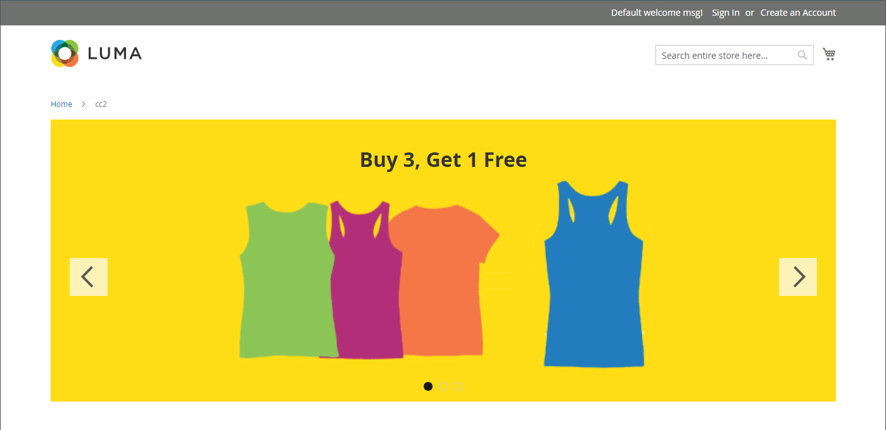{width="700" zoomable="yes"}

{{$include /help/_includes/page-builder-save-timeout.md}}

## ツールボックス

スライダーコンテンツタイプを使用する場合は、個々のスライドと、1つ以上のスライドを保持するスライダーコンテナを追加して編集します。 各スライドには、[!DNL Page Builder] ステージのスライドのデザインに使用する独自のツールボックスがあります。

## 個別スライドツールボックス

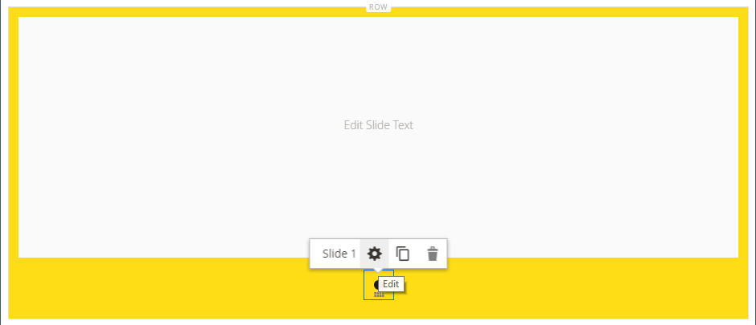{width="500" zoomable="yes"}

| ツール | アイコン | 説明 |
|--- |--- |--- |
| 移動 | {width="25"} | スライドをスライダー上の別の位置に移動します。 |
| （ラベル） | スライド# | 現在のスライドの番号を指定します。 |
| 設定 | {width="25"} | 現在のスライドのプロパティを変更できる&#x200B;_[!UICONTROL Edit Slide]_ページを開きます。 |
| 重複 | {width="25"} | 現在のスライドのコピーを作成します。 |
| 削除 | {width="25"} | スライダーから現在のスライドを削除します。 |

{style="table-layout:auto"}

## スライダーツールボックス

| ツール | アイコン | 説明 |
|--- |--- |--- |
| 移動 | {width="25"} | スライダーをステージ上の別の位置に移動します。 |
| （ラベル） | [!UICONTROL Slider] | スライダーコンテナを識別します。 |
| 設定 | {width="25"} | ビデオとコンテナのプロパティを変更できる&#x200B;_[!UICONTROL Edit Slider]_ページを開きます。 |
| 非表示 | {width="25"} | 現在のスライダーを非表示にします。 |
| 表示 | {width="25"} | 非表示スライダーを表示します。 |
| 重複 | {width="25"} | スライダーのコピーを作成します。 |
| 削除 | {width="25"} | ステージからスライダーを削除します。 |

{style="table-layout:auto"}

{{$include /help/_includes/page-builder-hidden-element-note.md}}

## 個別のスライドを追加

1. スライダーを配置するページ、ブロック、または動的ブロックを開き、**[!UICONTROL Content]** セクションを展開します。

1. [!DNL Page Builder] パネルで、**[!UICONTROL Media]**&#x200B;を展開し、**[!UICONTROL Slider]** プレースホルダーをステージ上の行、列、またはタブにドラッグします。

   次の例では、行の背景色は黄色（`#fffd16`）です。

   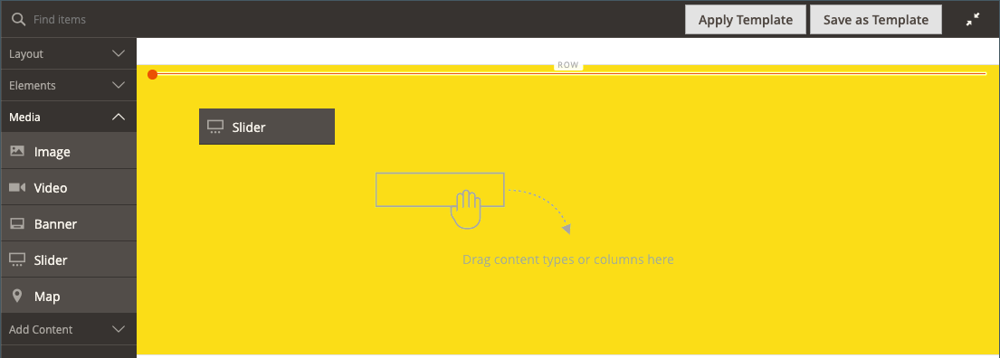{width="600" zoomable="yes"}

   スライダーコンテナは、1つの空のスライドでステージに表示されます。

1. スライダーコンテナ内をクリックして[ テキストエディター](../content-design/editor.md)を表示し、最初のスライドのコンテンツを入力します。

   [ コンテンツ ](#content)設定を使用して、より複雑なバナーコンテンツを含めることもできます。

1. スライダーの下部にあるナビゲーションドットをクリックして、個々のスライドのツールボックスを表示し、_設定_ （{width="20"}）アイコンを選択します。

   スライダーには2つのツールボックスがあります。 下部のスライドツールボックスを使用していることを確認してください。

1. 必要に応じて、次のセクションに従って設定を完了します。

   - [[!UICONTROL Appearance]](#appearance)
   - [[!UICONTROL Background]](#background)
   - [[!UICONTROL Content]](#content)
   - [[!UICONTROL Search Engine Optimization]](#seo)
   - [[!UICONTROL Advanced]](#advanced)

1. 完了したら、**[!UICONTROL Save]**&#x200B;をクリックして設定を適用し、[!DNL Page Builder] ワークスペースに戻ります。

## さらにスライドを追加

次の節では、個々のスライドから始めて、特定の製品を特徴とするレスポンシブスライダーを作成するための一連の手順について説明します。 個々のスライドがまだ存在しない場合は、前の手順に従って個々のスライドをステージに追加します。

スライドを追加するには、次のいずれかの方法または次の方法の組み合わせを使用します。

### 方法1：既存のスライドを複製する

必要な設定で既に設定されているスライドを複製することで、時間を節約できます。

1. スライドの下にあるナビゲーションドットをクリックしてツールボックスを表示し、_複製_ （{width="20"}）アイコンを選択します。

   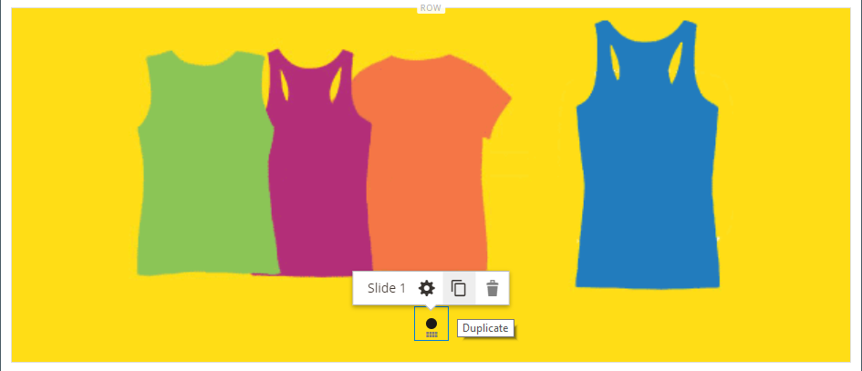{width="500" zoomable="yes"}

1. 新しいスライドのナビゲーションドットをクリックして、ツールボックスを表示し、_設定_ （{width="20"}）アイコンを選択します。

1. 必要に応じて、次のセクションに従って設定を変更します。

   - [[!UICONTROL Appearance]](#appearance)
   - [[!UICONTROL Background]](#background)
   - [[!UICONTROL Content]](#content)
   - [[!UICONTROL Advanced]](#advanced)

1. 完了したら、**[!UICONTROL Save]**&#x200B;をクリックして設定を適用し、[!DNL Page Builder] ワークスペースに戻ります。

### 方法2：新しい空のスライドを追加する

1. 上部のスライダーコンテナにカーソルを合わせてツールボックスを表示し、_追加_ （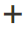{width="20"}）アイコンを選択します。

   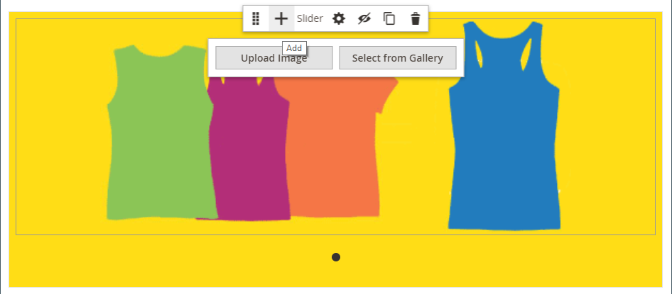{width="500" zoomable="yes"}

   独自のナビゲーションドットとツールボックスを含む新しい空白のスライドがスライダーに追加され、ステージに表示されます。

   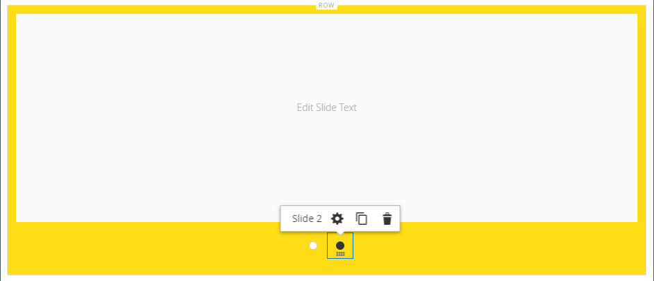{width="500" zoomable="yes"}

1. 新しいスライドのナビゲーションドットをクリックして、ツールボックスを表示し、_設定_ （{width="20"}）アイコンを選択します。

1. 必要に応じて、次のセクションに従って設定を変更します。

   - [[!UICONTROL Appearance]](#appearance)
   - [[!UICONTROL Background]](#background)
   - [[!UICONTROL Content]](#content)
   - [[!UICONTROL Advanced]](#advanced)

1. 完了したら、右上隅の&#x200B;**[!UICONTROL Save]**&#x200B;をクリックして、_[!UICONTROL Edit Slide]_ページを閉じます。

### スライドにウィジェットを追加

次の手順を使用して、任意の[ ウィジェットタイプ ](../content-design/widgets.md#widget-types)を[!DNL Page Builder] ステージのスライドに追加できます。

1. [ スライドに表示するウィジェット ](../content-design/widget-create.md)を作成します。

1. スライダーを配置するページ、ブロック、または動的ブロックを開き、**[!UICONTROL Content]** セクションを展開します。

1. [!DNL Page Builder] パネルで、**[!UICONTROL Media]**&#x200B;を展開し、**[!UICONTROL Slider]** プレースホルダーをステージ上の行、列、またはタブにドラッグします。

1. スライダーコンテナ内をクリックして[ テキストエディター](../content-design/editor.md) ツールバーを表示し、_ウィジェットの挿入_ （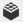{width="20"}）アイコンをクリックします。

1. 必要な&#x200B;**[!UICONTROL Widget Type]**&#x200B;を選択します。

1. ウィジェットの種類によって異なる設定を指定します

   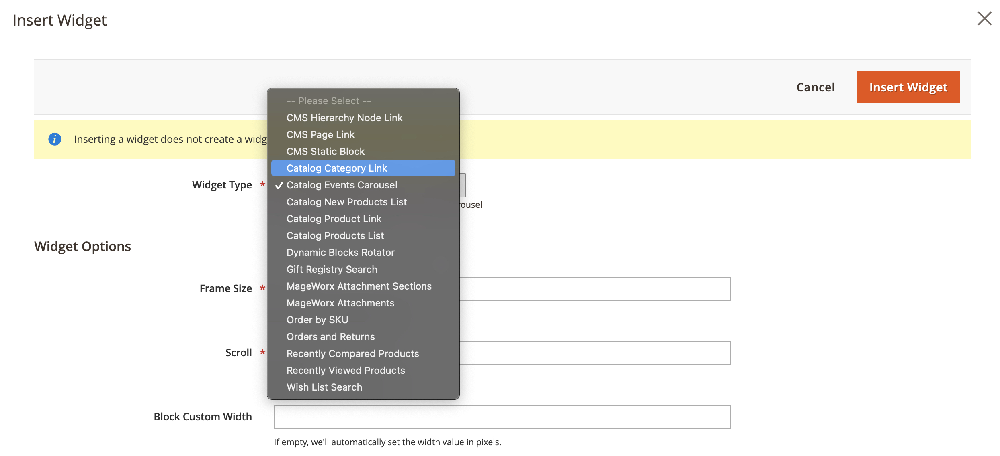{width="600" zoomable="yes"}

1. 完了したら、右上隅の「**[!UICONTROL Insert Widget]**」をクリックします。

1. 必要に応じてその他の設定を変更します。

1. 完了したら、右上隅の「**[!UICONTROL Save]**」をクリックします。

   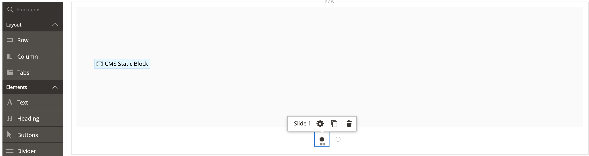{width="600" zoomable="yes"}

### 各スライドを表示

ステージ上に各スライドを表示するには、現在表示されているスライドの下にある次の点をクリックします。

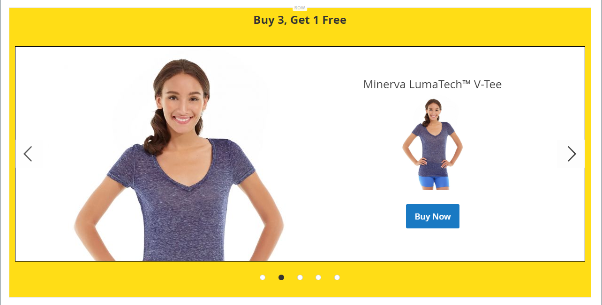{width="500" zoomable="yes"}

前の例のスライドには、背景画像、透明なモバイル画像、およびテキストエディターから追加されたインライン画像が含まれています。 この手法は、背景画像をオフにし、小さいインライン画像のみを表示することで、モバイルデバイスで適切に機能します。 この例の製品スライドには、次の追加設定があります。

| オプション | 設定例 |
|--- |--- |
| [!UICONTROL Appearance] | `Collage Right` |
| [!UICONTROL Background Color] | `#ffffff` （白） |
| [!UICONTROL Background Image] | このスライドの画像は製品ページから保存され、ギャラリーにアップロードされました。 |
| [!UICONTROL Mobile Background Image] | モバイルの背景画像は、10 ピクセル四方の透明な画像です。 空白の画像をモバイルに使用すると、標準の背景画像が非表示の画像に置き換わります。 |
| [!UICONTROL Background Size] | `Auto` |
| [!UICONTROL Message Text] | 挿入された画像を40%に拡大・縮小した`Minerva LumaTech&trade; V-Tee` （中央揃え）（中央揃え） |
| [!UICONTROL Link] | `Product` |
| [!UICONTROL Show Button] | `Always` |
| [!UICONTROL Button Text] | `Buy Now` |
| [!UICONTROL Show Overlay] | `Never Show` |
| [!UICONTROL Alignment] | `Center` （ボタンを整列するには） |
| [!UICONTROL Border] | `Solid` |
| [!UICONTROL Border Color] | `#000000` （黒） |
| [!UICONTROL Border Width] | `1 px` |

{style="table-layout:auto"}

## 個々のスライド設定の変更

1. ステージのスライダー表示を変更し、変更するスライドを表示します。

1. 個々のスライドツールボックスで、_設定_ （{width="20"}）アイコンを選択し、必要に応じて次のセクションに従って設定を完了します。

1. 右上隅の「**[!UICONTROL Save]**」をクリックして設定を適用し、[!DNL Page Builder] ワークスペースに戻ります。

### [!UICONTROL Appearance]

1. 次のいずれかのスライド配置タイプを選択します。

   | タイプ | 説明 |
   | ---- | ----------- |
   | `Poster` | スライドコンテンツをスライダーコンテナに中央に配置します。 オーバーレイを使用すると、スライダーの全幅が拡張されます。 |
   | `Collage Left` | スライダーコンテナの左側の定義された領域にスライドコンテンツを配置します。 オーバーレイを使用する場合は、定義された領域のみをカバーします。 |
   | `Collage Center` | スライダーコンテナの中央にある定義された領域にスライドコンテンツを配置します。 オーバーレイを使用する場合は、定義された領域のみをカバーします。 |
   | `Collage Right` | スライダーコンテナの右側の定義された領域にスライドコンテンツを配置します。 オーバーレイを使用する場合は、定義された領域のみをカバーします。 |

   {style="table-layout:auto"}

   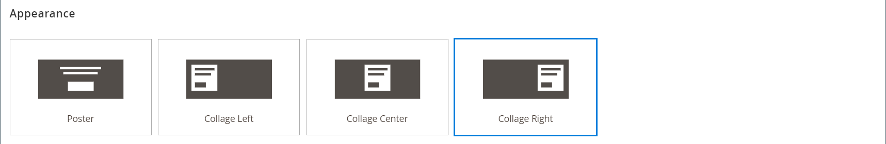{width="600" zoomable="yes"}

1. **[!UICONTROL Slide Name]**&#x200B;を入力します。

   編集モードで作業している場合、スライド名はナビゲーションドットの上にツールチップとして表示されます。 スライド名はストアフロントから表示されません。

   ナビゲーションの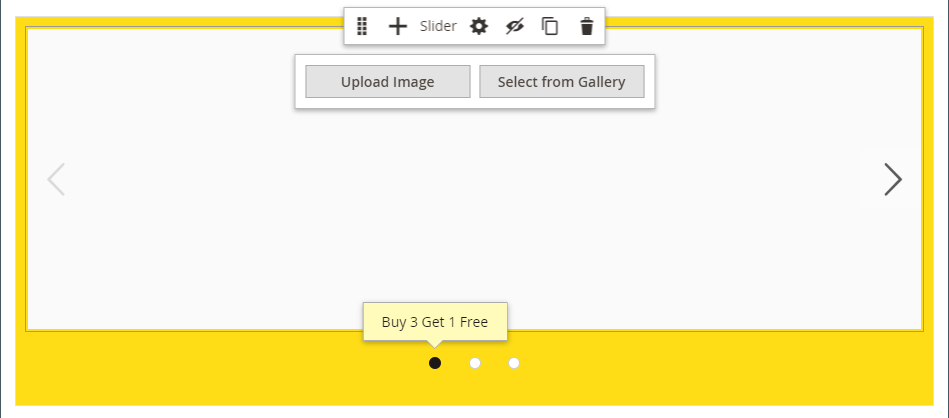{width="500" zoomable="yes"}

1. スライドの&#x200B;**[!UICONTROL Minimum Height]**&#x200B;を入力します。

   最小の高さは、有効なCSS単位（`100px`、`50%`、`50em`、`100vh`など）または計算（`100vh - 237px`など）を含む数値にすることができます。

   例えば、スライドの最小高さを設定してページ全体の高さをカバーし、背景画像とビデオを使用して魅力的なデザインオプションを作成できます。

   >[!NOTE]
   >
   >スライドをページの高さ全体（100vh）に設定すると、スライドを含むスライダーもページの高さ全体を引き伸ばして、スライドの高さに対応します。

## [!UICONTROL Background]

スライドの背景表示を定義するオプションは多数あります。 シンプルなカラーまたは背景画像を適用し、より洗練された効果を管理できます。

### [!UICONTROL Background Color]

色見本を選択するか、カラーピッカーをクリックするか、有効なカラー名または同等の16進数値を入力して、背景色を指定します。 この設定により、行の背景色が決まります。 カラーの不透明度を調整することもできます。

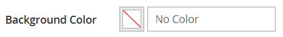{width="200"}

値は、次の3つの方法のいずれかで設定できます。

- `White`などの定義済みのカラー名
- カラーの16進数カラー値（`#ffffff`など）
- カラーのrgba値。不透明度パーセント（`rgba(255, 255, 255, 0.75)`など）

カラーを選択する場合は、「_カラーなし_」ボックスの左側にあるスウォッチをクリックします。

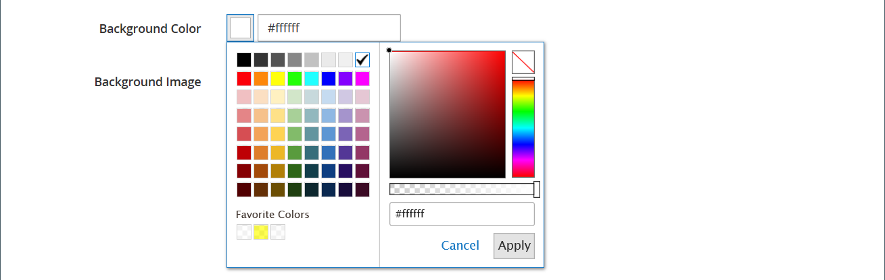{width="600" zoomable="yes"}

カラーボックスをクリックしてカラーピッカーを再度開くと、スライダーの下のボックスに、現在の赤、緑、青、アルファの値（rgba）が表示されます。 最後の数値は、現在の不透明度の割合を10進数で示しています。 スライダーを使用して不透明度を調整したり、必要な小数値を入力したりできます。

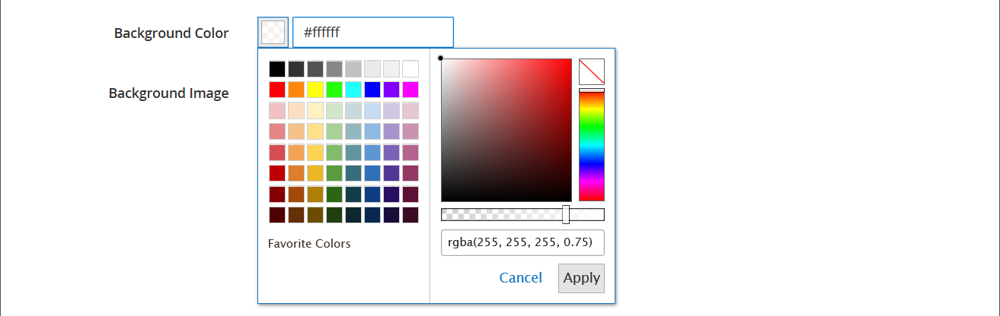{width="600" zoomable="yes"}

>[!NOTE]
>
>[!DNL Page Builder]は、様々な不透明度を持つ背景の作成に使用できる背景画像で、透明レイヤー（_アルファチャンネル_）もサポートしています。

### [!UICONTROL Background Type]

背景タイプには、画像またはビデオを使用できます。 [!DNL Page Builder]はデフォルトで`Image`に設定され、様々な画像設定が表示されます。 `Video`を選択すると、[!DNL Page Builder]は画像設定をビデオ設定に置き換えます。 両方の背景タイプの設定については、次の節で説明します。

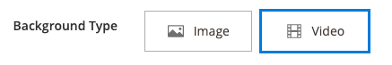{width="400"}

### 画像タイプの設定

_[!UICONTROL Background Type]_を`Image`に設定する場合は、次の設定を使用して背景画像表示を定義します。

{width="600" zoomable="yes"}

- **[!UICONTROL Background Image]** – 必要に応じて、提供されたツールを使用して、バナーに適用する背景画像を選択します。

  | ツール | 説明 |
  | ---- | ----------- |
  | [!UICONTROL Upload] | ローカルコンピューターからギャラリーに画像ファイルをアップロードし、バナーの背景画像として適用します。 |
  | [!UICONTROL Select from Gallery] | ギャラリーの既存の画像をバナーの背景画像として選択するよう求めるプロンプトが表示されます。 |
  | {width="25"} | 画像をカメラタイルにドラッグするか、ローカルファイルシステムで画像を参照できます。 |

  {style="table-layout:auto"}

- **[!UICONTROL Background Mobile Image]** – 必要に応じて、同じツールを使用して、モバイルデバイスでの表示に使用する異なる背景画像を選択します。

- **[!UICONTROL Background Size]** - バナーの幅に合わせて背景画像を拡大・縮小する方法を選択します。

  | オプション | 説明 |
  | ------ | ----------- |
  | `Cover` | 背景画像はバナーの全幅をカバーしています。 |
  | `Contain` | 背景画像は、コンテンツ領域の幅に制限されます。 |
  | `Auto` | 現在のスタイルシートのサイズを適用します。 |

  {style="table-layout:auto"}

  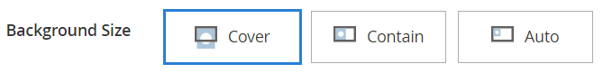{width="400"}

- **[!UICONTROL Background Position]** - バナーに対する背景画像のアンカー付け方法を選択します：

  | アンカーポイント | 位置 |
  | ------------ | -------- |
  | `Top` | 左/中央/右 |
  | `Center` | 左/中央/右 |
  | `Bottom` | 左/中央/右 |

  {style="table-layout:auto"}

  アンカーポイントは、指定した背景位置のバナーに画像を取り付けるプッシュピンのようなものです。

- **[!UICONTROL Background Repeat]** – 背景画像を繰り返してスペースを塗りつぶす場合は、この設定`Yes`を変更します。

### ビデオタイプの設定

_背景タイプ_&#x200B;を`Video`に設定した場合は、次の設定を使用して背景画像表示を定義します。

- **[!UICONTROL Video URL]** – 有効なビデオ URLを入力してください。 有効なビデオ URLは、次のリンクに設定できます。

   - YouTube ビデオ：`https://youtu.be/CoDhMRUUjeI`
   - Vimeo ビデオ：`https://vimeo.com/190156113`
   - 有効なビデオファイル （`.mp4`をお勧めします）: `https://myvideos.com/spiral.mp4`

  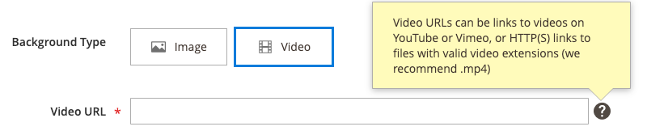{width="500"}

- **[!UICONTROL Overlay Color]** – 色を選択して、ビデオに透明な色合いを適用します。

- **[!UICONTROL Infinite Loop]** - ビデオを1回再生して停止するには、`No`に設定します。 このオプションを`Yes` （デフォルト）に設定すると、ビデオは無限ループで繰り返されます。

- **[!UICONTROL Lazy Load]** - `No`に設定すると、表示されていない場合でも、ページでビデオが読み込まれます。 このオプションが`Yes` （デフォルト）に設定されている場合、ビデオは画面に表示されている場合にのみソースから読み込まれます。

- **[!UICONTROL Play Only When Visible]** - ビデオが読み込まれた直後から、表示されているかどうかに関係なくビデオの再生を開始するには、`No`に設定します。 このオプションが`Yes` （デフォルト）に設定されている場合、ビデオは表示されているときにのみ再生を開始します。

- **[!UICONTROL Fallback Image]** – 必要に応じて、ビデオが読み込まれる前に画面に表示する画像を指定し、何らかの理由でビデオが読み込まれない場合は、画像を指定します。

## [!UICONTROL Content]

スライドの内容は、ステージ上で直接変更することも、設定を変更する際にも変更できます。 この設定には、スライドリンクやボタン、オーバーレイなど、より複雑なコンテンツ機能が用意されています。 コンテンツの位置は、[ アピアランス ](#appearance)のプレースメント設定を反映しています。

### ステージ上のシンプルなコンテンツ

1. プレースホルダーまたは既存のテキストをクリックし、スライドに表示する新しいテキストを入力します。

   エディターツールバーがテキストボックスの上に表示されます。

1. エディターツールバーを使用して、テキストを入力および書式設定したり、リンク、画像、ウィジェットなどの要素を挿入したりできます。

   {width="500" zoomable="yes"}

### 設定の複雑なコンテンツ

1. スライダーの下部にあるナビゲーションドットをクリックして、個々のスライドのツールボックスを表示し、_設定_ （{width="20"}）アイコンを選択します。

1. _[!UICONTROL Content]_セクションで、スライドと共に表示する&#x200B;**[!UICONTROL Message Text]**を入力します。

1. _[!UICONTROL Content]_セクションまでスクロールし、**[!UICONTROL Message Text]**エディターを使用してバナーテキストを入力し、書式設定します。

   テキストリンク、画像、ウィジェットなどの要素を挿入することもできます。

1. エディターツールバーを使用して、必要に応じてテキストを書式設定します。

   この例の最初のスライドには背景画像がありますが、メッセージテキストはありません。 スライダーの上にある`Buy 3 Get 1 Free` テキストは、テキストコンテナ内にあります（後で追加）。

1. 必要に応じて、スライドに&#x200B;**[!UICONTROL Link]**&#x200B;を指定します。

   リンクは、お客様がスライド領域をクリックしたときに表示される宛先ページです。 次の3つのリンクタイプのいずれかを使用できます。

   - **[!UICONTROL URL]** – 相対URLまたは完全修飾URLのいずれかにリンクします。

   - **[!UICONTROL Product]** – 製品名またはSKUに基づいて宛先ページを識別します。 部分的または完全な名前に基づいて、製品を名前で検索します。 検索結果リストから商品を選択します。

     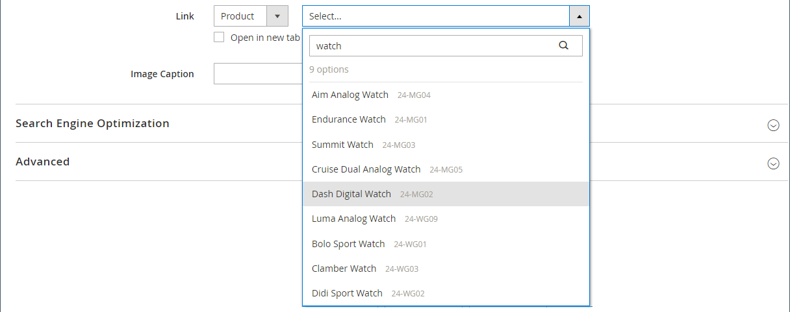{width="600" zoomable="yes"}

   - **[!UICONTROL Category]** – 宛先ページをカテゴリ ツリー内の特定のカテゴリまたはサブカテゴリとして識別します。 部分的または完全な名前に基づいてカテゴリを検索します。 表示されたツリーの展開されたセクションからカテゴリを選択します。

     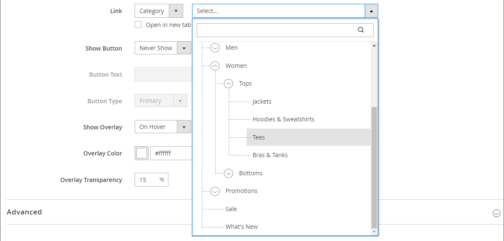{width="600" zoomable="yes"}

   - **[!UICONTROL Page]** – 宛先ページを特定のコンテンツ ページとして識別します。 部分的または完全な名前に基づいてページを検索します。 検索結果リストからページを選択します。

     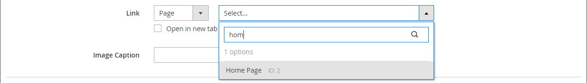{width="600" zoomable="yes"}

   

   2.4.1 リリース以降、[!DNL Page Builder]では、ストアフロントでの表示に関する問題により、ネストされたテキスト内のスライドとリンクのリンクがサポートされなくなりました。 「_[!UICONTROL Message Text]_」でリンクを使用している場合、「_[!UICONTROL Link]_」オプションを設定することはできません。 スライド全体に1つのリンクを使用する場合は、テキストからすべてのリンクを削除できます。

   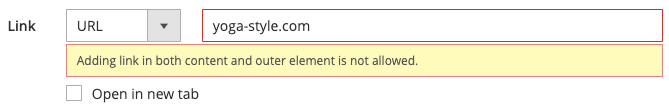{width="300"}
   

   訪問者がストアから離れるのを防ぐ場合は、**[!UICONTROL Open in new tab]** チェックボックスを選択します。 チェックボックスをオフにすると、リンクされた宛先が同じブラウザータブで開き、訪問者をストアから効果的に移動させることができます。

1. 必要に応じて、ボタンを追加して、顧客にリンクのフォローを促します。

   スライド _アピアランス_&#x200B;の位置は、テキストの下に1つのリンクまたはボタンを配置します。 追加するリンクまたはボタンのプロパティを入力します。

   {width="600" zoomable="yes"}

   >[!NOTE]
   >
   >バナーに[ ブロック ](block.md)を追加して、複数のボタンまたはリンクを使用することもできます。 競合を避けるために、すべてのリンクまたはボタンを別のブロックに保存し、リンクまたはボタンをバナーに直接追加しないでください。

   - **[!UICONTROL Show Button]**&#x200B;を次のいずれかに設定します：

     | オプション | 説明 |
     | ------ | ----------- |
     | `Always` | ボタンは常にスライドに表示されます。 |
     | `On Hover` | カーソルを合わせると、スライドにボタンが表示されます。 |
     | `Never Show` | ボタンはスライドには表示されません。 |

     {style="table-layout:auto"}

   - ボタンに表示する&#x200B;**[!UICONTROL Button Text]**&#x200B;を入力します。

   - **[!UICONTROL Button Type]**&#x200B;を次のいずれかに設定します：

     | オプション | 説明 |
     | ------ | ----------- |
     | `Primary` | 現在のスタイルシートからプライマリボタンのスタイルを適用します。 |
     | `Secondary` | 該当する場合は、現在のスタイルシートからセカンダリボタンスタイルを適用します。 |
     | `Link` | ボタンではなくハイパーリンクを作成します。 |

     {style="table-layout:auto"}

     現在のテーマのボタンスタイルによって、ボタンの形式が決まります。 通常、プライマリボタンは、セカンダリボタンよりも背景色が目立ちます。

1. **[!UICONTROL Show Overlay]**&#x200B;を次のいずれかに設定します：

   | オプション | 説明 |
   | ------ | ----------- |
   | `Always` | オーバーレイは常に表示されます。 |
   | `On Hover` | オーバーレイはカーソルを合わせたときにのみ表示されます。 |
   | `Never Show` | オーバーレイは表示されません。 |

   {style="table-layout:auto"}

   オーバーレイを使用して、「アピアランス」設定で定義されているアクティブコンテンツ領域に背景色を適用できます。 スライドの背景画像は、スライドの全幅にわたって表示されたままです。

   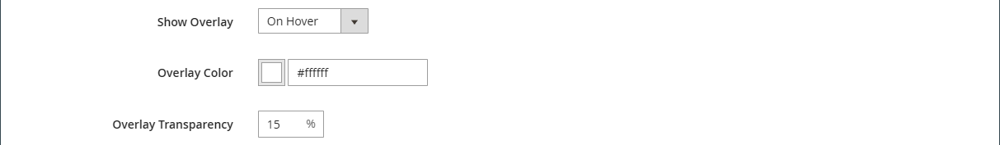{width="600" zoomable="yes"}

   オーバーレイを表示する場合は、**[!UICONTROL Overlay Color]**&#x200B;を設定します。

   - 「_カラーなし_」スウォッチをクリックし、スウォッチを選択します。
   - 「**[!UICONTROL Color]**」フィールドに、有効なカラー名または16進数値を入力します。

   {width="600" zoomable="yes"}

## [!UICONTROL Search Engine Optimization] {#seo}

これらの設定のテキストは、検索エンジンに表示され、ページのインデックス作成方法を改善します。

- 「**[!UICONTROL Alternative Text]**」に、表示するデジタルアクセシビリティツールの&#x200B;_alt_ テキスト説明を入力します。

  代替テキストの使用はアクセシビリティのベストプラクティスであり、一部のロケールでは法律で義務付けられています。 HTMLでは、`alt`属性は`image` タグ `<image title="tooltip" alt="description" src="image.jpg">`のサブセットです。

- **[!UICONTROL Title Attribute]**&#x200B;の場合、マウスオーバーにツールチップとして表示するテキストを入力します。

  ベストプラクティスとして、説明的でキーワードが豊富なタイトルを選択して、検索エンジンによる画像のインデックス付け方法を改善します。 HTMLでは、`title`属性は`image` タグ `<image title="tooltip" alt="description" src="image.jpg">`のサブセットです。

## [!UICONTROL Advanced]

1. スライドに追加されたコンテンツの水平方向の配置を制御するには、**[!UICONTROL Alignment]**&#x200B;を選択します。

   | オプション | 説明 |
   | ------ | ----------- |
   | `Default` | 現在のテーマのスタイルシートで指定されている整列のデフォルト設定を適用します。 |
   | `Left` | スライドの左端に沿ってコンテンツを整列し、指定されたパディングを許可します。 |
   | `Center` | スライドの中央にコンテンツを配置し、指定されたパディングを許可します。 |
   | `Right` | スライドの右端に沿ってコンテンツを整列し、指定されたパディングを許可します。 |

   {style="table-layout:auto"}

1. スライドのすべての4つの側面に適用される&#x200B;**[!UICONTROL Border]** スタイルを設定します。

   | オプション | 説明 |
   | ------ | ----------- |
   | `Default` | 関連付けられたスタイルシートで指定されたデフォルトの境界線スタイルを適用します。 |
   | `None` | スライドの境界線が表示されません。 |
   | `Dotted` | コンテナの境界線が点線で表示されます。 |
   | `Dashed` | コンテナの境界線が破線で表示されます。 |
   | `Solid` | コンテナの境界線が実線として表示されます。 |
   | `Double` | コンテナの境界線が2行で表示されます。 |
   | `Groove` | コンテナの境界線は、溝付き線として表示されます。 |
   | `Ridge` | コンテナの境界線は、うね付きの線として表示されます。 |
   | `Inset` | コンテナの境界線がインセット線として表示されます。 |
   | `Outset` | コンテナの境界線がアウトセット線として表示されます。 |

   {style="table-layout:auto"}

1. `None`以外の境界線スタイルを設定する場合は、境界線の表示オプションを完了します。

   {width="600" zoomable="yes"}

   | オプション | 説明 |
   | ------ |------------ |
   | [!UICONTROL Border Color] | 色見本を選択するか、カラーピッカーをクリックするか、有効なカラー名または同等の16進数値を入力して、カラーを指定します。 |
   | [!UICONTROL Border Width] | 境界線の幅のピクセル数を入力します。 |
   | [!UICONTROL Border Radius] | 境界線の各隅を丸めるために使用する半径のサイズを定義するピクセル数を入力します。 |

   {style="table-layout:auto"}

1. （オプション）現在のスタイルシートから&#x200B;**[!UICONTROL CSS classes]**&#x200B;の名前を指定して、スライドに適用します。

   複数のクラス名はスペースで区切ります。

1. **[!UICONTROL Margins and Padding]**&#x200B;の値をピクセル単位で入力して、スライドの外側の余白と内側の余白を指定します。

   スライド図に対応する各値を入力します。

   | コンテナ領域 | 説明 |
   | -------------- | ----------- |
   | [!UICONTROL Margins] | スライドのすべての側面の外側の端に適用される空白の量。 |
   | [!UICONTROL Padding] | スライドのすべての側面の内側の端に適用される空白の量。 |

   {style="table-layout:auto"}

## スライダータイトルを追加

スライダーの上にタイトルを追加する場合は、スライダーの上に[ テキストコンテンツタイプ ]を追加するだけです。 次に、必要に応じてテキストを書式設定します。

1. [!DNL Page Builder] パネルで、**[!UICONTROL Elements]**&#x200B;を展開し、**テキスト**&#x200B;のプレースホルダーをステージ上の行、列、またはタブ セットにドラッグします。

   ドラッグすると、赤いガイドラインがスライダーの上に挿入ポイントを示します。

   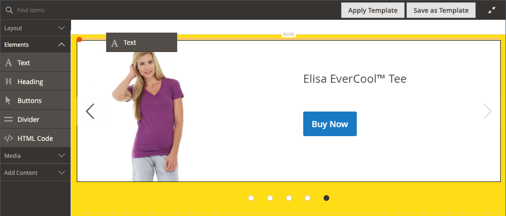{width="600" zoomable="yes"}

1. 必要に応じて、エディターを使用してテキストの書式を設定します。

   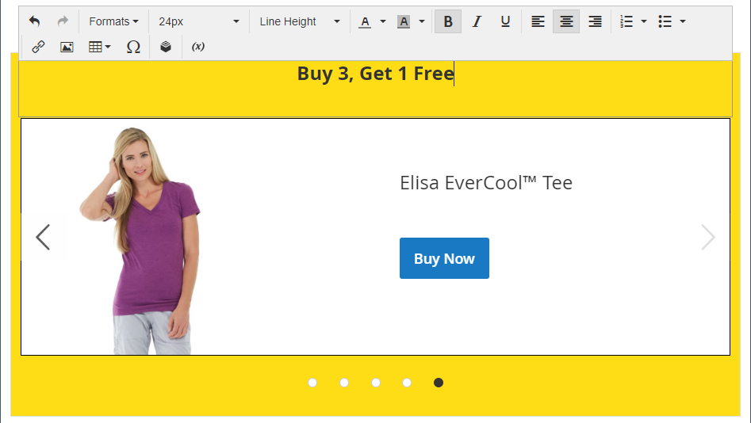{width="500" zoomable="yes"}

## スライダー設定の変更

1. スライダーコンテナにカーソルを合わせてメインツールボックスを表示し、_設定_ （{width="20"}）アイコンを選択します。

   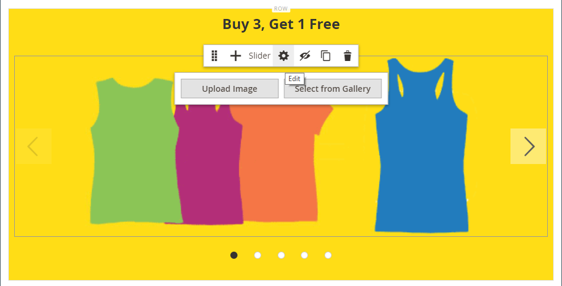{width="500" zoomable="yes"}

1. スライドの&#x200B;**[!UICONTROL Minimum Height]**&#x200B;を入力します。

   最小の高さは、有効なCSS単位（`100px`、`50%`、`50em`、`100vh`など）または計算（`100vh - 237px`など）を含む数値にすることができます。

   例えば、スライダーの最小高さを設定して、ページ全体の高さを伸ばすと、ページ全体の背景画像やビデオに対して魅力的なオプションが表示されます。

   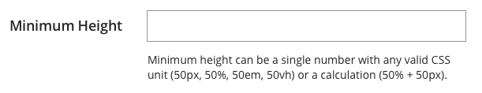{width="400"}

1. ページの読み込み時にスライダーを開始する場合は、**[!UICONTROL Autoplay]**&#x200B;を`Yes`に設定し、**[!UICONTROL Autoplay Speed]**&#x200B;をスライド間の遅延時間のミリ秒数に設定します。

   デフォルトでは、速度は4秒の4000 msに設定されています。 自動再生を`No`に設定すると、最初のスライドがデフォルトで表示され、お客様はスライドナビゲーション（ドットまたは矢印）をクリックして次のスライドを順番に表示する必要があります。

   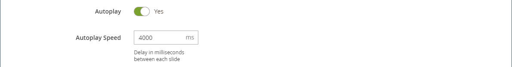{width="600" zoomable="yes"}

1. あるスライドから次のスライドへの移行をスムーズにするには、**[!UICONTROL Fade]**&#x200B;を`Yes`に設定します。

   フェードでは、スライドは配置されたままのように見えますが、コンテンツは次から次へとスムーズに変化します。 フェードを使用しない場合、1つのスライドから次のスライドへの水平方向の移動が表示されます。

   {width="600" zoomable="yes"}

1. ページを開いているときにスライドショーを無期限に繰り返すには、**[!UICONTROL Infinite Loop]**&#x200B;を`Yes`に設定します。

1. スライダーのナビゲーションコントロールの種類を選択するには、次の操作を行います。

   - 各スライドの左側と右側に&#x200B;_次_&#x200B;と&#x200B;_前_&#x200B;の矢印を含めるには、**[!UICONTROL Show Arrows]**&#x200B;を`Yes`に設定します。

   - スライダーの下に一連のナビゲーションドットを含めるには、**[!UICONTROL Show Dots]**&#x200B;を`Yes`に設定します。

   {width="600" zoomable="yes"}

1. 必要に応じて、[詳細](#slider-advanced) スライダーの設定を完了します。

1. 完了したら、**[!UICONTROL Save]**&#x200B;をクリックして設定を適用し、[!DNL Page Builder] ワークスペースに戻ります。

### 詳細設定 – スライダー {#slider-advanced}

1. 親スライダーコンテナ内のスライドの位置を制御するには、**[!UICONTROL Alignment]**&#x200B;を選択します。

   | オプション | 説明 |
   | ------ | ----------- |
   | `Default` | 現在のテーマのスタイルシートで指定されている整列のデフォルト設定を適用します。 |
   | `Left` | スライダーコンテナの左端に沿ってスライドを整列し、指定されたパディングを許可します。 |
   | `Center` | スライダーコンテナの中央にあるスライドを、指定したパディングの許容値に合わせて整列します。 |
   | `Right` | スライダーコンテナの右端に沿ってスライドを整列し、指定されたパディングを許可します。 |

   {style="table-layout:auto"}

1. スライダーコンテナのすべての4つの側面に適用される&#x200B;**[!UICONTROL Border]** スタイルを設定します。

   | オプション | 説明 |
   | ------ | ----------- |
   | `Default` | 関連付けられたスタイルシートで指定されたデフォルトの境界線スタイルを適用します。 |
   | `None` | コンテナの境界を表示しません。 |
   | `Dotted` | コンテナの境界線が点線で表示されます。 |
   | `Dashed` | コンテナの境界線が破線で表示されます。 |
   | `Solid` | コンテナの境界線が実線として表示されます。 |
   | `Double` | コンテナの境界線が2行で表示されます。 |
   | `Groove` | コンテナの境界線は、溝付き線として表示されます。 |
   | `Ridge` | コンテナの境界線は、うね付きの線として表示されます。 |
   | `Inset` | コンテナの境界線がインセット線として表示されます。 |
   | `Outset` | コンテナの境界線がアウトセット線として表示されます。 |

   {style="table-layout:auto"}

1. `None`以外の境界線スタイルを設定する場合は、境界線の表示オプションを完了します。

   | オプション | 説明 |
   | ------ |------------ |
   | [!UICONTROL Border Color] | 色見本を選択するか、カラーピッカーをクリックするか、有効なカラー名または同等の16進数値を入力して、カラーを指定します。 |
   | [!UICONTROL Border Width] | 境界線の幅のピクセル数を入力します。 |
   | [!UICONTROL Border Radius] | 境界線の各隅を丸めるために使用する半径のサイズを定義するピクセル数を入力します。 |

   {style="table-layout:auto"}

1. （オプション）現在のスタイルシートから&#x200B;**[!UICONTROL CSS classes]**&#x200B;の名前を指定して、スライダーコンテナに適用します。

   複数のクラス名はスペースで区切ります。

1. **[!UICONTROL Margins and Padding]**&#x200B;の値をピクセル単位で入力して、スライダーコンテナの外側の余白と内側の余白を決定します。

   対応する値をダイアグラムに入力します。

   | コンテナ領域 | 説明 |
   | -------------- | ----------- |
   | [!UICONTROL Margins] | コンテナのすべての側面の外側のエッジに適用される空白スペースの量。 |
   | [!UICONTROL Padding] | コンテナのすべての側面の内側エッジに適用される空白スペースの量。 |

   {style="table-layout:auto"}

## スライダーをテストする

1. スライダーを含めたページを開き、**[!UICONTROL Enable Page]**&#x200B;を`Yes`に設定します。

1. 右上隅の&#x200B;**[!UICONTROL Save]**&#x200B;矢印をクリックし、**[!UICONTROL Save & Close]**&#x200B;を選択します。

1. _ページ_ グリッドでページを検索し、_[!UICONTROL Action]_列の&#x200B;**[!UICONTROL View]**を選択します。

   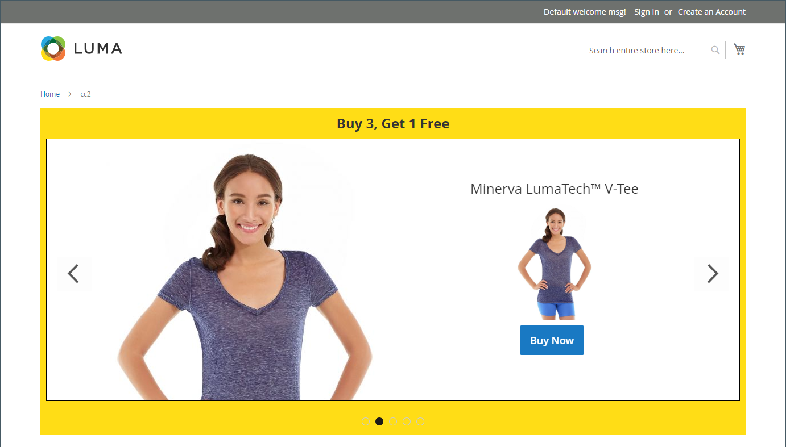{width="600" zoomable="yes"}

   スライダーをプレビューする場合は、モバイルデバイスでどのように表示されるかを確認できるように、ウィンドウのサイズを変更します。

   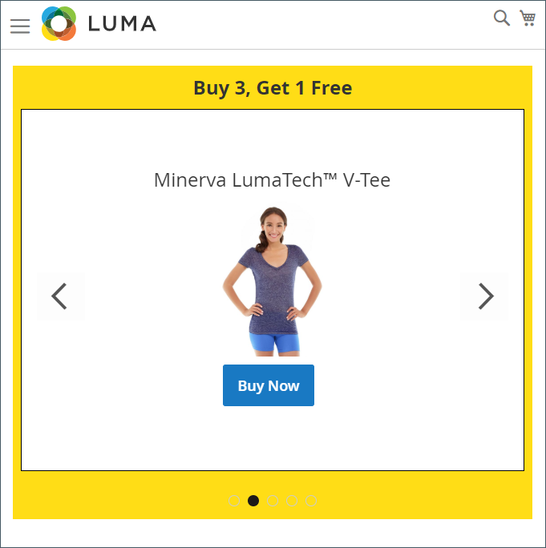{width="400" zoomable="yes"}

<!-- Last updated from includes: 2023-09-11 14:30:19 -->
