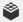
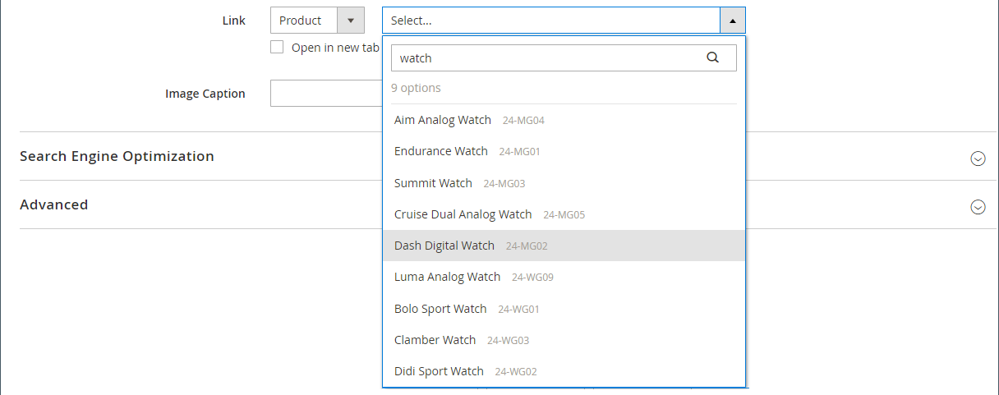

# メディア – スライダー

の使用 _Slider_ に画像のスライドショーを追加するためのコンテンツタイプ [[!DNL Page Builder] ステージ](workspace.md#stage). 新しい画像をアップロードしたり、ギャラリーや製品カタログから既存の画像を選択したりできます。 スライダーは、自動的に再生するように設定することも、ナビゲーションボタンを使用して手動で制御することもできます。 スライダーを特定のプロモーションに関連付けるには、を参照してください。 [動的ブロック](dynamic-block.md).

{width="700" zoomable="yes"}

{{$include /help/_includes/page-builder-save-timeout.md}}

## ツールボックス

Slider コンテンツ タイプを使用する場合は、個々のスライドと、1 つ以上のスライドを保持するスライダ コンテナを追加および編集します。 各スライドには、スライドのデザインに使用する独自のツールボックスがあります [!DNL Page Builder] ステージ。

## 個別のスライド ツールボックス

{width="500" zoomable="yes"}

| ツール | アイコン | 説明 |
|--- |--- |--- |
| 移動 | {width="25"} | スライドをスライド上の別の位置に移動します。 |
| （ラベル） | スライド番号 | 現在のスライドの番号を識別します。 |
| 設定 | {width="25"} | を開きます _[!UICONTROL Edit Slide]_現在のスライドのプロパティを変更できるページ。 |
| 複製 | {width="25"} | 現在のスライドをコピーします。 |
| 削除 | {width="25"} | スライダーから現在のスライドを削除します。 |

{style="table-layout:auto"}

## スライダーツールボックス

| ツール | アイコン | 説明 |
|--- |--- |--- |
| 移動 | {width="25"} | スライダをステージ上の別の位置に移動します。 |
| （ラベル） | [!UICONTROL Slider] | スライダーコンテナを識別します。 |
| 設定 | {width="25"} | を開きます _[!UICONTROL Edit Slider]_このページで、ビデオとコンテナのプロパティを変更できます。 |
| Hide | {width="25"} | 現在のスライダを非表示にします。 |
| 表示 | {width="25"} | 非表示のスライダーを表示します。 |
| 複製 | {width="25"} | スライダのコピーを作成します。 |
| 削除 | {width="25"} | ステージからスライダーを削除します。 |

{style="table-layout:auto"}

{{$include /help/_includes/page-builder-hidden-element-note.md}}

## 個々のスライドの追加

1. スライダーを配置するページ、ブロック、またはダイナミック ブロックを開き、 **[!UICONTROL Content]** セクション。

1. が含まれる [!DNL Page Builder] パネル、展開 **[!UICONTROL Media]** をドラッグします。 **[!UICONTROL Slider]** ステージの行、列またはタブへのプレースホルダー。

   次の例では、行の背景色が黄色（`#fffd16`）に設定します。

   {width="600" zoomable="yes"}

   スライダーコンテナは、空のスライドが 1 つ表示されたステージに表示されます。

1. スライダーコンテナ内をクリックして、 [テキストエディター](../content-design/editor.md) そして、最初のスライドのコンテンツを入力します。

   を使用して、より複雑なバナーコンテンツを含めることもできます [コンテンツ](#content) 設定。

1. スライダーの下部にあるナビゲーションドットをクリックして、個々のスライドのツールボックスを表示し、 _設定_ （ {width="20"} ） アイコンをクリックします。

   スライダには 2 つのツールボックスがあります。 下部のスライドツールボックスを使用していることを確認します。

1. 必要に応じて、次の節に従って設定を行います。

   - [[!UICONTROL Appearance]](#appearance)
   - [[!UICONTROL Background]](#background)
   - [[!UICONTROL Content]](#content)
   - [[!UICONTROL Search Engine Optimization]](#seo)
   - [[!UICONTROL Advanced]](#advanced)

1. 完了したら、 **[!UICONTROL Save]** 設定を適用し、 [!DNL Page Builder] ワークスペース。

## さらにスライドを追加

次の節では、個々のスライドから始めて、特定の製品の機能とリンクを備えたレスポンシブスライダーを作成する一連の手順について説明します。 個別のスライドがまだない場合は、前の手順に従って個別のスライドをステージに追加します。

スライドを追加するには、次のいずれかの方法または組み合わせを使用します。

### 方法 1：既存のスライドを複製する

既に設定されているスライドを必要な設定で複製することで、時間を節約できます。

1. スライドの下にあるナビゲーションドットをクリックしてツールボックスを表示し、 _複製_ （ {width="20"} ） アイコンをクリックします。

   {width="500" zoomable="yes"}

1. 新しいスライドのナビゲーションドットをクリックしてツールボックスを表示し、 _設定_ （ {width="20"} ） アイコンをクリックします。

1. 必要に応じて、次の節に従って設定を変更します。

   - [[!UICONTROL Appearance]](#appearance)
   - [[!UICONTROL Background]](#background)
   - [[!UICONTROL Content]](#content)
   - [[!UICONTROL Advanced]](#advanced)

1. 完了したら、 **[!UICONTROL Save]** 設定を適用し、 [!DNL Page Builder] ワークスペース。

### 方法 2：新しい空のスライドを追加する

1. 上部のスライダーコンテナにカーソルを合わせてツールボックスを表示し、 _追加_ （ {width="20"} ） アイコンをクリックします。

   {width="500" zoomable="yes"}

   新しい空白のスライドがスライダーに追加され、独自のナビゲーション ドットとツールボックスがステージに表示されます。

   {width="500" zoomable="yes"}

1. 新しいスライドのナビゲーションドットをクリックしてツールボックスを表示し、 _設定_ （ {width="20"} ） アイコンをクリックします。

1. 必要に応じて、次の節に従って設定を変更します。

   - [[!UICONTROL Appearance]](#appearance)
   - [[!UICONTROL Background]](#background)
   - [[!UICONTROL Content]](#content)
   - [[!UICONTROL Advanced]](#advanced)

1. 完了したら、 **[!UICONTROL Save]** を閉じるために右上隅にある _[!UICONTROL Edit Slide]_ページ。

### スライドにウィジェットを追加

次のいずれかを追加できます [ウィジェットタイプ](../content-design/widgets.md#widget-types) をスライドに追加する [!DNL Page Builder] 次の手順を使用してステージングします。

1. [ウィジェットの作成](../content-design/widget-create.md) スライドに表示する内容。

1. スライダーを配置するページ、ブロック、またはダイナミック ブロックを開き、 **[!UICONTROL Content]** セクション。

1. が含まれる [!DNL Page Builder] パネル、展開 **[!UICONTROL Media]** をドラッグします。 **[!UICONTROL Slider]** ステージの行、列またはタブへのプレースホルダー。

1. スライダーコンテナ内をクリックして、 [テキストエディター](../content-design/editor.md) ツールバーで、 _ウィジェットを挿入_ （ {width="20"} ） アイコンをクリックします。

1. 「」を選択します **[!UICONTROL Widget Type]** あなたが必要とする。

1. ウィジェットのタイプによって異なる設定を指定します

   {width="600" zoomable="yes"}

1. 完了したら、 **[!UICONTROL Insert Widget]** 右上隅

1. 必要に応じて他の設定を変更します。

1. 完了したら、 **[!UICONTROL Save]** 右上隅

   {width="600" zoomable="yes"}

### 各スライドを表示

ステージ上に各スライドを表示するには、現在表示されているスライドの下にある次の点をクリックします。

{width="500" zoomable="yes"}

前の例のスライドには、背景画像、透明なモバイル画像、テキストエディターから追加されたインライン画像があります。 この手法は、モバイルデバイスで背景画像をオフにし、小さいインライン画像のみを表示する方法でよく機能します。 この例の製品スライドには、次の追加設定があります。

| オプション | 設定例 |
|--- |--- |
| [!UICONTROL Appearance] | `Collage Right` |
| [!UICONTROL Background Color] | `#ffffff` （白） |
| [!UICONTROL Background Image] | このスライドの画像は製品ページから保存され、ギャラリーにアップロードされました。 |
| [!UICONTROL Mobile Background Image] | モバイルの背景画像は、10 ピクセル角の透明な画像です。 モバイルに空白の画像を使用すると、標準の背景画像が非表示の画像に効果的に置き換わります。 |
| [!UICONTROL Background Size] | `Auto` |
| [!UICONTROL Message Text] | `Minerva LumaTech&trade; V-Tee` 挿入した画像を 40% の比率で拡大/縮小した場合（中央揃え） |
| [!UICONTROL Link] | `Product` |
| [!UICONTROL Show Button] | `Always` |
| [!UICONTROL Button Text] | `Buy Now` |
| [!UICONTROL Show Overlay] | `Never Show` |
| [!UICONTROL Alignment] | `Center` （ボタンを位置合わせするには） |
| [!UICONTROL Border] | `Solid` |
| [!UICONTROL Border Color] | `#000000` （黒） |
| [!UICONTROL Border Width] | `1 px` |

{style="table-layout:auto"}

## 個々のスライド設定の変更

1. ステージ上のスライダー表示を変更し、変更するスライドを表示します。

1. 個々のスライド ツールボックスで、 _設定_ （ {width="20"} ）アイコンをクリックし、必要に応じて、次の節に従って設定を行います。

1. 右上隅のをクリックします。 **[!UICONTROL Save]** 設定を適用し、 [!DNL Page Builder] ワークスペース。

### [!UICONTROL Appearance]

1. 次のいずれかのスライド配置タイプを選択します。

   | タイプ | 説明 |
   | ---- | ----------- |
   | `Poster` | スライドコンテンツをスライダーコンテナの中央に配置します。 オーバーレイを使用すると、スライダーの全幅が拡張されます。 |
   | `Collage Left` | スライダーコンテナの左側の定義済み領域にスライドコンテンツを配置します。 オーバーレイを使用すると、定義した領域のみがオーバーレイ対象になります。 |
   | `Collage Center` | スライダーコンテナの中央にある定義済み領域にスライドコンテンツを配置します。 オーバーレイを使用すると、定義した領域のみがオーバーレイ対象になります。 |
   | `Collage Right` | スライダーコンテナの右側の定義済み領域にスライドコンテンツを配置します。 オーバーレイを使用すると、定義した領域のみがオーバーレイ対象になります。 |

   {style="table-layout:auto"}

   {width="600" zoomable="yes"}

1. を入力 **[!UICONTROL Slide Name]**.

   編集モードで作業しているときは、ナビゲーションドットの上にスライド名がツールヒントとして表示されます。 スライド名は、ストアフロントからは表示されません。

   {width="500" zoomable="yes"}

1. を入力 **[!UICONTROL Minimum Height]** スライドの場合。

   最小の高さは、有効な任意の CSS 単位（など）を持つ数値にすることができます `100px`, `50%`, `50em`, `100vh`）または計算（など `100vh - 237px`）に設定します。

   例えば、ページの高さを最大にカバーするようにスライドの最小の高さを設定し、背景画像とビデオを使用して魅力的なデザインオプションを作成できます。

   >[!NOTE]
   >
   >スライドがページの高さ全体（100vh）に設定されている場合、スライドを含むスライダーもページの高さ全体をスライドの高さに合わせて伸縮します。

## [!UICONTROL Background]

スライドの背景表示を定義するには、多くのオプションがあります。 シンプルなカラーまたは背景画像を適用し、より高度な効果を管理できます。

### [!UICONTROL Background Color]

スウォッチを選択するか、カラーピッカーをクリックするか、有効なカラー名または同等の 16 進数値を入力して、背景色を指定します。 この設定により、行の背景色が決まります。 また、カラーの不透明度を調整することもできます。

{width="200"}

次の 3 つの方法のいずれかで値を設定できます。

- 事前定義済みのカラー名（など） `White`
- カラーの 16 進数値（例：） `#ffffff`
- 次のような、不透明度のパーセントを使用したカラーの rgba 値 `rgba(255, 255, 255, 0.75)`

カラーを選択する場合は、の左側にあるスウォッチをクリックします _カラーなし_ ボックス。

{width="600" zoomable="yes"}

カラーボックスをクリックして再度カラーピッカーを開くと、スライダの下のボックスに現在の赤、緑、青、アルファ値（rgba）が表示されます。 最後の数値は、現在の不透明度の割合を小数で示します。 スライダを使用して、不透明度を調整したり、必要な小数値を入力したりできます。

{width="600" zoomable="yes"}

>[!NOTE]
>
>[!DNL Page Builder] では、透明度レイヤーもサポートされています。 _アルファチャネル_：様々な不透明度の背景を作成するために使用できる背景画像。

### [!UICONTROL Background Type]

背景の種類は、画像またはビデオです。 [!DNL Page Builder] デフォルトは `Image` 様々な画像設定を表示します。 を選択する場合 `Video`, [!DNL Page Builder] 画像設定をビデオ設定にスワップします。 両方の背景タイプの設定について、次の節で説明します。

{width="400"}

### 画像タイプの設定

を設定した場合 _[!UICONTROL Background Type]_対象： `Image`以下の設定を使用して、背景画像の表示を定義します。

{width="600" zoomable="yes"}

- **[!UICONTROL Background Image]**  – 必要に応じて、提供されたツールを使用してバナーに適用する背景画像を選択します。

  | ツール | 説明 |
  | ---- | ----------- |
  | [!UICONTROL Upload] | ローカルコンピューターからギャラリーに画像ファイルをアップロードし、それをバナーの背景画像として適用します。 |
  | [!UICONTROL Select from Gallery] | バナーの背景画像として、ギャラリーから既存の画像を選択するように求めるプロンプトを表示します。 |
  | {width="25"} | 画像をカメラタイルにドラッグするか、ローカルファイルシステム内の画像を参照できます。 |

  {style="table-layout:auto"}

- **[!UICONTROL Background Mobile Image]**  – 必要に応じて、同じツールを使用して、モバイルデバイスでの表示に使用する別の背景画像を選択します。

- **[!UICONTROL Background Size]** - バナーの幅に対する背景画像の拡大縮小の方法を選択します。

  | オプション | 説明 |
  | ------ | ----------- |
  | `Cover` | 背景画像はバナーの全幅をカバーしています。 |
  | `Contain` | 背景画像は、コンテンツ領域の幅に制限されます。 |
  | `Auto` | 現在のスタイル シートからサイズを適用します。 |

  {style="table-layout:auto"}

  {width="400"}

- **[!UICONTROL Background Position]** - バナーに対する背景画像のアンカー方法を選択します。

  | アンカーポイント | 位置 |
  | ------------ | -------- |
  | `Top` | 左/中央/右 |
  | `Center` | 左/中央/右 |
  | `Bottom` | 左/中央/右 |

  {style="table-layout:auto"}

  アンカーポイントは、プッシュピンのようなもので、指定した背景位置で画像をバナーにアタッチします。

- **[!UICONTROL Background Repeat]**  – 背景画像をスペースいっぱいに繰り返す場合は、この設定を変更します `Yes`.

### ビデオタイプの設定

を設定した場合 _背景の種類_ 対象： `Video`以下の設定を使用して、背景画像の表示を定義します。

- **[!UICONTROL Video URL]**  – 有効なビデオ URL を入力します。 有効なビデオ URL は、次へのリンクです。

   - YouTube ビデオ： `https://youtu.be/CoDhMRUUjeI`
   - Vimeo 動画： `https://vimeo.com/190156113`
   - 有効なビデオファイル （`.mp4` 推奨）: `https://myvideos.com/spiral.mp4`

  {width="500"}

- **[!UICONTROL Overlay Color]** - ビデオに透明な色合いを適用するカラーを選択します。

- **[!UICONTROL Infinite Loop]**  – に設定 `No` ビデオを一度再生して停止します。 このオプションを `Yes` （デフォルト）ビデオは無限ループで繰り返されます。

- **[!UICONTROL Lazy Load]**  – に設定 `No` 表示されていない場合でも、ビデオをページと共に読み込むことができるようにする。 このオプションを `Yes` （デフォルト）ソースからビデオが読み込まれるのは、画面に表示されている場合のみです。

- **[!UICONTROL Play Only When Visible]**  – に設定 `No` ビデオが表示されているかどうかに関係なく、ビデオの読み込み直後に再生を開始します。 このオプションを `Yes` （デフォルト）ビデオは、表示されている場合にのみ再生を開始します。

- **[!UICONTROL Fallback Image]**  – 必要に応じて、ビデオが読み込まれる前および何らかの理由でビデオが読み込まれない場合に、画面に表示する画像を指定します。

## [!UICONTROL Content]

スライドコンテンツは、ステージ上で直接変更することも、設定を変更する場合に変更することもできます。 設定では、スライドリンク、ボタン、オーバーレイなど、より複雑なコンテンツ機能が提供されます。 コンテンツの位置には、 [外観](#appearance) プレースメントの設定。

### ステージ上のシンプルなコンテンツ

1. プレースホルダーまたは既存のテキストをクリックし、スライドに表示する新しいテキストを入力します。

   テキストボックスの上にエディターツールバーが表示されます。

1. エディターツールバーを使用して、テキストの入力や書式設定のほか、リンク、画像、ウィジェットなどの要素を挿入します。

   {width="500" zoomable="yes"}

### 設定の複雑なコンテンツ

1. スライダーの下部にあるナビゲーションドットをクリックして、個々のスライドのツールボックスを表示し、 _設定_ （ {width="20"} ） アイコンをクリックします。

1. が含まれる _[!UICONTROL Content]_「」セクションに、**[!UICONTROL Message Text]**スライドと共に表示する。

1. にスクロール ダウンします。 _[!UICONTROL Content]_セクションと使用&#x200B;**[!UICONTROL Message Text]**バナーテキストを入力および書式設定するエディターです。

   テキストリンク、画像、ウィジェットなどの要素を挿入することもできます。

1. 必要に応じて、エディターツールバーを使用してテキストを書式設定します。

   この例の最初のスライドには背景画像がありますが、メッセージ テキストはありません。 この `Buy 3 Get 1 Free` スライダーの上のテキストはテキストコンテナ内にあります（後で追加）。

1. 必要に応じて、 **[!UICONTROL Link]** スライドの場合。

   リンクは、顧客がスライド領域をクリックすると表示される宛先ページです。 次の 3 つのリンクタイプのいずれかを使用できます。

   - **[!UICONTROL URL]**  – 相対 URL または完全修飾 URL へのリンク。

   - **[!UICONTROL Product]**  – 製品名または SKU に基づいて宛先ページを識別します。 部分的または完全な名前に基づいて、名前で製品を検索します。 検索結果リストから製品を選択します。

     {width="600" zoomable="yes"}

   - **[!UICONTROL Category]**  – 宛先ページをカテゴリツリー内の特定のカテゴリまたはサブカテゴリとして識別します。 名前の一部または全部に基づいてカテゴリを検索します。 表示されたツリーの展開セクションからカテゴリを選択します。

     {width="600" zoomable="yes"}

   - **[!UICONTROL Page]**  – 宛先ページを特定のコンテンツページとして識別します。 名前の一部または全部に基づいてページを検索します。 検索結果リストからページを選択します。

     {width="600" zoomable="yes"}

   

   2.4.1 リリース以降、 [!DNL Page Builder] ストアフロントでの表示に関する問題により、では、スライドとネストされたテキスト内のリンクのリンクをサポートしなくなりました。 _でリンクを使用している場合[!UICONTROL Message Text]_、_は設定できません[!UICONTROL Link]_個のオプション。 スライド全体に 1 つのリンクを使用する場合は、テキストからすべてのリンクを削除できます。

   {width="300"}
   

   訪問者がストアから移動できないようにするには、 **[!UICONTROL Open in new tab]** チェックボックス。 このチェックボックスをオフにすると、リンクされた宛先は同じブラウザータブで開くので、訪問者をストアから効果的に移動できます。

1. 必要に応じて、リンクをたどるように顧客に促すボタンを追加します。

   スライド _外観_ 「位置」を指定すると、テキストの下に 1 つのリンクまたはボタンが配置されます。 追加するリンクまたはボタンのプロパティを入力します。

   {width="600" zoomable="yes"}

   >[!NOTE]
   >
   >を追加して、複数のボタンやリンクを使用することもできます。 [ブロック](block.md) をバナーに追加します。 競合を避けるために、すべてのリンクまたはボタンを個別のブロックに保持し、リンクまたはボタンをバナーに直接追加しないでください。

   - を設定 **[!UICONTROL Show Button]** を次のいずれかに変更します。

     | オプション | 説明 |
     | ------ | ----------- |
     | `Always` | ボタンは常にスライドに表示されます。 |
     | `On Hover` | ボタンは、マウスポインターを置いたときにのみスライドに表示されます。 |
     | `Never Show` | ボタンはスライドに表示されません。 |

     {style="table-layout:auto"}

   - を入力 **[!UICONTROL Button Text]** をクリックしてボタンに表示します。

   - を設定 **[!UICONTROL Button Type]** を次のいずれかに変更します。

     | オプション | 説明 |
     | ------ | ----------- |
     | `Primary` | 現在のスタイル シートからプライマリ ボタン スタイルを適用します。 |
     | `Secondary` | 現在のスタイル シートからセカンダリ ボタン スタイルを適用します（該当する場合）。 |
     | `Link` | ボタンではなくハイパーリンクを作成します。 |

     {style="table-layout:auto"}

     現在のテーマのボタンのスタイルによって、ボタンの形式が決まります。 通常、プライマリボタンの背景色は、セカンダリボタンの背景色よりも目立ちます。

1. を設定 **[!UICONTROL Show Overlay]** を次のいずれかに変更します。

   | オプション | 説明 |
   | ------ | ----------- |
   | `Always` | オーバーレイは常に表示されます。 |
   | `On Hover` | オーバーレイは、カーソルを合わせたときにのみ表示されます。 |
   | `Never Show` | オーバーレイが表示されません。 |

   {style="table-layout:auto"}

   オーバーレイを使用して、アピアランス設定で定義されたアクティブなコンテンツ領域に背景色を適用できます。 スライドの背景画像は、スライドの幅全体に対して表示されたままになります。

   {width="600" zoomable="yes"}

   オーバーレイの表示を選択した場合は、 **[!UICONTROL Overlay Color]**:

   - 「」をクリックします _カラーなし_ スウォッチを選択し、スウォッチを選択します。
   - が含まれる **[!UICONTROL Color]** フィールドに、有効なカラー名または 16 進数値を入力します。

   {width="600" zoomable="yes"}

## [!UICONTROL Search Engine Optimization] {#seo}

これらの設定のテキストは、検索エンジンに表示され、ページのインデックス作成方法が改善されます。

- の場合 **[!UICONTROL Alternative Text]**、を入力 _alt_ 表示するデジタルアクセシビリティツールのテキスト説明。

  代替テキストの使用は、アクセシビリティのベストプラクティスであり、一部のロケールでは法律で義務付けられています。 HTMLでは、 `alt` attribute は、のサブセットです。 `image` タグ : `<image title="tooltip" alt="description" src="image.jpg">`.

- の場合 **[!UICONTROL Title Attribute]**&#x200B;マウスオーバーしたときにツールヒントとして表示するテキストを入力します。

  ベストプラクティスとして、説明的でキーワードの多いタイトルを選択すると、検索エンジンによる画像のインデックス作成方法が改善されます。 HTMLでは、 `title` attribute は、のサブセットです。 `image` タグ : `<image title="tooltip" alt="description" src="image.jpg">`.

## [!UICONTROL Advanced]

1. スライドに追加されるコンテンツの水平方向の位置を制御するには、 **[!UICONTROL Alignment]**:

   | オプション | 説明 |
   | ------ | ----------- |
   | `Default` | 現在のテーマのスタイル シートで指定されている線形の既定の設定を適用します。 |
   | `Left` | 指定したパディングに対する許容値を使用して、スライドの左境界線に沿ってコンテンツを揃えます。 |
   | `Center` | 指定したパディングに対する許容値を使用して、コンテンツをスライドの中央に揃えます。 |
   | `Right` | 指定したパディングに対する許容値を使用して、スライドの右端に沿ってコンテンツを配置します。 |

   {style="table-layout:auto"}

1. を **[!UICONTROL Border]** スライドの 4 つの辺すべてに適用するスタイル：

   | オプション | 説明 |
   | ------ | ----------- |
   | `Default` | 関連付けられたスタイル シートで指定されている既定の罫線スタイルを適用します。 |
   | `None` | スライドの境界線が見えるようには表示されません。 |
   | `Dotted` | コンテナの境界線は点線で表示されます。 |
   | `Dashed` | コンテナの境界線は破線で表示されます。 |
   | `Solid` | コンテナの境界線は実線で表示されます。 |
   | `Double` | コンテナの境界線は二重線で表示されます。 |
   | `Groove` | コンテナの境界線は溝付き線で表示されます。 |
   | `Ridge` | コンテナの境界線は、境界線として表示されます。 |
   | `Inset` | コンテナの境界線は、インセットされた線として表示されます。 |
   | `Outset` | コンテナの境界線は、先頭行として表示されます。 |

   {style="table-layout:auto"}

1. 境界線のスタイルを `None`の場合は、次のボーダー表示オプションを入力します。

   {width="600" zoomable="yes"}

   | オプション | 説明 |
   | ------ |------------ |
   | [!UICONTROL Border Color] | 見本を選択するか、カラーピッカーをクリックするか、有効なカラー名または同等の 16 進数値を入力して、カラーを指定します。 |
   | [!UICONTROL Border Width] | 境界線の幅のピクセル数を入力します。 |
   | [!UICONTROL Border Radius] | ピクセル数を入力して、境界線の各コーナーを丸めるために使用する半径のサイズを定義します。 |

   {style="table-layout:auto"}

1. （オプション）の名前を指定します **[!UICONTROL CSS classes]** スライドに適用する現在のスタイルシートから。

   複数のクラス名はスペースで区切ります。

1. 次の値をピクセル単位で入力 **[!UICONTROL Margins and Padding]** スライドの外側の余白と内側のパディングを指定します。

   スライド図に対応する値を入力します。

   | コンテナ領域 | 説明 |
   | -------------- | ----------- |
   | [!UICONTROL Margins] | スライドのすべての辺の外側の端に適用される空白の領域の量です。 |
   | [!UICONTROL Padding] | スライドのすべての辺の内側の端に適用される空白の領域の量です。 |

   {style="table-layout:auto"}

## スライダータイトルを追加

スライダーの上にタイトルを表示するには、 [テキストコンテンツタイプ] スライダーの上。 次に、必要に応じてテキストの書式を設定します。

1. が含まれる [!DNL Page Builder] パネル、展開 **[!UICONTROL Elements]** をドラッグします。 **テキスト** ステージ上の行、列またはタブセットへのプレースホルダー。

   ドラッグすると、スライダーの上の挿入点に赤いガイドラインが表示されます。

   {width="600" zoomable="yes"}

1. エディターを使用して、必要に応じてテキストを書式設定します。

   {width="500" zoomable="yes"}

## スライダー設定の変更

1. スライダーコンテナにカーソルを合わせて主なツールボックスを表示し、 _設定_ （ {width="20"} ） アイコンをクリックします。

   {width="500" zoomable="yes"}

1. を入力 **[!UICONTROL Minimum Height]** スライドの場合。

   最小の高さは、有効な任意の CSS 単位（など）を持つ数値にすることができます `100px`, `50%`, `50em`, `100vh`）または計算（など `100vh - 237px`）に設定します。

   例えば、スライダーの最小の高さを設定して、ページの完全な高さを伸ばすことができ、完全なページの背景画像やビデオに魅力的なオプションを提供できます。

   {width="400"}

1. ページが読み込まれたときにスライダーを開始する場合は、次のように設定します **[!UICONTROL Autoplay]** 対象： `Yes` およびを設定 **[!UICONTROL Autoplay Speed]** スライド間の遅延（ミリ秒単位）です。

   デフォルトでは、速度は 4,000 ミリ秒に設定されています。これは 4 秒です。 自動再生をに設定した場合 `No`の場合、デフォルトでは最初のスライドが表示されますが、次のスライドを順番に表示するには、ユーザーがスライドナビゲーション（ドットまたは矢印）をクリックする必要があります。

   {width="600" zoomable="yes"}

1. スライド間のトランジションをスムーズにするには、を設定します **[!UICONTROL Fade]** 対象： `Yes`.

   フェードを適用すると、スライドは元の位置に表示されますが、コンテンツはスムーズに切り替わります。 フェードを使用しない場合は、スライド間の水平方向の移動が表示されます。

   {width="600" zoomable="yes"}

1. ページが開いている間にスライドショーを無限に繰り返すには、次のように設定します **[!UICONTROL Infinite Loop]** 対象： `Yes`.

1. スライダーのナビゲーション コントロールの種類を選択するには、次の操作を行います。

   - 次を含める _次_ および _前へ_ 各スライドの左右にある矢印を設定 **[!UICONTROL Show Arrows]** 対象： `Yes`.

   - スライダーの下に一連のナビゲーションドットを含めるには、次のように設定します **[!UICONTROL Show Dots]** 対象： `Yes`.

   {width="600" zoomable="yes"}

1. を完了する [詳細](#slider-advanced) 必要に応じてスライダを設定します。

1. 完了したら、 **[!UICONTROL Save]** 設定を適用し、 [!DNL Page Builder] ワークスペース。

### 詳細 – スライダー {#slider-advanced}

1. 親スライダーコンテナ内のスライドの位置を制御するには、 **[!UICONTROL Alignment]**:

   | オプション | 説明 |
   | ------ | ----------- |
   | `Default` | 現在のテーマのスタイル シートで指定されている線形の既定の設定を適用します。 |
   | `Left` | スライダーコンテナの左境界線に沿ってスライドを配置します。指定したパディングに対する許容値を使用します。 |
   | `Center` | スライダーコンテナの中央にスライドを揃えます。指定したパディングに対する許容値を使用します。 |
   | `Right` | スライダーコンテナの右端に沿ってスライドを配置します。指定したパディングに対する許容値を使用します。 |

   {style="table-layout:auto"}

1. を **[!UICONTROL Border]** スライダーコンテナの 4 つの側面すべてに適用されるスタイル：

   | オプション | 説明 |
   | ------ | ----------- |
   | `Default` | 関連付けられたスタイル シートで指定されている既定の罫線スタイルを適用します。 |
   | `None` | コンテナの境界線の表示はしません。 |
   | `Dotted` | コンテナの境界線は点線で表示されます。 |
   | `Dashed` | コンテナの境界線は破線で表示されます。 |
   | `Solid` | コンテナの境界線は実線で表示されます。 |
   | `Double` | コンテナの境界線は二重線で表示されます。 |
   | `Groove` | コンテナの境界線は溝付き線で表示されます。 |
   | `Ridge` | コンテナの境界線は、境界線として表示されます。 |
   | `Inset` | コンテナの境界線は、インセットされた線として表示されます。 |
   | `Outset` | コンテナの境界線は、先頭行として表示されます。 |

   {style="table-layout:auto"}

1. 境界線のスタイルを `None`の場合は、次のボーダー表示オプションを入力します。

   | オプション | 説明 |
   | ------ |------------ |
   | [!UICONTROL Border Color] | 見本を選択するか、カラーピッカーをクリックするか、有効なカラー名または同等の 16 進数値を入力して、カラーを指定します。 |
   | [!UICONTROL Border Width] | 境界線の幅のピクセル数を入力します。 |
   | [!UICONTROL Border Radius] | ピクセル数を入力して、境界線の各コーナーを丸めるために使用する半径のサイズを定義します。 |

   {style="table-layout:auto"}

1. （オプション）の名前を指定します **[!UICONTROL CSS classes]** を現在のスタイルシートから取得して、スライダーコンテナに適用します。

   複数のクラス名はスペースで区切ります。

1. 次の値をピクセル単位で入力 **[!UICONTROL Margins and Padding]** スライダーコンテナの外側の余白と内側のパディングを決定します。

   対応する値を図に入力します。

   | コンテナ領域 | 説明 |
   | -------------- | ----------- |
   | [!UICONTROL Margins] | コンテナのすべての側面の外側の端に適用される空白スペースの量。 |
   | [!UICONTROL Padding] | コンテナのすべての側面の内側の端に適用される空白のスペースの量です。 |

   {style="table-layout:auto"}

## スライダーのテスト

1. スライダーを含めたページを開き、次のように設定します **[!UICONTROL Enable Page]** 対象： `Yes`.

1. 右上隅のをクリックします **[!UICONTROL Save]** 矢印と選択 **[!UICONTROL Save & Close]**.

1. でページを検索します。 _ページ_ グリッドと選択 **[!UICONTROL View]** が含まれる _[!UICONTROL Action]_列。

   {width="600" zoomable="yes"}

   スライダーをプレビューする場合は、モバイルデバイスでの表示を確認できるように、ウィンドウのサイズを変更します。

   {width="400" zoomable="yes"}
