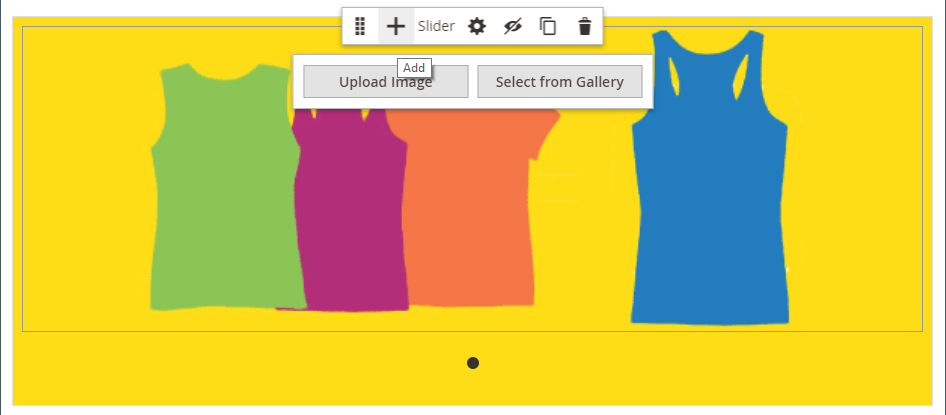
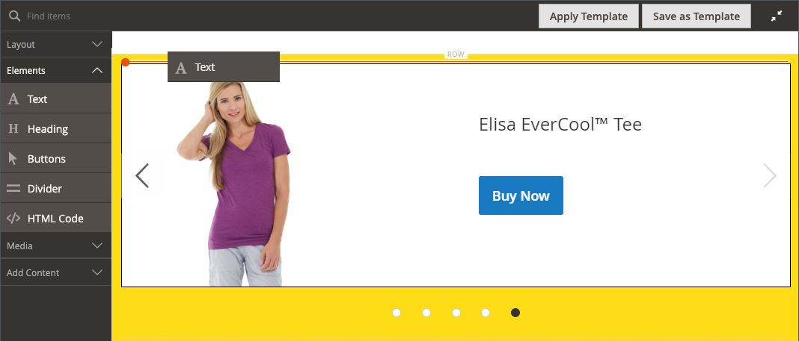
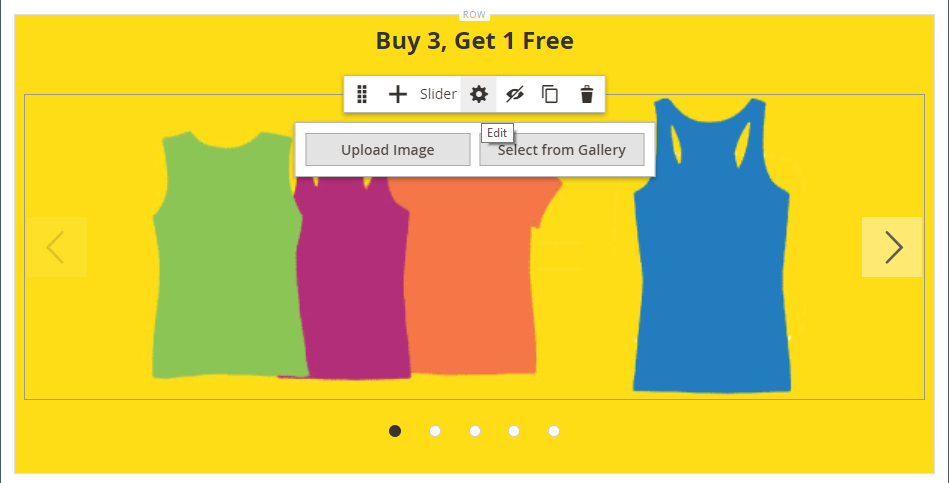

# メディア – スライダー

_Slider_ コンテンツタイプを使用して、[[!DNL Page Builder] stage](workspace.md#stage) に画像のスライドショーを追加します。 新しい画像をアップロードしたり、ギャラリーや製品カタログから既存の画像を選択したりできます。 スライダーは、自動的に再生するように設定することも、ナビゲーションボタンを使用して手動で制御することもできます。 スライダーを特定のプロモーションに関連付けるには、[ ダイナミックブロック ](dynamic-block.md) を参照してください。

{width="700" zoomable="yes"}

{{$include /help/_includes/page-builder-save-timeout.md}}

## ツールボックス

Slider コンテンツ タイプを使用する場合は、個々のスライドと、1 つ以上のスライドを保持するスライダ コンテナを追加および編集します。 スライドごとに専用のツールボックスがあり、[!DNL Page Builder] のステージでスライドをデザインするのに使用します。

## 個別のスライド ツールボックス

{width="500" zoomable="yes"}

| ツール | アイコン | 説明 |
|--- |--- |--- |
| 移動 | {width="25"} | スライドをスライド上の別の位置に移動します。 |
| （ラベル） | スライド番号 | 現在のスライドの番号を識別します。 |
| 設定 | {width="25"} | _[!UICONTROL Edit Slide]_&#x200B;ページを開きます。このページで、現在のスライドのプロパティを変更できます。 |
| 複製 | {width="25"} | 現在のスライドをコピーします。 |
| 削除 | {width="25"} | スライダーから現在のスライドを削除します。 |

{style="table-layout:auto"}

## スライダーツールボックス

| ツール | アイコン | 説明 |
|--- |--- |--- |
| 移動 | {width="25"} | スライダをステージ上の別の位置に移動します。 |
| （ラベル） | [!UICONTROL Slider] | スライダーコンテナを識別します。 |
| 設定 | {width="25"} | _[!UICONTROL Edit Slider]_&#x200B;ページが開き、ビデオとコンテナのプロパティを変更できます。 |
| Hide | {width="25"} | 現在のスライダを非表示にします。 |
| 表示 | {width="25"} | 非表示のスライダーを表示します。 |
| 複製 | {width="25"} | スライダのコピーを作成します。 |
| 削除 | {width="25"} | ステージからスライダーを削除します。 |

{style="table-layout:auto"}

{{$include /help/_includes/page-builder-hidden-element-note.md}}

## 個々のスライドの追加

1. スライダーを配置するページ、ブロック、またはダイナミック ブロックを開き、[**[!UICONTROL Content]**] セクションを展開します。

1. [!DNL Page Builder] パネルで **[!UICONTROL Media]** を展開し、**[!UICONTROL Slider]** プレースホルダーをステージの行、列、タブにドラッグします。

   次の例では、行の背景色は黄色（`#fffd16`）です。

   {width="600" zoomable="yes"}

   スライダーコンテナは、空のスライドが 1 つ表示されたステージに表示されます。

1. スライダーコンテナ内をクリックして [ テキストエディター ](../content-design/editor.md) を表示し、最初のスライドのコンテンツを入力します。

   [ コンテンツ ](#content) 設定を使用して、より複雑なバナーコンテンツを含めることもできます。

1. スライダーの下部にあるナビゲーションドットをクリックして、個々のスライドのツールボックスを表示し、_設定_ （{width="20"}）アイコンを選択します。

   スライダには 2 つのツールボックスがあります。 下部のスライドツールボックスを使用していることを確認します。

1. 必要に応じて、次の節に従って設定を行います。

   - [[!UICONTROL Appearance]](#appearance)
   - [[!UICONTROL Background]](#background)
   - [[!UICONTROL Content]](#content)
   - [[!UICONTROL Search Engine Optimization]](#seo)
   - [[!UICONTROL Advanced]](#advanced)

1. 完了したら、「**[!UICONTROL Save]**」をクリックして設定を適用し、[!DNL Page Builder] ワークスペースに戻ります。

## さらにスライドを追加

次の節では、個々のスライドから始めて、特定の製品の機能とリンクを備えたレスポンシブスライダーを作成する一連の手順について説明します。 個別のスライドがまだない場合は、前の手順に従って個別のスライドをステージに追加します。

スライドを追加するには、次のいずれかの方法または組み合わせを使用します。

### 方法 1：既存のスライドを複製する

既に設定されているスライドを必要な設定で複製することで、時間を節約できます。

1. スライドの下にあるナビゲーションドットをクリックしてツールボックスを表示し、_複製_ （{width="20"}）アイコンを選択します。

   {width="500" zoomable="yes"}

1. 新しいスライドのナビゲーションドットをクリックしてツールボックスを表示し、_設定_ （{width="20"}）アイコンを選択します。

1. 必要に応じて、次の節に従って設定を変更します。

   - [[!UICONTROL Appearance]](#appearance)
   - [[!UICONTROL Background]](#background)
   - [[!UICONTROL Content]](#content)
   - [[!UICONTROL Advanced]](#advanced)

1. 完了したら、「**[!UICONTROL Save]**」をクリックして設定を適用し、[!DNL Page Builder] ワークスペースに戻ります。

### 方法 2：新しい空のスライドを追加する

1. 上部のスライダーコンテナにマウスポインターを置いてツールボックスを表示し、「_追加_」（{width="20"}）アイコンを選択します。

   {width="500" zoomable="yes"}

   新しい空白のスライドがスライダーに追加され、独自のナビゲーション ドットとツールボックスがステージに表示されます。

   {width="500" zoomable="yes"}

1. 新しいスライドのナビゲーションドットをクリックしてツールボックスを表示し、_設定_ （{width="20"}）アイコンを選択します。

1. 必要に応じて、次の節に従って設定を変更します。

   - [[!UICONTROL Appearance]](#appearance)
   - [[!UICONTROL Background]](#background)
   - [[!UICONTROL Content]](#content)
   - [[!UICONTROL Advanced]](#advanced)

1. 完了したら、右上隅の「**[!UICONTROL Save]**」をクリックして、_[!UICONTROL Edit Slide]_&#x200B;ページを閉じます。

### スライドにウィジェットを追加

次の手順を使用して、[ のステージのスライドに任意の ](../content-design/widgets.md#widget-types) ウィジェットタイプ [!DNL Page Builder] を追加できます。

1. スライドに表示する [ ウィジェットを作成 ](../content-design/widget-create.md) します。

1. スライダーを配置するページ、ブロック、またはダイナミック ブロックを開き、[**[!UICONTROL Content]**] セクションを展開します。

1. [!DNL Page Builder] パネルで **[!UICONTROL Media]** を展開し、**[!UICONTROL Slider]** プレースホルダーをステージの行、列、タブにドラッグします。

1. スライダーコンテナ内をクリックして [ テキストエディター ](../content-design/editor.md) ツールバーを表示し、_ウィジェットを挿入_ （{width="20"}）アイコンをクリックします。

1. 必要な **[!UICONTROL Widget Type]** を選択します。

1. ウィジェットのタイプによって異なる設定を指定します

   {width="600" zoomable="yes"}

1. 完了したら、右上隅の「**[!UICONTROL Insert Widget]**」をクリックします。

1. 必要に応じて他の設定を変更します。

1. 完了したら、右上隅の「**[!UICONTROL Save]**」をクリックします。

   {width="600" zoomable="yes"}

### 各スライドを表示

ステージ上に各スライドを表示するには、現在表示されているスライドの下にある次の点をクリックします。

{width="500" zoomable="yes"}

前の例のスライドには、背景画像、透明なモバイル画像、テキストエディターから追加されたインライン画像があります。 この手法は、モバイルデバイスで背景画像をオフにし、小さいインライン画像のみを表示する方法でよく機能します。 この例の製品スライドには、次の追加設定があります。

| オプション | 設定例 |
|--- |--- |
| [!UICONTROL Appearance] | `Collage Right` |
| [!UICONTROL Background Color] | `#ffffff` （白） |
| [!UICONTROL Background Image] | このスライドの画像は製品ページから保存され、ギャラリーにアップロードされました。 |
| [!UICONTROL Mobile Background Image] | モバイルの背景画像は、10 ピクセル角の透明な画像です。 モバイルに空白の画像を使用すると、標準の背景画像が非表示の画像に効果的に置き換わります。 |
| [!UICONTROL Background Size] | `Auto` |
| [!UICONTROL Message Text] | 挿入した画像を 40% の比率で拡大/縮小した `Minerva LumaTech&trade; V-Tee` （中央揃え） |
| [!UICONTROL Link] | `Product` |
| [!UICONTROL Show Button] | `Always` |
| [!UICONTROL Button Text] | `Buy Now` |
| [!UICONTROL Show Overlay] | `Never Show` |
| [!UICONTROL Alignment] | `Center` （ボタンの位置揃え） |
| [!UICONTROL Border] | `Solid` |
| [!UICONTROL Border Color] | `#000000` （黒） |
| [!UICONTROL Border Width] | `1 px` |

{style="table-layout:auto"}

## 個々のスライド設定の変更

1. ステージ上のスライダー表示を変更し、変更するスライドを表示します。

1. 個々のスライドツールボックスで、_設定_ （{width="20"}）アイコンを選択し、必要に応じて、次の節に従って設定を完了します。

1. 右上隅にある「**[!UICONTROL Save]**」をクリックして設定を適用し、[!DNL Page Builder] ワークスペースに戻ります。

### [!UICONTROL Appearance]

1. 次のいずれかのスライド配置タイプを選択します。

   | タイプ | 説明 |
   | ---- | ----------- |
   | `Poster` | スライドコンテンツをスライダーコンテナの中央に配置します。 オーバーレイを使用すると、スライダーの全幅が拡張されます。 |
   | `Collage Left` | スライダーコンテナの左側の定義済み領域にスライドコンテンツを配置します。 オーバーレイを使用すると、定義した領域のみがオーバーレイ対象になります。 |
   | `Collage Center` | スライダーコンテナの中央にある定義済み領域にスライドコンテンツを配置します。 オーバーレイを使用すると、定義した領域のみがオーバーレイ対象になります。 |
   | `Collage Right` | スライダーコンテナの右側の定義済み領域にスライドコンテンツを配置します。 オーバーレイを使用すると、定義した領域のみがオーバーレイ対象になります。 |

   {style="table-layout:auto"}

   {width="600" zoomable="yes"}

1. **[!UICONTROL Slide Name]** を入力します。

   編集モードで作業しているときは、ナビゲーションドットの上にスライド名がツールヒントとして表示されます。 スライド名は、ストアフロントからは表示されません。

   {width="500" zoomable="yes"}

1. スライドの **[!UICONTROL Minimum Height]** を入力します。

   最小の高さは、有効な CSS 単位（`100px`、`50%`、`50em`、`100vh` など）または計算（`100vh - 237px` など）を含む数値です。

   例えば、ページの高さを最大にカバーするようにスライドの最小の高さを設定し、背景画像とビデオを使用して魅力的なデザインオプションを作成できます。

   >[!NOTE]
   >
   >スライドがページの高さ全体（100vh）に設定されている場合、スライドを含むスライダーもページの高さ全体をスライドの高さに合わせて伸縮します。

## [!UICONTROL Background]

スライドの背景表示を定義するには、多くのオプションがあります。 シンプルなカラーまたは背景画像を適用し、より高度な効果を管理できます。

### [!UICONTROL Background Color]

スウォッチを選択するか、カラーピッカーをクリックするか、有効なカラー名または同等の 16 進数値を入力して、背景色を指定します。 この設定により、行の背景色が決まります。 また、カラーの不透明度を調整することもできます。

{width="200"}

次の 3 つの方法のいずれかで値を設定できます。

- 定義済みのカラー名（`White` など）
- カラーの 16 進数カラー値（例：`#ffffff`）
- カラーの rgba 値（不透明度の割合）（`rgba(255, 255, 255, 0.75)` など）。

カラーを選択する場合は、「カラーなし _ボックスの左側にあるスウォッチをクリックし_ す。

{width="600" zoomable="yes"}

カラーボックスをクリックして再度カラーピッカーを開くと、スライダの下のボックスに現在の赤、緑、青、アルファ値（rgba）が表示されます。 最後の数値は、現在の不透明度の割合を小数で示します。 スライダを使用して、不透明度を調整したり、必要な小数値を入力したりできます。

{width="600" zoomable="yes"}

>[!NOTE]
>
>[!DNL Page Builder] では、背景画像に透明度レイヤー（_アルファチャンネル_ を含めることもできます。このレイヤーを使用して、様々な不透明度の背景を作成できます。

### [!UICONTROL Background Type]

背景の種類は、画像またはビデオです。 デフォルト [!DNL Page Builder]`Image` で、様々な画像設定が表示されます。 `Video` を選択すると、[!DNL Page Builder] は画像設定をビデオ設定にスワップします。 両方の背景タイプの設定について、次の節で説明します。

{width="400"}

### 画像タイプの設定

_[!UICONTROL Background Type]_&#x200B;を `Image` に設定した場合は、次の設定を使用して背景画像の表示を定義します。

{width="600" zoomable="yes"}

- **[!UICONTROL Background Image]** – 必要に応じて、用意されているツールを使用してバナーに適用する背景画像を選択します。

  | ツール | 説明 |
  | ---- | ----------- |
  | [!UICONTROL Upload] | ローカルコンピューターからギャラリーに画像ファイルをアップロードし、それをバナーの背景画像として適用します。 |
  | [!UICONTROL Select from Gallery] | バナーの背景画像として、ギャラリーから既存の画像を選択するように求めるプロンプトを表示します。 |
  | {width="25"} | 画像をカメラタイルにドラッグするか、ローカルファイルシステム内の画像を参照できます。 |

  {style="table-layout:auto"}

- **[!UICONTROL Background Mobile Image]** – 必要に応じて、同じツールを使用して、モバイルデバイスでの表示に使用する別の背景画像を選択します。

- **[!UICONTROL Background Size]** - バナーの幅に対する背景画像の拡大縮小の方法を選択します。

  | オプション | 説明 |
  | ------ | ----------- |
  | `Cover` | 背景画像はバナーの全幅をカバーしています。 |
  | `Contain` | 背景画像は、コンテンツ領域の幅に制限されます。 |
  | `Auto` | 現在のスタイル シートからサイズを適用します。 |

  {style="table-layout:auto"}

  {width="400"}

- **[!UICONTROL Background Position]** - バナーに対する背景画像のアンカー方法を選択します。

  | アンカーポイント | 位置 |
  | ------------ | -------- |
  | `Top` | 左/中央/右 |
  | `Center` | 左/中央/右 |
  | `Bottom` | 左/中央/右 |

  {style="table-layout:auto"}

  アンカーポイントは、プッシュピンのようなもので、指定した背景位置で画像をバナーにアタッチします。

- **[!UICONTROL Background Repeat]** – 背景画像を繰り返してスペースを埋める場合は、この設定 `Yes` を変更します。

### ビデオタイプの設定

_背景の種類_ を `Video` に設定する場合、次の設定を使用して背景画像の表示を定義します。

- **[!UICONTROL Video URL]** – 有効なビデオ URL を入力します。 有効なビデオ URL は、次へのリンクです。

   - YouTube ビデオ：`https://youtu.be/CoDhMRUUjeI`
   - Vimeo ビデオ：`https://vimeo.com/190156113`
   - 有効なビデオ ファイル （`.mp4` を推奨）: `https://myvideos.com/spiral.mp4`

  {width="500"}

- **[!UICONTROL Overlay Color]** - ビデオに透明の濃淡を適用するカラーを選択します。

- **[!UICONTROL Infinite Loop]** - `No` に設定すると、ビデオを 1 回再生して停止します。 このオプションを `Yes` （デフォルト）に設定すると、ビデオは無限ループで繰り返されます。

- **[!UICONTROL Lazy Load]** - `No` に設定すると、非表示の場合でもビデオがページと共に読み込まれます。 このオプションを `Yes` （デフォルト）に設定すると、画面に表示されている場合にのみ、ビデオはソースから読み込まれます。

- **[!UICONTROL Play Only When Visible]** - ビデオが表示されているかどうかに関係なく、ビデオの読み込み直後に再生を開始するには、`No` に設定します。 このオプションが `Yes` （デフォルト）に設定されている場合、ビデオは表示されているときにのみ再生を開始します。

- **[!UICONTROL Fallback Image]** – 必要に応じて、ビデオが読み込まれる前および何らかの理由でビデオが読み込まれない場合に画面に表示する画像を指定します。

## [!UICONTROL Content]

スライドコンテンツは、ステージ上で直接変更することも、設定を変更する場合に変更することもできます。 設定では、スライドリンク、ボタン、オーバーレイなど、より複雑なコンテンツ機能が提供されます。 コンテンツの位置は、[ アピアランス ](#appearance) の配置設定を反映します。

### ステージ上のシンプルなコンテンツ

1. プレースホルダーまたは既存のテキストをクリックし、スライドに表示する新しいテキストを入力します。

   テキストボックスの上にエディターツールバーが表示されます。

1. エディターツールバーを使用して、テキストの入力や書式設定のほか、リンク、画像、ウィジェットなどの要素を挿入します。

   {width="500" zoomable="yes"}

### 設定の複雑なコンテンツ

1. スライダーの下部にあるナビゲーションドットをクリックして、個々のスライドのツールボックスを表示し、_設定_ （{width="20"}）アイコンを選択します。

1. _[!UICONTROL Content]_&#x200B;セクションで、スライドに表示する&#x200B;**[!UICONTROL Message Text]**&#x200B;を入力します。

1. 「_[!UICONTROL Content]_」セクションまでスクロールし、**[!UICONTROL Message Text]**&#x200B;エディターを使用してバナーテキストを入力および書式設定します。

   テキストリンク、画像、ウィジェットなどの要素を挿入することもできます。

1. 必要に応じて、エディターツールバーを使用してテキストを書式設定します。

   この例の最初のスライドには背景画像がありますが、メッセージ テキストはありません。 スライダーの上の `Buy 3 Get 1 Free` のテキストはテキストコンテナ内にあります（後で追加します）。

1. 必要に応じて、スライドの **[!UICONTROL Link]** を指定します。

   リンクは、顧客がスライド領域をクリックすると表示される宛先ページです。 次の 3 つのリンクタイプのいずれかを使用できます。

   - **[!UICONTROL URL]** – 相対 URL または完全修飾 URL へのリンク。

   - **[!UICONTROL Product]** – 製品名または SKU に基づいて宛先ページを識別します。 部分的または完全な名前に基づいて、名前で製品を検索します。 検索結果リストから製品を選択します。

     {width="600" zoomable="yes"}

   - **[!UICONTROL Category]** - カテゴリツリー内の特定のカテゴリまたはサブカテゴリとして宛先ページを識別します。 名前の一部または全部に基づいてカテゴリを検索します。 表示されたツリーの展開セクションからカテゴリを選択します。

     {width="600" zoomable="yes"}

   - **[!UICONTROL Page]** – 宛先ページを特定のコンテンツページとして識別します。 名前の一部または全部に基づいてページを検索します。 検索結果リストからページを選択します。

     {width="600" zoomable="yes"}

   

   2.4.1 リリース以降、ストアフロントの表示に関する問題により、[!DNL Page Builder] はスライドとネストされたテキスト内のリンクのリンクをサポートしなくなりました。 _[!UICONTROL Message Text]_&#x200B;内のリンクを使用している場合は、_[!UICONTROL Link]_ オプションを設定できません。 スライド全体に 1 つのリンクを使用する場合は、テキストからすべてのリンクを削除できます。

   {width="300"}
   

   訪問者がストアから移動できないようにするには、「**[!UICONTROL Open in new tab]**」チェックボックスを選択します。 このチェックボックスをオフにすると、リンクされた宛先は同じブラウザータブで開くので、訪問者をストアから効果的に移動できます。

1. 必要に応じて、リンクをたどるように顧客に促すボタンを追加します。

   スライド _外観_ を配置すると、テキストの下に 1 つのリンクまたはボタンが配置されます。 追加するリンクまたはボタンのプロパティを入力します。

   {width="600" zoomable="yes"}

   >[!NOTE]
   >
   >バナーに [ ブロック ](block.md) を追加して、複数のボタンやリンクを使用することもできます。 競合を避けるために、すべてのリンクまたはボタンを個別のブロックに保持し、リンクまたはボタンをバナーに直接追加しないでください。

   - **[!UICONTROL Show Button]** を次のいずれかに設定します。

     | オプション | 説明 |
     | ------ | ----------- |
     | `Always` | ボタンは常にスライドに表示されます。 |
     | `On Hover` | ボタンは、マウスポインターを置いたときにのみスライドに表示されます。 |
     | `Never Show` | ボタンはスライドに表示されません。 |

     {style="table-layout:auto"}

   - ボタンに表示する **[!UICONTROL Button Text]** を入力します。

   - **[!UICONTROL Button Type]** を次のいずれかに設定します。

     | オプション | 説明 |
     | ------ | ----------- |
     | `Primary` | 現在のスタイル シートからプライマリ ボタン スタイルを適用します。 |
     | `Secondary` | 現在のスタイル シートからセカンダリ ボタン スタイルを適用します（該当する場合）。 |
     | `Link` | ボタンではなくハイパーリンクを作成します。 |

     {style="table-layout:auto"}

     現在のテーマのボタンのスタイルによって、ボタンの形式が決まります。 通常、プライマリボタンの背景色は、セカンダリボタンの背景色よりも目立ちます。

1. **[!UICONTROL Show Overlay]** を次のいずれかに設定します。

   | オプション | 説明 |
   | ------ | ----------- |
   | `Always` | オーバーレイは常に表示されます。 |
   | `On Hover` | オーバーレイは、カーソルを合わせたときにのみ表示されます。 |
   | `Never Show` | オーバーレイが表示されません。 |

   {style="table-layout:auto"}

   オーバーレイを使用して、アピアランス設定で定義されたアクティブなコンテンツ領域に背景色を適用できます。 スライドの背景画像は、スライドの幅全体に対して表示されたままになります。

   {width="600" zoomable="yes"}

   オーバーレイの表示を選択した場合は、**[!UICONTROL Overlay Color]** を設定します。

   - _カラーなし_ スウォッチをクリックし、スウォッチを選択します。
   - **[!UICONTROL Color]** フィールドに、有効なカラー名または 16 進数値を入力します。

   {width="600" zoomable="yes"}

## [!UICONTROL Search Engine Optimization] {#seo}

これらの設定のテキストは、検索エンジンに表示され、ページのインデックス作成方法が改善されます。

- **[!UICONTROL Alternative Text]** しくは、表示するデジタルアクセシビリティツールの _alt_ テキストの説明を入力します。

  代替テキストの使用は、アクセシビリティのベストプラクティスであり、一部のロケールでは法律で義務付けられています。 HTMLでは、`alt` 属性は `image` タグのサブセットです（`<image title="tooltip" alt="description" src="image.jpg">`）。

- **[!UICONTROL Title Attribute]**：マウスオーバーしたときにツールヒントとして表示するテキストを入力します。

  ベストプラクティスとして、説明的でキーワードの多いタイトルを選択すると、検索エンジンによる画像のインデックス作成方法が改善されます。 HTMLでは、`title` 属性は `image` タグのサブセットです（`<image title="tooltip" alt="description" src="image.jpg">`）。

## [!UICONTROL Advanced]

1. スライドに追加されるコンテンツの水平方向の位置を制御するには、**[!UICONTROL Alignment]** のいずれかを選択します。

   | オプション | 説明 |
   | ------ | ----------- |
   | `Default` | 現在のテーマのスタイル シートで指定されている線形の既定の設定を適用します。 |
   | `Left` | 指定したパディングに対する許容値を使用して、スライドの左境界線に沿ってコンテンツを揃えます。 |
   | `Center` | 指定したパディングに対する許容値を使用して、コンテンツをスライドの中央に揃えます。 |
   | `Right` | 指定したパディングに対する許容値を使用して、スライドの右端に沿ってコンテンツを配置します。 |

   {style="table-layout:auto"}

1. スライドの 4 つの辺すべてに適用する **[!UICONTROL Border]** スタイルを設定します。

   | オプション | 説明 |
   | ------ | ----------- |
   | `Default` | 関連付けられたスタイル シートで指定されている既定の罫線スタイルを適用します。 |
   | `None` | スライドの境界線が見えるようには表示されません。 |
   | `Dotted` | コンテナの境界線は点線で表示されます。 |
   | `Dashed` | コンテナの境界線は破線で表示されます。 |
   | `Solid` | コンテナの境界線は実線で表示されます。 |
   | `Double` | コンテナの境界線は二重線で表示されます。 |
   | `Groove` | コンテナの境界線は溝付き線で表示されます。 |
   | `Ridge` | コンテナの境界線は、境界線として表示されます。 |
   | `Inset` | コンテナの境界線は、インセットされた線として表示されます。 |
   | `Outset` | コンテナの境界線は、先頭行として表示されます。 |

   {style="table-layout:auto"}

1. `None` 以外の境界線のスタイルを設定する場合は、境界線の表示オプションを完了します。

   {width="600" zoomable="yes"}

   | オプション | 説明 |
   | ------ |------------ |
   | [!UICONTROL Border Color] | 見本を選択するか、カラーピッカーをクリックするか、有効なカラー名または同等の 16 進数値を入力して、カラーを指定します。 |
   | [!UICONTROL Border Width] | 境界線の幅のピクセル数を入力します。 |
   | [!UICONTROL Border Radius] | ピクセル数を入力して、境界線の各コーナーを丸めるために使用する半径のサイズを定義します。 |

   {style="table-layout:auto"}

1. （オプション）スライドに適用する現在のスタイルシートの **[!UICONTROL CSS classes]** の名前を指定します。

   複数のクラス名はスペースで区切ります。

1. スライドの外側の余白と内側のパディングを指定する **[!UICONTROL Margins and Padding]** の値をピクセル単位で入力します。

   スライド図に対応する値を入力します。

   | コンテナ領域 | 説明 |
   | -------------- | ----------- |
   | [!UICONTROL Margins] | スライドのすべての辺の外側の端に適用される空白の領域の量です。 |
   | [!UICONTROL Padding] | スライドのすべての辺の内側の端に適用される空白の領域の量です。 |

   {style="table-layout:auto"}

## スライダータイトルを追加

スライダーの上にタイトルを表示する場合は、スライダーの上に [ テキストコンテンツタイプ ] を追加するだけです。 次に、必要に応じてテキストの書式を設定します。

1. [!DNL Page Builder] パネルで「**[!UICONTROL Elements]**」を展開し、**テキスト** プレースホルダーをステージ上の行、列、タブセットにドラッグします。

   ドラッグすると、スライダーの上の挿入点に赤いガイドラインが表示されます。

   {width="600" zoomable="yes"}

1. エディターを使用して、必要に応じてテキストを書式設定します。

   {width="500" zoomable="yes"}

## スライダー設定の変更

1. スライダーコンテナにカーソルを合わせて主なツールボックスを表示し、_設定_ （{width="20"}）アイコンを選択します。

   {width="500" zoomable="yes"}

1. スライドの **[!UICONTROL Minimum Height]** を入力します。

   最小の高さは、有効な CSS 単位（`100px`、`50%`、`50em`、`100vh` など）または計算（`100vh - 237px` など）を含む数値です。

   例えば、スライダーの最小の高さを設定して、ページの完全な高さを伸ばすことができ、完全なページの背景画像やビデオに魅力的なオプションを提供できます。

   {width="400"}

1. ページの読み込み時にスライダーを開始する場合は、**[!UICONTROL Autoplay]** を `Yes` に設定し、**[!UICONTROL Autoplay Speed]** をスライド間の遅延のミリ秒数に設定します。

   デフォルトでは、速度は 4,000 ミリ秒に設定されています。これは 4 秒です。 自動再生を `No` に設定した場合は、デフォルトで最初のスライドが表示され、ユーザーはスライドナビゲーション（ドットまたは矢印）をクリックして次のスライドを順番に表示する必要があります。

   {width="600" zoomable="yes"}

1. スライド間の切り替えをスムーズにするには、**[!UICONTROL Fade]** を `Yes` に設定します。

   フェードを適用すると、スライドは元の位置に表示されますが、コンテンツはスムーズに切り替わります。 フェードを使用しない場合は、スライド間の水平方向の移動が表示されます。

   {width="600" zoomable="yes"}

1. ページが開いている間にスライドショーを無限に繰り返すには、**[!UICONTROL Infinite Loop]** を `Yes` に設定します。

1. スライダーのナビゲーション コントロールの種類を選択するには、次の操作を行います。

   - 各スライドの左側と右側にある _次へ_ 矢印と _前へ_ 矢印を含めるには、「**[!UICONTROL Show Arrows]**」を「`Yes`」に設定します。

   - スライダーの下に一連のナビゲーションドットを含めるには、「**[!UICONTROL Show Dots]**」を「`Yes`」に設定します。

   {width="600" zoomable="yes"}

1. 必要に応じて [ 詳細 ](#slider-advanced) スライダー設定を行います。

1. 完了したら、「**[!UICONTROL Save]**」をクリックして設定を適用し、[!DNL Page Builder] ワークスペースに戻ります。

### 詳細 – スライダー {#slider-advanced}

1. 親スライダーコンテナ内のスライドの位置を制御するには、**[!UICONTROL Alignment]** のオプションを選択します。

   | オプション | 説明 |
   | ------ | ----------- |
   | `Default` | 現在のテーマのスタイル シートで指定されている線形の既定の設定を適用します。 |
   | `Left` | スライダーコンテナの左境界線に沿ってスライドを配置します。指定したパディングに対する許容値を使用します。 |
   | `Center` | スライダーコンテナの中央にスライドを揃えます。指定したパディングに対する許容値を使用します。 |
   | `Right` | スライダーコンテナの右端に沿ってスライドを配置します。指定したパディングに対する許容値を使用します。 |

   {style="table-layout:auto"}

1. スライダーコンテナの 4 つの側面すべてに適用される **[!UICONTROL Border]** スタイルを設定します。

   | オプション | 説明 |
   | ------ | ----------- |
   | `Default` | 関連付けられたスタイル シートで指定されている既定の罫線スタイルを適用します。 |
   | `None` | コンテナの境界線の表示はしません。 |
   | `Dotted` | コンテナの境界線は点線で表示されます。 |
   | `Dashed` | コンテナの境界線は破線で表示されます。 |
   | `Solid` | コンテナの境界線は実線で表示されます。 |
   | `Double` | コンテナの境界線は二重線で表示されます。 |
   | `Groove` | コンテナの境界線は溝付き線で表示されます。 |
   | `Ridge` | コンテナの境界線は、境界線として表示されます。 |
   | `Inset` | コンテナの境界線は、インセットされた線として表示されます。 |
   | `Outset` | コンテナの境界線は、先頭行として表示されます。 |

   {style="table-layout:auto"}

1. `None` 以外の境界線のスタイルを設定する場合は、境界線の表示オプションを完了します。

   | オプション | 説明 |
   | ------ |------------ |
   | [!UICONTROL Border Color] | 見本を選択するか、カラーピッカーをクリックするか、有効なカラー名または同等の 16 進数値を入力して、カラーを指定します。 |
   | [!UICONTROL Border Width] | 境界線の幅のピクセル数を入力します。 |
   | [!UICONTROL Border Radius] | ピクセル数を入力して、境界線の各コーナーを丸めるために使用する半径のサイズを定義します。 |

   {style="table-layout:auto"}

1. （オプション）スライダーコンテナに適用する現在のスタイルシートの **[!UICONTROL CSS classes]** の名前を指定します。

   複数のクラス名はスペースで区切ります。

1. **[!UICONTROL Margins and Padding]** の値をピクセル単位で入力して、スライダーコンテナの外側の余白と内側のパディングを決定します。

   対応する値を図に入力します。

   | コンテナ領域 | 説明 |
   | -------------- | ----------- |
   | [!UICONTROL Margins] | コンテナのすべての側面の外側の端に適用される空白スペースの量。 |
   | [!UICONTROL Padding] | コンテナのすべての側面の内側の端に適用される空白のスペースの量です。 |

   {style="table-layout:auto"}

## スライダーのテスト

1. スライダーを含めたページを開き、**[!UICONTROL Enable Page]** を `Yes` に設定します。

1. 右上隅の **[!UICONTROL Save]** 矢印をクリックし、「**[!UICONTROL Save & Close]**」を選択します。

1. _ページ_ グリッドでページを見つけ、**[!UICONTROL View]** 列で _[!UICONTROL Action]_&#x200B;を選択します。

   {width="600" zoomable="yes"}

   スライダーをプレビューする場合は、モバイルデバイスでの表示を確認できるように、ウィンドウのサイズを変更します。

   {width="400" zoomable="yes"}

<!-- Last updated from includes: 2023-09-11 14:30:19 -->
