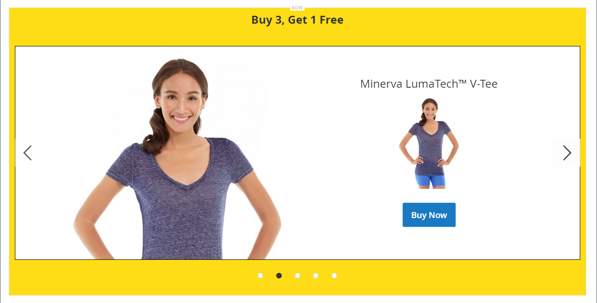
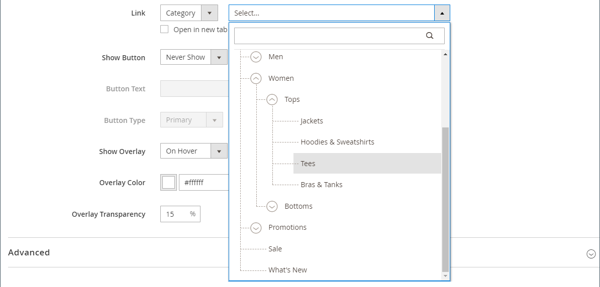
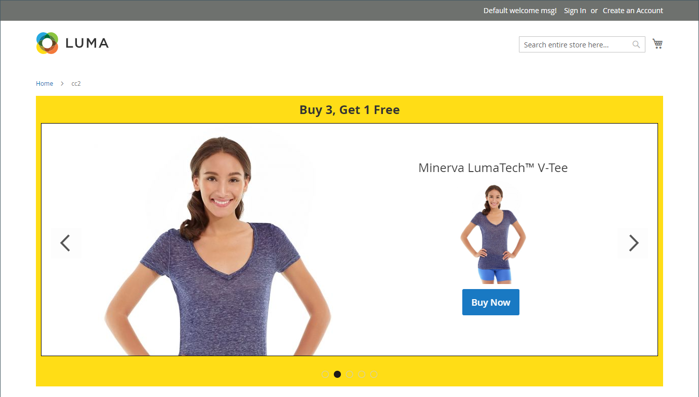

# メディア — スライダー

以下を使用します。 _スライダー_ 画像のスライドショーを [[!DNL Page Builder] ステージ](workspace.md#stage). 新しい画像をアップロードしたり、ギャラリーまたは製品カタログから既存の画像を選択したりできます。 スライダーは、自動的に再生するように設定するか、ナビゲーションボタンを使用して手動で制御することができます。 スライダーを特定のプロモーションに関連付けるには、 [ダイナミックブロック](dynamic-block.md).

{width="700" zoomable="yes"}

{{$include /help/_includes/page-builder-save-timeout.md}}

## ツールボックス

Slider コンテンツタイプを使用する場合は、個々のスライドと、1 つ以上のスライドを格納するスライダーコンテナを追加および編集します。 各スライドには、 [!DNL Page Builder] ステージ。

## 個々のスライドツールボックス

{width="500" zoomable="yes"}

| ツール | アイコン | 説明 |
|--- |--- |--- |
| 移動 | {width="25"} | スライダ上の別の位置にスライドを移動します。 |
| （ラベル） | スライド# | 現在のスライドの番号を示します。 |
| 設定 | {width="25"} | を開きます。 _[!UICONTROL Edit Slide]_現在のスライドのプロパティを変更できるページ。 |
| 複製 | {width="25"} | 現在のスライドのコピーを作成します。 |
| 削除 | {width="25"} | スライダから現在のスライドを削除します。 |

{style="table-layout:auto"}

## Slider ツールボックス

| ツール | アイコン | 説明 |
|--- |--- |--- |
| 移動 | {width="25"} | スライダをステージ上の別の位置に移動します。 |
| （ラベル） | [!UICONTROL Slider] | スライダーコンテナを指定します。 |
| 設定 | {width="25"} | を開きます。 _[!UICONTROL Edit Slider]_ページに表示されます。このページで、ビデオとコンテナのプロパティを変更できます。 |
| 非表示 | {width="25"} | 現在のスライダを非表示にします。 |
| 表示 | {width="25"} | 非表示のスライダを表示します。 |
| 複製 | {width="25"} | スライダのコピーを作成します。 |
| 削除 | {width="25"} | ステージからスライダを削除します。 |

{style="table-layout:auto"}

{{$include /help/_includes/page-builder-hidden-element-note.md}}

## 個々のスライドを追加

1. スライダーを配置するページ、ブロック、またはダイナミックブロックを開き、 **[!UICONTROL Content]** 」セクションに入力します。

1. Adobe Analytics の [!DNL Page Builder] パネル、展開 **[!UICONTROL Media]** をクリックし、 **[!UICONTROL Slider]** プレースホルダーをステージ上の行、列またはタブにドラッグします。

   次の例では、行の背景色は黄色 (`#fffd16`) をクリックします。

   {width="600" zoomable="yes"}

   スライダーコンテナは、空の 1 つのスライドでステージ上に表示されます。

1. スライダーコンテナ内をクリックして、 [テキストエディター](../content-design/editor.md) 最初のスライドのコンテンツを入力します。

   また、 [コンテンツ](#content) 設定。

1. スライダの下部にあるナビゲーションドットをクリックして、個々のスライドのツールボックスを表示し、 _設定_ ( {width="20"} ) アイコンをクリックします。

   スライダには 2 つのツールボックスがあります。 下部のスライドツールボックスを使用していることを確認してください。

1. 次のセクションに従って、必要に応じて設定を完了します。

   - [[!UICONTROL Appearance]](#appearance)
   - [[!UICONTROL Background]](#background)
   - [[!UICONTROL Content]](#content)
   - [[!UICONTROL Search Engine Optimization]](#seo)
   - [[!UICONTROL Advanced]](#advanced)

1. 完了したら、「 **[!UICONTROL Save]** 設定を適用し、に戻るには、次の手順に従います。 [!DNL Page Builder] ワークスペース。

## 他のスライドを追加

次の節では、個々のスライドから開始し、特定の製品に機能し、リンクするレスポンシブスライダーを作成する一連の手順について説明します。 個々のスライドがまだない場合は、前の手順に従って、個々のスライドをステージに追加します。

スライドを追加するには、次の方法の 1 つまたは複数を使用します。

### 方法 1：既存のスライドを複製する

必要な設定で既に構成されているスライドを複製することで、時間を節約できます。

1. スライドの下のナビゲーションドットをクリックしてツールボックスを表示し、 _複製_ ( {width="20"} ) アイコンをクリックします。

   {width="500" zoomable="yes"}

1. 新しいスライドのナビゲーションドットをクリックし、ツールボックスを表示して、 _設定_ ( {width="20"} ) アイコンをクリックします。

1. 次のセクションに従って、必要に応じて設定を変更します。

   - [[!UICONTROL Appearance]](#appearance)
   - [[!UICONTROL Background]](#background)
   - [[!UICONTROL Content]](#content)
   - [[!UICONTROL Advanced]](#advanced)

1. 完了したら、「 **[!UICONTROL Save]** 設定を適用し、に戻るには、次の手順に従います。 [!DNL Page Builder] ワークスペース。

### 方法 2：新しい空白スライドを追加する

1. 上部のスライダコンテナの上にマウスポインターを置いてツールボックスを表示し、 _追加_ ( {width="20"} ) アイコンをクリックします。

   {width="500" zoomable="yes"}

   独自のナビゲーションドットとツールボックスを持つ新しい空白のスライドがスライダに追加され、ステージに表示されます。

   {width="500" zoomable="yes"}

1. 新しいスライドのナビゲーションドットをクリックし、ツールボックスを表示して、 _設定_ ( {width="20"} ) アイコンをクリックします。

1. 次のセクションに従って、必要に応じて設定を変更します。

   - [[!UICONTROL Appearance]](#appearance)
   - [[!UICONTROL Background]](#background)
   - [[!UICONTROL Content]](#content)
   - [[!UICONTROL Advanced]](#advanced)

1. 完了したら、「 **[!UICONTROL Save]** を閉じるには、を右上隅に _[!UICONTROL Edit Slide]_ページに貼り付けます。

### スライドにウィジェットを追加する

任意の [ウィジェットの種類](../content-design/widgets.md#widget-types) スライドインの [!DNL Page Builder] ステージで次の手順に従います。

1. [ウィジェットの作成](../content-design/widget-create.md) スライドで見たいと思う

1. スライダーを配置するページ、ブロック、またはダイナミックブロックを開き、 **[!UICONTROL Content]** 」セクションに入力します。

1. Adobe Analytics の [!DNL Page Builder] パネル、展開 **[!UICONTROL Media]** をクリックし、 **[!UICONTROL Slider]** プレースホルダーをステージ上の行、列またはタブにドラッグします。

1. スライダーコンテナ内をクリックして、 [テキストエディター](../content-design/editor.md) ツールバーで、 _ウィジェットの挿入_ ( {width="20"} ) アイコンをクリックします。

1. を選択します。 **[!UICONTROL Widget Type]** 必要です。

1. ウィジェットの種類に応じて異なる設定を指定します。

   {width="600" zoomable="yes"}

1. 完了したら、「 **[!UICONTROL Insert Widget]** をクリックします。

1. 必要に応じて、その他の設定を変更します。

1. 完了したら、「 **[!UICONTROL Save]** をクリックします。

   {width="600" zoomable="yes"}

### 各スライドを表示

ステージに各スライドを表示するには、現在表示されているスライドの下の次の点をクリックします。

{width="500" zoomable="yes"}

前の例のスライドには、背景画像、透明なモバイル画像、およびテキストエディターから追加されたインライン画像が含まれています。 この手法は、背景画像をオフにし、小さいインライン画像のみを表示することで、モバイルデバイスで適切に動作します。 この例の製品スライドには、次の追加設定が含まれています。

| オプション | 設定例 |
|--- |--- |
| [!UICONTROL Appearance] | `Collage Right` |
| [!UICONTROL Background Color] | `#ffffff` （白） |
| [!UICONTROL Background Image] | このスライドの画像は製品ページから保存され、ギャラリーにアップロードされました。 |
| [!UICONTROL Mobile Background Image] | モバイルの背景画像は、10 ピクセルの正方形の透明な画像です。 モバイル用の空白の画像を使用すると、標準の背景画像が非表示の画像に効果的に置き換えられます。 |
| [!UICONTROL Background Size] | `Auto` |
| [!UICONTROL Message Text] | `Minerva LumaTech&trade; V-Tee` （中央揃え）挿入された画像を 40%に拡大・縮小した状態（中央揃え） |
| [!UICONTROL Link] | `Product` |
| [!UICONTROL Show Button] | `Always` |
| [!UICONTROL Button Text] | `Buy Now` |
| [!UICONTROL Show Overlay] | `Never Show` |
| [!UICONTROL Alignment] | `Center` （ボタンを揃えるには） |
| [!UICONTROL Border] | `Solid` |
| [!UICONTROL Border Color] | `#000000` （黒） |
| [!UICONTROL Border Width] | `1 px` |

{style="table-layout:auto"}

## 個々のスライド設定を変更する

1. スライダーの表示をステージ上で変更し、変更するスライドを表示します。

1. 個々のスライドツールボックスで、 _設定_ ( {width="20"} ) アイコンをクリックし、必要に応じて、以降の節で設定を完了します。

1. 右上隅で、 **[!UICONTROL Save]** 設定を適用し、に戻るには、次の手順に従います。 [!DNL Page Builder] ワークスペース。

### [!UICONTROL Appearance]

1. 次のスライド配置タイプのいずれかを選択します。

   | タイプ | 説明 |
   | ---- | ----------- |
   | `Poster` | スライダーコンテナ内のスライドコンテンツを中央に配置します。 オーバーレイを使用すると、スライダーの幅が広くなります。 |
   | `Collage Left` | スライダーコンテナの左側にある定義済みの領域に、スライドコンテンツを配置します。 オーバーレイを使用すると、定義された領域のみがオーバーレイ表示されます。 |
   | `Collage Center` | スライダーコンテナの中央にある定義済みの領域に、スライドコンテンツを配置します。 オーバーレイを使用すると、定義された領域のみがオーバーレイ表示されます。 |
   | `Collage Right` | スライダーコンテナの右側にある定義済みの領域に、スライドコンテンツを配置します。 オーバーレイを使用すると、定義された領域のみがオーバーレイ表示されます。 |

   {style="table-layout:auto"}

   {width="600" zoomable="yes"}

1. 次を入力します。 **[!UICONTROL Slide Name]**.

   編集モードで作業している場合、スライド名はナビゲーションドットの上にツールチップとして表示されます。 スライド名はストアフロントには表示されません。

   {width="500" zoomable="yes"}

1. 次を入力します。 **[!UICONTROL Minimum Height]** スライドの

   最小の高さは、任意の有効な CSS 単位 ( `100px`, `50%`, `50em`, `100vh`) または計算 ( `100vh - 237px`) をクリックします。

   例えば、スライドの最小の高さをページの高さ全体に設定し、背景画像やビデオを使用して魅力的なデザインオプションを設定できます。

   >[!NOTE]
   >
   >スライドがページの全高に設定されると (100vh)、スライドを含むスライダも、スライドの高さに合わせてページの全高を引き伸ばします。

## [!UICONTROL Background]

スライドの背景表示を定義するには、多くのオプションがあります。 単純なカラーまたは背景画像を適用し、より高度な効果を管理できます。

### [!UICONTROL Background Color]

スウォッチを選択するか、カラーピッカーをクリックするか、有効なカラー名または同等の 16 進値を入力して、背景色を指定します。 この設定は、行の背景色を決定します。 また、カラーの不透明度を調整することもできます。

{width="200"}

値は、次の 3 つの方法のいずれかで設定できます。

- 事前定義済みの色名（例： ） `White`
- 色の 16 進数カラー値（例： ） `#ffffff`
- 色の rgba 値（不透明度の割合を含む）。次に例を示します。 `rgba(255, 255, 255, 0.75)`

カラーを選択する場合は、 _カラーなし_ ボックス。

{width="600" zoomable="yes"}

カラーボックスをクリックしてカラーピッカーを再度開くと、スライダの下のボックスに現在の赤、緑、青、アルファの値 (rgba) が表示されます。 最後の数値は、現在の不透明度の割合を小数で示します。 スライダーを使用して不透明度を調整したり、必要な 10 進数値を入力したりできます。

{width="600" zoomable="yes"}

>[!NOTE]
>
>[!DNL Page Builder] は、透明度レイヤーをサポートしています。 _アルファチャンネル_：様々な不透明度の背景の作成に使用できる背景画像。

### [!UICONTROL Background Type]

背景の種類には、画像またはビデオがあります。 [!DNL Page Builder] デフォルト： `Image` およびは、様々な画像設定を表示します。 次を選択した場合、 `Video`, [!DNL Page Builder] 画像設定をビデオ設定と入れ替えます。 次の節では、両方の背景の種類の設定について説明します。

{width="400"}

### 画像タイプの設定

次の場合、 _[!UICONTROL Background Type]_から `Image`の場合は、次の設定を使用して背景画像表示を定義します。

{width="600" zoomable="yes"}

- **[!UICONTROL Background Image]**  — 必要に応じて、提供されているツールを使用して、バナーに適用する背景画像を選択します。

  | ツール | 説明 |
  | ---- | ----------- |
  | [!UICONTROL Upload] | ローカルコンピューターからギャラリーに画像ファイルをアップロードし、バナーの背景画像として適用します。 |
  | [!UICONTROL Select from Gallery] | ギャラリーから既存の画像をバナーの背景画像として選択するように求めるプロンプトが表示されます。 |
  | {width="25"} | 画像をカメラタイルにドラッグするか、ローカルファイルシステム内の画像を参照することができます。 |

  {style="table-layout:auto"}

- **[!UICONTROL Background Mobile Image]**  — 必要に応じて、同じツールを使用して、モバイルデバイスでの表示に使用する別の背景画像を選択します。

- **[!UICONTROL Background Size]**  — バナーの幅に対する背景画像の拡大/縮小方法を選択します。

  | オプション | 説明 |
  | ------ | ----------- |
  | `Cover` | 背景画像はバナーの全幅に表示されます。 |
  | `Contain` | 背景画像は、コンテンツ領域の幅に制限されます。 |
  | `Auto` | 現在のスタイルシートからサイズを適用します。 |

  {style="table-layout:auto"}

  {width="400"}

- **[!UICONTROL Background Position]**  — バナーに対する背景画像のアンカー方法を選択します。

  | アンカーポイント | 位置 |
  | ------------ | -------- |
  | `Top` | 左/中央/右 |
  | `Center` | 左/中央/右 |
  | `Bottom` | 左/中央/右 |

  {style="table-layout:auto"}

  アンカーポイントは、指定した背景位置で画像をバナーにアタッチするプッシュピンのようなものです。

- **[!UICONTROL Background Repeat]**  — 背景画像を繰り返してスペースを埋める場合は、この設定を変更します `Yes`.

### ビデオタイプ設定

次の場合、 _背景の種類_ から `Video`の場合は、次の設定を使用して背景画像表示を定義します。

- **[!UICONTROL Video URL]**  — 有効なビデオの URL を入力します。 有効なビデオの URL は次のリンクになります。

   - YouTubeビデオ： `https://youtu.be/CoDhMRUUjeI`
   - Vimeo ビデオ： `https://vimeo.com/190156113`
   - 有効なビデオファイル (`.mp4` をお勧めします )。 `https://myvideos.com/spiral.mp4`

  {width="500"}

- **[!UICONTROL Overlay Color]**  — 色を選択して、ビデオに透明の色合いを適用します。

- **[!UICONTROL Infinite Loop]**  — に設定 `No` ビデオを 1 回再生して停止させる場合。 このオプションが `Yes` （デフォルト）。ビデオは無限ループで繰り返されます。

- **[!UICONTROL Lazy Load]**  — に設定 `No` ページが表示されていない場合でも、ビデオをページと共に読み込む。 このオプションが `Yes` （デフォルト）。ビデオは、画面に表示されている場合にのみ、ソースから読み込まれます。

- **[!UICONTROL Play Only When Visible]**  — に設定 `No` ビデオが表示されているかどうかに関係なく、読み込まれた直後にビデオの再生を開始する場合。 このオプションが `Yes` （デフォルト）。ビデオの再生は表示されているときにのみ開始されます。

- **[!UICONTROL Fallback Image]**  — 必要に応じて、ビデオが読み込まれる前に画面に表示する画像を指定します。また、何らかの理由でビデオが読み込まれない場合も指定します。

## [!UICONTROL Content]

ステージ上または設定を変更する際に、スライドの内容を直接変更できます。 この設定では、スライドリンクやボタン、オーバーレイなど、より複雑なコンテンツ機能を提供します。 コンテンツの位置は、 [外観](#appearance) 配置設定を使用します。

### ステージ上のシンプルなコンテンツ

1. プレースホルダーまたは既存のテキストをクリックし、スライドに表示する新しいテキストを入力します。

   テキストボックスの上にエディターツールバーが表示されます。

1. エディターのツールバーを使用して、テキストの入力と書式設定、およびリンク、画像、ウィジェットなどの要素の挿入を行います。

   {width="500" zoomable="yes"}

### 設定内の複雑なコンテンツ

1. スライダの下部にあるナビゲーションドットをクリックして、個々のスライドのツールボックスを表示し、 _設定_ ( {width="20"} ) アイコンをクリックします。

1. Adobe Analytics の _[!UICONTROL Content]_セクションに、**[!UICONTROL Message Text]**スライドに表示する

1. 下にスクロールして、 _[!UICONTROL Content]_セクションの&#x200B;**[!UICONTROL Message Text]**エディターを使用して、バナーテキストを入力および書式設定します。

   また、テキストリンク、画像、ウィジェットなどの要素を挿入することもできます。

1. 必要に応じて、エディターツールバーを使用してテキストを書式設定します。

   この例の最初のスライドには背景画像が表示されますが、メッセージテキストは表示されません。 The `Buy 3 Get 1 Free` スライダーの上にあるテキストは、テキストコンテナにあります（後で追加します）。

1. 必要に応じて、 **[!UICONTROL Link]** スライドの

   リンクとは、顧客がスライド領域をクリックすると表示されるリンク先ページです。 次の 3 つのリンクタイプのいずれかを使用できます。

   - **[!UICONTROL URL]**  — 相対 URL または完全修飾 URL へのリンク。

   - **[!UICONTROL Product]**  — 製品名または SKU に基づいて宛先ページを識別します。 部分的または完全な名前に基づいて、製品を名前で検索します。 検索結果のリストから製品を選択します。

     {width="600" zoomable="yes"}

   - **[!UICONTROL Category]**  — リンク先のページを、カテゴリツリー内の特定のカテゴリまたはサブカテゴリとして識別します。 名前の一部または完全に一致するものに基づいてカテゴリを検索します。 表示されたツリーの展開済みのセクションからカテゴリを選択します。

     {width="600" zoomable="yes"}

   - **[!UICONTROL Page]**  — リンク先のページを特定のコンテンツページとして識別します。 名前の一部または完全などに基づいてページを検索します。 検索結果のリストからページを選択します。

     {width="600" zoomable="yes"}

   

   2.4.1 リリース以降、 [!DNL Page Builder] ストアフロントでの表示に問題があるので、は、ネストされたテキスト内のスライドとリンクのリンクをサポートしなくなりました。 リンクを[!UICONTROL Message Text]_、_を設定できません[!UICONTROL Link]_オプション。 スライド全体に 1 つのリンクを使用する場合は、テキストからすべてのリンクを削除できます。

   {width="300"}
   

   訪問者がストアから離れないようにするには、 **[!UICONTROL Open in new tab]** チェックボックス。 このチェックボックスをオフにすると、リンクされた宛先が同じブラウザータブで開き、訪問者を効果的にストアから移動できます。

1. 必要に応じて、リンクをたどるように促すボタンを追加します。

   スライド _外観_ を指定すると、テキストの下に 1 つのリンクまたはボタンが配置されます。 追加するリンクまたはボタンのプロパティを入力します。

   {width="600" zoomable="yes"}

   >[!NOTE]
   >
   >また、複数のボタンやリンクを使用する場合は、 [ブロック](block.md) をバナーに追加します。 競合を避けるには、すべてのリンクまたはボタンを別々のブロックに残し、リンクまたはボタンをバナーに直接追加しないでください。

   - 設定 **[!UICONTROL Show Button]** を次のいずれかに変更します。

     | オプション | 説明 |
     | ------ | ----------- |
     | `Always` | ボタンは常にスライド上に表示されます。 |
     | `On Hover` | ボタンは、マウスポインターを置いたときにのみ、スライド上に表示されます。 |
     | `Never Show` | ボタンはスライドには表示されません。 |

     {style="table-layout:auto"}

   - 次を入力します。 **[!UICONTROL Button Text]** をクリックして、「 」ボタンに表示します。

   - 設定 **[!UICONTROL Button Type]** を次のいずれかに変更します。

     | オプション | 説明 |
     | ------ | ----------- |
     | `Primary` | 現在のスタイルシートからプライマリボタンのスタイルを適用します。 |
     | `Secondary` | 該当する場合は、現在のスタイルシートからセカンダリボタンのスタイルを適用します。 |
     | `Link` | ボタンではなくハイパーリンクを作成します。 |

     {style="table-layout:auto"}

     現在のテーマのボタンのスタイルによって、ボタンの形式が決まります。 通常、プライマリボタンの背景色はセカンダリボタンよりも目立ちます。

1. 設定 **[!UICONTROL Show Overlay]** を次のいずれかに変更します。

   | オプション | 説明 |
   | ------ | ----------- |
   | `Always` | オーバーレイは常に表示されます。 |
   | `On Hover` | オーバーレイは、カーソルを合わせたときにのみ表示されます。 |
   | `Never Show` | オーバーレイが表示されません。 |

   {style="table-layout:auto"}

   オーバーレイを使用して、「外観」設定で定義されたアクティブなコンテンツ領域に背景色を適用できます。 スライドの背景画像は、スライドの全幅に対して表示されたままになります。

   {width="600" zoomable="yes"}

   オーバーレイを表示する場合は、 **[!UICONTROL Overlay Color]**:

   - 次をクリック： _カラーなし_ スウォッチを選択し、スウォッチを選択します。
   - Adobe Analytics の **[!UICONTROL Color]** フィールドに、有効な色の名前を入力するか、16 進値を入力します。

   {width="600" zoomable="yes"}

## [!UICONTROL Search Engine Optimization] {#seo}

これらの設定のテキストは検索エンジンで表示され、ページのインデックス付け方法が改善されます。

- の場合 **[!UICONTROL Alternative Text]**、 _alt_ 表示するデジタルアクセシビリティツールのテキスト説明。

  代替テキストの使用はアクセシビリティのベストプラクティスであり、一部のロケールでは法律で必須となっています。 HTMLでは、 `alt` 属性は、 `image` タグ： `<image title="tooltip" alt="description" src="image.jpg">`.

- の場合 **[!UICONTROL Title Attribute]**&#x200B;に値を入力する場合は、マウスオーバー時にツールチップとして表示するテキストを入力します。

  ベストプラクティスとしては、説明的でキーワードが豊富なタイトルを選択し、検索エンジンによる画像のインデックス作成方法を改善します。 HTMLでは、 `title` 属性は、 `image` タグ： `<image title="tooltip" alt="description" src="image.jpg">`.

## [!UICONTROL Advanced]

1. スライドに追加するコンテンツの水平方向の位置を制御するには、 **[!UICONTROL Alignment]**:

   | オプション | 説明 |
   | ------ | ----------- |
   | `Default` | 現在のテーマのスタイルシートで指定された位置揃えの既定の設定を適用します。 |
   | `Left` | 指定されたパディングを許容して、スライドの左の境界線に沿ってコンテンツを揃えます。 |
   | `Center` | 指定されたパディングを許容して、スライドの中央にコンテンツを揃えます。 |
   | `Right` | 指定されたパディングを許容して、スライドの右の境界線に沿ってコンテンツを揃えます。 |

   {style="table-layout:auto"}

1. を設定します。 **[!UICONTROL Border]** スライドの 4 つの側面すべてに適用されるスタイル：

   | オプション | 説明 |
   | ------ | ----------- |
   | `Default` | 関連するスタイルシートで指定された既定の罫線のスタイルを適用します。 |
   | `None` | スライドの境界線を表示しません。 |
   | `Dotted` | コンテナの境界線は点線で表示されます。 |
   | `Dashed` | コンテナの境界線は破線で表示されます。 |
   | `Solid` | コンテナの境界線は実線で表示されます。 |
   | `Double` | コンテナの境界線は二重線で表示されます。 |
   | `Groove` | コンテナ境界は溝付きの線として表示されます。 |
   | `Ridge` | コンテナの境界線は、稜線として表示されます。 |
   | `Inset` | コンテナの境界線は、挿入線として表示されます。 |
   | `Outset` | コンテナの境界線は、アウトセット行として表示されます。 |

   {style="table-layout:auto"}

1. 次の条件を満たさない境界線のスタイルを設定した場合： `None`、境界線の表示オプションを設定します。

   {width="600" zoomable="yes"}

   | オプション | 説明 |
   | ------ |------------ |
   | [!UICONTROL Border Color] | スウォッチを選択するか、カラーピッカーをクリックするか、有効なカラー名または同等の 16 進値を入力して、カラーを指定します。 |
   | [!UICONTROL Border Width] | 境界線の幅のピクセル数を入力します。 |
   | [!UICONTROL Border Radius] | ピクセル数を入力して、境界線の各隅を囲むために使用する半径のサイズを定義します。 |

   {style="table-layout:auto"}

1. （オプション） **[!UICONTROL CSS classes]** 現在のスタイルシートからスライドに適用します。

   複数のクラス名はスペースで区切ります。

1. 次の値をピクセル単位で入力します。 **[!UICONTROL Margins and Padding]** スライドの外側の余白と内側の余白を指定します。

   スライド図に、対応する各値を入力します。

   | コンテナ領域 | 説明 |
   | -------------- | ----------- |
   | [!UICONTROL Margins] | スライドのすべての辺の外側の端に適用される空白の量。 |
   | [!UICONTROL Padding] | スライドのすべての辺の内側の端に適用される空白の量。 |

   {style="table-layout:auto"}

## スライダータイトルを追加

スライダーの上にタイトルを追加する場合は、 [テキストコンテンツタイプ] をスライダーの上に置きます。 次に、必要に応じてテキストの形式を設定します。

1. Adobe Analytics の [!DNL Page Builder] パネル、展開 **[!UICONTROL Elements]** をクリックし、 **テキスト** プレースホルダーをステージ上の行、列またはタブセットに追加します。

   ドラッグすると、スライダーの上の挿入点を示す赤いガイドラインが表示されます。

   {width="600" zoomable="yes"}

1. エディターを使用して、必要に応じてテキストの書式を設定します。

   {width="500" zoomable="yes"}

## スライダー設定を変更

1. スライダコンテナの上にマウスポインターを置いて、メインツールボックスを表示し、 _設定_ ( {width="20"} ) アイコンをクリックします。

   {width="500" zoomable="yes"}

1. 次を入力します。 **[!UICONTROL Minimum Height]** スライドの

   最小の高さは、任意の有効な CSS 単位 ( `100px`, `50%`, `50em`, `100vh`) または計算 ( `100vh - 237px`) をクリックします。

   例えば、スライダーの最小の高さを設定して、ページの高さを最大限に引き伸ばすことができ、ページ全体の背景画像やビデオに対する魅力的なオプションを提供できます。

   {width="400"}

1. ページが読み込まれたときにスライダーを開始する場合は、 **[!UICONTROL Autoplay]** から `Yes` と設定します。 **[!UICONTROL Autoplay Speed]** スライド間の遅延時間（ミリ秒）をミリ秒単位で指定します。

   デフォルトでは、速度は 4000 ms に設定されています（4 秒）。 自動再生を `No`」を選択した場合、最初のスライドがデフォルトで表示され、ユーザーがスライドナビゲーション（ドットまたは矢印）をクリックして次のスライドを順番に表示する必要があります。

   {width="600" zoomable="yes"}

1. あるスライドから次のスライドへの切り替えをスムーズにするには、 **[!UICONTROL Fade]** から `Yes`.

   フェードを使用すると、スライドがそのまま表示されますが、コンテンツは次々にスムーズに変更されます。 フェードを行わないと、あるスライドから次のスライドへの水平方向の動きが表示されます。

   {width="600" zoomable="yes"}

1. ページが開いている間、スライドショーを無期限に繰り返すようにするには、 **[!UICONTROL Infinite Loop]** から `Yes`.

1. スライダーのナビゲーションコントロールの種類を選択するには、次の操作を行います。

   - 含める _次へ_ および _前へ_ 各スライドの左右の矢印を、 **[!UICONTROL Show Arrows]** から `Yes`.

   - スライダーの下に一連のナビゲーションドットを含めるには、 **[!UICONTROL Show Dots]** から `Yes`.

   {width="600" zoomable="yes"}

1. 次を完了： [詳細](#slider-advanced) 必要に応じてスライダ設定を指定します。

1. 完了したら、「 **[!UICONTROL Save]** 設定を適用し、に戻るには、次の手順に従います。 [!DNL Page Builder] ワークスペース。

### 詳細 — スライダー {#slider-advanced}

1. 親スライダーコンテナ内でのスライドの位置を制御するには、 **[!UICONTROL Alignment]**:

   | オプション | 説明 |
   | ------ | ----------- |
   | `Default` | 現在のテーマのスタイルシートで指定された位置揃えの既定の設定を適用します。 |
   | `Left` | 指定されたパディングを許容して、スライダーコンテナの左の境界線に沿ってスライドを揃えます。 |
   | `Center` | 指定されたパディングを許容して、スライダーコンテナの中央にスライドを揃えます。 |
   | `Right` | 指定されたパディングの値を使用して、スライダーコンテナの右の境界線に沿ってスライドを揃えます。 |

   {style="table-layout:auto"}

1. を設定します。 **[!UICONTROL Border]** スライダーコンテナの 4 つの側面すべてに適用されるスタイル：

   | オプション | 説明 |
   | ------ | ----------- |
   | `Default` | 関連するスタイルシートで指定された既定の罫線のスタイルを適用します。 |
   | `None` | コンテナの境界線を表示しません。 |
   | `Dotted` | コンテナの境界線は点線で表示されます。 |
   | `Dashed` | コンテナの境界線は破線で表示されます。 |
   | `Solid` | コンテナの境界線は実線で表示されます。 |
   | `Double` | コンテナの境界線は二重線で表示されます。 |
   | `Groove` | コンテナ境界は溝付きの線として表示されます。 |
   | `Ridge` | コンテナの境界線は、稜線として表示されます。 |
   | `Inset` | コンテナの境界線は、挿入線として表示されます。 |
   | `Outset` | コンテナの境界線は、アウトセット行として表示されます。 |

   {style="table-layout:auto"}

1. 次の条件を満たさない境界線のスタイルを設定した場合： `None`、境界線の表示オプションを設定します。

   | オプション | 説明 |
   | ------ |------------ |
   | [!UICONTROL Border Color] | スウォッチを選択するか、カラーピッカーをクリックするか、有効なカラー名または同等の 16 進値を入力して、カラーを指定します。 |
   | [!UICONTROL Border Width] | 境界線の幅のピクセル数を入力します。 |
   | [!UICONTROL Border Radius] | ピクセル数を入力して、境界線の各隅を囲むために使用する半径のサイズを定義します。 |

   {style="table-layout:auto"}

1. （オプション） **[!UICONTROL CSS classes]** 現在のスタイルシートからスライダーコンテナに適用します。

   複数のクラス名はスペースで区切ります。

1. 次の値をピクセル単位で入力します。 **[!UICONTROL Margins and Padding]** スライダーコンテナの外側の余白と内側の余白を決定します。

   ダイアグラムに対応する値を入力します。

   | コンテナ領域 | 説明 |
   | -------------- | ----------- |
   | [!UICONTROL Margins] | コンテナのすべての側面の外側の端に適用される空白の量。 |
   | [!UICONTROL Padding] | コンテナのすべての側面の内側の端に適用される空白の量。 |

   {style="table-layout:auto"}

## スライダーをテストする

1. スライダーを追加したページを開き、を設定します。 **[!UICONTROL Enable Page]** から `Yes`.

1. 右上隅で、 **[!UICONTROL Save]** 矢印と選択 **[!UICONTROL Save & Close]**.

1. でページを見つけます。 _ページ_ グリッドと選択 **[!UICONTROL View]** （内） _[!UICONTROL Action]_列。

   {width="600" zoomable="yes"}

   スライダーをプレビューする際に、モバイルデバイスでの表示を確認できるように、ウィンドウのサイズを変更します。

   {width="400" zoomable="yes"}
