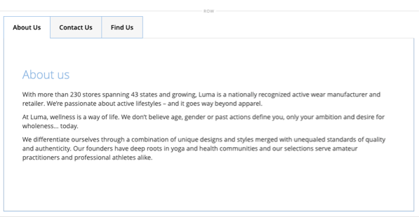
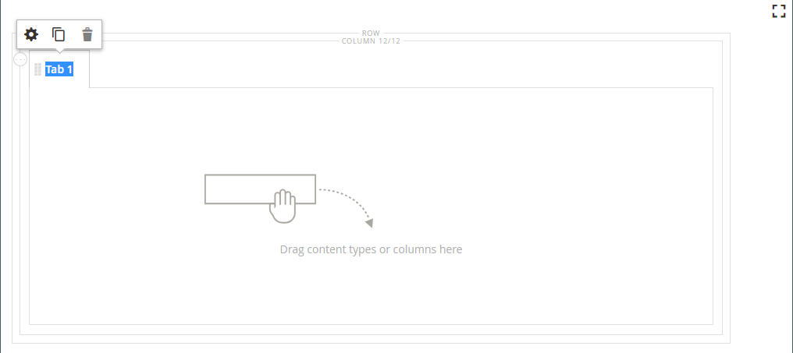
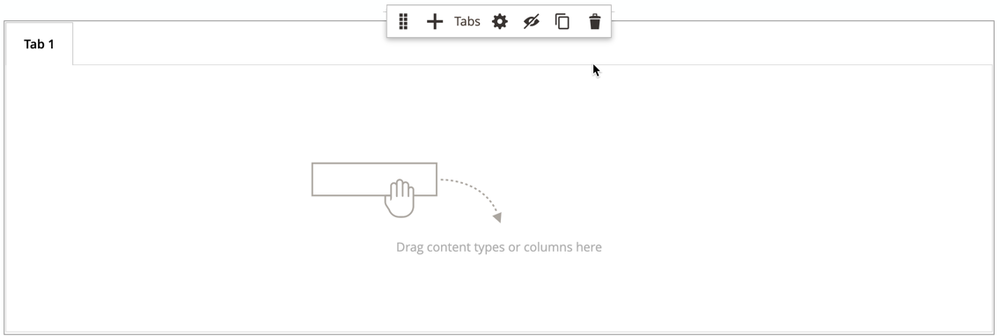
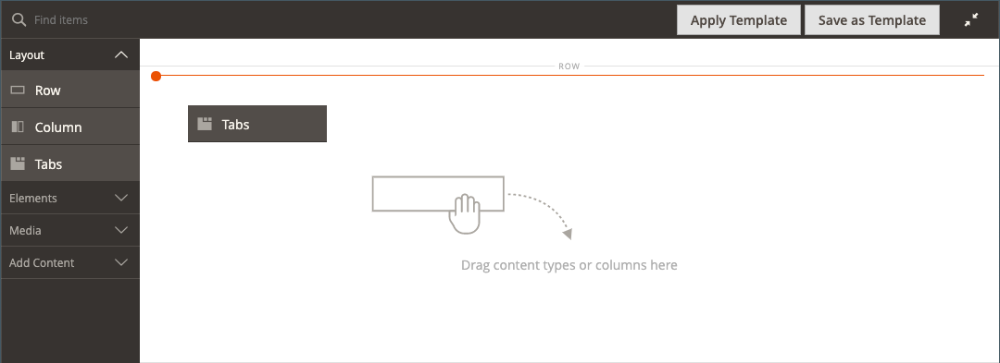
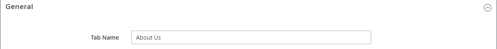
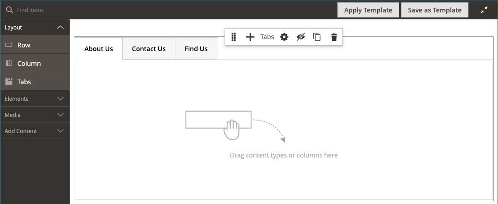
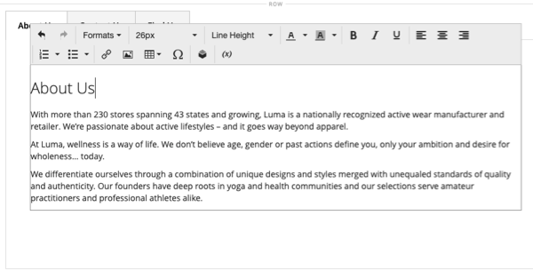
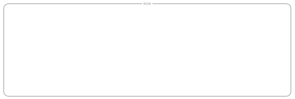
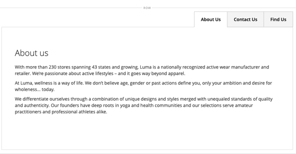

# レイアウト – タブ

_タブ_ コンテンツタイプを使用して、[[!DNL Page Builder]  ステージ &#x200B;](workspace.md#stage)のタブのセットを追加します。 タブプレースホルダーをパネルからステージにドラッグすると、最初に単一のデフォルトタブが表示されます。 複数のタブを追加して、フルセットを作成できます。 タブセットの幅は、親コンテナとパディング設定の幅によって決まります。

{width="500" zoomable="yes"}

{{$include /help/_includes/page-builder-save-timeout.md}}

## ツールボックス

_タブ_ コンテンツタイプを使用している場合、個々のタブと、1つ以上のタブを保持するタブコンテナを追加および編集します。 各タブには、[!DNL Page Builder] ステージでタブをデザインするために使用する独自のツールボックスがあります。

### 個別タブツールボックス

{width="500" zoomable="yes"}

| ツール | アイコン | 説明 |
|--- |--- |--- |
| 移動 | {width="25"} | タブラベルの横にあるこのコントロールを使用して、個々のタブをタブセット内の別の位置に移動します。 |
| 設定 | {width="25"} | タブを編集ページが開き、個々のタブのプロパティを変更できます。 |
| 重複 | {width="25"} | タブのコピーを作成します。 |
| 削除 | {width="25"} | タブセットからタブを削除します。 |

{style="table-layout:auto"}

### タブコンテナツールボックス

{width="500" zoomable="yes"}

| ツール | アイコン | 説明 |
|--- |--- |--- |
| 移動 | {width="25"} | タブのセットを親コンテナ内のグリッド上の別の位置に移動します。 |
| 追加 | {width="25"} | タブセットにタブを追加します。 |
| （ラベル） | [!UICONTROL Tabs] | 現在のコンテナをタブセットとして識別します。 コンテナの上端にカーソルを合わせると、ツールボックスが表示されます。 |
| 設定 | {width="25"} | 「タブを編集」ページが開き、コンテナのプロパティを変更できます。 |
| 非表示 | {width="25"} | タブコンテナを非表示にします。 |
| 表示 | {width="25"} | 非表示タブコンテナを表示します。 |
| 重複 | {width="25"} | 現在のタブのコピーを作成します。 |
| 削除 | {width="25"} | ステージから現在のタブセットを削除します。 |

{style="table-layout:auto"}

{{$include /help/_includes/page-builder-hidden-element-note.md}}

## 個々のタブを追加

1. _[!UICONTROL Layout]_&#x200B;の下の[!DNL Page Builder] パネルで、**[!UICONTROL Tabs]**&#x200B;プレースホルダーを直接ステージにドラッグするか、ステージの行または列にドラッグします。

   {width="600" zoomable="yes"}

1. 「**[!UICONTROL Tab 1]**」ラベルをクリックして個々のタブツールボックスを表示し、_設定_ （{width="20"}）アイコンを選択します。

1. ラベルとして使用する&#x200B;**[!UICONTROL Tab Name]**&#x200B;を入力します。

   {width="600" zoomable="yes"}

1. 必要に応じて、タブに&#x200B;**[!UICONTROL Minimum Height]**&#x200B;を入力します。

   この値は、有効なCSS単位（`100px`、`50%`、`50em`、`100vh`など）または計算（`100vh - 237px`など）を含む数値にできます。

1. タブに追加されたコンテンツコンテナ（上、中央、下）を整列させるには、**[!UICONTROL Vertical Alignment]**&#x200B;設定を選択します。

1. 必要に応じて、以下のセクションをガイダンスとして使用して、他のオプションを設定します。

   - [[!UICONTROL Background]](#background)
   - [[!UICONTROL Advanced]](#advanced)

1. 右上隅の「**[!UICONTROL Save]**」をクリックして設定を適用し、[!DNL Page Builder] ワークスペースに戻ります。

## タブのセットの追加

次の手順は、個々のタブから始まり、タブコンテナ内に3つのタブのセットを作成します。 個々のタブがまだ存在しない場合は、前の手順に従って1つのタブをステージに追加します。

1. タブコンテナにカーソルを合わせてツールボックスを表示し、_追加_ （{width="20"}）アイコンを選択します。

1. **[!UICONTROL Tab 2]** ラベルをクリックしてカーソルを表示し、タブの独自のラベルを入力します。

1. ステージの2番目のタブをもう一度クリックし、_複製_ （{width="20"}）アイコンを選択します。

1. YourName **[!UICONTROL Copy]** ラベルをクリックしてカーソルを表示し、3番目のタブに独自のラベルを入力します。

{width="600" zoomable="yes"}

## セット内でのタブの移動

1. 移動するタブをクリックします。

1. タブのラベルテキストの直前に表示される&#x200B;_移動_ （{width="20"}）アイコンを選択して、タブセット内の新しい位置にドラッグします。

## タブにコンテンツを追加

行と同じように、任意のコンテンツタイプをタブに追加できます。 例として、テキストコンテンツタイプを追加するには、次の手順を使用します。

1. コンテンツを追加するタブをクリックします。

1. [!DNL Page Builder] パネルで、**[!UICONTROL Elements]**&#x200B;を展開し、**テキスト** プレースホルダーをタブにドラッグします。

1. エディターでテキストを入力またはペーストし、エディターツールバーを使用して必要に応じて書式設定します。

   テキストコンテンツタイプの操作について詳しくは、[要素 – テキスト &#x200B;](text.md)を参照してください。

   {width="500" zoomable="yes"}

1. 右上隅の「**[!UICONTROL Save]**」をクリックします。

## 個々のタブ設定の変更

1. 個々のタブにカーソルを合わせてツールボックスを表示し、_設定_ （{width="20"}）アイコンを選択します。

1. 必要に応じて、タブの基本設定のいずれかを変更します。

   - **[!UICONTROL Tab Name]** - タブ ラベルの改訂テキストを入力します。 ステージ上で直接ラベルを変更することもできます。

   - **[!UICONTROL Minimum Height]** – 自動高さを上書きする場合は、ピクセルとして入力します。 例えば、背景画像の高さに合わせて最小の高さを設定し、完全な画像が表示されるようにすることができます。

   - **[!UICONTROL Vertical Alignment]** - タブに追加されるコンテンツコンテナの垂直位置を選択します。

1. 次の節を使用して、必要に応じてその他の設定を変更します。

1. 完了したら、**[!UICONTROL Save]**&#x200B;をクリックして設定を適用し、[!DNL Page Builder] ワークスペースに戻ります。

### 背景

- **[!UICONTROL Background Color]** – 色見本を選択するか、カラーピッカーをクリックするか、有効なカラー名または同等の16進数値を入力して、背景色を指定します。 この設定により、行の背景色が決まります。 カラーの不透明度を調整することもできます。

  {width="200"}

  値は、次の3つの方法で入力できます。

   - `White`などの定義済みのカラー名

   - カラーの16進数カラー値（`#ffffff`など）

   - カラーのrgba値。不透明度パーセント（`rgba(255, 255, 255, 0.75)`など）

  カラーを選択する場合は、「_カラーなし_」ボックスの左側にあるスウォッチをクリックします。

  {width="600" zoomable="yes"}

  カラーボックスをクリックしてカラーピッカーを再度開くと、スライダーの下のボックスに、現在の赤、緑、青、アルファの値（rgba）が表示されます。 最後の数値は、現在の不透明度の割合を10進数で示しています。 スライダーを使用して不透明度を調整したり、必要な小数値を入力したりできます。

  {width="600" zoomable="yes"}

  >[!NOTE]
  >
  >[!DNL Page Builder]は、様々な不透明度を持つ背景の作成に使用できる背景画像で、透明レイヤー（_アルファチャンネル_）もサポートしています。

- **[!UICONTROL Background Image]** – 必要に応じて、提供されたツールを使用して、タブに適用する背景画像を選択します。

  | ツール | 説明 |
  |--- |--- |
  | [!UICONTROL Upload] | ローカルコンピューターからギャラリーに画像ファイルをアップロードし、それをタブの背景画像として適用します。 |
  | [!UICONTROL Select from Gallery] | ギャラリーの既存の画像をタブの背景画像として選択するよう求めるプロンプトが表示されます。 |
  | {width="25"} | 画像をカメラタイルにドラッグするか、ローカルファイルシステムで画像を参照できます。 |

  {style="table-layout:auto"}

- **[!UICONTROL Background Mobile Image]** – 必要に応じて、同じツールを使用して、モバイルデバイスでの表示に使用する異なる背景画像を選択します。

- **[!UICONTROL Background Size]** - タブの幅に合わせて背景画像を拡大・縮小する方法を選択します。

  | オプション | 説明 |
  |--- |--- |
  | `Cover` | 背景画像は、タブの全幅をカバーしています。 |
  | `Contain` | 背景画像は、タブ領域の幅に制限されます。 |
  | `Auto` | 現在のスタイルシートのサイズを適用します。 |

  {style="table-layout:auto"}

- **[!UICONTROL Background Position]** - タブに関連する背景画像のアンカー方法を選択：`Top Left` / `Top Center` / `Top Right` / `Center Left` / `Center` / `Center Right` / `Bottom Left` / `Bottom Center` / `Bottom Right`

- **[!UICONTROL Background Attachment]** – 添付ファイルの種類を選択して、背景画像がスクロール ページに対してどのように移動するかを決定します。

  | オプション | 説明 |
  | --- | --- |
  | `Scroll` | 添付された背景画像は、ページのスクロールに合わせて下に移動するように同期されます。 |
  | `Fixed` | （モバイルでは利用できません） コンテナが画像をスクロールしても背景の画像が移動せず、指定した背景位置に固定されます。 |

  {style="table-layout:auto"}

- **[!UICONTROL Background Repeat]** - タブの空き容量を埋めるために背景画像を繰り返す場合は、`Yes`に設定します。

### アドバンス

- タブに追加されるコンテンツコンテナの水平方向の整列を制御するには、**[!UICONTROL Alignment]**&#x200B;を選択します。

  | オプション | 説明 |
  | --- | --- |
  | `Default` | 現在のテーマのスタイルシートで指定されている整列のデフォルト設定を適用します。 |
  | `Left` | タブの左端に沿ってコンテンツコンテナを整列させ、指定されたパディングを許可します。 |
  | `Center` | コンテンツコンテナをタブの中央に配置し、指定されたパディングを許可します。 |
  | `Right` | コンテンツコンテナをタブの右端に沿って整列させ、指定されたパディングを許可します。 |

  {style="table-layout:auto"}

- タブコンテナのすべての4つの側面に適用される&#x200B;**[!UICONTROL Border]** スタイルを設定します。

  | オプション | 説明 |
  | --- | --- |
  | `Default` | 関連付けられたスタイルシートで指定されたデフォルトの境界線スタイルを適用します。 |
  | `None` | コンテナの境界を表示しません。 |
  | `Dotted` | コンテナの境界線が点線で表示されます。 |
  | `Dashed` | コンテナの境界線が破線で表示されます。 |
  | `Solid` | コンテナの境界線が実線として表示されます。 |
  | `Double` | コンテナの境界線が2行で表示されます。 |
  | `Groove` | コンテナの境界線は、溝付き線として表示されます。 |
  | `Ridge` | コンテナの境界線は、うね付きの線として表示されます。 |
  | `Inset` | コンテナの境界線がインセット線として表示されます。 |
  | `Outset` | コンテナの境界線がアウトセット線として表示されます。 |

  {style="table-layout:auto"}

- `None`以外の境界線スタイルを設定する場合は、境界線の表示オプションを完了します。

  {width="600" zoomable="yes"}

  | オプション | 説明 |
  | ------ |------------ |
  | [!UICONTROL Border Color] | 色見本を選択するか、カラーピッカーをクリックするか、有効なカラー名または同等の16進数値を入力して、カラーを指定します。 |
  | [!UICONTROL Border Width] | 境界線の幅のピクセル数を入力します。 |
  | [!UICONTROL Border Radius] | 境界線の各隅を丸めるために使用する半径のサイズを定義するピクセル数を入力します。 |

  {style="table-layout:auto"}

  次の例の行の境界線の半径は15です。

  {width="500"}の行

- （オプション）列コンテナに適用する現在のスタイルシートから&#x200B;**[!UICONTROL CSS classes]**&#x200B;の名前を指定します。

  複数のクラス名はスペースで区切ります。

- **[!UICONTROL Margins and Padding]**&#x200B;の値をピクセル単位で入力して、列の外側の余白と内側の余白を指定します。

  タブコンテナ図に対応する各値を入力します。

  | コンテナ領域 | 説明 |
  | -------------- | ---------- |
  | [!UICONTROL Margins] | コンテナのすべての側面の外側のエッジに適用される空白スペースの量。 オプション：`Top` / `Right` / `Bottom` / `Left` |
  | [!UICONTROL Padding] | コンテナのすべての側面の内側エッジに適用される空白スペースの量。 オプション：`Top` / `Right` / `Bottom` / `Left` |

  {style="table-layout:auto"}

## タブセット設定の変更

1. タブセットコンテナの上端にカーソルを合わせてツールボックスを表示し、_設定_ （{width="20"}）アイコンを選択します。

1. 必要に応じて、**[!UICONTROL Default Active Tab]**&#x200B;を変更します。

   ページの読み込み時にアクティブにするタブをセット内で選択します。

1. タブセットの自動高さを上書きする場合は、**[!UICONTROL Minimum Height]**&#x200B;をピクセル単位で入力します。

1. ナビゲーションタブをタブセットの上部に沿って配置するには、**[!UICONTROL Tab Navigation Alignment]** （`Left`、`Center`、または`Right`）を選択します。

   {width="500" zoomable="yes"}

1. タブセットの「詳細」オプションを設定します。

   - 親コンテナ内のタブセットの位置を制御するには、**[!UICONTROL Alignment]**&#x200B;を選択します。

     | オプション | 説明 |
     | ------ | ---------- |
     | `Default` | 現在のテーマのスタイルシートで指定されている整列のデフォルト設定を適用します。 |
     | `Left` | 親コンテナの左端に沿ってタブセットを整列させ、指定された任意のパディングを許可します。 |
     | `Center` | 親コンテナの中央にあるタブセットを、指定された任意のパディングを許可して整列させます。 |
     | `Right` | 親コンテナの右端に沿ってタブセットを整列させ、指定された任意のパディングを許可します。 |

     {style="table-layout:auto"}

   - タブコンテナのすべての4つの側面に適用される&#x200B;**[!UICONTROL Border]** スタイルを設定します。

     | オプション | 説明 |
     | ------ | ---------- |
     | `Default` | 関連付けられたスタイルシートで指定されたデフォルトの境界線スタイルを適用します。 |
     | `None` | コンテナの境界を表示しません。 |
     | `Dotted` | コンテナの境界線が点線で表示されます。 |
     | `Dashed` | コンテナの境界線が破線で表示されます。 |
     | `Solid` | コンテナの境界線が実線として表示されます。 |
     | `Double` | コンテナの境界線が2行で表示されます。 |
     | `Groove` | コンテナの境界線は、溝付き線として表示されます。 |
     | `Ridge` | コンテナの境界線は、うね付きの線として表示されます。 |
     | `Inset` | コンテナの境界線がインセット線として表示されます。 |
     | `Outset` | コンテナの境界線がアウトセット線として表示されます。 |

     {style="table-layout:auto"}

   - `None`以外の境界線スタイルを設定する場合は、境界線の表示オプションを完了します。

     | オプション | 説明 |
     | ------ |------------ |
     | [!UICONTROL Border Color] | 色見本を選択するか、カラーピッカーをクリックするか、有効なカラー名または同等の16進数値を入力して、カラーを指定します。 |
     | [!UICONTROL Border Width] | 境界線の幅のピクセル数を入力します。 |
     | [!UICONTROL Border Radius] | 境界線の各隅を丸めるために使用する半径のサイズを定義するピクセル数を入力します。 |

     {style="table-layout:auto"}

   - （オプション）現在のスタイルシートから&#x200B;**[!UICONTROL CSS classes]**&#x200B;の名前を指定して、タブコンテナに適用します。

     複数のクラス名はスペースで区切ります。

   - **[!UICONTROL Margins and Padding]**&#x200B;の値をピクセル単位で入力して、タブコンテナの外側の余白と内側の余白を決定します。

     タブコンテナ図に対応する値を入力します。

     | コンテナ領域 | 説明 |
     | -------------- | ---------- |
     | [!UICONTROL Margins] | コンテナのすべての側面の外側のエッジに適用される空白スペースの量。 オプション：`Top` / `Right` / `Bottom` / `Left` |
     | [!UICONTROL Padding] | コンテナのすべての側面の内側エッジに適用される空白スペースの量。 オプション：`Top` / `Right` / `Bottom` / `Left` |

     {style="table-layout:auto"}

1. 完了したら、**[!UICONTROL Save]**&#x200B;をクリックして設定を適用し、[!DNL Page Builder] ワークスペースに戻ります。

<!-- Last updated from includes: 2023-09-11 14:30:19 -->
