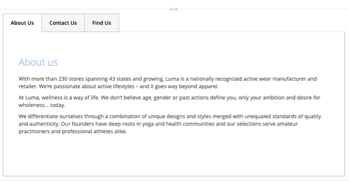

# レイアウト – タブ

の使用 _タブ_ 一連のタブを [[!DNL Page Builder] ステージ](workspace.md#stage). パネルからステージにタブプレースホルダーをドラッグすると、最初にデフォルトのタブが 1 つ表示されます。 さらにタブを追加して、完全なセットを作成できます。 タブセットの幅は、その親コンテナの幅とパディングの設定によって決まります。

{width="500" zoomable="yes"}

{{$include /help/_includes/page-builder-save-timeout.md}}

## ツールボックス

を使用する場合 _タブ_ コンテンツタイプを使用すると、個々のタブと、1 つ以上のタブを保持するタブコンテナを追加および編集できます。 各タブには独自のツールボックスがあり、タブのデザインに使用します [!DNL Page Builder] ステージ。

### 個々のタブのツールボックス

{width="500" zoomable="yes"}

| ツール | アイコン | 説明 |
|--- |--- |--- |
| 移動 | {width="25"} | タブ ラベルの隣にあるこのコントロールは、個々のタブをタブ セット内の別の位置に移動するために使用されます。 |
| 設定 | {width="25"} | タブの編集ページを開きます。このページで、個々のタブのプロパティを変更できます。 |
| 複製 | {width="25"} | タブをコピーします。 |
| 削除 | {width="25"} | タブセットからタブを削除します。 |

{style="table-layout:auto"}

### タブコンテナツールボックス

{width="500" zoomable="yes"}

| ツール | アイコン | 説明 |
|--- |--- |--- |
| 移動 | {width="25"} | タブのセットを、親コンテナのグリッド上の別の位置に移動します。 |
| 追加 | {width="25"} | タブセットにタブを追加します。 |
| （ラベル） | [!UICONTROL Tabs] | 現在のコンテナをタブセットとして識別します。 コンテナの上部の境界線にポインタを合わせると、ツールボックスが表示されます。 |
| 設定 | {width="25"} | 「編集タブ」ページが開きます。このページで、コンテナのプロパティを変更できます。 |
| Hide | {width="25"} | タブコンテナを非表示にします。 |
| 表示 | {width="25"} | 非表示のタブコンテナを表示します。 |
| 複製 | {width="25"} | 現在のタブをコピーします。 |
| 削除 | {width="25"} | ステージから現在のタブセットを削除します。 |

{style="table-layout:auto"}

{{$include /help/_includes/page-builder-hidden-element-note.md}}

## 個々のタブの追加

1. が含まれる [!DNL Page Builder] 下のパネル _[!UICONTROL Layout]_、をドラッグします&#x200B;**[!UICONTROL Tabs]**ステージまたはステージ上の行や列に直接プレースホルダーを追加します。

   {width="600" zoomable="yes"}

1. 「」をクリックします **[!UICONTROL Tab 1]** 個々のタブのツールボックスを表示するラベル _設定_ （ {width="20"} ） アイコンをクリックします。

1. を入力 **[!UICONTROL Tab Name]** をラベルとして使用する。

   {width="600" zoomable="yes"}

1. 必要に応じて、を入力します **[!UICONTROL Minimum Height]** 「」タブの場合。

   この値には、有効な CSS 単位（など）を含む数値を指定できます `100px`, `50%`, `50em`, `100vh`）または計算（など `100vh - 237px`）に設定します。

1. を選択 **[!UICONTROL Vertical Alignment]** タブに追加されたコンテンツコンテナを整列する設定（上、中央または下）。

1. 必要に応じて、次の節を参考にして、その他のオプションを設定します。

   - [[!UICONTROL Background]][background]
   - [[!UICONTROL Advanced]][advanced]

1. 右上隅のをクリックします。 **[!UICONTROL Save]** 設定を適用し、 [!DNL Page Builder] ワークスペース。

## 一連のタブを追加

次の手順は、個々のタブから開始して、タブコンテナ内に 3 つのタブのセットを作成します。 個々のタブをまだ持っていない場合は、前の手順に従って、ステージに 1 つのタブを追加します。

1. タブコンテナにカーソルを合わせてツールボックスを表示し、 _追加_ （ {width="20"} ） アイコンをクリックします。

1. 内をクリック **[!UICONTROL Tab 2]** ラベル：カーソルを表示し、タブの独自のラベルを入力します。

1. ステージの 2 番目のタブをもう一度クリックし、 _複製_ （ {width="20"} ） アイコンをクリックします。

1. YourName をクリック **[!UICONTROL Copy]** ラベル：カーソルを表示し、3 番目のタブに独自のラベルを入力します。

{width="600" zoomable="yes"}

## セット内でのタブの移動

1. 移動するタブをクリックします。

1. を選択してドラッグします。 _移動_ （ {width="20"} ） アイコンがタブセット内の新しい位置に表示されます。このアイコンはタブラベルのテキストの直前に表示されます。

## タブへのコンテンツの追加

行に対する場合と同様に、タブに対して任意のコンテンツタイプを使用できます。 テキストコンテンツタイプを例として追加するには、次の手順を使用します。

1. コンテンツを追加するタブをクリックします。

1. が含まれる [!DNL Page Builder] パネル、展開 **[!UICONTROL Elements]** をドラッグします。 **テキスト** タブのプレースホルダー。

1. エディターにテキストを入力または貼り付け、エディターツールバーを使用して必要に応じて書式設定します。

   参照： [要素 – テキスト](text.md) テキスト コンテンツタイプの操作の詳細については、を参照してください。

   {width="500" zoomable="yes"}

1. 右上隅のをクリックします。 **[!UICONTROL Save]**.

## 個々のタブ設定の変更

1. 個々のタブにポインタを合わせてツールボックスを表示し、 _設定_ （ {width="20"} ） アイコンをクリックします。

1. 必要に応じて、タブの基本設定を変更します。

   - **[!UICONTROL Tab Name]** - タブラベルの改訂テキストを入力します。 ラベルをステージ上で直接変更することもできます。

   - **[!UICONTROL Minimum Height]**  – 自動の高さを上書きする場合は、ピクセルで入力します。 例えば、背景画像の高さと一致するように最小の高さを設定して、画像全体が表示されるようにします。

   - **[!UICONTROL Vertical Alignment]** - タブに追加するコンテンツコンテナの垂直位置を選択します。

1. 必要に応じて、以下の節で他の設定を変更します。

1. 完了したら、 **[!UICONTROL Save]** 設定を適用し、 [!DNL Page Builder] ワークスペース。

### 背景

- **[!UICONTROL Background Color]**  – 背景色を指定するには、見本を選択するか、カラーピッカーをクリックするか、有効なカラー名または同等の 16 進数値を入力します。 この設定により、行の背景色が決まります。 また、カラーの不透明度を調整することもできます。

  {width="200"}

  次の 3 つの方法で値を入力できます。

   - 事前定義済みのカラー名（など） `White`

   - カラーの 16 進数値（例：） `#ffffff`

   - 次のような、不透明度のパーセントを使用したカラーの rgba 値 `rgba(255, 255, 255, 0.75)`

  カラーを選択する場合は、の左側にあるスウォッチをクリックします _カラーなし_ ボックス。

  {width="600" zoomable="yes"}

  カラーボックスをクリックして再度カラーピッカーを開くと、スライダの下のボックスに現在の赤、緑、青、アルファ値（rgba）が表示されます。 最後の数値は、現在の不透明度の割合を小数で示します。 スライダを使用して、不透明度を調整したり、必要な小数値を入力したりできます。

  {width="600" zoomable="yes"}

  >[!NOTE]
  >
  >[!DNL Page Builder] では、透明度レイヤーもサポートされています。 _アルファチャネル_：様々な不透明度の背景を作成するために使用できる背景画像。

- **[!UICONTROL Background Image]**  – 必要に応じて、提供されたツールを使用してタブに適用する背景画像を選択します。

  | ツール | 説明 |
  |--- |--- |
  | [!UICONTROL Upload] | ローカルコンピューターからギャラリーに画像ファイルをアップロードし、タブの背景画像として適用します。 |
  | [!UICONTROL Select from Gallery] | タブの背景画像として、ギャラリーから既存の画像を選択するように求めるプロンプトを表示します。 |
  | {width="25"} | 画像をカメラタイルにドラッグするか、ローカルファイルシステム内の画像を参照できます。 |

  {style="table-layout:auto"}

- **[!UICONTROL Background Mobile Image]**  – 必要に応じて、同じツールを使用して、モバイルデバイスでの表示に使用する別の背景画像を選択します。

- **[!UICONTROL Background Size]** - タブの幅を基準に背景画像を拡大/縮小する方法を選択します。

  | オプション | 説明 |
  |--- |--- |
  | `Cover` | 背景画像は、タブの全幅をカバーしています。 |
  | `Contain` | 背景画像は、タブ領域の幅に制限されます。 |
  | `Auto` | 現在のスタイル シートからサイズを適用します。 |

  {style="table-layout:auto"}

- **[!UICONTROL Background Position]** - タブに関連して背景画像を固定する方法を選択します。 `Top Left` / `Top Center` / `Top Right` / `Center Left` / `Center` / `Center Right` / `Bottom Left` / `Bottom Center` / `Bottom Right`

- **[!UICONTROL Background Attachment]**  – 背景画像がスクロールするページに対してどのように移動するかを決定するための添付ファイルタイプを選択します。

  | オプション | 説明 |
  | --- | --- |
  | `Scroll` | 添付された背景画像は、ページがスクロールすると下に移動するように同期されます。 |
  | `Fixed` | （モバイルでは使用できません）コンテナが画像の上をスクロールし、指定された背景位置に固定されるので、背景画像は移動しません。 |

  {style="table-layout:auto"}

- **[!UICONTROL Background Repeat]**  – に設定 `Yes` 背景画像を繰り返して、タブの使用可能なスペースを埋めます。

### 詳細

- タブに追加されるコンテンツコンテナの水平方向の配置を制御するには、 **[!UICONTROL Alignment]** .

  | オプション | 説明 |
  | --- | --- |
  | `Default` | 現在のテーマのスタイル シートで指定されている線形の既定の設定を適用します。 |
  | `Left` | コンテンツコンテナをタブの左側の境界線に沿って配置します。指定したパディングは許容されます。 |
  | `Center` | コンテンツコンテナをタブの中央に揃え、指定したパディングを許可します。 |
  | `Right` | コンテンツコンテナをタブの右端に沿って配置します。指定したパディングに対する許容値を使用します。 |

  {style="table-layout:auto"}

- を **[!UICONTROL Border]** タブコンテナの 4 つの辺すべてに適用されるスタイル：

  | オプション | 説明 |
  | --- | --- |
  | `Default` | 関連付けられたスタイル シートで指定されている既定の罫線スタイルを適用します。 |
  | `None` | コンテナの境界線の表示はしません。 |
  | `Dotted` | コンテナの境界線は点線で表示されます。 |
  | `Dashed` | コンテナの境界線は破線で表示されます。 |
  | `Solid` | コンテナの境界線は実線で表示されます。 |
  | `Double` | コンテナの境界線は二重線で表示されます。 |
  | `Groove` | コンテナの境界線は溝付き線で表示されます。 |
  | `Ridge` | コンテナの境界線は、境界線として表示されます。 |
  | `Inset` | コンテナの境界線は、インセットされた線として表示されます。 |
  | `Outset` | コンテナの境界線は、先頭行として表示されます。 |

  {style="table-layout:auto"}

- 境界線のスタイルを `None`の場合は、次のボーダー表示オプションを入力します。

  {width="600" zoomable="yes"}

  | オプション | 説明 |
  | ------ |------------ |
  | [!UICONTROL Border Color] | 見本を選択するか、カラーピッカーをクリックするか、有効なカラー名または同等の 16 進数値を入力して、カラーを指定します。 |
  | [!UICONTROL Border Width] | 境界線の幅のピクセル数を入力します。 |
  | [!UICONTROL Border Radius] | ピクセル数を入力して、境界線の各コーナーを丸めるために使用する半径のサイズを定義します。 |

  {style="table-layout:auto"}

  次の例の行の境界線の半径は 15 です。

  {width="500"}

- （オプション）の名前を指定します **[!UICONTROL CSS classes]** 列コンテナに適用する現在のスタイルシートから。

  複数のクラス名はスペースで区切ります。

- 次の値をピクセル単位で入力 **[!UICONTROL Margins and Padding]** 列の外側の余白と内側のパディングを指定します。

  対応する各値をタブコンテナ図に入力します。

  | コンテナ領域 | 説明 |
  | -------------- | ---------- |
  | [!UICONTROL Margins] | コンテナのすべての側面の外側の端に適用される空白スペースの量。 オプション： `Top` / `Right` / `Bottom` / `Left` |
  | [!UICONTROL Padding] | コンテナのすべての側面の内側の端に適用される空白のスペースの量です。 オプション： `Top` / `Right` / `Bottom` / `Left` |

  {style="table-layout:auto"}

## タブセットの設定を変更

1. タブセットコンテナの上部のボーダーにマウスポインターを置いてツールボックスを表示し、 _設定_ （ {width="20"} ） アイコンをクリックします。

1. 必要に応じて、 **[!UICONTROL Default Active Tab]**.

   ページの読み込み時にアクティブにするタブをセットから選択します。

1. を入力 **[!UICONTROL Minimum Height]**&#x200B;タブセットの自動の高さを上書きする場合は、ピクセル単位です。

1. ナビゲーションタブをタブセットの上部に沿って配置するには、 **[!UICONTROL Tab Navigation Alignment]** （`Left`, `Center`、または `Right`）に設定します。

   {width="500" zoomable="yes"}

1. タブセットの詳細オプションを設定します。

   - 親コンテナ内のタブセットの位置を制御するには、 **[!UICONTROL Alignment]**:

     | オプション | 説明 |
     | ------ | ---------- |
     | `Default` | 現在のテーマのスタイル シートで指定されている線形の既定の設定を適用します。 |
     | `Left` | 指定したパディングに対する許容値を使用して、親コンテナの左境界に沿ってタブセットを配置します。 |
     | `Center` | 指定したパディングに対する許容値を使用して、タブセットを親コンテナの中央に揃えます。 |
     | `Right` | 親コンテナの右端に沿ってタブセットを配置します。指定したパディングに対する許容値が設定されます。 |

     {style="table-layout:auto"}

   - を **[!UICONTROL Border]** タブコンテナの 4 つの側面すべてに適用されるスタイル：

     | オプション | 説明 |
     | ------ | ---------- |
     | `Default` | 関連付けられたスタイル シートで指定されている既定の罫線スタイルを適用します。 |
     | `None` | コンテナの境界線の表示はしません。 |
     | `Dotted` | コンテナの境界線は点線で表示されます。 |
     | `Dashed` | コンテナの境界線は破線で表示されます。 |
     | `Solid` | コンテナの境界線は実線で表示されます。 |
     | `Double` | コンテナの境界線は二重線で表示されます。 |
     | `Groove` | コンテナの境界線は溝付き線で表示されます。 |
     | `Ridge` | コンテナの境界線は、境界線として表示されます。 |
     | `Inset` | コンテナの境界線は、インセットされた線として表示されます。 |
     | `Outset` | コンテナの境界線は、先頭行として表示されます。 |

     {style="table-layout:auto"}

   - 境界線のスタイルを `None`の場合は、次のボーダー表示オプションを入力します。

     | オプション | 説明 |
     | ------ |------------ |
     | [!UICONTROL Border Color] | 見本を選択するか、カラーピッカーをクリックするか、有効なカラー名または同等の 16 進数値を入力して、カラーを指定します。 |
     | [!UICONTROL Border Width] | 境界線の幅のピクセル数を入力します。 |
     | [!UICONTROL Border Radius] | ピクセル数を入力して、境界線の各コーナーを丸めるために使用する半径のサイズを定義します。 |

     {style="table-layout:auto"}

   - （オプション）の名前を指定します **[!UICONTROL CSS classes]** 現在のスタイルシートからタブコンテナに適用します。

     複数のクラス名はスペースで区切ります。

   - 次の値をピクセル単位で入力 **[!UICONTROL Margins and Padding]** タブコンテナの外側の余白と内側のパディングを決定します。

     タブコンテナ図に対応する値を入力します。

     | コンテナ領域 | 説明 |
     | -------------- | ---------- |
     | [!UICONTROL Margins] | コンテナのすべての側面の外側の端に適用される空白スペースの量。 オプション： `Top` / `Right` / `Bottom` / `Left` |
     | [!UICONTROL Padding] | コンテナのすべての側面の内側の端に適用される空白のスペースの量です。 オプション： `Top` / `Right` / `Bottom` / `Left` |

     {style="table-layout:auto"}

1. 完了したら、 **[!UICONTROL Save]** 設定を適用し、 [!DNL Page Builder] ワークスペース。

[background]: #background
[advanced]: #advanced
