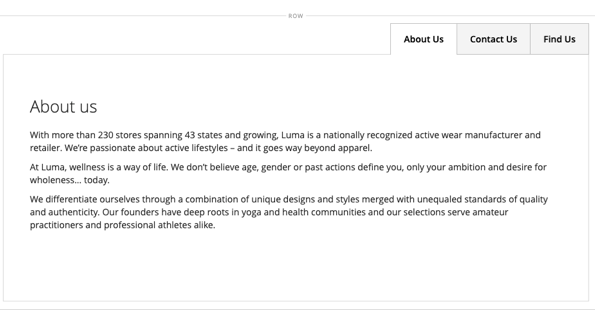

# レイアウト — タブ

以下を使用します。 _タブ_ コンテンツタイプ：タブのセットを [[!DNL Page Builder] ステージ](workspace.md#stage). パネルからステージにタブプレースホルダーをドラッグすると、最初に 1 つのデフォルトタブが表示されます。 タブをさらに追加して、完全なセットを作成できます。 タブセットの幅は、親コンテナの幅とパディングの設定によって決まります。

{width="500" zoomable="yes"}

{{$include /help/_includes/page-builder-save-timeout.md}}

## ツールボックス

を使用して _タブ_ コンテンツタイプを編集する場合は、個々のタブと、1 つ以上のタブを保持するタブコンテナを追加および編集します。 各タブには、タブをデザインするために使用する独自のツールボックスがあります。 [!DNL Page Builder] ステージ。

### 個々のタブツールボックス

{width="500" zoomable="yes"}

| ツール | アイコン | 説明 |
|--- |--- |--- |
| 移動 | {width="25"} | タブラベルの横にあるこのコントロールは、個々のタブをタブセット内の別の位置に移動するために使用します。 |
| 設定 | {width="25"} | タブを編集ページを開き、個々のタブのプロパティを変更できます。 |
| 複製 | {width="25"} | タブのコピーを作成します。 |
| 削除 | {width="25"} | タブセットからタブを削除します。 |

{style="table-layout:auto"}

### タブコンテナツールボックス

{width="500" zoomable="yes"}

| ツール | アイコン | 説明 |
|--- |--- |--- |
| 移動 | {width="25"} | タブのセットを親コンテナ内のグリッド上の別の位置に移動します。 |
| 追加 | {width="25"} | タブセットにタブを追加します。 |
| （ラベル） | [!UICONTROL Tabs] | 現在のコンテナをタブセットとして識別します。 コンテナの上の境界線の上にマウスポインターを置くと、ツールボックスが表示されます。 |
| 設定 | {width="25"} | 「タブを編集」ページが開き、コンテナのプロパティを変更できます。 |
| 非表示 | {width="25"} | タブコンテナを非表示にします。 |
| 表示 | {width="25"} | 非表示のタブコンテナを表示します。 |
| 複製 | {width="25"} | 現在のタブのコピーを作成します。 |
| 削除 | {width="25"} | 現在のタブセットをステージから削除します。 |

{style="table-layout:auto"}

{{$include /help/_includes/page-builder-hidden-element-note.md}}

## 個々のタブの追加

1. Adobe Analytics の [!DNL Page Builder] 下のパネル _[!UICONTROL Layout]_をクリックし、**[!UICONTROL Tabs]**プレースホルダーを直接ステージまたはステージ上の行または列に追加します。

   {width="600" zoomable="yes"}

1. 次をクリック： **[!UICONTROL Tab 1]** 個々のタブツールボックスを表示し、 _設定_ ( {width="20"} ) アイコンをクリックします。

1. 次を入力します。 **[!UICONTROL Tab Name]** を選択します。

   {width="600" zoomable="yes"}

1. 必要に応じて、 **[!UICONTROL Minimum Height]** 」をクリックします。

   この値は、任意の有効な CSS 単位 ( `100px`, `50%`, `50em`, `100vh`) または計算 ( `100vh - 237px`) をクリックします。

1. を選択します。 **[!UICONTROL Vertical Alignment]** 設定を使用して、タブに追加されるコンテンツコンテナ（上、中央、下）を揃えます。

1. 必要に応じて、次のセクションをガイダンスとして使用して、その他のオプションを設定します。

   - [[!UICONTROL Background]][background]
   - [[!UICONTROL Advanced]][advanced]

1. 右上隅で、 **[!UICONTROL Save]** 設定を適用し、に戻るには、次の手順に従います。 [!DNL Page Builder] ワークスペース。

## 一連のタブを追加する

次の手順は、個々のタブから始まり、タブコンテナ内に 3 つのタブのセットを作成します。 個々のタブがまだない場合は、前の手順に従って 1 つのタブをステージに追加します。

1. タブコンテナの上にマウスポインターを置いてツールボックスを表示し、 _追加_ ( {width="20"} ) アイコンをクリックします。

1. をクリックします。 **[!UICONTROL Tab 2]** ラベル：カーソルを表示し、タブに独自のラベルを入力します。

1. ステージで 2 番目のタブを再度クリックし、「 」を選択します。 _複製_ ( {width="20"} ) アイコンをクリックします。

1. YourName をクリックします。 **[!UICONTROL Copy]** ラベル：カーソルを表示し、3 番目のタブに独自のラベルを入力します。

{width="600" zoomable="yes"}

## セット内でのタブの移動

1. 移動するタブをクリックします。

1. を選択し、 _移動_ ( {width="20"} ) アイコン ( タブラベルテキストの直前に表示され、タブセット内の新しい位置に移動します。

## タブへのコンテンツの追加

行に移動する場合と同様に、任意のコンテンツタイプをタブに追加できます。 例として、次の手順を使用して、テキストコンテンツタイプを追加します。

1. コンテンツを追加するタブをクリックします。

1. Adobe Analytics の [!DNL Page Builder] パネル、展開 **[!UICONTROL Elements]** をクリックし、 **テキスト** プレースホルダーをタブに追加します。

1. エディターにテキストを入力または貼り付け、エディターツールバーを使用して必要に応じて書式を設定します。

   詳しくは、 [要素 — テキスト](text.md) を参照してください。

   {width="500" zoomable="yes"}

1. 右上隅で、 **[!UICONTROL Save]**.

## 個々のタブ設定の変更

1. 個々のタブの上にマウスポインターを置いてツールボックスを表示し、 _設定_ ( {width="20"} ) アイコンをクリックします。

1. 必要に応じて、タブの基本設定を変更します。

   - **[!UICONTROL Tab Name]**  — タブラベルの改訂されたテキストを入力します。 ステージ上でラベルを直接変更することもできます。

   - **[!UICONTROL Minimum Height]**  — 高さの自動設定を上書きする場合は、ピクセル単位でを入力します。 例えば、背景画像の高さに合わせて最小の高さを設定し、画像全体が表示されるようにすることができます。

   - **[!UICONTROL Vertical Alignment]**  — タブに追加されるコンテンツコンテナの垂直方向の位置を選択します。

1. 必要に応じて、次のセクションを使用して、その他の設定を変更します。

1. 完了したら、「 **[!UICONTROL Save]** 設定を適用し、に戻るには、次の手順に従います。 [!DNL Page Builder] ワークスペース。

### 背景

- **[!UICONTROL Background Color]**  — スウォッチを選択するか、カラーピッカーをクリックするか、有効なカラー名または同等の 16 進値を入力して、背景色を指定します。 この設定は、行の背景色を決定します。 また、カラーの不透明度を調整することもできます。

  {width="200"}

  値は、次の 3 つの方法で入力できます。

   - 事前定義済みの色名（例： ） `White`

   - 色の 16 進数カラー値（例： ） `#ffffff`

   - 色の rgba 値（不透明度の割合を含む）。次に例を示します。 `rgba(255, 255, 255, 0.75)`

  カラーを選択する場合は、 _カラーなし_ ボックス。

  {width="600" zoomable="yes"}

  カラーボックスをクリックしてカラーピッカーを再度開くと、スライダの下のボックスに現在の赤、緑、青、アルファの値 (rgba) が表示されます。 最後の数値は、現在の不透明度の割合を小数で示します。 スライダーを使用して不透明度を調整したり、必要な 10 進数値を入力したりできます。

  {width="600" zoomable="yes"}

  >[!NOTE]
  >
  >[!DNL Page Builder] は、透明度レイヤーをサポートしています。 _アルファチャンネル_：様々な不透明度の背景の作成に使用できる背景画像。

- **[!UICONTROL Background Image]**  — 必要に応じて、提供されているツールを使用して、タブに適用する背景画像を選択します。

  | ツール | 説明 |
  |--- |--- |
  | [!UICONTROL Upload] | ローカルコンピューターからギャラリーに画像ファイルをアップロードし、「 」タブの背景画像として適用します。 |
  | [!UICONTROL Select from Gallery] | ギャラリーからタブの背景画像として既存の画像を選択するように求めるプロンプトが表示されます。 |
  | {width="25"} | 画像をカメラタイルにドラッグするか、ローカルファイルシステム内の画像を参照することができます。 |

  {style="table-layout:auto"}

- **[!UICONTROL Background Mobile Image]**  — 必要に応じて、同じツールを使用して、モバイルデバイスでの表示に使用する別の背景画像を選択します。

- **[!UICONTROL Background Size]**  — タブの幅に対する背景画像の拡大/縮小方法を選択します。

  | オプション | 説明 |
  |--- |--- |
  | `Cover` | 背景画像はタブの全幅に表示されます。 |
  | `Contain` | 背景画像はタブ領域の幅に制限されます。 |
  | `Auto` | 現在のスタイルシートからサイズを適用します。 |

  {style="table-layout:auto"}

- **[!UICONTROL Background Position]**  — タブに対する背景画像のアンカー方法を選択します。 `Top Left` / `Top Center` / `Top Right` / `Center Left` / `Center` / `Center Right` / `Bottom Left` / `Bottom Center` / `Bottom Right`

- **[!UICONTROL Background Attachment]**  — 添付ファイルの種類を選択して、背景画像をスクロールページに対してどのように移動するかを指定します。

  | オプション | 説明 |
  | --- | --- |
  | `Scroll` | 添付された背景画像は、ページがスクロールするたびに下に移動するように同期されます。 |
  | `Fixed` | （モバイルでは使用できません）コンテナが画像をスクロールすると、背景画像は移動せず、指定された背景位置で固定されます。 |

  {style="table-layout:auto"}

- **[!UICONTROL Background Repeat]**  — に設定 `Yes` を繰り返して、「 」タブの使用可能なスペースを埋めます。

### 詳細

- タブに追加されるコンテンツコンテナの水平方向の配置を制御するには、 **[!UICONTROL Alignment]** .

  | オプション | 説明 |
  | --- | --- |
  | `Default` | 現在のテーマのスタイルシートで指定された位置揃えの既定の設定を適用します。 |
  | `Left` | コンテンツコンテナをタブの左の境界線に沿って揃えます。指定されたパディングに対する余裕を持たせます。 |
  | `Center` | コンテンツコンテナをタブの中央に揃え、指定されたパディングを許容します。 |
  | `Right` | コンテンツコンテナをタブの右側の境界線に沿って揃えます。指定されたパディングに適した位置に揃えます。 |

  {style="table-layout:auto"}

- を設定します。 **[!UICONTROL Border]** タブコンテナの 4 つの側面すべてに適用されるスタイル：

  | オプション | 説明 |
  | --- | --- |
  | `Default` | 関連するスタイルシートで指定された既定の罫線のスタイルを適用します。 |
  | `None` | コンテナの境界線を表示しません。 |
  | `Dotted` | コンテナの境界線は点線で表示されます。 |
  | `Dashed` | コンテナの境界線は破線で表示されます。 |
  | `Solid` | コンテナの境界線は実線で表示されます。 |
  | `Double` | コンテナの境界線は二重線で表示されます。 |
  | `Groove` | コンテナ境界は溝付きの線として表示されます。 |
  | `Ridge` | コンテナの境界線は、稜線として表示されます。 |
  | `Inset` | コンテナの境界線は、挿入線として表示されます。 |
  | `Outset` | コンテナの境界線は、アウトセット行として表示されます。 |

  {style="table-layout:auto"}

- 次の条件を満たさない境界線のスタイルを設定した場合： `None`、境界線の表示オプションを設定します。

  {width="600" zoomable="yes"}

  | オプション | 説明 |
  | ------ |------------ |
  | [!UICONTROL Border Color] | スウォッチを選択するか、カラーピッカーをクリックするか、有効なカラー名または同等の 16 進値を入力して、カラーを指定します。 |
  | [!UICONTROL Border Width] | 境界線の幅のピクセル数を入力します。 |
  | [!UICONTROL Border Radius] | ピクセル数を入力して、境界線の各隅を囲むために使用する半径のサイズを定義します。 |

  {style="table-layout:auto"}

  次の例の行の境界線の半径は 15 です。

  {width="500"}

- （オプション） **[!UICONTROL CSS classes]** 現在のスタイルシートから列コンテナに適用します。

  複数のクラス名はスペースで区切ります。

- 次の値をピクセル単位で入力します。 **[!UICONTROL Margins and Padding]** をクリックして、列の外側の余白と内側の余白を指定します。

  タブコンテナ図で、対応する各値を入力します。

  | コンテナ領域 | 説明 |
  | -------------- | ---------- |
  | [!UICONTROL Margins] | コンテナのすべての側面の外側の端に適用される空白の量。 オプション： `Top` / `Right` / `Bottom` / `Left` |
  | [!UICONTROL Padding] | コンテナのすべての側面の内側の端に適用される空白の量。 オプション： `Top` / `Right` / `Bottom` / `Left` |

  {style="table-layout:auto"}

## タブセット設定の変更

1. タブセットコンテナの上の境界線にマウスポインターを置いてツールボックスを表示し、 _設定_ ( {width="20"} ) アイコンをクリックします。

1. 必要に応じて、 **[!UICONTROL Default Active Tab]**.

   セット内で、ページの読み込み時にアクティブにするタブを選択します。

1. 次を入力します。 **[!UICONTROL Minimum Height]**&#x200B;タブセットの自動高さを上書きする場合は、ピクセル単位で指定します。

1. ナビゲーションタブをタブセットの上部に配置するには、 **[!UICONTROL Tab Navigation Alignment]** (`Left`, `Center`または `Right`) をクリックします。

   {width="500" zoomable="yes"}

1. タブセットの詳細オプションを設定します。

   - 親コンテナ内でのタブセットの位置を制御するには、 **[!UICONTROL Alignment]**:

     | オプション | 説明 |
     | ------ | ---------- |
     | `Default` | 現在のテーマのスタイルシートで指定された位置揃えの既定の設定を適用します。 |
     | `Left` | 親コンテナの左の境界線に沿ってタブセットを揃えます。指定されたパディングの値を使用します。 |
     | `Center` | 親コンテナの中央にタブセットを揃え、指定されたパディングを許容します。 |
     | `Right` | 親コンテナの右側の境界線に沿ってタブセットを揃えます。指定されたパディングの値を使用します。 |

     {style="table-layout:auto"}

   - を設定します。 **[!UICONTROL Border]** スタイルがタブコンテナの 4 つの側面すべてに適用されます。

     | オプション | 説明 |
     | ------ | ---------- |
     | `Default` | 関連するスタイルシートで指定された既定の罫線のスタイルを適用します。 |
     | `None` | コンテナの境界線を表示しません。 |
     | `Dotted` | コンテナの境界線は点線で表示されます。 |
     | `Dashed` | コンテナの境界線は破線で表示されます。 |
     | `Solid` | コンテナの境界線は実線で表示されます。 |
     | `Double` | コンテナの境界線は二重線で表示されます。 |
     | `Groove` | コンテナ境界は溝付きの線として表示されます。 |
     | `Ridge` | コンテナの境界線は、稜線として表示されます。 |
     | `Inset` | コンテナの境界線は、挿入線として表示されます。 |
     | `Outset` | コンテナの境界線は、アウトセット行として表示されます。 |

     {style="table-layout:auto"}

   - 次の条件を満たさない境界線のスタイルを設定した場合： `None`、境界線の表示オプションを設定します。

     | オプション | 説明 |
     | ------ |------------ |
     | [!UICONTROL Border Color] | スウォッチを選択するか、カラーピッカーをクリックするか、有効なカラー名または同等の 16 進値を入力して、カラーを指定します。 |
     | [!UICONTROL Border Width] | 境界線の幅のピクセル数を入力します。 |
     | [!UICONTROL Border Radius] | ピクセル数を入力して、境界線の各隅を囲むために使用する半径のサイズを定義します。 |

     {style="table-layout:auto"}

   - （オプション） **[!UICONTROL CSS classes]** 現在のスタイルシートからタブコンテナに適用します。

     複数のクラス名はスペースで区切ります。

   - 次の値をピクセル単位で入力します。 **[!UICONTROL Margins and Padding]** を使用して、タブコンテナの外側の余白と内側の余白を指定します。

     タブコンテナダイアグラムに、対応する値を入力します。

     | コンテナ領域 | 説明 |
     | -------------- | ---------- |
     | [!UICONTROL Margins] | コンテナのすべての側面の外側の端に適用される空白の量。 オプション： `Top` / `Right` / `Bottom` / `Left` |
     | [!UICONTROL Padding] | コンテナのすべての側面の内側の端に適用される空白の量。 オプション： `Top` / `Right` / `Bottom` / `Left` |

     {style="table-layout:auto"}

1. 完了したら、「 **[!UICONTROL Save]** 設定を適用し、に戻るには、次の手順に従います。 [!DNL Page Builder] ワークスペース。

[background]: #background
[advanced]: #advanced
