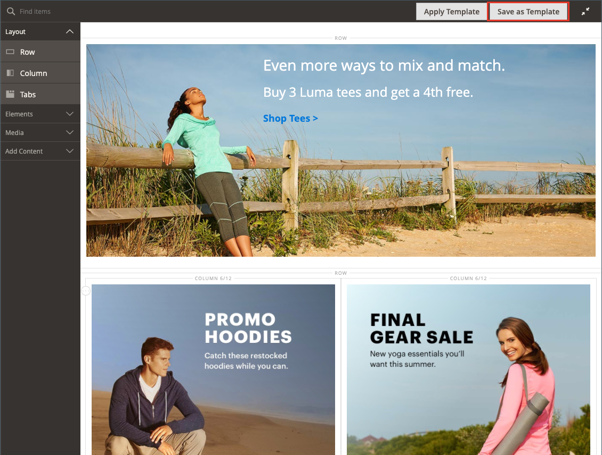

# [!DNL Page Builder] テンプレート

テンプレートは、[!DNL Page Builder]個のコンテンツと、既存のページ、ブロック、動的ブロック、製品属性、カテゴリ説明のレイアウトを保存するコンテナです。 テンプレートを使用することで、コンテンツの作成（または古いコンテンツの置き換え）にかかる時間と労力を削減できます。 例えば、既存の[!DNL Page Builder] コンテンツをテンプレートとして保存し、そのテンプレートを（すべてのコンテンツとレイアウトを含めて）別の領域に適用して、[!DNL Page Builder] コンテンツをすばやく作成できます。

## テンプレートへのアクセス

_管理者_ サイドバーで、**[!UICONTROL Content]** > _[!UICONTROL Elements]_>**[!UICONTROL Templates]**&#x200B;に移動します。

{width="700" zoomable="yes"}

## [!DNL Page Builder] コンテンツをテンプレートとして保存

1. [[!DNL Page Builder]  ステージ &#x200B;](workspace.md#stage)に移動し、テンプレートとして保存するコンテンツにアクセスします。

   これには、ページ、ブロック、ダイナミックブロック、製品属性、カテゴリ説明を使用できます。

1. ステージの上で、右上の「**[!UICONTROL Save as Template]**」をクリックします。

   テンプレートとして保存ボタン {width="600" zoomable="yes"}を使用した[!DNL Page Builder] ステージ

   このアクションは、_[!UICONTROL Save Content as Template]_&#x200B;ダイアログを表示します。

   ![[!DNL Page Builder] テンプレートとして保存ダイアログ &#x200B;](./assets/pb-templates-save-dialog.png){width="400" zoomable="yes"}

1. **[!UICONTROL Template Name]**&#x200B;に、テンプレートの一意の名前を入力します。

   必要に応じて、一意の名前を検索して選択し、別のコンテンツ領域に適用できるように、一意の名前が必要です。

1. 必要に応じて、**作成日**&#x200B;を設定して、テンプレートを特定のコンテンツ領域タイプに割り当てます。

   この割り当てを追加すると、後でテンプレートを適用する際に、その割り当てをフィルタリングして簡単に見つけることができます。 しかし、その用途はその地域に限定されません。 [!DNL Page Builder] コンテンツが許可されている任意の場所で、任意のテンプレートを使用できます。

1. **[!UICONTROL Save]**&#x200B;をクリックします。

   テンプレートが保存されたことを示す確認メッセージが表示されます。

## テンプレートの適用

テンプレートは、[!DNL Page Builder] コンテンツ領域（ページ、ブロック、動的ブロック、製品属性、またはカテゴリの説明）に適用できます。

1. テンプレートを適用するコンテンツ領域に移動します。

1. コンテンツ領域で、右上の「**[!UICONTROL Apply Template]**」をクリックします。

   ![[!DNL Page Builder] 「テンプレートを適用」ボタン &#x200B;](./assets/pb-templates-applytemplate-button.png){width="600" zoomable="yes"}

1. _[!UICONTROL Apply Template]_&#x200B;グリッドからテンプレートを選択し、行の最後にある&#x200B;**[!UICONTROL Apply]**&#x200B;をクリックします。

   テンプレート全体を表示するには、テンプレートのサムネール画像をクリックします。 このアクションは、画像を拡張して、必要に応じてテンプレート全体を表示できるようにします。

   ![[!DNL Page Builder] テンプレートグリッドを適用](./assets/pb-templates-apply-slideout-nofilters.png){width="600" zoomable="yes"}

## テンプレートの削除

1. _管理者_ サイドバーで、**[!UICONTROL Content]** > **[!UICONTROL Templates]**&#x200B;に移動します。

1. _テンプレート_ ページで、テンプレートを選択し、行の最後にある&#x200B;**[!UICONTROL Delete]**&#x200B;をクリックします。

   テンプレート全体を表示するには、テンプレートのサムネール画像をクリックします。 このアクションは、画像を拡張して、必要に応じてテンプレート全体を表示できるようにします。

1. プロンプトが表示されたら、テンプレートの削除を確認します。

## フィルターテンプレート

_テンプレートを適用_ グリッドと&#x200B;_テンプレート_ ページグリッドには、テンプレートグリッドをフィルタリングする2つの方法が用意されています。

- 左上の検索ボックスを使用して、入力したテキストに基づいてテンプレート名でグリッドをフィルタリングします。

- 「**[!UICONTROL Filters]**」をクリックしてフィルターオプションを開き、次の方法でテンプレートをフィルタリングできます。

   - テンプレート IDの範囲（**[!UICONTROL ID]**）
   - 作成日の範囲（**[!UICONTROL Created]**）
   - テンプレート名（**[!UICONTROL Template Name]**）
   - 指定されたコンテンツ領域（**[!UICONTROL Created For]**）

![[!DNL Page Builder] テンプレートグリッドを適用](./assets/pb-templates-apply-slideout-withfilters.png){width="600" zoomable="yes"}

## コンテンツテンプレートのデモ

このビデオでは、ページビルダーのコンテンツテンプレートについて説明します。

>[!VIDEO](https://video.tv.adobe.com/v/3410844?captions=jpn&quality=12&learn=on)
