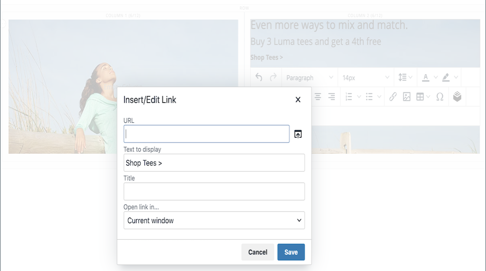

# 要素 – テキスト

の使用 _テキスト_ コンテンツタイプを使用すると、で WYSIWYG （&quot;What You See Is What You Get&quot;）エディターを使用してテキストコンテナを追加できます [[!DNL Page Builder] ステージ](workspace.md#stage). また、リンクや画像を追加できます。 [変数](../systems/variables-predefined.md)エディターツールバーからテキストへのウィジェット。

{width="700"}

{{$include /help/_includes/page-builder-save-timeout.md}}

## テキストエディターツール

テキストエディターには、ステージから直接アクセスすることも、設定ページからアクセスすることもできます。 ステージに直接加えられた変更は、自動的に保存されます。 詳しくは、を参照してください [エディターの使用](../content-design/editor.md).

{width="600"}

## テキストコンテナツールボックス

{width="600"}

| ツール | アイコン | 説明 |
| --------- | --------------------- | -------------- |
| 移動 | {width="25"} | テキスト コンテナをページ上の別の有効な場所に移動します。 |
| （ラベル） | テキスト | 現在のコンテナをテキスト要素として識別します。 |
| 設定 | {width="25"} | テキストコンテナのプロパティを編集モードで開きます。 |
| Hide | {width="25"} | テキストコンテナを非表示にします。 |
| 表示 | {width="25"} | 非表示のテキストコンテナを表示します。 |
| 複製 | {width="25"} | テキストコンテナをコピーします。 |
| 削除 | {width="25"} | テキストコンテナとそのコンテンツをステージから削除します。 |

{style="table-layout:auto"}

{{$include /help/_includes/page-builder-hidden-element-note.md}}

## テキストを追加

1. が含まれる [!DNL Page Builder] パネル、展開 **[!UICONTROL Elements]** をドラッグします。 **[!UICONTROL Text]** ステージ上の行、列またはタブセットへのプレースホルダー。

   {width="600" zoomable="yes"}

1. 必要に応じて、エディターを使用してテキストの入力や書式設定を行います。

   詳しくは、を参照してください [エディターの使用](../content-design/editor.md).

   {width="600"}

## リンクの作成

エディターの「リンクを挿入」ボタンを使用すると、ギャラリー内の画像にハイパーリンクを簡単に追加できます。 ただし、事前に URL があれば、テキスト内にインラインリンクを作成する場合にも使用できます。 ウィジェットボタンとは異なり、「リンクを挿入/編集」ボタンは、ストアのページ、製品、カテゴリには統合されません。

電話番号またはメールのリンクを作成するには、を参照してください。 [カスタム変数の追加](../systems/variables-custom.md).

1. ストアフロントで、リンクのターゲットにするページに移動し、リンク情報をコピーします。

   完全修飾 URL か、ストアドメインへの参照を省略する相対 URL のいずれかを使用できます。

   完全な URL - `https://mystore.com/women/tops-women/tees-women.html`

   相対 URL - `../women/tops-women/tees-women.html`

1. エディタースペースでテキストを選択し、 _リンクを挿入/編集_ （ {width="20"} ）を選択します。

   {width="500" zoomable="yes"}

1. の場合 **[!UICONTROL URL]**&#x200B;に、作成した相対リンクを入力します。

1. を設定 **[!UICONTROL Target]** 対象： `None`.

   この設定の場合、ページは新しいタブを開かずに同じブラウザーウィンドウで開きます。

1. の場合 **[!UICONTROL Title]**、と入力します `Shop Tees`.

   この `Title` リンク属性は、一部のブラウザーでツールヒントとして使用されます。

1. リンクを保存して、に戻るには [!DNL Page Builder] ワークスペース、クリック **[!UICONTROL OK]**.

   {width="500" zoomable="yes"}

## 画像の挿入

1. 画像を挿入するテキスト内の位置にカーソルを置きます。

1. クリック _画像を挿入/編集_ （ {width="20"} ）を選択します。

1. の場合 **[!UICONTROL Source]**&#x200B;を選択します。検索アイコンをクリックすると、メディアストレージを使用して画像を検索および選択できます。

1. の場合 **[!UICONTROL Image Description]**、画像の説明テキストを入力します。

   このテキストはに入力されます `alt` 画像のリンク属性で、アクセシビリティのために一部のブラウザーで使用されます。

1. 幅と高さを入力 **[!UICONTROL Dimensions]**&#x200B;ページ上に画像をレンダリングするためのピクセル単位。

   保持： **[!UICONTROL Constrain proportions]** 画像の縦横比を自動的に維持する場合に選択したチェックボックス。

1. 画像を挿入して、に戻るには [!DNL Page Builder] ワークスペース、クリック **[!UICONTROL OK]**.

## テキスト設定の変更

1. テキストコンテナにカーソルを合わせてツールボックスを表示し、 _設定_ （ {width="20"} ） アイコンをクリックします。

   >[!NOTE]
   >
   >テキストコンテナは別のコンテナ内に密にネストされているので、正しいツールボックスがあることを確認してください。

1. 必要に応じてコンテンツを更新します。

1. を更新 _[!UICONTROL Advanced]_必要に応じて設定します。

   - 親コンテナ内のテキストの位置を制御するには、 **[!UICONTROL Alignment]**:

     | オプション | 説明 |
     | ------ |------------ |
     | `Default` | 現在のテーマのスタイル シートで指定されている線形の既定の設定を適用します。 |
     | `Left` | 親コンテナの左罫線に沿ってリストを配置します。指定したパディングはすべて許可されます。 |
     | `Center` | 親コンテナの中央にリストを揃えます。指定したパディングに対する許容値を使用します。 |
     | `Right` | 親コンテナの右端に沿ってブロックを配置します。指定したパディングは許可されます。 |

     {style="table-layout:auto"}

   - を **[!UICONTROL Border]** テキストコンテナの 4 つの辺すべてに適用されるスタイル：

     | オプション | 説明 |
     | ------ |------------ |
     | `Default` | 関連付けられたスタイル シートで指定されている既定の罫線スタイルを適用します。 |
     | `None` | コンテナの境界線の表示はしません。 |
     | `Dotted` | コンテナの境界線は点線で表示されます。 |
     | `Dashed` | コンテナの境界線は破線で表示されます。 |
     | `Solid` | コンテナの境界線は実線で表示されます。 |
     | `Double` | コンテナの境界線は二重線で表示されます。 |
     | `Groove` | コンテナの境界線は溝付き線で表示されます。 |
     | `Ridge` | コンテナの境界線は、境界線として表示されます。 |
     | `Inset` | コンテナの境界線は、インセットされた線として表示されます。 |
     | `Outset` | コンテナの境界線は、先頭行として表示されます。 |

     {style="table-layout:auto"}

   - 境界線のスタイルを `None`の場合は、次のボーダー表示オプションを入力します。

     | オプション | 説明 |
     | ------ |------------ |
     | [!UICONTROL Border Color] | 見本を選択するか、カラーピッカーをクリックするか、有効なカラー名または同等の 16 進数値を入力して、カラーを指定します。 |
     | [!UICONTROL Border Width] | 境界線の幅のピクセル数を入力します。 |
     | [!UICONTROL Border Radius] | ピクセル数を入力して、境界線の各コーナーを丸めるために使用する半径のサイズを定義します。 |

     {style="table-layout:auto"}

   - （オプション）の名前を指定します **[!UICONTROL CSS classes]** を現在のスタイルシートから取得して、コンテナに適用します。

     複数のクラス名はスペースで区切ります。

   - 次の値をピクセル単位で入力 **[!UICONTROL Margins and Padding]** テキストコンテナの外側の余白と内側のパディングを決定します。

     対応する値を図に入力します。

     | コンテナ領域 | 説明 |
     | -------------- |------------ |
     | [!UICONTROL Margins] | コンテナのすべての側面の外側の端に適用される空白スペースの量。 オプション： `Top` / `Right` / `Bottom` / `Left` |
     | [!UICONTROL Padding] | コンテナのすべての側面の内側の端に適用される空白のスペースの量です。 オプション： `Top` / `Right` / `Bottom` / `Left` |

     {style="table-layout:auto"}

1. 完了したら、 **[!UICONTROL Save]** 設定を適用し、 [!DNL Page Builder] ワークスペース。
