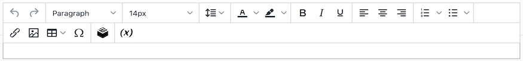
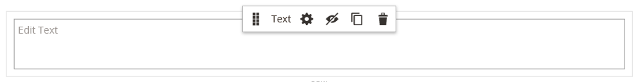
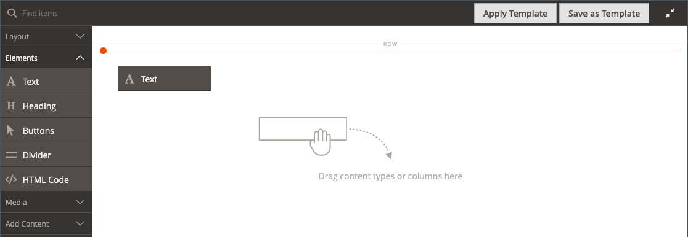
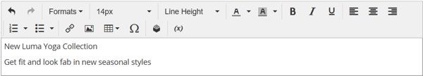
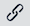
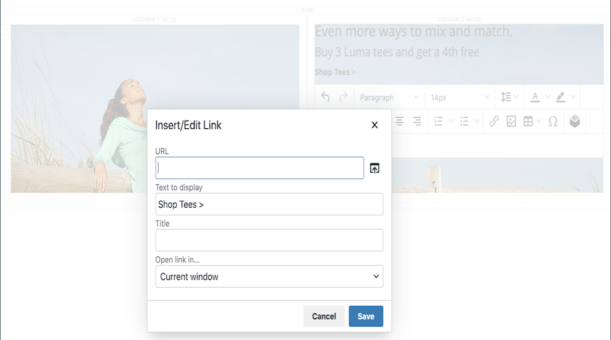
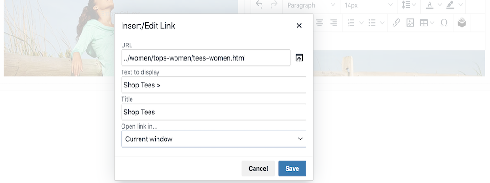
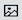

# 要素 – テキスト

_Text_ コンテンツタイプを使用して、[[!DNL Page Builder]  ステージ &#x200B;](workspace.md#stage)でWYSIWYG （「What You See Is What You Get」）エディターを使用してテキストコンテナを追加します。 さらに、エディターツールバーから、リンク、画像、[変数](../systems/variables-predefined.md)およびウィジェットをテキストに追加できます。

{width="700"}

{{$include /help/_includes/page-builder-save-timeout.md}}

## テキストエディターツール

ステージまたは設定ページから直接テキストエディターにアクセスできます。 ステージに直接加えられた変更は、自動的に保存されます。 詳しくは、[&#x200B; エディターの使用](../content-design/editor.md)を参照してください。

{width="600"}

## テキストコンテナツールボックス

{width="600"}

| ツール | アイコン | 説明 |
| --------- | --------------------- | -------------- |
| 移動 | {width="25"} | テキストコンテナをページ上の別の有効な場所に移動します。 |
| （ラベル） | テキスト | 現在のコンテナをテキスト要素として識別します。 |
| 設定 | {width="25"} | テキストコンテナプロパティを編集モードで開きます。 |
| 非表示 | {width="25"} | テキストコンテナを非表示にします。 |
| 表示 | {width="25"} | 非表示のテキストコンテナを表示します。 |
| 重複 | {width="25"} | テキストコンテナのコピーを作成します。 |
| 削除 | {width="25"} | ステージからテキストコンテナとそのコンテンツを削除します。 |

{style="table-layout:auto"}

{{$include /help/_includes/page-builder-hidden-element-note.md}}

## テキストを追加

1. [!DNL Page Builder] パネルで、**[!UICONTROL Elements]**&#x200B;を展開し、**[!UICONTROL Text]** プレースホルダーをステージ上の行、列、またはタブ セットにドラッグします。

   {width="600" zoomable="yes"}

1. 必要に応じて、エディターを使用してテキストを入力および書式設定します。

   詳しくは、[&#x200B; エディターの使用](../content-design/editor.md)を参照してください。

   {width="600"}

## リンクの作成

エディターの「リンクを挿入」ボタンを使用すると、ギャラリー内の画像にハイパーリンクを簡単に追加できます。 ただし、事前にURLがある場合は、テキスト内にインラインリンクを作成するために使用することもできます。 「ウィジェット」ボタンとは異なり、「リンクを挿入/編集」ボタンは、ストア内のページ、製品、またはカテゴリと統合されません。

電話番号または電子メールのリンクを作成するには、[&#x200B; カスタム変数の追加](../systems/variables-custom.md)を参照してください。

1. ストアフロントで、リンクのターゲット先となるページに移動し、リンク情報をコピーします。

   完全修飾URLまたはストアドメインへの参照を省略する相対URLを使用できます。

   フル URL - `https://mystore.com/women/tops-women/tees-women.html`

   相対URL - `../women/tops-women/tees-women.html`

1. エディタースペースでテキストを選択し、エディターツールバーの&#x200B;_リンクの挿入/編集_ （{width="20"}）をクリックします。

   {width="500" zoomable="yes"}

1. **[!UICONTROL URL]**&#x200B;に、準備した相対リンクを入力します。

1. **[!UICONTROL Target]**&#x200B;を`None`に設定します。

   この設定では、新しいタブを開くのではなく、同じブラウザーウィンドウでページが開きます。

1. **[!UICONTROL Title]**&#x200B;に対して、`Shop Tees`と入力します。

   一部のブラウザーでは、`Title` リンク属性がツールチップとして使用されています。

1. リンクを保存して[!DNL Page Builder] ワークスペースに戻るには、**[!UICONTROL OK]**&#x200B;をクリックします。

   {width="500" zoomable="yes"}

## 画像の挿入

1. 画像を挿入するテキスト内にカーソルを置きます。

1. エディターツールバーの「_画像を挿入/編集_」（{width="20"}）をクリックします。

1. **[!UICONTROL Source]**&#x200B;の場合、検索アイコンをクリックして、画像の検索と選択にメディアストレージを使用します。

1. **[!UICONTROL Image Description]**&#x200B;に、画像の説明テキストを入力します。

   このテキストは、画像の`alt` リンク属性を入力し、一部のブラウザーでアクセシビリティのために使用されます。

1. ページ上に画像をレンダリングするために、幅と高さ&#x200B;**[!UICONTROL Dimensions]**&#x200B;をピクセル単位で入力します。

   画像の縦横比を自動的に維持するには、**[!UICONTROL Constrain proportions]** チェックボックスを選択したままにします。

1. 画像を挿入して[!DNL Page Builder] ワークスペースに戻るには、**[!UICONTROL OK]**&#x200B;をクリックします。

## テキスト設定の変更

1. テキストコンテナにカーソルを合わせてツールボックスを表示し、_設定_ （{width="20"}）アイコンを選択します。

   >[!NOTE]
   >
   >テキストコンテナは別のコンテナ内で厳密にネストされているため、適切なツールボックスがあることを確認してください。

1. 必要に応じてコンテンツを更新します。

1. 必要に応じて&#x200B;_[!UICONTROL Advanced]_&#x200B;設定を更新します。

   - 親コンテナ内のテキストの位置を制御するには、**[!UICONTROL Alignment]**&#x200B;を選択します。

     | オプション | 説明 |
     | ------ |------------ |
     | `Default` | 現在のテーマのスタイルシートで指定されている整列のデフォルト設定を適用します。 |
     | `Left` | 親コンテナの左端に沿ってリストを整列させ、指定されたパディングを許可します。 |
     | `Center` | 親コンテナの中央にリストを整列させ、指定された任意のパディングを許可します。 |
     | `Right` | 親コンテナの右端に沿ってブロックを整列させ、指定されたパディングを許可します。 |

     {style="table-layout:auto"}

   - テキストコンテナのすべての4つの側面に適用される&#x200B;**[!UICONTROL Border]** スタイルを設定します。

     | オプション | 説明 |
     | ------ |------------ |
     | `Default` | 関連付けられたスタイルシートで指定されたデフォルトの境界線スタイルを適用します。 |
     | `None` | コンテナの境界を表示しません。 |
     | `Dotted` | コンテナの境界線が点線で表示されます。 |
     | `Dashed` | コンテナの境界線が破線で表示されます。 |
     | `Solid` | コンテナの境界線が実線として表示されます。 |
     | `Double` | コンテナの境界線が2行で表示されます。 |
     | `Groove` | コンテナの境界線は、溝付き線として表示されます。 |
     | `Ridge` | コンテナの境界線は、うね付きの線として表示されます。 |
     | `Inset` | コンテナの境界線がインセット線として表示されます。 |
     | `Outset` | コンテナの境界線がアウトセット線として表示されます。 |

     {style="table-layout:auto"}

   - `None`以外の境界線スタイルを設定する場合は、境界線の表示オプションを完了します。

     | オプション | 説明 |
     | ------ |------------ |
     | [!UICONTROL Border Color] | 色見本を選択するか、カラーピッカーをクリックするか、有効なカラー名または同等の16進数値を入力して、カラーを指定します。 |
     | [!UICONTROL Border Width] | 境界線の幅のピクセル数を入力します。 |
     | [!UICONTROL Border Radius] | 境界線の各隅を丸めるために使用する半径のサイズを定義するピクセル数を入力します。 |

     {style="table-layout:auto"}

   - （オプション）現在のスタイルシートから&#x200B;**[!UICONTROL CSS classes]**&#x200B;の名前を指定して、コンテナに適用します。

     複数のクラス名はスペースで区切ります。

   - **[!UICONTROL Margins and Padding]**&#x200B;の値をピクセル単位で入力して、テキストコンテナの外側の余白と内側の余白を決定します。

     対応する値をダイアグラムに入力します。

     | コンテナ領域 | 説明 |
     | -------------- |------------ |
     | [!UICONTROL Margins] | コンテナのすべての側面の外側のエッジに適用される空白スペースの量。 オプション：`Top` / `Right` / `Bottom` / `Left` |
     | [!UICONTROL Padding] | コンテナのすべての側面の内側エッジに適用される空白スペースの量。 オプション：`Top` / `Right` / `Bottom` / `Left` |

     {style="table-layout:auto"}

1. 完了したら、**[!UICONTROL Save]**&#x200B;をクリックして設定を適用し、[!DNL Page Builder] ワークスペースに戻ります。

<!-- Last updated from includes: 2023-09-11 14:30:19 -->
