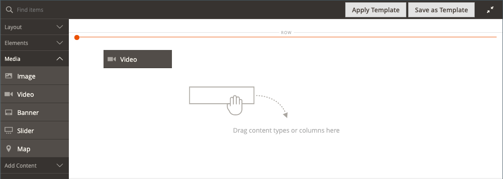

# メディア – ビデオ

_ビデオ_ コンテンツタイプを使用して、[YouTube][1] または [Vimeo][2] でホストされているビデオを [[!DNL Page Builder]  ステージ ](workspace.md#stage) に追加します。 ページやブロック、または製品やカテゴリの説明にビデオを簡単に埋め込むことができます。

{width="700" zoomable="yes"}

{{$include /help/_includes/page-builder-save-timeout.md}}

## ビデオツールボックス

{width="600" zoomable="yes"}

| ツール | アイコン | 説明 |
|--- |--- |--- |
| 移動 | {width="25"} | ビデオをステージ上の別の位置に移動します。 |
| （ラベル） | [!UICONTROL Video] | 現在のコンテンツコンテナをビデオとして識別します。 画像コンテナにカーソルを合わせると、ツールボックスが表示されます。 |
| 設定 | {width="25"} | _[!UICONTROL Edit Video]_&#x200B;ページが開き、ビデオとコンテナのプロパティを変更できます。 |
| Hide | {width="25"} | 現在のビデオを非表示にします。 |
| 表示 | {width="25"} | 非表示のビデオを表示します。 |
| 複製 | {width="25"} | ビデオをコピーします。 |
| 削除 | {width="25"} | ステージからビデオを削除します。 |

{style="table-layout:auto"}

{{$include /help/_includes/page-builder-hidden-element-note.md}}

## ビデオを追加

1. 開始する前に、埋め込む [YouTube][1] または [Vimeo][2] ビデオに移動し、リンクをコピーします。

   または、有効なビデオファイルへの直接リンクをコピーすることもできます。 有効なリンクについては、[ 基本ビデオ設定 ](#basic-video-settings) を参照してください。

1. [!DNL Commerce] Admin で、ビデオを追加する [!DNL Page Builder] ワークスペースに戻ります。

1. [!DNL Page Builder] パネルで **[!UICONTROL Media]** を展開し、**[!UICONTROL Video]** プレースホルダーをステージにドラッグします。

   {width="600" zoomable="yes"}

1. ビデオコンテナにカーソルを合わせてツールボックスを表示し、_設定_ （{width="20"}）アイコンを選択します。

1. **[!UICONTROL Video URL]**：コピーしたビデオの URL をペーストします。

   この例で使用される [!DNL Page Builder] ビデオの URL は `https://www.youtube.com/watch?v=Y0KNS7C5dZA` です。

1. ビデオの **[!UICONTROL Maximum Width]** を制限するには、最大幅をピクセル単位で入力します。

   空白の場合、ビデオの幅はコンテナで許可されている幅になり、余白とパディングを使用できます。

1. 右上隅にある「**[!UICONTROL Save]**」をクリックして設定を適用し、[!DNL Page Builder] ワークスペースに戻ります。

## ビデオ設定の変更

1. ビデオコンテナにカーソルを合わせてツールボックスを表示し、_設定_ （{width="20"}）アイコンを選択します。

1. 次の節に従って、設定を変更します。

   - [基本](#basic-video-settings)
   - [詳細](#advanced)

1. 右上隅にある「**[!UICONTROL Save]**」をクリックして設定を適用し、[!DNL Page Builder] ワークスペースに戻ります。

### 基本的なビデオ設定

1. 現在のビデオを変更するには、**[!UICONTROL Video URL]** を更新します。

   有効なビデオ URL を入力します。 有効なビデオ URL は、次へのリンクです。

   - YouTube ビデオ：`https://youtu.be/CoDhMRUUjeI`
   - Vimeo ビデオ：`https://vimeo.com/190156113`
   - 有効なビデオ ファイル （`.mp4` を推奨）: `https://myvideos.com/spiral.mp4`

1. ストアフロントのビデオに許可される幅を変更するには、新しい **[!UICONTROL Maximum Width]** をピクセル単位で入力します。

   空白の場合、ビデオはコンテナの全幅を拡大し、余白とパディングの許容値を減らします。

1. ページの読み込み後にビデオを自動開始するには、**[!UICONTROL Autoplay]** を `Yes` に設定します。

   自動再生が `Yes` に設定されている場合、ビデオはポリシーに従って再生時にミュートされます。 ただし、この設定を使用しても、モバイルデバイスでビデオを自動再生することはできません。 これらのポリシーについて詳しくは、次の開発者向けリソースを参照してください。

   - [Vimeo の自動再生ポリシー ](https://vimeo.zendesk.com/hc/en-us/articles/115004485728-Autoplaying-and-looping-embedded-videos)
   - [Google（Chrome/YouTube）の自動再生ポリシー ](https://developer.chrome.com/blog/autoplay/)
   - [ ローカルビデオの自動再生ポリシー ](https://developer.mozilla.org/en-US/docs/Web/Media/Autoplay_guide)

   自動再生が `No` に設定されている場合、ビデオはユーザーの要求に応じてのみ再生されます。

### [!UICONTROL Advanced]

1. コンテナ内のビデオの水平方向の位置を制御するには、**[!UICONTROL Alignment]** のいずれかを選択します。

   | オプション | 説明 |
   | ------ | ----------- |
   | `Default` | 現在のテーマのスタイル シートで指定されている線形の既定の設定を適用します。 |
   | `Left` | 指定したパディングを考慮して、ビデオコンテナの左境界線に沿ってコンテンツを配置します。 |
   | `Center` | 指定したパディングを許容して、ビデオコンテナの中央にコンテンツを揃えます。 |
   | `Right` | 指定したパディングを考慮して、ビデオコンテナの右端に沿ってコンテンツを配置します。 |

   {style="table-layout:auto"}

- ビデオコンテナの 4 つの辺すべてに適用する **[!UICONTROL Border]** スタイルを設定します。

  | オプション | 説明 |
  | ------ | ----------- |
  | `Default` | 関連付けられたスタイル シートで指定されている既定の罫線スタイルを適用します。 |
  | `None` | コンテナの境界線の表示はしません。 |
  | `Dotted` | コンテナの境界線は点線で表示されます。 |
  | `Dashed` | コンテナの境界線は破線で表示されます。 |
  | `Solid` | コンテナの境界線は実線で表示されます。 |
  | `Double` | コンテナの境界線は二重線で表示されます。 |
  | `Groove` | コンテナの境界線は溝付き線で表示されます。 |
  | `Ridge` | コンテナの境界線は、境界線として表示されます。 |
  | `Inset` | コンテナの境界線は、インセットされた線として表示されます。 |
  | `Outset` | コンテナの境界線は、先頭行として表示されます。 |

  {style="table-layout:auto"}

- `None` 以外の境界線のスタイルを設定する場合は、境界線の表示オプションを完了します。

  {width="600" zoomable="yes"}

  | オプション | 説明 |
  | ------ |------------ |
  | [!UICONTROL Border Color] | 見本を選択するか、カラーピッカーをクリックするか、有効なカラー名または同等の 16 進数値を入力して、カラーを指定します。 |
  | [!UICONTROL Border Width] | 境界線の幅のピクセル数を入力します。 |
  | [!UICONTROL Border Radius] | ピクセル数を入力して、境界線の各コーナーを丸めるために使用する半径のサイズを定義します。 |

  {style="table-layout:auto"}

- （オプション）ビデオコンテナに適用する現在のスタイルシートの **[!UICONTROL CSS classes]** の名前を指定します。

  複数のクラス名はスペースで区切ります。

- ビデオコンテナの外側の余白と内側のパディングを指定する **[!UICONTROL Margins and Padding]** の値をピクセル単位で入力します。

  対応する各値をビデオコンテナ図に入力します。

  | コンテナ領域 | 説明 |
  | -------------- | ----------- |
  | [!UICONTROL Margins] | コンテナのすべての側面の外側の端に適用される空白スペースの量。 |
  | [!UICONTROL Padding] | コンテナのすべての側面の内側の端に適用される空白のスペースの量です。 |

  {style="table-layout:auto"}

## ビデオの移動

1. ビデオコンテナにカーソルを合わせてツールボックスを表示し、_移動_ （{width="20"}）アイコンを選択します。

   {width="500" zoomable="yes"}

1. ビデオを選択して、赤いガイドラインのすぐ下の新しい位置にドラッグします。

   {width="500" zoomable="yes"}

## ステージからビデオを削除

1. ビデオコンテナにカーソルを合わせてツールボックスを表示し、「_削除_」（）アイコンを選択します。

1. 確認を求めるメッセージが表示されたら、「**[!UICONTROL OK]**」をクリックします。

[1]: https://www.youtube.com/
[2]: https://vimeo.com/

<!-- Last updated from includes: 2023-09-11 14:30:19 -->
