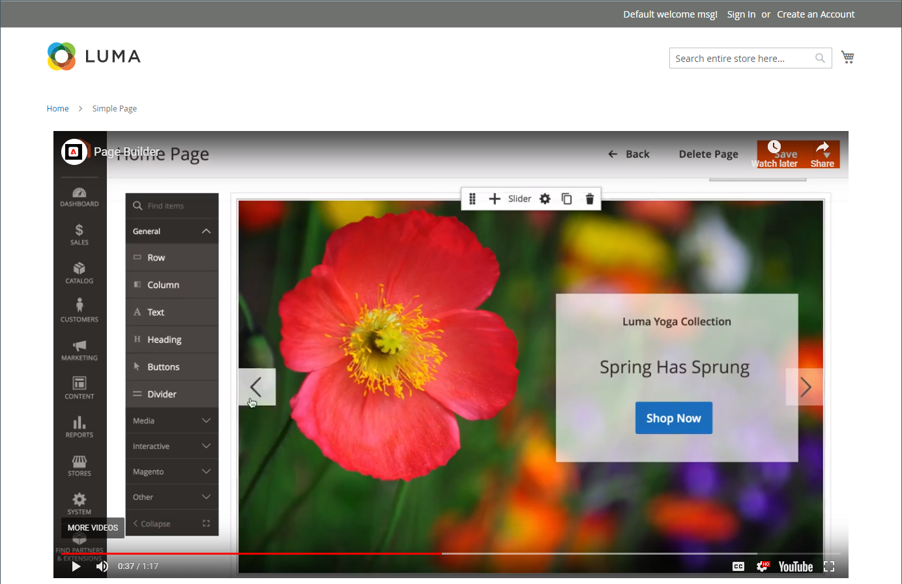
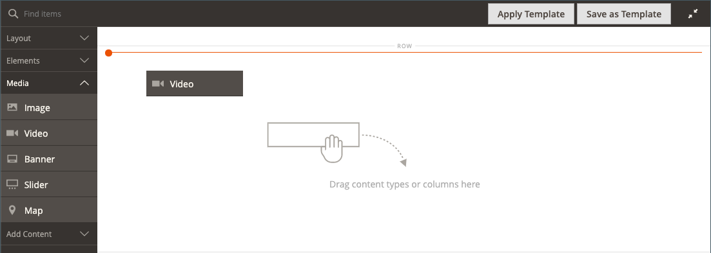

# メディア – ビデオ

_Video_ コンテンツ タイプを使用して、[YouTube](https://www.youtube.com/)または[Vimeo](https://vimeo.com/)でホストされているビデオを[[!DNL Page Builder]  ステージ ](workspace.md#stage)に追加します。 ページやブロック、商品やカテゴリーの説明に動画を簡単に埋め込むことができます。

{width="700" zoomable="yes"}

{{$include /help/_includes/page-builder-save-timeout.md}}

## ビデオツールボックス

{width="600" zoomable="yes"}

| ツール | アイコン | 説明 |
|--- |--- |--- |
| 移動 | {width="25"} | ビデオをステージ上の別の位置に移動します。 |
| （ラベル） | [!UICONTROL Video] | 現在のコンテンツコンテナをビデオとして識別します。 画像コンテナにカーソルを合わせると、ツールボックスが表示されます。 |
| 設定 | {width="25"} | ビデオとコンテナのプロパティを変更できる&#x200B;_[!UICONTROL Edit Video]_ページを開きます。 |
| 非表示 | {width="25"} | 現在のビデオを非表示にします。 |
| 表示 | {width="25"} | 非表示のビデオを表示します。 |
| 重複 | {width="25"} | ビデオのコピーを作成します。 |
| 削除 | {width="25"} | ステージからビデオを削除します。 |

{style="table-layout:auto"}

{{$include /help/_includes/page-builder-hidden-element-note.md}}

## ビデオを追加

1. 開始する前に、埋め込む[YouTube](https://www.youtube.com/)または[Vimeo](https://vimeo.com/)のビデオに移動し、リンクをコピーします。

   別の方法として、有効なビデオファイルへの直接リンクをコピーすることもできます。 有効なリンクについては、[基本的なビデオ設定](#basic-video-settings)を参照してください。

1. [!DNL Commerce]管理者で、ビデオを追加する[!DNL Page Builder] ワークスペースに戻ります。

1. [!DNL Page Builder] パネルで、**[!UICONTROL Media]**&#x200B;を展開し、**[!UICONTROL Video]** プレースホルダーをステージにドラッグします。

   {width="600" zoomable="yes"}

1. ビデオコンテナにカーソルを合わせてツールボックスを表示し、_設定_ （{width="20"}）アイコンを選択します。

1. **[!UICONTROL Video URL]**&#x200B;に、コピーしたビデオのURLを貼り付けます。

   この例で使用されている[!DNL Page Builder] ビデオのURLは`https://www.youtube.com/watch?v=Y0KNS7C5dZA`です。

1. ビデオの&#x200B;**[!UICONTROL Maximum Width]**&#x200B;を制限するには、最大幅をピクセル単位で入力します。

   空白の場合、ビデオはコンテナで許可される幅と同じ幅になり、余白とパディングが可能になります。

1. 右上隅の「**[!UICONTROL Save]**」をクリックして設定を適用し、[!DNL Page Builder] ワークスペースに戻ります。

## ビデオ設定の変更

1. ビデオコンテナにカーソルを合わせてツールボックスを表示し、_設定_ （{width="20"}）アイコンを選択します。

1. 次のセクションに従って設定を変更します。

   - [基本](#basic-video-settings)
   - [アドバンス](#advanced)

1. 右上隅の「**[!UICONTROL Save]**」をクリックして設定を適用し、[!DNL Page Builder] ワークスペースに戻ります。

### 基本的なビデオ設定

1. 現在のビデオを変更するには、**[!UICONTROL Video URL]**&#x200B;を更新します。

   ビデオのURLを入力してください。 有効なビデオ URLは、次のリンクに設定できます。

   - YouTube ビデオ：`https://youtu.be/CoDhMRUUjeI`
   - Vimeo ビデオ：`https://vimeo.com/190156113`
   - 有効なビデオファイル （`.mp4`をお勧めします）: `https://myvideos.com/spiral.mp4`

1. ストアフロントでビデオに使用できる幅を変更するには、新しい&#x200B;**[!UICONTROL Maximum Width]**&#x200B;をピクセル単位で入力します。

   空白の場合、ビデオはコンテナの全幅を拡張し、余白とパディングの許容値を小さくします。

1. ページの読み込み後にビデオを自動的に開始するには、**[!UICONTROL Autoplay]**&#x200B;を`Yes`に設定します。

   自動再生が`Yes`に設定されている場合、ビデオは再生時にポリシーに従ってミュートされます。 ただし、この設定でも、モバイルデバイスでビデオを自動再生することはできません。 これらのポリシーについて詳しくは、次の開発者向けリソースを参照してください。

   - [Vimeoの自動再生ポリシー](https://vimeo.zendesk.com/hc/en-us/articles/115004485728-Autoplaying-and-looping-embedded-videos)
   - [Googleからの自動再生ポリシー（Chrome/YouTube）](https://developer.chrome.com/blog/autoplay/)
   - [ローカル動画の自動再生ポリシー](https://developer.mozilla.org/en-US/docs/Web/Media/Autoplay_guide)

   自動再生が`No`に設定されている場合、ビデオはユーザーデマンドでのみ再生されます。

### [!UICONTROL Advanced]

1. コンテナ内でのビデオの水平方向の配置を制御するには、**[!UICONTROL Alignment]**&#x200B;を選択します。

   | オプション | 説明 |
   | ------ | ----------- |
   | `Default` | 現在のテーマのスタイルシートで指定されている整列のデフォルト設定を適用します。 |
   | `Left` | ビデオコンテナの左端に沿ってコンテンツを整列させ、指定されたパディングを許可します。 |
   | `Center` | ビデオコンテナの中央にあるコンテンツを、指定されたパディングを許可して整列させます。 |
   | `Right` | ビデオコンテナの右端に沿ってコンテンツを整列させ、指定されたパディングを許可します。 |

   {style="table-layout:auto"}

- ビデオコンテナのすべての4つの側面に適用される&#x200B;**[!UICONTROL Border]** スタイルを設定します。

  | オプション | 説明 |
  | ------ | ----------- |
  | `Default` | 関連付けられたスタイルシートで指定されたデフォルトの境界線スタイルを適用します。 |
  | `None` | コンテナの境界を表示しません。 |
  | `Dotted` | コンテナの境界線が点線で表示されます。 |
  | `Dashed` | コンテナの境界線が破線で表示されます。 |
  | `Solid` | コンテナの境界線が実線として表示されます。 |
  | `Double` | コンテナの境界線が2行で表示されます。 |
  | `Groove` | コンテナの境界線は、溝付き線として表示されます。 |
  | `Ridge` | コンテナの境界線は、うね付きの線として表示されます。 |
  | `Inset` | コンテナの境界線がインセット線として表示されます。 |
  | `Outset` | コンテナの境界線がアウトセット線として表示されます。 |

  {style="table-layout:auto"}

- `None`以外の境界線スタイルを設定する場合は、境界線の表示オプションを完了します。

  {width="600" zoomable="yes"}

  | オプション | 説明 |
  | ------ |------------ |
  | [!UICONTROL Border Color] | 色見本を選択するか、カラーピッカーをクリックするか、有効なカラー名または同等の16進数値を入力して、カラーを指定します。 |
  | [!UICONTROL Border Width] | 境界線の幅のピクセル数を入力します。 |
  | [!UICONTROL Border Radius] | 境界線の各隅を丸めるために使用する半径のサイズを定義するピクセル数を入力します。 |

  {style="table-layout:auto"}

- （オプション）ビデオコンテナに適用する現在のスタイルシートから&#x200B;**[!UICONTROL CSS classes]**&#x200B;の名前を指定します。

  複数のクラス名はスペースで区切ります。

- **[!UICONTROL Margins and Padding]**&#x200B;の値をピクセル単位で入力して、ビデオコンテナの外側の余白と内側の余白を指定します。

  ビデオコンテナダイアグラムに対応する各値を入力します。

  | コンテナ領域 | 説明 |
  | -------------- | ----------- |
  | [!UICONTROL Margins] | コンテナのすべての側面の外側のエッジに適用される空白スペースの量。 |
  | [!UICONTROL Padding] | コンテナのすべての側面の内側エッジに適用される空白スペースの量。 |

  {style="table-layout:auto"}

## ビデオの移動

1. ビデオコンテナにカーソルを合わせてツールボックスを表示し、_移動_ （{width="20"}）アイコンを選択します。

   {width="500" zoomable="yes"}

1. 赤いガイドラインのすぐ下にある新しい位置にビデオを選択してドラッグします。

   {width="500" zoomable="yes"}

## ステージからビデオを削除する

1. ビデオコンテナにカーソルを合わせてツールボックスを表示し、_削除_ （）アイコンを選択します。

1. 確認を求められたら、**[!UICONTROL OK]**&#x200B;をクリックします。

<!-- Last updated from includes: 2023-09-11 14:30:19 -->
