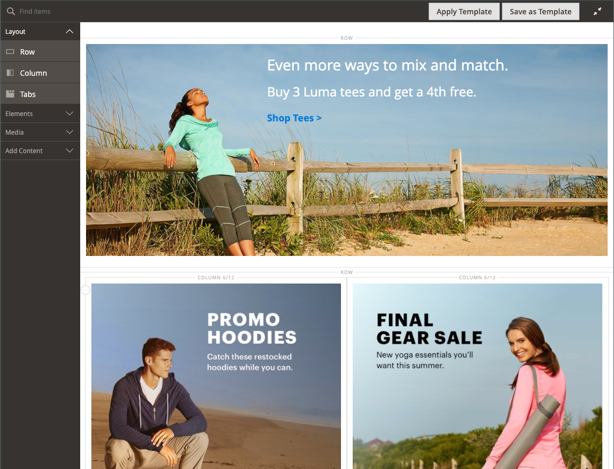
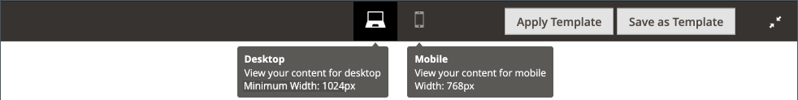
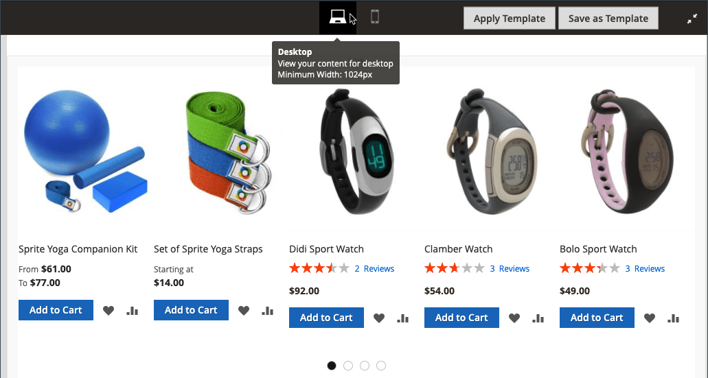
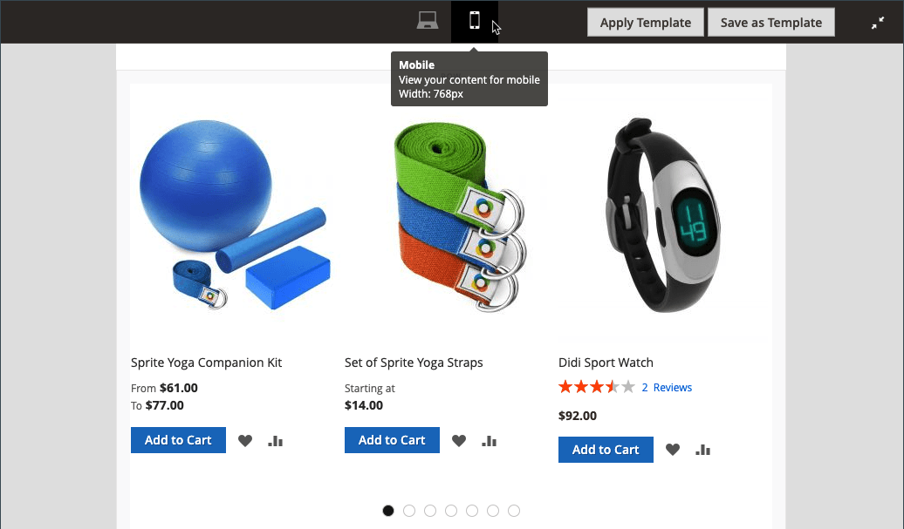
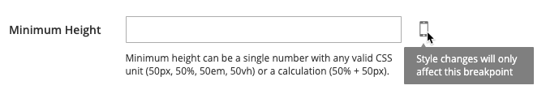

# [!DNL Page Builder] Workspace

[[!DNL Page Builder] が有効になっている](setup.md)場合、_[!UICONTROL Content]_セクションとコンテンツ作成プロセスが変更され、CMS [ ページ ](../content-design/page-add.md)、[製品](../catalog/product-content.md)、[ カテゴリ ](../catalog/categories-content-settings.md) ページ、[ ブロック ](../content-design/block-add.md)、および[動的ブロック ](../content-design/dynamic-blocks.md)の高度な[!DNL Page Builder] ツールを利用できるようになります。 このセクションには、_ コンテンツ見出し&#x200B;_フィールド、コンテンツのプレビュー、フルスクリーン [!DNL Page Builder] ワークスペースへの簡単なアクセスが含まれています。

[!DNL Page Builder]のプレビュー](./assets/pb-content-preview.png){width="700" zoomable="yes"}を含む![ コンテンツセクション

## コンテンツ見出し

検索エンジンはレベル 1 （H1）の見出しを探すので、レベル 1見出しを追加すると、ページが正しくインデックス付けされていることを確認する簡単な方法です。

>[!NOTE]
>
>ページの上部に表示される&#x200B;_[!UICONTROL Content Heading]_フィールドは、以前の[!DNL Commerce] リリースで作成されたコンテンツをサポートするレガシーフィールドです。 ただし、[!DNL Page Builder]の一部ではありません。 [!UICONTROL Content Heading]は、現在のテーマに関連付けられているスタイルシートに従って、H1見出しとして書式設定されます。 [!DNL Page Builder] ステージで定義されているアクティブなコンテンツ領域のすぐ上に配置されます。

すべてのレベルの見出しの位置と形式を最適に制御するには、_[!UICONTROL Content Heading]_フィールドを空のままにして、[!DNL Page Builder] [見出し](heading.md) コンテンツタイプを使用することをお勧めします。

{width="700" zoomable="yes"}

## プレビュー

_[!UICONTROL Content]_セクションを展開し、[!DNL Page Builder]で作成された既存のコンテンツがある場合、ページに表示されるコンテンツのプレビューが表示されます。**[!UICONTROL Edit with Page Builder]**をクリックするか、コンテンツのプレビュー領域内で[!DNL Page Builder] ワークスペースを開き、必要な更新を行うことができます。

>[!NOTE]
>
>ページビルダーのコンテンツエディターに、デフォルトのストアビューで使用できないCMS ページ要素のプレビューが表示されない。 例えば、デフォルト以外のストアビューにのみ割り当てられているCMS ブロックをプレビューすることはできません。 この場合、最初にCMS ページを公開する必要があります。 次に、ストアフロントでこのページを直接表示できます。 または、[!UICONTROL Action]列のCMS ページ [!UICONTROL View]を選択して、管理者の[!UICONTROL Pages] グリッドからページを表示することもできます。

{width="500" zoomable="yes"}

>[!NOTE]
>
>製品フォームとカテゴリーフォームの場合、このコンテンツプレビューはデフォルトで有効になっていますが、無効にすることができます。 プレビューの読み込みに伴いパフォーマンスが低下する場合は、[ コンテンツ管理設定](../configuration-reference/general/content-management.md#advanced-content-tools)でプレビューを無効にできます。

## ステージ

プレビューから[!DNL Page Builder] ワークスペースを開くと、このステージが主要な作業領域となり、コンテンツの作成と書式設定、ライブコンテンツのクイック編集を行うことができます。 ステージは最初は空で、左側のパネルから行、列、タブをドラッグできるデザインサーフェスが表示されます。

>[!NOTE]
>
>2.4.1 リリース以降、コンテンツ編集は、[!DNL Page Builder]によって制御されるすべての領域（CMS ページ、商品ページ、カテゴリページ、ブロック、動的ブロック）に対してのみフルスクリーンになりました。 フルスクリーン編集は、コンテンツに焦点を当て、ストアフロントのユーザーエクスペリエンスにより適したビューを提供します。

{width="600" zoomable="yes"}

{{$include /help/_includes/page-builder-save-timeout.md}}

## Viewports

_ビューポート_&#x200B;は、ユーザーが表示するweb ページの表示領域です。 フルスクリーンデザインモードでは、ビューポートボタンが[!DNL Page Builder] ステージの上に表示され、サイトユーザーがストアフロントでコンテンツを見たときにコンテンツが表示されます。

{width="500" zoomable="yes"}

[!DNL Page Builder]は、ビューポートのブレークポイントも定義します。 ブレークポイントは、特定のスタイルが適用される最小幅と最大幅を定義します。 [!DNL Page Builder] ビューポートには、次のコンテンツ ブレークポイントが用意されています。

- **デスクトップ ブレークポイント**—`min-width: 1024px`。 このブレークポイントは、1024 ピクセル以上の幅を測定するビューポート幅に定義されたスタイルを適用します。
- **モバイルブレークポイント**—`max-width: 768px, min-width: 640px`。 これらのブレークポイントは、768 ピクセルから640 ピクセルのビューポート幅に定義されたスタイルを適用します。

[!DNL Page Builder]個のビューポートには、次の2つの機能があります。**_コンテンツプレビュー_**&#x200B;と&#x200B;**_ブレークポイント設定_**。

### コンテンツプレビュー

デフォルトでは、[!DNL Page Builder]には2つのビューポート プレビューが用意されています。

- **デスクトップ** – 定義済みの幅を持たずにコンテンツのプレビューを表示します。 デスクトップ定義のスタイル（ブレークポイントの最小幅1024 ピクセルを使用）は、ページに引き続き適用されます。 ただし、デスクトップビューポートの幅は、行などのコンテナコンテンツタイプの設定によって定義されます。 デスクトップビューポートを選択すると、ブラウザーページの幅が1024 ピクセル以上の場合に、ストアフロントでコンテンツがどのようにスタイル設定されるかを確認できます。

  {width="500" zoomable="yes"}

- **モバイル** — コンテンツのプレビューを、事前に定義された幅768 ピクセルで表示します。 デスクトップビューポートとは異なり、モバイルビューポートでは、768 ピクセルの幅でページコンテンツが表示され、ブレークポイントの幅が768 ピクセル（最大）と640 ピクセル（最小）に定義されたスタイルも表示されます。

  {width="500" zoomable="yes"}

### ブレークポイント設定

ビューポート ボタンには、選択したビューポートに基づいて、コンテンツ タイプに異なるブレークポイント スタイルを適用するオプションも用意されています。 デフォルトでは、[!DNL Page Builder]は、行、列、タブ、タブアイテム、バナー、スライダー、スライドの&#x200B;_[!UICONTROL Minimum Height]_フィールドにブレークポイント設定を提供します。 モバイルビューポートを選択し、これらのコンテンツタイプのエディターを開くと、モバイルビューポートブレークポイントに固有のフィールド値を入力できます。 特定のブレークポイント設定を許可するコンテンツタイプフィールドでは、行の次の例のように、フィールドの右側にアイコンが表示されます。

ブレークポイント設定の{width="400"}

## パネル

[!DNL Page Builder] パネルはステージの左側にあり、ステージにドラッグできるコンテンツタイプが含まれています。 コンテンツタイプに固有のコンテナが、オプションのツールボックスとともに表示されます。 コンテンツタイプは、次のようにパネルに整理されます。

### レイアウト

[!DNL Page Builder] パネルの&#x200B;_[!UICONTROL Layout]_セクションは、行、列、またはタブをステージに追加するために使用されます。 コンテンツタイプをパネルからステージにドラッグすると、コンテンツタイプに固有のオプションのツールボックスがコンテナに表示されます。

デフォルトでは、[!DNL Page Builder] ステージは空です。 レイアウトコンテンツタイプをパネルからステージにドラッグすると、ページの上、下、または他のレイアウトコンテナ内に配置できます。 行はステージに直接追加することしかできません。

レイアウトコンテンツタイプとステージ ](./assets/pb-stage-toolbox.png){width="600" zoomable="yes"}を含む![[!DNL Page Builder] パネル

| レイアウトコンテンツタイプ | 説明 |
| ------------------- |------------ |
| [行](row.md) | 新しい行は、パネルからステージにのみドラッグでき、別の行、タブ、または列グループの上または下に配置できます。 また、「複製」オプションを使用して、既存の行のコピーを作成することもできます。 |
| [列](column.md) | 列は、パネルからステージ、または行とタブにドラッグできます。 追加できる列の最大数は、[設定](setup.md)で指定されたグリッド分割の数によって決まります。 |
| [ タブ ](tabs.md) | 単一のタブは、パネルからステージに、または行と列にドラッグできます。 ツールボックスから追加のタブを追加できます。 |

{style="table-layout:auto"}

### 要素

[!DNL Page Builder] パネルの&#x200B;_[!UICONTROL Elements]_セクションを使用して、テキスト、見出し、ボタン、区切り記号、HTML コードを[[!DNL Page Builder]  ステージ ](workspace.md#stage)の任意のレイアウトコンテナに追加します。 コンテンツタイプをパネルから行または列、またはステージ上のタブセットにドラッグすると、コンテナが表示されます。 コンテンツタイプツールボックスを使用して、タイプに固有の設定にアクセスします。

要素コンテンツタイプ ](./assets/pb-elements.png){width="600" zoomable="yes"}を含む![[!DNL Page Builder] パネル

| 要素のコンテンツタイプ | 説明 |
| -------------------- | ----------- |
| [ テキスト ](text.md) | ステージにテキストコンテナとエディターを追加します。 |
| [見出し](heading.md) | ステージに見出しコンテナを追加します。 |
| [ ボタン ](buttons.md) | 個別のボタンまたは一連のボタンのコンテナをステージに追加します。 |
| [ ディバイダー](divider.md) | ステージに仕切り用のコンテナを追加します。 |
| [HTML コード ](html-code.md) | HTML コードのコンテナをステージに追加します。 |

{style="table-layout:auto"}

### メディア

[!DNL Page Builder] パネルの&#x200B;_[!UICONTROL Media]_セクションを使用して、[[!DNL Page Builder]  ステージ ](workspace.md#stage)の任意のレイアウトコンテナに画像、ビデオ、バナー、スライダー、および[!DNL Google Maps]を追加します。 メディアコンテンツタイプをパネルからステージにドラッグすると、コンテンツタイプに固有のオプションのツールボックスがコンテナに表示されます。

メディアコンテンツタイプ ](./assets/pb-media-content-types.png){width="600" zoomable="yes"}を含む![[!DNL Page Builder] パネル

| メディアコンテンツタイプ | 説明 |
| ------------------- | ------------------------------------------ |
| [画像](image.md) | 画像コンテナをステージに追加します。 |
| [ ビデオ ](video.md) | ビデオコンテナをステージに追加します。 |
| [ バナー](banner.md) | ステージにバナーコンテナを追加します。 |
| [ スライダー](slider.md) | ステージにスライダーコンテナを追加します。 |
| [ マップ ](map.md) | ステージに[!DNL Google Maps] コンテナを追加します。 |

{style="table-layout:auto"}

### コンテンツを追加

[!DNL Page Builder] パネルの&#x200B;_[!UICONTROL Add Content]_セクションを使用して、既存のコンテンツを[[!DNL Page Builder]  ステージ ](workspace.md#stage)に追加します。 メディアコンテンツタイプをパネルからステージにドラッグすると、コンテナが表示されます。 コンテンツタイプツールボックスを使用して、タイプに固有の_&#x200B;設定&#x200B;_にアクセスします。

コンテンツタイプを追加する![[!DNL Page Builder] パネル ](./assets/pb-add-content.png){width="600" zoomable="yes"}

| コンテンツタイプ | 説明 |
| ---------------------------------------------------------------- | -------------------------------------------- |
| [ ブロック ](block.md) | 既存のブロックをステージに追加します。 |
| [動的ブロック ](dynamic-block.md) | 既存のダイナミックブロックをステージに追加します。 |
| [製品](products.md) | ステージに製品のリストを追加します。 |
|  [商品レコメンデーション ](recommendations.md) | ステージにレコメンデーションユニットを追加します。 |

{style="table-layout:auto"}

## ツールボックス

ステージ上の各コンテンツコンテナには、オプションのツールボックスがあります。 オプションはコンテンツの種類によって異なりますが、通常は移動、設定、非表示/表示、複製、削除などがあります。

### ツールボックスを表示

コンテナにカーソルを合わせてツールボックスを表示し、オプションを選択します。

{width="600" zoomable="yes"}

### ツールボックスオプション

| オプション | アイコン | 説明 |
| --------- | ---------------------------------------- | ------------ |
| 移動 | {width="25"} | 現在のコンテンツコンテナをステージ上の別の位置に移動します。 |
| 追加 | {width="25"} | ボタン、スライド、タブなどの子エレメントを追加します。 |
| （ラベル） |           | コンテナコンテンツタイプを識別します。 |
| 設定 | {width="25"} | コンテンツコンテナのプロパティを編集モードで開きます。 |
| 非表示 | {width="25"} | 現在のコンテンツコンテナを非表示にします。 |
| 表示 | {width="25"} | 現在のコンテンツコンテナを表示します。 |
| 重複 | {width="25"} | 現在のコンテンツコンテナのコピーを作成します。 |
| 削除 | {width="25"} | 現在のコンテンツコンテナをステージから削除します。 |

{style="table-layout:auto"}

{{$include /help/_includes/page-builder-hidden-element-note.md}}

<!-- Last updated from includes: 2023-09-11 14:30:19 -->
