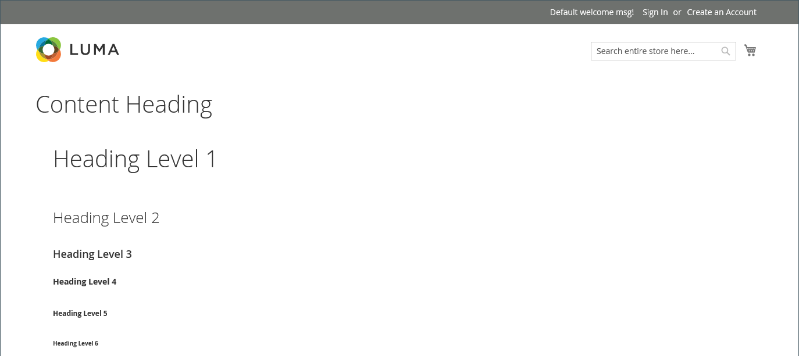

# [!DNL Page Builder] Workspace

[[!DNL Page Builder]  有効 &#x200B;](setup.md) にすると、CMS _[!UICONTROL Content]_&#x200B;ページ [!DNL Page Builder]、[product](../content-design/page-add.md) および [&#x200B; カテゴリ &#x200B;](../catalog/product-content.md) ページ、[&#x200B; ブロック &#x200B;](../catalog/categories-content-settings.md) および [&#x200B; 動的ブロック &#x200B;](../content-design/block-add.md) 用の高度な [&#x200B; ツールを利用するように &#x200B;](../content-design/dynamic-blocks.md) セクションとコンテンツの作成プロセスが変更されます。 このセクションには、_ コンテンツ見出し _フィールド、コンテンツのプレビュー、フルスクリーン [!DNL Page Builder] ワークスペースへの簡単なアクセスが含まれます。

![&#x200B; コンテンツプレビュー付き [!DNL Page Builder] ンテンツセクション &#x200B;](./assets/pb-content-preview.png){width="700" zoomable="yes"}

## コンテンツの見出し

検索エンジンはレベル 1 （H1）の見出しを検索するので、レベル 1 の見出しを追加すると、ページのインデックスが正しく作成されていることを簡単に確認できます。

>[!NOTE]
>
>ページの上部に表示される _[!UICONTROL Content Heading]_&#x200B;フィールドは、以前の [!DNL Commerce] リリースで作成されたコンテンツをサポートするレガシーフィールドです。 しかし、それは [!DNL Page Builder] の一部ではありません。 [!UICONTROL Content Heading] は、現在のテーマに関連付けられているスタイルシートに従って、H1 見出しとして書式設定されます。 [!DNL Page Builder] のステージで定義されたアクティブなコンテンツ領域のすぐ上に配置されます。

すべてのレベルの見出しの位置と形式を最適に制御するには、_[!UICONTROL Content Heading]_&#x200B;フィールドを空のままにし、[!DNL Page Builder] [&#x200B; 見出し &#x200B;](heading.md) コンテンツタイプを使用することをお勧めします。

{width="700" zoomable="yes"}

## プレビュー

「_[!UICONTROL Content]_」セクションを展開すると、[!DNL Page Builder] で作成された既存のコンテンツがあり、ページに表示されるとおりにコンテンツのプレビューが表示されます。 コンテンツプレビュー領域の&#x200B;**[!UICONTROL Edit with Page Builder]**&#x200B;または内部をクリックして [!DNL Page Builder] ワークスペースを開き、必要な更新を行うことができます。

{width="500" zoomable="yes"}

>[!NOTE]
>
>製品フォームとカテゴリフォームの場合、このコンテンツプレビューはデフォルトで有効になっていますが、無効にすることもできます。 プレビューの読み込みが原因でパフォーマンスが低下した場合は、[&#x200B; コンテンツ管理の設定 &#x200B;](../configuration-reference/general/content-management.md#advanced-content-tools) でプレビューを無効にすることができます。

## ステージ

プレビューから [!DNL Page Builder] ワークスペースを開くと、ステージは、コンテンツの作成や書式設定、さらにはライブコンテンツのクイック編集を行うことができるメイン作業領域になります。 最初はステージは空で、デザインサーフェスが提供されます。このサーフェスで、左パネルから行、列、タブをドラッグできます。

>[!NOTE]
>
>2.4.1 リリース以降、コンテンツ編集は、CMSページ、製品およびカテゴリページ、ブロック、ダイナミックブロックなど、[!DNL Page Builder] が制御するすべての領域でフルスクリーンになりました。 全画面編集では、コンテンツに焦点を当て、ストアフロントでのユーザーエクスペリエンスにより適したビューを提供します。

{width="600" zoomable="yes"}

{{$include /help/_includes/page-builder-save-timeout.md}}

## ビューポート

_ビューポート_ は、ユーザーに表示される web ページの表示可能な領域です。 フルスクリーンデザインモードでは、ビューポートのボタンは [!DNL Page Builder] のステージの上に表示され、サイトユーザーがストアフロントで表示しているとおりにコンテンツが表示されます。

{width="500" zoomable="yes"}

[!DNL Page Builder] た、ビューポートのブレークポイントも定義します。 ブレークポイントは、特定のスタイルを適用する幅の最小値と最大値を定義します。 [!DNL Page Builder] のビューポートには、次のコンテンツブレークポイントがあります。

- **デスクトップブレークポイント**—`min-width: 1024px`。 このブレークポイントでは、1024 ピクセル以上のビューポートの幅に対して定義されたスタイルが適用されます。
- **モバイルブレークポイント**—`max-width: 768px, min-width: 640px`。 これらのブレークポイントには、ビューポートの幅を 768～640 ピクセルの範囲で定義したスタイルが適用されます。

[!DNL Page Builder] ビューポートには、**_コンテンツプレビュー_** と **_ブレークポイント設定_** の 2 つの機能があります。

### コンテンツプレビュー

デフォルトでは、[!DNL Page Builder] には 2 つのビューポート プレビューが用意されています。

- **デスクトップ** – 定義済みの幅なしでコンテンツプレビューを表示します。 デスクトップ定義のスタイル（ブレークポイントの最小幅 1024 ピクセルを使用）は、引き続きページに適用されます。 ただし、デスクトップビューポートの幅は、行などのコンテナコンテンツタイプの設定によって定義されます。 デスクトップビューポートを選択すると、ブラウザーページの幅が 1024 ピクセル以上の場合に、ストアフロントでコンテンツがどのようにスタイル設定されるかが表示されます。

  {width="500" zoomable="yes"}

- **モバイル** – 定義済みの幅 768 ピクセルでコンテンツのプレビューを表示します。 デスクトップビューポートとは異なり、モバイルビューポートでは 768 ピクセルの幅と、768 ピクセル（最大）および 640 ピクセル（最小）のブレークポイントの幅に対して定義されたスタイルでページコンテンツが表示されます。

  {width="500" zoomable="yes"}

### ブレークポイントの設定

また、ビューポート ボタンには、選択したビューポートに基づいて、コンテンツ タイプに異なるブレークポイント スタイルを適用するオプションもあります。 デフォルトでは、[!DNL Page Builder] は行、列、タブ、タブ項目、バナー、スライダー、スライドの _[!UICONTROL Minimum Height]_&#x200B;のフィールドのブレークポイント設定を提供します。 モバイルビューポートを選択し、これらのコンテンツタイプの 1 つに対してエディターを開くと、モバイルビューポートのブレークポイントに固有のフィールド値を入力できます。 特定のブレークポイント設定を許可するコンテンツタイプフィールドでは、フィールドの右側に、次の行の例のようにアイコンが表示されます。

{width="400"}

## パネル

[!DNL Page Builder] パネルはステージの左側にあり、ステージにドラッグできるコンテンツタイプを含んでいます。 コンテンツタイプに固有のコンテナが、オプションのツールボックスと共に表示されます。 コンテンツタイプは、パネル内で次のように整理されます。

### レイアウト

_[!UICONTROL Layout]_&#x200B;パネルの [!DNL Page Builder] セクションは、行、列、タブをステージに追加するために使用します。 コンテンツタイプをパネルからステージにドラッグすると、コンテナが表示され、コンテンツタイプに固有のオプションのツールボックスが表示されます。

デフォルトでは、[!DNL Page Builder] のステージは空です。 レイアウトコンテンツタイプをパネルからステージにドラッグする際に、ページ上の他のレイアウトコンテナの上、下または内側に配置できます。 行は、ステージに直接追加する場合にのみ選択できます。

レイアウトコンテンツのタイプとステージを含む ![[!DNL Page Builder] パネル &#x200B;](./assets/pb-stage-toolbox.png){width="600" zoomable="yes"}

| レイアウトコンテンツタイプ | 説明 |
| ------------------- |------------ |
| [&#x200B; 行 &#x200B;](row.md) | 新しい行は、パネルからステージにドラッグして、別の行、タブ、列グループの上または下に配置する必要があります。 また、「複製」オプションを使用して、既存の行のコピーを作成することもできます。 |
| [&#x200B; 列 &#x200B;](column.md) | 列はパネルからステージに、または行とタブにドラッグできます。 追加できる列の最大数は、[configuration](setup.md) で指定されたグリッド分割数によって決まります。 |
| [&#x200B; タブ &#x200B;](tabs.md) | 単一のタブをパネルからステージに、または行と列にドラッグできます。 ツールボックスからタブを追加できます。 |

{style="table-layout:auto"}

### 要素

_[!UICONTROL Elements]_&#x200B;パネルの「[!DNL Page Builder]」セクションを使用すると、[[!DNL Page Builder]  ステージ &#x200B;](workspace.md#stage) 上の任意のレイアウトコンテナにテキスト、見出し、ボタン、区切り線、HTML コードを追加できます。 パネルから行または列にコンテンツタイプをドラッグするか、ステージ上のタブセットにコンテンツタイプをドラッグすると、コンテナが表示されます。 コンテンツ タイプのツールボックスを使用して、そのタイプに固有の設定にアクセスします。

要素コンテンツタイプを含む ![[!DNL Page Builder] パネル &#x200B;](./assets/pb-elements.png){width="600" zoomable="yes"}

| 要素コンテンツタイプ | 説明 |
| -------------------- | ----------- |
| [&#x200B; テキスト &#x200B;](text.md) | テキストコンテナとエディターをステージに追加します。 |
| [&#x200B; 見出し &#x200B;](heading.md) | 見出しコンテナをステージに追加します。 |
| [&#x200B; ボタン &#x200B;](buttons.md) | 個々のボタンまたは一連のボタンのコンテナをステージに追加します。 |
| [&#x200B; デバイダ &#x200B;](divider.md) | ステージに区切り記号用のコンテナを追加します。 |
| [HTML コード &#x200B;](html-code.md) | HTML コードのコンテナをステージに追加します。 |

{style="table-layout:auto"}

### メディア

_[!UICONTROL Media]_&#x200B;パネルの [!DNL Page Builder] セクションを使用して、画像、ビデオ、バナー、スライダー、[!DNL Google Maps] を [[!DNL Page Builder] stage](workspace.md#stage) 上のレイアウトコンテナに追加します。 メディアコンテンツタイプがパネルからステージにドラッグされると、コンテナが表示され、コンテンツタイプに固有のオプションのツールボックスが表示されます。

メディアコンテンツタイプを含む ![[!DNL Page Builder] パネル &#x200B;](./assets/pb-media-content-types.png){width="600" zoomable="yes"}

| メディアコンテンツタイプ | 説明 |
| ------------------- | ------------------------------------------ |
| [&#x200B; 画像 &#x200B;](image.md) | 画像コンテナをステージに追加します。 |
| [&#x200B; ビデオ &#x200B;](video.md) | ビデオコンテナをステージに追加します。 |
| [&#x200B; バナー &#x200B;](banner.md) | バナーコンテナをステージに追加します。 |
| [Slider](slider.md) | スライダーコンテナをステージに追加します。 |
| [&#x200B; マップ &#x200B;](map.md) | ステージに [!DNL Google Maps] コンテナを追加します。 |

{style="table-layout:auto"}

### コンテンツを追加

_[!UICONTROL Add Content]_&#x200B;パネルの「[!DNL Page Builder]」セクションを使用して、既存のコンテンツを [[!DNL Page Builder] stage](workspace.md#stage) に追加します。 メディアコンテンツタイプをパネルからステージにドラッグすると、コンテナが表示されます。 コンテンツ タイプのツールボックスを使用して、そのタイプに固有の_ 設定 _にアクセスします。

「コンテンツタイプを追加」を含む ![[!DNL Page Builder] パネル &#x200B;](./assets/pb-add-content.png){width="600" zoomable="yes"}

| コンテンツタイプ | 説明 |
| ---------------------------------------------------------------- | -------------------------------------------- |
| [&#x200B; ブロック &#x200B;](block.md) | 既存のブロックをステージに追加します。 |
| [&#x200B; ダイナミック ブロック &#x200B;](dynamic-block.md) | 既存のダイナミックブロックをステージに追加します。 |
| [&#x200B; 製品 &#x200B;](products.md) | 商品のリストをステージに追加します。 |
|  [Product Recommendations](recommendations.md) | レコメンデーションユニットをステージに追加します。 |

{style="table-layout:auto"}

## ツールボックス

ステージ上の各コンテンツコンテナには、オプションのツールボックスがあります。 オプションはコンテンツ タイプによって異なりますが、通常は [ 移動 ]、[ 設定 ]、[ 非表示/表示 ]、[ 複製 ]、[ 削除 ] が含まれます。

### ツールボックスを表示する

コンテナの上にマウスポインターを置いてツールボックスを表示し、オプションを選択します。

{width="600" zoomable="yes"}

### ツールボックスオプション

| オプション | アイコン | 説明 |
| --------- | ---------------------------------------- | ------------ |
| 移動 | {width="25"} | 現在のコンテンツコンテナをステージ上の別の位置に移動します。 |
| 追加 | {width="25"} | ボタン、スライド、タブなどの子要素を追加します。 |
| （ラベル） |           | コンテナコンテンツタイプを識別します。 |
| 設定 | {width="25"} | コンテンツコンテナのプロパティを編集モードで開きます。 |
| Hide | {width="25"} | 現在のコンテンツコンテナを非表示にします。 |
| 表示 | {width="25"} | 現在のコンテンツコンテナを表示します。 |
| 複製 | {width="25"} | 現在のコンテンツコンテナをコピーします。 |
| 削除 | {width="25"} | ステージから現在のコンテンツコンテナを削除します。 |

{style="table-layout:auto"}

{{$include /help/_includes/page-builder-hidden-element-note.md}}

<!-- Last updated from includes: 2023-09-11 14:30:19 -->
