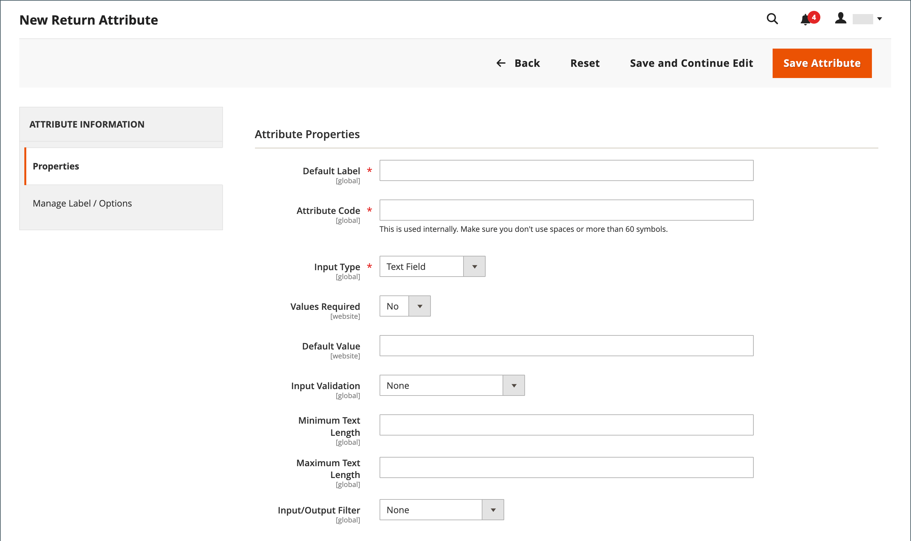

# 属性を返します

{{ee-feature}}

戻り値の属性は、製品の返却プロセス中に必要な情報を保存するために使用されます。 デフォルトの属性には、返される製品の条件、返される製品の理由、および返される製品の解決方法を示すフィールドが含まれます。 戻り値の属性を作成するプロセスは、 [顧客属性](../customers/attribute-properties.md).

{width="700" zoomable="yes"}

## 戻り値属性の作成

1. 次の日： _管理者_ サイドバー、移動 **[!UICONTROL Stores]** > _[!UICONTROL Attributes]_>**[!UICONTROL Returns]**.

1. 右上隅で、 **[!UICONTROL Add New Attribute]**.

   {width="600" zoomable="yes"}

### プロパティを定義する

1. データ入力時に属性を識別するには、 **[!UICONTROL Default Label]**.

1. の場合 **[!UICONTROL Attribute Code]**」で、システム内の属性を識別するコードを入力します。

1. データ入力に使用される入力コントロールの種類を判断するには、 **[!UICONTROL Input Type]** を次のいずれかに変更します。

   - `Text Field`
   - `Text Area`
   - `Dropdown`
   - `Yes/No`
   - `File`
   - `Image File`

1. フィールドを必須項目にするには、 **[!UICONTROL Values Required]** から `Yes`.

1. 初期値をフィールドに割り当てるには、 **[!UICONTROL Default Value]**.

1. レコードを保存する前に、フィールドに入力されたデータを正確に検証するには、 **[!UICONTROL Input Validation]** を次のいずれかに変更します。

   - `None`
   - `Alphanumeric`
   - `Alphanumeric with Space`
   - `Numeric Only`
   - `Alpha Only`
   - `URL`
   - `Email`

1. の `Text Field` および `Text Area` 入力タイプ、 **[!UICONTROL Minimum Text Length]** および **[!UICONTROL Maximum Text Length]**.

1. 前処理フィルターを適用するには、 **[!UICONTROL Input/Output Filter]** を次のいずれかに変更します。

   - `None`
   - `Strip HTML Tags`
   - `Escape  HTML Entities`

1. 属性を顧客に表示するには、 **[!UICONTROL Show on Storefront]** から `Yes` （内） _[!UICONTROL Storefront Properties]_」セクションに入力します。

1. （オプション）の場合 **[!UICONTROL Sort Order]**」で、この属性をページの同じ部分の他の属性と相対的に表示する場所を指定する数値を入力します。 (`0` =最初 `1` =秒 `2` = 3 番目、など )

### ラベル/オプションを管理

1. 左側のパネルで、を選択します。 **[!UICONTROL Manage Labels/Options]**.

1. Adobe Analytics の **[!UICONTROL Manage Titles (Size, Color, etc.)]** 「 」セクションで、各ストアビューのラベルを入力します。

   {width="600" zoomable="yes"}

1. 次の場合、 **[!UICONTROL Input Type]** の場合、属性は `Dropdown`を設定する場合は、 **[!UICONTROL Manage Options (Values of Your Attribute)]** 」セクションに入力します。

   - オプションを追加するには、 **[!UICONTROL Add Option]** 「管理者」のラベルと、各ストア表示を入力します。
   - オプションを選択したデフォルトにするには、「 」を選択します。 **[!UICONTROL Is Default]**.
   - オプションを削除するには、 **[!UICONTROL Delete]**.

1. 変更を保存するには、 **[!UICONTROL Save Attribute]**.
