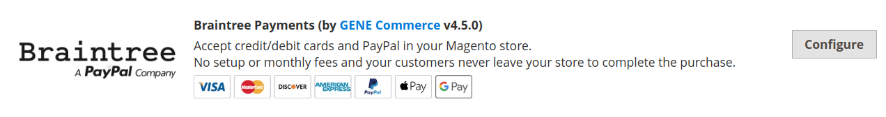
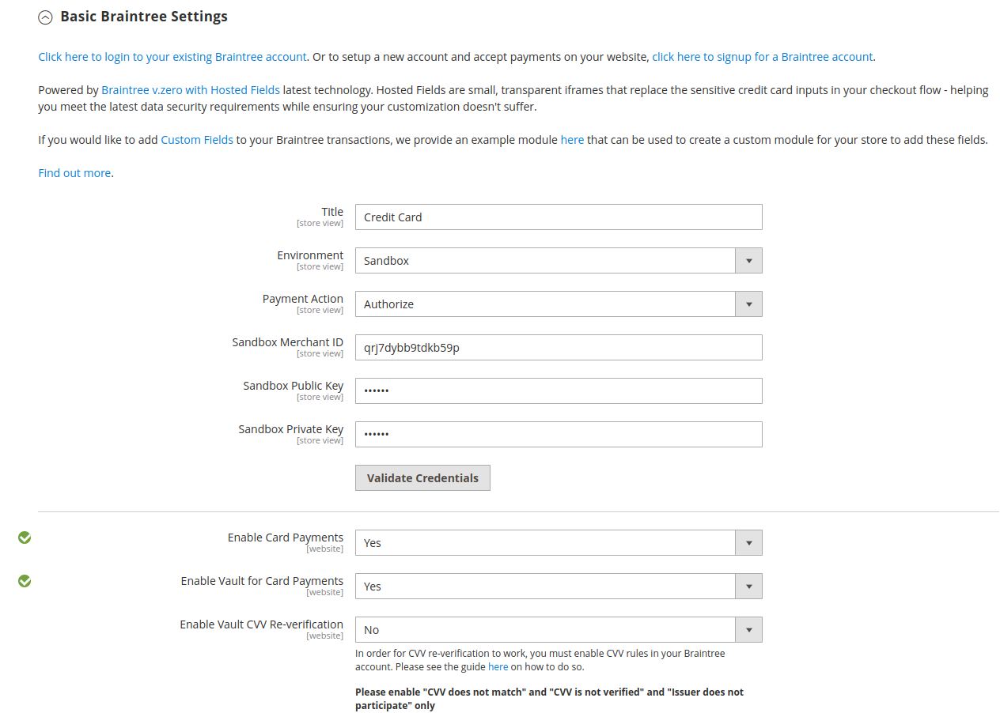
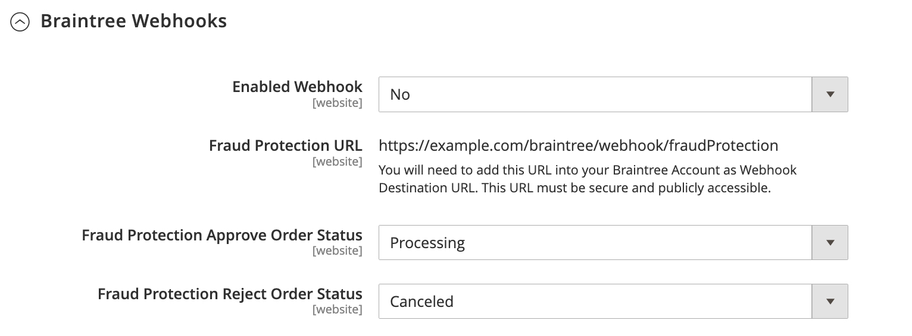
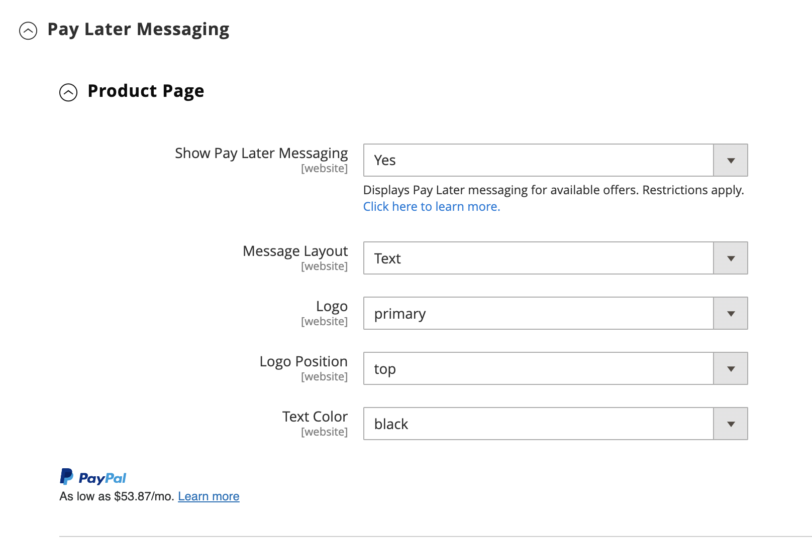
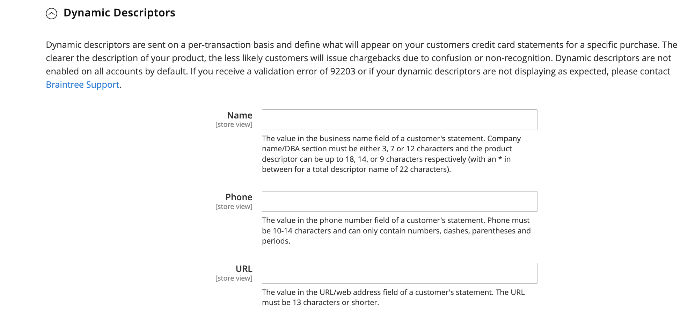

# Braintree

>[!IMPORTANT]
>
>カードに予想外の料金が発生した場合は、[ サブスクリプションをキャンセル ](https://helpx.adobe.com/jp/manage-account/using/cancel-subscription.html) ページでサポートを受けることができます。

Braintreeは、不正検知と PayPal 統合により、完全にカスタマイズ可能なチェックアウトエクスペリエンスを提供します。 [!DNL Apple Pay]、[!DNL Google Pay]、ACH、Venmo、およびローカルの支払い方法をサポートします。 BraintreeではBraintree システム上で取引が行われるので、マーチャントの PCI コンプライアンスに関する負担が軽減されます。 Braintree Payments の統合は、[GENE Commerce](https://www.gene.co.uk/gene-braintree-payments/) によって開発されました。

>[!NOTE]
>
>Commerce MarketplaceのBraintree拡張機能がインストールされているAdobe CommerceまたはMagento Open Sourceの以前のバージョンから 2.4.x にアップグレードする場合は、このページの最後にある [2.4 アップグレードノート ](#24-upgrade-notes) を参照してください。

## 手順 1:Braintree資格情報を取得する

[Braintree支払い ][1] に移動してアカウントに新規登録します。

## 手順 2：基本設定を完了する

1. _管理者_ サイドバーで、**[!UICONTROL Stores]**/_[!UICONTROL Settings]_/**[!UICONTROL Configuration]**&#x200B;に移動します。

1. 左側のパネルで「**[!UICONTROL Sales]**」を展開し、「**[!UICONTROL Payment Methods]**」を選択します。

   - Commerceのインストールに複数の web サイト、ストア、ビューがある場合は、左上隅で設定が適用される **[!UICONTROL Store View]** を選択します。

   - _[!UICONTROL Merchant Location]_&#x200B;セクションで、**[!UICONTROL Merchant Country]**&#x200B;がビジネスの場所に設定されていることを確認します。

1. 「_[!UICONTROL Recommended Solutions]_」の「_[!UICONTROL Braintree Payments] （[GENE Commerce](https://www.gene.co.uk/gene-braintree-payments/) v4.7.0 - [ リリースノート ](https://support.gene.co.uk/support/solutions/articles/35000278668)_」セクションで、「**[!UICONTROL Configure]**」をクリックします。

   {width="600" zoomable="yes"}

1. **[!UICONTROL Title]** しくは、チェックアウト時にBraintreeを支払いオプションとして識別するタイトルを入力します。

1. Braintree取引の現在の営業 **[!UICONTROL Environment]** を `Sandbox` または `Production` に設定します

   サンドボックスで設定をテストする場合は、Braintreeで推奨されている [ クレジットカード番号 ][2] のみを使用します。 Braintreeを使用して実稼動に移行する準備が整ったら、**[!UICONTROL Environment]** を `Production` に設定します。

   {width="600" zoomable="yes"}

1. **[!UICONTROL Payment Action]** を次のいずれかに設定します。

   - `Authorize Only` – 購入を承認し、資金を保留します。 加盟店が売却 _キャプチャ_ するまで、お客様の銀行口座から金額は引き出されません。
   - `Intent Sale` – 購入金額は許可され、すぐにお客様のアカウントから引き出されます。 **_メモ：_** この値は、2.3.x 以前のリリースでは _認証してキャプチャ_ されていました。|

1. Braintree アカウントの **[!UICONTROL Sandbox Merchant ID / Merchant ID]** を入力します。

1. Braintree アカウントから次の資格情報を入力します。

   - **[!UICONTROL Sandbox Public Key / Public Key]**
   - **[!UICONTROL Sandbox Private Key / Private Key]**

   >[!NOTE]
   >
   >**（サンドボックスと実稼動）環境の両方に対して別々のフィールドがあり** その他のフィールドは選択した環境に基づいてレンダリングされます。

1. 設定を保存する前に、「**[!UICONTROL Validate Credentials]**」をクリックして認証情報を検証します。

1. **[!UICONTROL Enable Card Payments]** を `Yes` に設定します。

1. 顧客情報を安全に保存する機能を希望し、顧客が購入するたびに情報を再入力する必要がない場合は、**[!UICONTROL Enable Vault for Card Payments]** を `Yes` に設定します。

1. 購入時にヴォールト・カードの CVV 番号を確認する場合は、**[!UICONTROL Enable Vault CVV Re-verification]** を `Yes` に設定します。

## 手順 3：詳細設定の完了

1. 「」を展開し、「**[!UICONTROL Advanced Braintree Settings]**」セクションを展開します。

   {width="550" zoomable="yes"}

1. **[!UICONTROL Vault Title]** しくは、顧客カード情報が格納されている Vault を識別する、参照の説明的なタイトルを入力します。

1. Braintree アカウントの **[!UICONTROL Merchant Account ID]** を入力します。

   使用するマーチャントアカウントを指定しない場合、Braintreeはデフォルトのマーチャントアカウントを使用して取引を処理します。

1. PayPal、PayLater、Apple Pay、Google Pay など、チェックアウトプロセスの開始時に Express Payment オプションを使用して迅速にチェックアウトできるようにするために、**[!UICONTROL Enable Checkout Express Payments]** を `Yes` に設定します。

1. 高度な不正ツールのチェックの一環としてトランザクションが評価のために送信されないようにするには、管理者を通じて行われた注文で、**[!UICONTROL Skip Fraud Checks on Admin Orders]** を `Yes` に設定します。

1. しきい値に達したとき、またはしきい値を超えたときに `Advanced Fraud Protection` チェックをバイパスするように、**[!UICONTROL Bypass Fraud Protection Threshold]** を設定します。

   このフィールドを空白にすると、このオプションが無効になります。

1. ストアとBraintree間のやり取りのログファイルを保存する場合は、**[!UICONTROL Debug]** を `Yes` に設定します。

1. クレジットカードの裏面から 3 桁のセキュリティコードを提供するよう顧客に求めるには、**[!UICONTROL CVV Verification]** を `Yes` に設定します。

   CVV 検証を使用する場合は、Braintree アカウントの _設定/処理_ セクションで AVS や CVV を必ず有効にしてください。

1. すべての支払い方法で買い物かご品目を送信するには、**[!UICONTROL Send Card Line Items]** を `Yes` に設定します。

1. **[!UICONTROL Credit Card Types]** しくは、Braintreeを通じて支払いとしてストアで受け入れられる各クレジットカードを選択します。

   複数のカードの種類を選択するには、Ctrl キー（PC）または Command キー（Mac）を押したまま、各オプションをクリックします。

1. **[!UICONTROL Sort Order]** しくは、番号を入力して、チェックアウト時に他のお支払い方法と一緒にリストされたときにBraintreeが表示される順序を指定します。

## 手順 4:Braintree Webhook を設定する

{width="600" zoomable="yes"}

1. **[!UICONTROL Enable Webhook]** を `Yes` に設定すると、不正防止、ACH 支払いおよびローカル支払い方法の Webhook 機能が有効になります。

1. 「**[!UICONTROL Fraud Protection URL]**」フィールドに URL をコピーし、_[!UICONTROL Webhook Destination URL]_&#x200B;としてBraintree アカウントに追加します。

   >[!IMPORTANT]
   >
   >この URL はセキュリティで保護され、公開アクセス可能である必要があります。

1. **[!UICONTROL Fraud Protection Approve Order Status]** フィールドを設定して、Braintreeが不正対策を承認するタイミングを決定します。

   選択した注文ステータスがCommerceの注文に割り当てられます。

1. 「**[!UICONTROL Fraud Protection Reject Order Status]**」フィールドを設定して、Braintreeが不正対策を却下するタイミングを決定します。

   選択した注文ステータスがCommerceの注文に割り当てられます。

## 手順 5：国固有の設定の完了

1. **[!UICONTROL Payment from Applicable Countries]** を次のいずれかに設定します。

   - `All Allowed Countries` - ストア設定で指定されたすべての [ 国 ](../getting-started/store-details.md#country-options) のお客様がこの支払い方法を使用できます。
   - `Specific Countries` – このオプションを選択すると、_[!UICONTROL Payment from Specific Countries]_&#x200B;のリストが表示されます。 Ctrl キー（PC）または Command キー（Mac）を押しながら、リスト内で、お客様がストアから購入できる国を選択します。

   {width="600" zoomable="yes"}

1. **[!UICONTROL Country Specific Credit Card Types]** を設定するには：

   - 「**[!UICONTROL Add]**」をクリックします。

   - **[!UICONTROL Country]** を設定し、各 **[!UICONTROL Allowed Credit Card Type]** を選択します。

   - 繰り返して、各国から受け入れるクレジットカードを識別します。

## 手順 6:Braintreeを使用して ACH を実行する

{width="600" zoomable="yes"}

1. Braintreeの支払いオプションとして ACH を含めるには、**[!UICONTROL Enable ACH Direct Debit]** を `Yes` に設定します。

1. お客様は、1 回限りの ACH Direct Debit 支払い方法をヴォールティングし、将来の使用のために保存できます。 ヴォールト後、お客様は ACH Direct Debit を再利用できます。`Yes` に設定されている場合は、支払い情報を再入力または認証する必要は **[!UICONTROL Enable Vault for ACH Direct Debit]** りません。

1. **[!UICONTROL Sort Order]**：番号を入力して、チェックアウト時に他の支払い方法と一緒に表示されるBraintree ACH 支払い方法の順序を指定します。

## 手順 7:Braintreeを使用して [!UICONTROL Apple Pay] を入力する

{width="600" zoomable="yes"}

1. Braintreeの支払いオプションとして [!DNL Apple Pay] を含めるには、**[!UICONTROL Enable ApplePay through Braintree]** を `Yes` に設定します。

   最初に、Braintree アカウントに [ ドメイン名を確認 ](https://developer.paypal.com/braintree/docs/guides/apple-pay/configuration/javascript/v3) してください。

1. お客様の情報を安全に保存し、Apple Pay で購入するたびに情報を再入力する必要がない場合は、**[!UICONTROL Enable Vault for ApplePay]** を `Yes` に設定します。

1. **[!UICONTROL Payment Action]** を次のいずれかに設定します。

   - `Authorize Only` – 購入を承認し、資金を保留します。 この金額は、マーチャントによって売却が _キャプチャ_ されるまで、顧客の銀行口座から引き出されません。
   - `Intent Sale` – 購入金額は許可され、すぐにお客様のアカウントから引き出されます。

1. **[!UICONTROL Merchant Name]**: Apple Pay ダイアログで顧客に表示されるラベルを指定するテキストを入力します。

1. **[!UICONTROL Sort Order]**：番号を入力して、チェックアウト時に他の支払いオプション [!DNL Apple Pay] 一緒にリストされたときに支払いオプションが表示される順序を決定します。

## 手順 8：現地の支払方法の設定を完了する

1. Braintreeの支払いオプションにローカルの支払い方法を含めるには、**[!UICONTROL Enable Local Payment Methods]** を `Yes` に設定します。

1. **[!UICONTROL Title]** の場合は、「チェックアウト時の支払方法」セクションに表示されるラベルに使用するテキストを入力します（デフォルト値：`Local Payments`）。

1. **[!UICONTROL Fallback Button Text]** しくは、フォールバックのBraintreeページに表示されるボタンに使用するテキストを入力して、顧客を web サイトに戻します（例：`Complete Checkout`）。

1. **[!UICONTROL Redirect on Fail]**: ローカル支払方法トランザクションが取り消された場合、失敗した場合、またはエラーが発生した場合に顧客がリダイレクトされる URL を入力します。 チェックアウト支払いページにする必要があります（例：`https://www.domain.com/checkout#payment`）。

1. **[!UICONTROL Allowed Payment Methods]**：有効にするローカル支払方法を選択します。

   オプション：`Bancontact`/`EPS`/`giropay`/`iDeal`/`Klarna Pay Now`/`SOFORT`/`MyBank`/`P24`/`SEPA/ELV Direct Debit` （まだサポートされていません）

   {width="600" zoomable="yes"}

   >[!NOTE]
   >
   >バンドルされたBraintree拡張機能は、[Braintree開発者向けドキュメント ](https://developer.paypal.com/braintree/docs/guides/local-payment-methods/overview) にリストされているすべてのローカル支払い方法をサポートしているわけではありません。 今後のリリースでサポートされる予定の、その他の地域での支払い方法も開発中です。

1. **[!UICONTROL Sort Order]**：番号を入力して、チェックアウト時に他の支払オプションとともに表示されるローカル支払方法の表示順序を決定します。

## 手順 9:Braintreeを使用して [!DNL Google Pay] を入力する

{width="600" zoomable="yes"}

1. Braintreeの支払いオプションとして [!DNL Google Pay] を含めるには、**[!UICONTROL Enable GooglePay Through Braintree]** を `Yes` に設定します。

1. お客様の情報を安全に保存し、Google Pay で購入するたびに情報を再入力する必要がない場合は、**[!UICONTROL Enable Vault for GooglePay]** を `Yes` に設定します。

1. **[!UICONTROL Payment Action]** を次のいずれかに設定します。

   - `Authorize Only` – 購入を承認し、資金を保留します。 この金額は、マーチャントによって売却が _キャプチャ_ されるまで、顧客の銀行口座から引き出されません。
   - `Intent Sale` – 購入金額は許可され、すぐにお客様のアカウントから引き出されます。

1. [!DNL Google Pay] ボタンの色を決定するには、**[!UICONTROL Button Color]** を設定します：`White` または `Black`

1. **[!UICONTROL Merchant ID]**: MerchantID （Googleが提供）を入力します。

1. **[!UICONTROL Accepted Cards]**：顧客が [!DNL Google Pay] を使用して注文するために使用できるカードのタイプを選択します。

   オプション：`Visa` / `MasterCard` / `AMEX` / `Discover` / `JCB`

1. **[!UICONTROL Sort Order]**：番号を入力して、チェックアウト時に他の支払いオプションと一緒にリストされ [!DNL Google Pay] ときに表示される順序を決定します。

## 手順 10:Braintreeを使用して Venmo を設定する

1. Venmo をBraintreeの支払いオプションとして含めるには、**[!UICONTROL Enable Venmo through Braintree]** を `Yes` に設定します。

1. 顧客が今後のトランザクションで Venmo アカウントに再度ログインする必要がないように、セキュアなコンテナを使用して顧客の Venmo アカウントを保存できるようにするには、**[!UICONTROL Enable Vault for Venmo]** を `Yes` に設定します。

   {width="600" zoomable="yes"}

1. **[!UICONTROL Payment Action]** を次のいずれかに設定します。

   - `Authorize Only` – 購入を承認し、資金を保留します。 この金額は、マーチャントによって売却が _キャプチャ_ されるまで、顧客の銀行口座から引き出されません。
   - `Intent Sale` – 購入金額は許可され、すぐにお客様のアカウントから引き出されます。

1. **[!UICONTROL Sort Order]** の場合は、番号を入力して、チェックアウト時に他の支払いオプションと一緒に表示される Venmo の表示順序を決定します。

## 手順 11:Braintreeで PayPal を入力

{width="550" zoomable="yes"}

1. Braintreeの支払いオプションに PayPal を含めるには、**[!UICONTROL Enable PayPal through Braintree]** を `Yes` に設定します。

1. Braintreeの支払い方法を使用して PayPal を指定します。

   >[!NOTE]
   >
   >**[!DNL PayPal Credit]** または **[!DNL PayPal PayLater]** のいずれかを有効にできます。 両方のメソッドを同時に有効にすることはできません。

   - Braintreeの支払いオプションとして [!DNL PayPal Credit] を含めるには、**[!UICONTROL Enable PayPal Credit through Braintree]** を `Yes` に設定します。

     **Braintreeで PayPal を有効にする** が `Yes` に設定されている場合、このフィールドのみが表示されます。

     >[!NOTE]
     >
     >PayPal クレジットは米国および英国でのみ利用できます。 _[!UICONTROL Merchant Country]_&#x200B;フィールドに選択した値が `US` または `UK` でない場合、PayPal クレジットは無効になります。

   - Braintreeの支払いオプションとして [!DNL PayPal PayLater] を含めるには、**[!UICONTROL Enable PayPal PayLater through Braintree]** を `Yes` に設定します。

     **[!UICONTROL Enable PayPal PayLater through Braintree]** を `Yes` に設定すると、このフィールドのみが表示されます。

     _3 で支払う_ などのオファーでは、サイトに PayLater メッセージを表示できます。この場合、顧客は 3 回の支払いを無利子で行うことができます。 Braintree統合では、この機能を宣伝するために、サイトにメッセージを表示できます。 PayLater オファーを、他のコンテンツ、マーケティングまたはマテリアルでプロモーションすることはできません。

1. **[!UICONTROL Title]** しくは、チェックアウト時に「PayPal によるBraintree支払い」オプションを識別するタイトルを入力します。

1. **[!UICONTROL Vault Enabled]** を `Yes` に設定すると、顧客の PayPal アカウントを保存するためのセキュアなコンテナを使用できるようになります。 ヴォールティングされた PayPal アカウントは、将来のトランザクションに使用でき、顧客のステップ数を減らすことができます。

1. 行項目（注文項目）を PayPal に送信し、ギフトカード、商品のギフトラッピング、注文のギフトラッピング、ストアクレジット、配送、税を行項目として送信するには、**[!UICONTROL Send Cart Line Items for PayPal]** を `Yes` に設定します。

1. **[!UICONTROL Sort Order]** しくは、数字を入力して、チェックアウト時に他の支払いオプションと一緒に表示されるBraintree PayPal 支払いオプションの表示順序を指定します。

1. [ ストア設定 ](../getting-started/store-details.md#store-information) で定義した名前とは異なるマーチャント名を表示するには、表示したい名前を **[!UICONTROL Override Merchant Name]** フィールドに入力します。

1. **[!UICONTROL Payment Action]** を次のいずれかに設定します。

   - `Authorize Only` – 購入を承認し、資金を保留します。 この金額は、マーチャントによって売却が _キャプチャ_ されるまで、顧客の銀行口座から引き出されません。
   - `Authorize and Capture` – 購入金額は許可され、すぐにお客様のアカウントから引き出されます。

1. PayPal で処理されるBraintree トランザクションの場合は、**[!UICONTROL Payment from Applicable Countries]** を次のいずれかに設定します。

   - `All Allowed Countries` - ストア設定で指定されたすべての [ 国 ](../getting-started/store-details.md#country-options) のお客様がこの支払い方法を使用できます。
   - `Specific Countries` – このオプションを選択すると、_[!UICONTROL Payment from Specific Countries]_&#x200B;のリストが表示されます。 Ctrl キー（PC）または Command キー（Mac）を押しながら、リスト内で、お客様がストアから購入できる国を選択します。

   {width="550" zoomable="yes"}

1. 顧客に請求先住所の指定を要求するには、**[!UICONTROL Require Customer's Billing Address]** を `Yes` に設定します。

   >[!NOTE]
   >
   >この機能は、PayPal テクニカルサポートがお使いのアカウントで有効にする必要があります。

1. PayPal Express の注文レビューページをスキップするには、**[!UICONTROL Skip Order Review Step]** を `Yes` に設定します。

   PayPal Express でお支払いのお客様の場合：お支払いを完了する前にお客様をレビューページにリダイレクトさせたい場合は、これを `No` に設定します。 顧客に対して、レビューページをスキップしたい場合は、レビューページを `Yes` に設定します。

1. Braintreeを使用してストアと PayPal 間のやり取りのログファイルを保存するには、**[!UICONTROL Debug]** を `Yes` に設定します。

1. ミニカートと買い物かごページの両方に PayPal ボタンを表示するには、**[!UICONTROL Display on Shopping Cart]** を `Yes` に設定します。

1. パッケージトラッキング情報を PayPal に送信するには、**[!UICONTROL Send Package Tracking]** を `Yes` に設定します。

   パッケージトラッキング情報は、PayPal のトランザクション/注文の場合にのみ PayPal に送信されます。 [!UICONTROL Package Tracking] 機能を正しく動作させるには、[!UICONTROL Send Cart Line Items for PayPal] 設定フィールドを有効にする必要があります。

1. パッケージトラッキングの更新について PayPal で購入者または支払者に通知するには、**[!UICONTROL Use PayPal's "Notify Payer" functionality]** を `Yes` に設定します。

## 手順 12：スタイル設定を指定する

1. **[!UICONTROL Location]**: PayPal ボタンとメッセージのレンダリング先を `Mini-Cart and Cart Page`、`Checkout Page`、`Product Page` から選択します

   {width="600" zoomable="yes"}

### [!UICONTROL Mini-Cart and Cart Page]

このセクションのオプションと設定は、「_[!UICONTROL Location]_」フィールドの設定によって異なります。

1. **[!UICONTROL PayPal Button Type]** を、`PayPal Button`/`PayPal Pay Later Button`/`PayPal Credit Button` の 3 種類のボタンのいずれかに設定します。

**[!UICONTROL PayPal Button]**

このセクションのオプションと設定は、「_[!UICONTROL PayPal Button Type]_」フィールドで選択したボタンタイプによって異なります。

1. 選択した場所のストアフロントに PayPal ボタンを表示するには、「**[!UICONTROL Show PayPal Button]**」を「`Yes`」に設定します。

1. **[!UICONTROL Button Label]** しくは、PayPal ボタンのラベル（`Paypal`、`Checkout`、`Buynow`、`Pay` のいずれか）を選択します

1. **[!UICONTROL Color]** しくは、PayPal ボタンの色（`Blue`、`Black`、`Gold`、`Silver` のいずれか）を選択します

1. **[!UICONTROL Shape]** の場合は、[PayPal] ボタン図形（`Pill` または `Rectangle`）を選択します

1. **[!UICONTROL Size (Deprecated)]** しくは、PayPal ボタンのサイズ（`Medium`、`Large`、`Responsive`）を選択します

>[!NOTE]
>
>**[!DNL Size(Deprecated)]** 設定フィールドは非推奨となり、PayPal ボタンのスタイル設定には使用されません。

これらのオプションを設定すると、PayPal ボタンのプレビューを確認できます。 設定の適用や値のリセットに使用できるコントロールがあります。

- ボタンおよび PayLater メッセージング用に選択したスタイル設定を保存し、それらを現在の場所および現在のボタン タイプに適用するには、[**[!UICONTROL Apply]**] をクリックします。

- ボタンおよび PayLater メッセージング値に対して選択したスタイル設定を保存し、それらをボタンのすべてのタイプと場所に適用するには、[**[!UICONTROL Apply to All Buttons]**] をクリックします。

- スタイル設定をボタンと PayLater メッセージに推奨されるデフォルト値に戻し、すべてのボタンのタイプと場所に適用するには、[**[!UICONTROL Reset to Recommended Defaults]**] をクリックします。

## 手順 13：後払いメッセージ

**[!UICONTROL Product Page]**

{width="600" zoomable="yes"}

1. 製品ページのストアフロントに [!DNL Pay Later] のメッセージを表示するには、**[!UICONTROL Show PayLater Messaging]** を `Yes` に設定します。

   使用可能なオファーに関する Pay Later メッセージを表示します。 制限事項があります。 [PayPal のドキュメント ](https://developer.paypal.com/studio/checkout/pay-later/us) を参照してください。

1. **[!UICONTROL Message Layout]** の場合は、[!DNL Pay Later] のメッセージレイアウト（`Text` または `Flex`）を選択します。

1. **[!UICONTROL Logo]** しくは、PayPal ロゴのタイプ（`Inline`、`Primary`、`Alternative`、`None` のいずれか）を選択します

1. **[!UICONTROL Logo Position]**:PayPal ロゴの位置（`Left`、`Right`、`Top` のいずれか）を選択します

1. **[!UICONTROL Text Color]** の場合は、[!DNL PayLater] のメッセージのテキストの色を選択します（`Black`、`White`、`Monochrome`、`Grayscale`）。

**[!UICONTROL Cart]**

{width="600" zoomable="yes"}

1. ストアフロントのミニカートまたはカートのページに [!DNL Pay Later] のメッセージを表示するには、**[!UICONTROL Show PayLater Messaging]** を `Yes` に設定します。

   使用可能なオファーに関する Pay Later メッセージを表示します。 制限事項があります。 [PayPal のドキュメント ](https://developer.paypal.com/studio/checkout/pay-later/us) を参照してください。

1. **[!UICONTROL Message Layout]** の場合は、[!DNL Pay Later] のメッセージレイアウト（`Text` または `Flex`）を選択します。

1. **[!UICONTROL Logo]** しくは、PayPal ロゴのタイプ（`Inline`、`Primary`、`Alternative`、`None` のいずれか）を選択します

1. **[!UICONTROL Logo Position]**:PayPal ロゴの位置（`Left`、`Right`、`Top` のいずれか）を選択します

1. **[!UICONTROL Text Color]** の場合は、[!DNL PayLater] のメッセージのテキストの色を選択します（`Black`、`White`、`Monochrome`、`Grayscale`）。

**[!UICONTROL Checkout]**

{width="600" zoomable="yes"}

1. チェックアウト時にストアフロントに [!DNL Pay Later] のメッセージを表示するには、**[!UICONTROL Show PayLater Messaging]** を `Yes` に設定します。

   使用可能なオファーに関する Pay Later メッセージを表示します。 制限事項があります。 [PayPal のドキュメント ](https://developer.paypal.com/studio/checkout/pay-later/us) を参照してください。

1. **[!UICONTROL Text Align]** の場合、メッセージのテキストの位置揃え [!DNL Pay Later] 選択します（`Text`、`Center`、`Right`）

1. **[!UICONTROL Text Color]** の場合は、[!DNL Pay Later] メッセージのテキストの色 `Black`、`White` を選択します。

## 手順 14: 3D 検証設定の完了

1. 認証プログラムに登録されているクレジットカードを使用するお客様（_VISA による認証済み_ など）に認証手順を追加する場合は、**[!UICONTROL 3D Secure Verification]** を `Yes` に設定します。

   プロセス中に、検証用に送信されたトランザクション金額と、認証用に送信された金額がチェックされます。

2. すべてのトランザクションに対して 3D セキュア要求に常にチャレンジするには、**[!UICONTROL Always request 3DS]** を `Yes` に設定します。

3. **[!UICONTROL Threshold Amount]**: 3D 検証のトリガーに必要な最小注文金額を入力します。

4. **[!UICONTROL Verify for Applicable Countries]** を次のいずれかに設定します。

   - `All Allowed Countries` - ストア設定で指定されたすべての [ 国 ](../getting-started/store-details.md#country-options) のお客様がこの支払い方法を使用できます。
   - `Specific Countries` – このオプションを選択すると、_[!UICONTROL Verify for Specific Countries]_&#x200B;のリストが表示されます。 Ctrl キー（PC）または Command キー（Mac）を押しながら、リスト内で、お客様がストアから購入できる国を選択します。

   {width="600" zoomable="yes"}

## 手順 15:Braintree動的記述子の設定

次の記述子は、顧客のクレジットカード明細書の購入を識別するために使用されます。 各購入に関連付けられている会社を明確に識別することで、チャージバックの数を減らすことができます。 動的記述子がアカウントで有効になっていない場合は、Braintree サポートにお問い合わせください。

{width="600" zoomable="yes"}

1. 次のガイドラインに従って、**[!UICONTROL Name]**、**[!UICONTROL Phone]**、**[!UICONTROL URL]** の動的記述子を入力します。

   - **[!UICONTROL Name]** – 名前記述子には 2 つの部分があり、アスタリスク（*）で区切られています。 例：

     `company*myproduct`

     記述子の最初の部分は会社または DBA を示し、2 番目の部分は製品を示します。 記述子の `company` と `product` の部分の長さは、次のように、最大 22 文字の長さを組み合わせて割り当てることができます。

     **_名前記述子に含まれる文字_**

     _オプション 1:_ `Company` は 3 文字にする必要があります `Product`、最大 18 文字にすることができます

     _オプション 2:_ `Company` は 7 文字、最大 14 文字 `Product` する必要があります

     _オプション 3_:`Company` は 12 文字にする必要があります `Product`、最大 9 文字にすることができます

   - **[!UICONTROL Phone]** – 電話記述子は、10 ～ 14 文字の長さにする必要があり、数字、ダッシュ、括弧、ピリオドのみを含めることができます。 例：

     `9999999999`

     `(999) 999-9999`

     `999.999.9999`

   - **[!UICONTROL URL]** - URL 記述子はドメイン名を表し、最大 13 文字にすることができます。 例：

     `company.com`

1. Braintreeの設定が完了したら、「**[!UICONTROL Save Config]**」をクリックします。

## 2.4 アップグレードノート

Adobe CommerceおよびMagento Open Source 2.4.0 以降、Braintree拡張機能はリリースに含まれています。 Marketplace Braintree拡張機能がインストールされている 2.4.0 以前のバージョンからCommerce 2.4.x に移行する場合は、拡張機能（`paypal/module-braintree` または `gene/module-braintree`）をアンインストールして、`Magento_Braintree` の代わりに `PayPal_Braintree` 名前空間を使用するようにコードのカスタマイズを更新する必要があります。 コアバージョンのCommerce Braintree Payments バンドル拡張機能およびCommerce Marketplaceで配布されている拡張機能の設定が保持され、以前のバージョンで行われた支払いは通常どおりキャプチャ、無効化または払い戻しできます。

[1]: https://www.braintreepayments.com/
[2]: https://developers.braintreepayments.com/reference/general/testing/php
