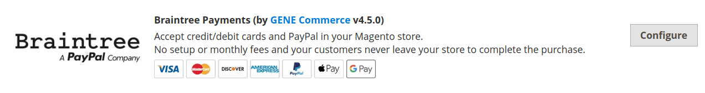

# Braintree

>[!IMPORTANT]
>
>カードの予期しない請求に関するサポートが必要な場合は、[&#x200B; サブスクリプションの解約](https://helpx.adobe.com/manage-account/using/cancel-subscription.html) ページにアクセスしてサポートを受けてください。

Braintreeでは、不正行為の検出とPayPalとの統合により、詳細にカスタマイズ可能なチェックアウト体験を提供します。 [!DNL Apple Pay]、[!DNL Google Pay]、ACH、Venmo、およびローカルの支払い方法をサポートしています。 Braintreeは、Braintreeシステムで取引がおこなわれるため、加盟店におけるPCI認定の負担を軽減することができます。 Braintree Payments統合は、[GENE Commerce](https://www.gene.co.uk/gene-braintree-payments/)によって開発されました。

>[!NOTE]
>
>Commerce MarketplaceのBraintree拡張機能がインストールされている以前のバージョンのAdobe CommerceまたはMagento Open Sourceから2.4.xにアップグレードする場合は、このページの最後にある[2.4 アップグレードノート &#x200B;](#24-upgrade-notes)を参照してください。

## 手順1:Braintree資格情報の取得

[Braintree支払い](https://www.braintreepayments.com/)に移動し、アカウントにサインアップします。

## 手順2：基本設定を完了する

1. _管理者_ サイドバーで、**[!UICONTROL Stores]** > _[!UICONTROL Settings]_>**[!UICONTROL Configuration]**&#x200B;に移動します。

1. 左側のパネルで、**[!UICONTROL Sales]**&#x200B;を展開し、**[!UICONTROL Payment Methods]**&#x200B;を選択します。

   - Commerce インストールに複数のweb サイト、ストア、またはビューがある場合、左上隅で、設定が適用される&#x200B;**[!UICONTROL Store View]**&#x200B;を選択します。

   - 「_[!UICONTROL Merchant Location]_」セクションで、**[!UICONTROL Merchant Country]**&#x200B;がビジネスの場所に設定されていることを確認します。

1. _[!UICONTROL Recommended Solutions]_&#x200B;の下の「_[!UICONTROL Braintree Payments]」（[GENE Commerce](https://www.gene.co.uk/gene-braintree-payments/) v4.7.0～[&#x200B; リリースノート &#x200B;](https://support.gene.co.uk/support/solutions/articles/35000278668)_）セクションで、「**[!UICONTROL Configure]**」をクリックします。

   {width="600" zoomable="yes"}

1. **[!UICONTROL Title]**&#x200B;に、チェックアウト時の支払い方法としてBraintreeを特定するタイトルを入力します。

1. Braintree トランザクションの現在のオペレーティング **[!UICONTROL Environment]**&#x200B;を`Sandbox`または`Production`に設定します

   サンドボックスで設定をテストする場合は、Braintreeが推奨する[&#x200B; クレジットカード番号](https://developers.braintreepayments.com/reference/general/testing/php)のみを使用します。 Braintreeを使用して本番環境に移行する準備ができたら、**[!UICONTROL Environment]**&#x200B;を`Production`に設定します。

   {width="600" zoomable="yes"}

1. **[!UICONTROL Payment Action]**&#x200B;を次のいずれかに設定します：

   - `Authorize Only` – 購入を承認し、資金を保留します。 金額は、販売者が販売を&#x200B;_獲得_&#x200B;するまで、顧客の銀行口座から引き出されません。|
   - `Intent Sale` – 購入金額が承認され、お客様のアカウントから直ちに引き落とされます。 **_Note:_**&#x200B;この値は、2.3.x以前のリリースの_&#x200B;認証とキャプチャ _でした。|

1. Braintree アカウントから&#x200B;**[!UICONTROL Sandbox Merchant ID / Merchant ID]**&#x200B;を入力します。

1. Braintree アカウントから次の資格情報を入力します。

   - **[!UICONTROL Sandbox Public Key / Public Key]**
   - **[!UICONTROL Sandbox Private Key / Private Key]**

   >[!NOTE]
   >
   >**（サンドボックスおよび実稼動環境）**&#x200B;環境には個別のフィールドがあり、その他のフィールドは、選択されている環境に基づいてレンダリングされます。

1. 設定を保存する前に、**[!UICONTROL Validate Credentials]**&#x200B;をクリックして資格情報を検証します。

1. **[!UICONTROL Enable Card Payments]**&#x200B;を`Yes`に設定します。

1. 顧客の情報を安全に保存する機能を使用して、顧客が購入するたびに再入力する必要がない場合は、**[!UICONTROL Enable Vault for Card Payments]**&#x200B;を`Yes`に設定します。

1. お客様が購入するたびにヴォールト カードのCVV番号を確認する場合は、**[!UICONTROL Enable Vault CVV Re-verification]**&#x200B;を`Yes`に設定します。

## 手順3：詳細設定を完了する

1. **[!UICONTROL Advanced Braintree Settings]** セクションのを展開します。

   {width="550" zoomable="yes"}

1. **[!UICONTROL Vault Title]**&#x200B;に、顧客カード情報が保存されている保管スペースを識別する、参照用の説明的なタイトルを入力します。

1. Braintree アカウントから&#x200B;**[!UICONTROL Merchant Account ID]**&#x200B;を入力します。

   使用する加盟店アカウントを指定しない場合、Braintreeはデフォルトの加盟店アカウントを使用してトランザクションを処理します。

1. PayPal、PayLater、Apple Pay、Google Payなど、決済プロセスの開始時にExpress Payment オプションを使用して、より迅速な決済エクスペリエンスを提供するには、**[!UICONTROL Enable Checkout Express Payments]**&#x200B;を`Yes`に設定します。

1. 高度な不正ツールのチェックの一環としてトランザクションを評価用に送信しないようにするには、管理者を通じて行われた注文に対して、**[!UICONTROL Skip Fraud Checks on Admin Orders]**&#x200B;を`Yes`に設定します。

1. しきい値を満たすか、しきい値を超えたときに`Advanced Fraud Protection` チェックがバイパスされるように、**[!UICONTROL Bypass Fraud Protection Threshold]**&#x200B;を設定します。

   このフィールドを空白にすると、このオプションは無効になります。

1. ストアとBraintree間のやり取りのログファイルを保存する場合は、**[!UICONTROL Debug]**&#x200B;を`Yes`に設定します。

1. クレジットカードの裏面から3桁のセキュリティコードを提供するように顧客に要求するには、**[!UICONTROL CVV Verification]**&#x200B;を`Yes`に設定します。

   CVV検証を使用する場合は、Braintree アカウントの&#x200B;_Settings/Processing_ セクションでAVSまたはCVVを有効にしてください。

1. すべての支払い方法のカート行項目を送信するには、**[!UICONTROL Send Card Line Items]**&#x200B;を`Yes`に設定します。

1. **[!UICONTROL Credit Card Types]**&#x200B;の場合、店舗で支払いに受け入れられている各クレジットカードをBraintreeを通じてお支払いとして選択します。

   複数の種類のカードを選択するには、Ctrl キー（PC）またはCommand キー（Mac）を押しながら、各オプションをクリックします。

1. **[!UICONTROL Sort Order]**&#x200B;に数字を入力して、チェックアウト時にBraintreeが他の支払い方法と共に表示されるときに表示される順序を決定します。

## 手順4:BraintreeのWebhook設定を完了する

{width="600" zoomable="yes"}

1. **[!UICONTROL Enable Webhook]**&#x200B;を`Yes`に設定して、不正利用防止、ACH支払い、およびローカル支払い方法のWebhook機能を有効にします。

1. **[!UICONTROL Fraud Protection URL]** フィールドのURLをコピーし、_[!UICONTROL Webhook Destination URL]_&#x200B;としてBraintree アカウントに追加します。

   >[!IMPORTANT]
   >
   >このURLは安全で一般に公開できる必要があります。

1. **[!UICONTROL Fraud Protection Approve Order Status]** フィールドを設定して、Braintreeで不正防止が承認されるタイミングを判断します。

   選択した注文ステータスは、Commerce注文に割り当てられます。

1. Braintreeによって不正防止が拒否されるタイミングを判断するには、**[!UICONTROL Fraud Protection Reject Order Status]** フィールドを設定します。

   選択した注文ステータスは、Commerce注文に割り当てられます。

## ステップ 5：国別の設定を完了する

1. **[!UICONTROL Payment from Applicable Countries]**&#x200B;を次のいずれかに設定します：

   - `All Allowed Countries` - ストア設定で指定されたすべての[国](../getting-started/store-details.md#country-options)のお客様は、この支払い方法を使用できます。
   - `Specific Countries` – このオプションを選択すると、_[!UICONTROL Payment from Specific Countries]_&#x200B;リストが表示されます。 Ctrl キー（PC）またはCommand キー（Mac）を押しながら、お客様が店舗で購入できる国をリストから選択します。

   {width="600" zoomable="yes"}

1. **[!UICONTROL Country Specific Credit Card Types]**&#x200B;を設定するには：

   - **[!UICONTROL Add]**&#x200B;をクリックします。

   - **[!UICONTROL Country]**&#x200B;を設定し、各&#x200B;**[!UICONTROL Allowed Credit Card Type]**&#x200B;を選択します。

   - 各国から受け入れられるクレジットカードを特定するために繰り返します。

## 手順6:BraintreeでACHを実行する

{width="600" zoomable="yes"}

1. ACHをBraintreeの支払いオプションとして含めるには、**[!UICONTROL Enable ACH Direct Debit]**&#x200B;を`Yes`に設定します。

1. 顧客は、1回限りのACH ダイレクトデビット支払い方法を保管し、今後の使用に備えて保管することができます。 **[!UICONTROL Enable Vault for ACH Direct Debit]**&#x200B;から`Yes`に設定されている場合、顧客は支払い情報を再入力または認証する必要なく、ACH Direct Debitを再利用できます。

1. **[!UICONTROL Sort Order]**&#x200B;に番号を入力して、チェックアウト時に他の支払いオプションと共に表示されるBraintree ACH支払いオプションが表示される順序を決定します。

## 手順7: Braintreeの設定で[!UICONTROL Apple Pay]を完了する

{width="600" zoomable="yes"}

1. [!DNL Apple Pay]をBraintreeの支払いオプションとして含めるには、**[!UICONTROL Enable ApplePay through Braintree]**&#x200B;を`Yes`に設定します。

   最初に、Braintree アカウントで[&#x200B; ドメイン名](https://developer.paypal.com/braintree/docs/guides/apple-pay/configuration/javascript/v3)を確認してください。

1. お客様の情報を安全に保存する機能を使用して、お客様がApple Payで購入するたびに再入力する必要がない場合は、**[!UICONTROL Enable Vault for ApplePay]**&#x200B;を`Yes`に設定します。

1. **[!UICONTROL Payment Action]**&#x200B;を次のいずれかに設定します：

   - `Authorize Only` – 購入を承認し、資金を保留します。 金額は、販売者が販売を&#x200B;_獲得_&#x200B;するまで、顧客の銀行口座から引き出されません。
   - `Intent Sale` – 購入金額が承認され、お客様のアカウントから直ちに引き落とされます。

1. **[!UICONTROL Merchant Name]**&#x200B;の場合、Apple支払いダイアログでお客様に表示されるラベルを指定するテキストを入力します。

1. **[!UICONTROL Sort Order]**&#x200B;に番号を入力して、チェックアウト中に他の支払いオプションと共に表示される[!DNL Apple Pay]支払いオプションが表示される順序を決定します。

## ステップ 8：ローカルの支払い方法の設定を完了する

1. Braintreeの支払い方法としてローカルの支払い方法を含めるには、**[!UICONTROL Enable Local Payment Methods]**&#x200B;を`Yes`に設定します。

1. **[!UICONTROL Title]**&#x200B;に、チェックアウト支払い方法セクションに表示されるラベルに使用するテキストを入力します（デフォルト値：`Local Payments`）。

1. **[!UICONTROL Fallback Button Text]**&#x200B;の場合、フォールバック Braintree ページに表示されるボタンに使用するテキストを入力して、お客様をweb サイトに戻します（例：`Complete Checkout`）。

1. **[!UICONTROL Redirect on Fail]**&#x200B;の場合、ローカルの支払い方法のトランザクションがキャンセルされたり、失敗したり、エラーが発生したりしたときに、顧客をリダイレクトするURLを入力します。 チェックアウト支払いページである必要があります（例：`https://www.domain.com/checkout#payment`）。

1. **[!UICONTROL Allowed Payment Methods]**&#x200B;で、有効にするローカル支払い方法を選択します。

   オプション：`Bancontact` / `EPS` / `giropay` / `iDeal` / `Klarna Pay Now` / `SOFORT` / `MyBank` / `P24` / `SEPA/ELV Direct Debit` （まだサポートされていません）

   {width="600" zoomable="yes"}

   >[!NOTE]
   >
   >バンドルされたBraintree拡張機能は、[Braintree開発者ドキュメント &#x200B;](https://developer.paypal.com/braintree/docs/guides/local-payment-methods/overview)に記載されているすべてのローカル支払い方法をサポートしていません。 その他のローカル支払い方法は、今後のリリースでサポートされる予定です。

1. **[!UICONTROL Sort Order]**&#x200B;に番号を入力して、チェックアウト中に他の支払いオプションと共に表示されるローカル支払い方法が表示される順序を決定します。

## 手順9: Braintreeの設定で[!DNL Google Pay]を完了する

{width="600" zoomable="yes"}

1. [!DNL Google Pay]をBraintreeの支払いオプションとして含めるには、**[!UICONTROL Enable GooglePay Through Braintree]**&#x200B;を`Yes`に設定します。

1. お客様の情報を安全に保存する機能を使用して、お客様がGoogle Payで購入するたびに再入力する必要がない場合は、**[!UICONTROL Enable Vault for GooglePay]**&#x200B;を`Yes`に設定します。

1. **[!UICONTROL Payment Action]**&#x200B;を次のいずれかに設定します：

   - `Authorize Only` – 購入を承認し、資金を保留します。 金額は、販売者が販売を&#x200B;_獲得_&#x200B;するまで、顧客の銀行口座から引き出されません。
   - `Intent Sale` – 購入金額が承認され、お客様のアカウントから直ちに引き落とされます。

1. **[!UICONTROL Button Color]**&#x200B;を設定して、[!DNL Google Pay] ボタンの色を決定します：`White`または`Black`

1. **[!UICONTROL Merchant ID]**&#x200B;に、MerchantIDを入力します（Googleから提供）。

1. **[!UICONTROL Accepted Cards]**&#x200B;の場合は、お客様が[!DNL Google Pay]を使用して注文を行う際に使用できるカードの種類を選択します。

   オプション：`Visa` / `MasterCard` / `AMEX` / `Discover` / `JCB`

1. **[!UICONTROL Sort Order]**&#x200B;に番号を入力して、チェックアウト中に他の支払いオプションと共に表示されるときに[!DNL Google Pay]が表示される順序を決定します。

## ステップ 10: Braintreeの設定でVenmoを完成させる

1. VenmoをBraintreeの支払いオプションとして含めるには、**[!UICONTROL Enable Venmo through Braintree]**&#x200B;を`Yes`に設定します。

1. セキュリティで保護されたVaultを使用して顧客のVenmo アカウントを保存できるようにするには、**[!UICONTROL Enable Vault for Venmo]**&#x200B;を`Yes`に設定して、今後のトランザクションのために顧客がVenmo アカウントに再度ログインする必要がないようにします。

   {width="600" zoomable="yes"}

1. **[!UICONTROL Payment Action]**&#x200B;を次のいずれかに設定します：

   - `Authorize Only` – 購入を承認し、資金を保留します。 金額は、販売者が販売を&#x200B;_獲得_&#x200B;するまで、顧客の銀行口座から引き出されません。
   - `Intent Sale` – 購入金額が承認され、お客様のアカウントから直ちに引き落とされます。

1. 「**[!UICONTROL Sort Order]**」に数値を入力して、チェックアウト中に他の支払いオプションと共に表示されるときにVenmoが表示される順序を決定します。

## ステップ 11:BraintreeでPayPalを完了する

{width="550" zoomable="yes"}を使用したPayPal

1. Braintreeの支払いオプションとしてPayPalを含めるには、**[!UICONTROL Enable PayPal through Braintree]**&#x200B;を`Yes`に設定します。

1. Braintreeのお支払い方法でPayPalを指定します。

   >[!NOTE]
   >
   >**[!DNL PayPal Credit]**&#x200B;または&#x200B;**[!DNL PayPal PayLater]**&#x200B;を有効にできます。 両方のメソッドを同時に有効にすることはできません。

   - [!DNL PayPal Credit]をBraintreeの支払いオプションとして含めるには、**[!UICONTROL Enable PayPal Credit through Braintree]**&#x200B;を`Yes`に設定します。

     **Braintreeを通じてPayPalを有効にする**&#x200B;が`Yes`に設定されている場合、このフィールドのみが表示されます。

     >[!NOTE]
     >
     >PayPal Creditは、米国および英国でのみ利用可能です。 _[!UICONTROL Merchant Country]_&#x200B;フィールドで選択した値が`US`または`UK`でない場合、PayPal クレジットは無効になります。

   - [!DNL PayPal PayLater]をBraintreeの支払いオプションとして含めるには、**[!UICONTROL Enable PayPal PayLater through Braintree]**&#x200B;を`Yes`に設定します。

     **[!UICONTROL Enable PayPal PayLater through Braintree]**&#x200B;が`Yes`に設定されている場合、このフィールドのみが表示されます。

     _3_&#x200B;でのお支払いなど、オファーに関するPayLater メッセージをサイトに表示できます。これにより、顧客は3回の無利息の月払いで支払うことができます。 Braintreeとの連携により、この機能を宣伝するためのメッセージをサイトに表示できます。 PayLaterのオファーを他のコンテンツ、マーケティング、素材と宣伝することはできません。

1. 「**[!UICONTROL Title]**」に、決済時にPayPalによるBraintree支払いオプションを識別するタイトルを入力します。

1. **[!UICONTROL Vault Enabled]**&#x200B;を`Yes`に設定して、顧客のPayPal アカウントを保存するためのセキュアな保管を有効にします。 認証済みのPayPal アカウントは、今後の取引に使用できるため、顧客の手順数を減らすことができます。

1. **[!UICONTROL Send Cart Line Items for PayPal]**&#x200B;から`Yes`に設定して、行項目（注文項目）をギフトカード、項目のギフトラッピング、注文のギフトラッピング、店舗クレジット、配送、および行項目としての税金と共にPayPalに送信します。

1. 「**[!UICONTROL Sort Order]**」に数字を入力して、チェックアウト時にBraintree PayPalの支払いオプションが他の支払いオプションと共に表示されるときに表示される順序を決定します。

1. [&#x200B; ストア設定](../getting-started/store-details.md#store-information)で定義されている名前とは異なる名前を表示するには、表示する名前を&#x200B;**[!UICONTROL Override Merchant Name]** フィールドに入力します。

1. **[!UICONTROL Payment Action]**&#x200B;を次のいずれかに設定します：

   - `Authorize Only` – 購入を承認し、資金を保留します。 金額は、販売者が販売を&#x200B;_獲得_&#x200B;するまで、顧客の銀行口座から引き出されません。
   - `Authorize and Capture` – 購入金額が承認され、お客様のアカウントから直ちに引き落とされます。

1. PayPalで処理されたBraintree トランザクションに対して、**[!UICONTROL Payment from Applicable Countries]**&#x200B;を次のいずれかに設定します。

   - `All Allowed Countries` - ストア設定で指定されたすべての[国](../getting-started/store-details.md#country-options)のお客様は、この支払い方法を使用できます。
   - `Specific Countries` – このオプションを選択すると、_[!UICONTROL Payment from Specific Countries]_&#x200B;リストが表示されます。 Ctrl キー（PC）またはCommand キー（Mac）を押しながら、お客様が店舗で購入できる国をリストから選択します。

   {width="550" zoomable="yes"}

1. お客様に請求先住所の提供を求めるには、**[!UICONTROL Require Customer's Billing Address]**&#x200B;を`Yes`に設定します。

   >[!NOTE]
   >
   >この機能は、PayPal テクニカルサポートによってアカウントに対して有効にする必要があります。

1. PayPal Expressの注文レビューページをスキップするには、**[!UICONTROL Skip Order Review Step]**&#x200B;を`Yes`に設定します。

   PayPal Expressでお支払いのお客様：お支払いを完了する前にレビューページにリダイレクトする場合は、これを`No`に設定します。 お客様がレビューページをスキップする場合は、`Yes`に設定します。

1. ストアとPayPalのインタラクションのログファイルをBraintree経由で保存するには、**[!UICONTROL Debug]**&#x200B;を`Yes`に設定します。

1. ミニカートとショッピングカートページの両方にPayPal ボタンを表示するには、**[!UICONTROL Display on Shopping Cart]**&#x200B;を`Yes`に設定します。

1. パッケージの追跡情報をPayPalに送信するには、**[!UICONTROL Send Package Tracking]**&#x200B;を`Yes`に設定します。

   パッケージの追跡情報は、PayPalの取引/注文の場合にのみPayPalに送信されます。 [!UICONTROL Package Tracking]機能が正しく動作するには、[!UICONTROL Send Cart Line Items for PayPal]設定フィールドを有効にする必要があります。

1. パッケージのトラッキング更新をPayPalで購入者または支払い者に通知するには、**[!UICONTROL Use PayPal's "Notify Payer" functionality]**&#x200B;を`Yes`に設定します。

## 手順12：スタイル設定の設定

1. **[!UICONTROL Location]**&#x200B;の場合、PayPalのボタンとメッセージのレンダリング先を選択します：`Mini-Cart and Cart Page`、`Checkout Page`、または`Product Page`

   {width="600" zoomable="yes"}

### [!UICONTROL Mini-Cart and Cart Page]

このセクションのオプションと設定は、_[!UICONTROL Location]_&#x200B;フィールドの設定によって異なります。

1. **[!UICONTROL PayPal Button Type]**&#x200B;を3種類のボタンのいずれかに設定します：`PayPal Button` / `PayPal Pay Later Button` / `PayPal Credit Button`

**[!UICONTROL PayPal Button]**

このセクションのオプションと設定は、_[!UICONTROL PayPal Button Type]_&#x200B;フィールドで選択したボタンの種類によって異なります。

1. 選択した場所のストアフロントにPayPal ボタンを表示するには、**[!UICONTROL Show PayPal Button]**&#x200B;を`Yes`に設定します。

1. **[!UICONTROL Button Label]**&#x200B;の場合、PayPal ボタンラベルを選択します：`Paypal`、`Checkout`、`Buynow`、または`Pay`

1. **[!UICONTROL Color]**&#x200B;の場合、PayPal ボタンの色を選択します：`Blue`、`Black`、`Gold`、または`Silver`

1. **[!UICONTROL Shape]**&#x200B;の場合、PayPal ボタンの形状を選択します：`Pill`または`Rectangle`

1. **[!UICONTROL Size (Deprecated)]**&#x200B;の場合、PayPal ボタンのサイズを選択してください：`Medium`、`Large`、または`Responsive`

>[!NOTE]
>
>**[!DNL Size(Deprecated)]**&#x200B;設定フィールドは廃止され、PayPal ボタンのスタイル設定には使用されません。

これらのオプションを設定すると、PayPal ボタンのプレビューが表示されます。 設定の適用や値のリセットに使用できるコントロールがあります。

- ボタンとPayLater メッセージの選択したスタイル設定を保存し、現在の場所とボタンの種類に適用するには、**[!UICONTROL Apply]**&#x200B;をクリックします。

- ボタンとPayLater メッセージの値に対して選択したスタイル設定を保存し、すべてのボタンの種類と場所に適用するには、**[!UICONTROL Apply to All Buttons]**&#x200B;をクリックします。

- ボタンとPayLater メッセージの推奨されるデフォルト値にスタイル設定を戻し、すべてのボタンの種類と場所に適用するには、**[!UICONTROL Reset to Recommended Defaults]**&#x200B;をクリックします。

## ステップ 13：後払いメッセージ

**[!UICONTROL Product Page]**

{width="600" zoomable="yes"}

1. ストアフロントで[!DNL Pay Later] メッセージを製品ページに表示するには、**[!UICONTROL Show PayLater Messaging]**&#x200B;を`Yes`に設定します。

   利用可能なオファーに対する後払いメッセージを表示します。 制限が適用されます。 [PayPalのドキュメント &#x200B;](https://developer.paypal.com/studio/checkout/pay-later/us)を参照してください。

1. **[!UICONTROL Message Layout]**&#x200B;の場合、[!DNL Pay Later] メッセージレイアウトを選択します：`Text`または`Flex`

1. **[!UICONTROL Logo]**&#x200B;の場合、PayPal ロゴの種類（`Inline`、`Primary`、`Alternative`、または`None`）を選択します

1. **[!UICONTROL Logo Position]**&#x200B;の場合、PayPal ロゴの位置を選択します：`Left`、`Right`、または`Top`

1. **[!UICONTROL Text Color]**&#x200B;の場合、[!DNL PayLater] メッセージのテキストカラーを選択します：`Black`、`White`、`Monochrome`、または`Grayscale`

**[!UICONTROL Cart]**

{width="600" zoomable="yes"}

1. ミニカートまたはカートページで[!DNL Pay Later] メッセージをストアフロントに表示するには、**[!UICONTROL Show PayLater Messaging]**&#x200B;を`Yes`に設定します。

   利用可能なオファーに対する後払いメッセージを表示します。 制限が適用されます。 [PayPalのドキュメント &#x200B;](https://developer.paypal.com/studio/checkout/pay-later/us)を参照してください。

1. **[!UICONTROL Message Layout]**&#x200B;の場合、[!DNL Pay Later] メッセージレイアウトを選択します：`Text`または`Flex`

1. **[!UICONTROL Logo]**&#x200B;の場合、PayPal ロゴの種類（`Inline`、`Primary`、`Alternative`、または`None`）を選択します

1. **[!UICONTROL Logo Position]**&#x200B;の場合、PayPal ロゴの位置を選択します：`Left`、`Right`、または`Top`

1. **[!UICONTROL Text Color]**&#x200B;の場合、[!DNL PayLater] メッセージのテキストカラーを選択します：`Black`、`White`、`Monochrome`、または`Grayscale`

**[!UICONTROL Checkout]**

{width="600" zoomable="yes"}

1. チェックアウト時にストアフロントに[!DNL Pay Later] メッセージを表示するには、**[!UICONTROL Show PayLater Messaging]**&#x200B;を`Yes`に設定します。

   利用可能なオファーに対する後払いメッセージを表示します。 制限が適用されます。 [PayPalのドキュメント &#x200B;](https://developer.paypal.com/studio/checkout/pay-later/us)を参照してください。

1. **[!UICONTROL Text Align]**&#x200B;の場合、[!DNL Pay Later] メッセージのテキスト整列を選択します：`Text`、`Center`、または`Right`

1. **[!UICONTROL Text Color]**&#x200B;の場合、[!DNL Pay Later] メッセージのテキストカラーを選択します：`Black`、`White`

## 手順14: 3D検証設定を完了する

1. 確認プログラムに登録されているクレジットカード（_VISA_&#x200B;による確認など）を使用しているお客様に対して確認手順を追加する場合は、**[!UICONTROL 3D Secure Verification]**&#x200B;を`Yes`に設定します。

   このプロセスでは、検証用に送信されたトランザクション金額が、承認用に送信された金額と照合されます。

2. すべてのトランザクションに対して常に3D セキュア要求にチャレンジするには、**[!UICONTROL Always request 3DS]**&#x200B;を`Yes`に設定します。

3. **[!UICONTROL Threshold Amount]**&#x200B;に、3D認証をトリガーするために必要な最低注文金額を入力します。

4. **[!UICONTROL Verify for Applicable Countries]**&#x200B;を次のいずれかに設定します：

   - `All Allowed Countries` - ストア設定で指定されたすべての[国](../getting-started/store-details.md#country-options)のお客様は、この支払い方法を使用できます。
   - `Specific Countries` – このオプションを選択すると、_[!UICONTROL Verify for Specific Countries]_&#x200B;リストが表示されます。 Ctrl キー（PC）またはCommand キー（Mac）を押しながら、お客様が店舗で購入できる国をリストから選択します。

   {width="600" zoomable="yes"}

## 手順15:Braintree動的記述子の設定

顧客のクレジットカード明細書の購入を識別するには、次の記述子を使用します。 各購入に関連する企業を明確に特定することで、チャージバックの数を減らすことができます。 アカウントで動的記述子が有効になっていない場合は、Braintree サポートにお問い合わせください。

{width="600" zoomable="yes"}

1. 次のガイドラインに従って、**[!UICONTROL Name]**、**[!UICONTROL Phone]**&#x200B;および&#x200B;**[!UICONTROL URL]**&#x200B;の動的記述子を入力します。

   - **[!UICONTROL Name]** – 名前記述子には、アスタリスク （*）で区切られた2つの部分があります。 例：

     `company*myproduct`

     記述子の最初の部分は会社またはDBAを識別し、2番目の部分は製品を識別します。 ディスクリプタの`company`部分と`product`部分の長さは、次の方法で割り当てることができます。組み合わせた長さは最大22文字です。

     **_名前記述子_**&#x200B;の文字

     _Option 1 :_`Company`は3文字である必要があります。`Product`は最大18文字です

     _Option 2 :_`Company`は7文字である必要があります。`Product`は最大14文字です

     _オプション 3_: `Company`は12文字である必要があり、`Product`は9文字までである可能性があります

   - **[!UICONTROL Phone]** – 電話記述子の長さは10 ～ 14文字にする必要があり、数値、ダッシュ、括弧、ピリオドのみを含めることができます。 例：

     `9999999999`

     `(999) 999-9999`

     `999.999.9999`

   - **[!UICONTROL URL]** - URL記述子はドメイン名を表し、最大13文字まで指定できます。 例：

     `company.com`

1. Braintreeの設定が完了したら、**[!UICONTROL Save Config]**&#x200B;をクリックします。

## 2.4 アップグレードノート

Adobe CommerceおよびMagento Open Source 2.4.0以降、Braintree拡張機能はリリースに含まれています。 Marketplace Braintree拡張機能がインストールされている2.4.0より前のバージョンからCommerce 2.4.xに移行する場合は、その拡張機能（`paypal/module-braintree`または`gene/module-braintree`）をアンインストールし、`Magento_Braintree`ではなく`PayPal_Braintree`名前空間を使用するようにコードを更新する必要があります。 コアのCommerce Braintree Payments バンドル拡張機能およびCommerce Marketplaceに配布された拡張機能の設定設定は保持され、以前のバージョンに配置された支払いは、引き続き通常どおりキャプチャ、無効化、または払い戻しできます。
