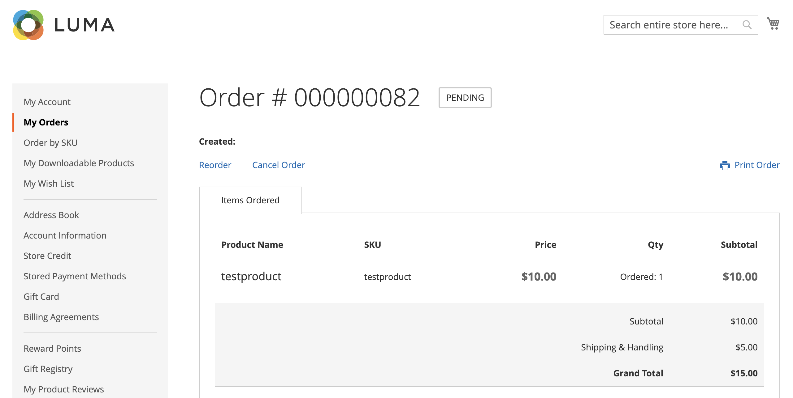

# 注文のキャンセルを許可

有効にすると、顧客のアカウントから直接注文をキャンセルできます。 キャンセルはデフォルトで無効になっています。

## 注文のキャンセルを有効にする基準

- _キャンセル注文を許可_ 設定オプションを有効にする必要があります。

- 注文のステータスが `Hold`、`Canceled`、`Complete`、`Closed` の場合、ストアフロントのキャンセルオプションは無効になります。

- 注文された商品のいずれかが出荷された場合、ストアフロントでキャンセルオプションが無効になります。

- 支払われた商品がある場合、キャンセルオプションが有効になり、その商品の払い戻しが作成されます。

- 注文が `Pending` または `Processing` ステータスの場合は、ストアフロントでキャンセルオプションが有効になっています。

## 顧客のキャンセルを許可し、キャンセル理由をカスタマイズするように設定

1. _管理者_ サイドバーで、**[!UICONTROL Stores]**/_[!UICONTROL Settings]_/**[!UICONTROL Configuration]**&#x200B;に移動します。

1. 左側のパネルで「**[!UICONTROL Sales]**」を展開し、「**[!UICONTROL Sales]**」を選択します。

1. 「」を展開し、「**[!UICONTROL Order cancellation]**」セクションを展開します。

   {width="600" zoomable="yes"}

1. **[!UICONTROL Order cancellation through GraphQL]** を `Yes` に設定します。

   この設定により、ストアフロントの顧客アカウントからのキャンセル機能が有効になります。

1. **[!UICONTROL Order Order cancellation reasons]** では、キャンセル理由を追加、削除または変更できます。

   この設定では、注文をキャンセルした際に、キャンセル理由が顧客に対してストアフロントに表示されます。
少なくとも 1 つの理由を指定したことを確認します。

1. 「**[!UICONTROL Save Config]**」をクリックします。

## ストアフロントからのキャンセル

お客様は、次の 3 つのページから特定の注文のキャンセル機能を開始できます。

- _マイオーダー_ ページ

- _並べ替え順_ ページ

- _マイアカウント_ ページ

### マイ注文

注文をキャンセルできる場合は、[ マイ注文 ] ページに [_注文をキャンセル_] ボタンが表示されます。

{width="700" zoomable="yes"}

### 注文ビューページ

注文をキャンセルできる場合は、「注文を表示」ページに _注文をキャンセル_ ボタンが表示されます。

{width="700" zoomable="yes"}

### マイアカウント

注文をキャンセルできる場合は、マイアカウント ページの「最近の注文」セクションに「_注文をキャンセル_」ボタンが表示されます。

{width="700" zoomable="yes"}
