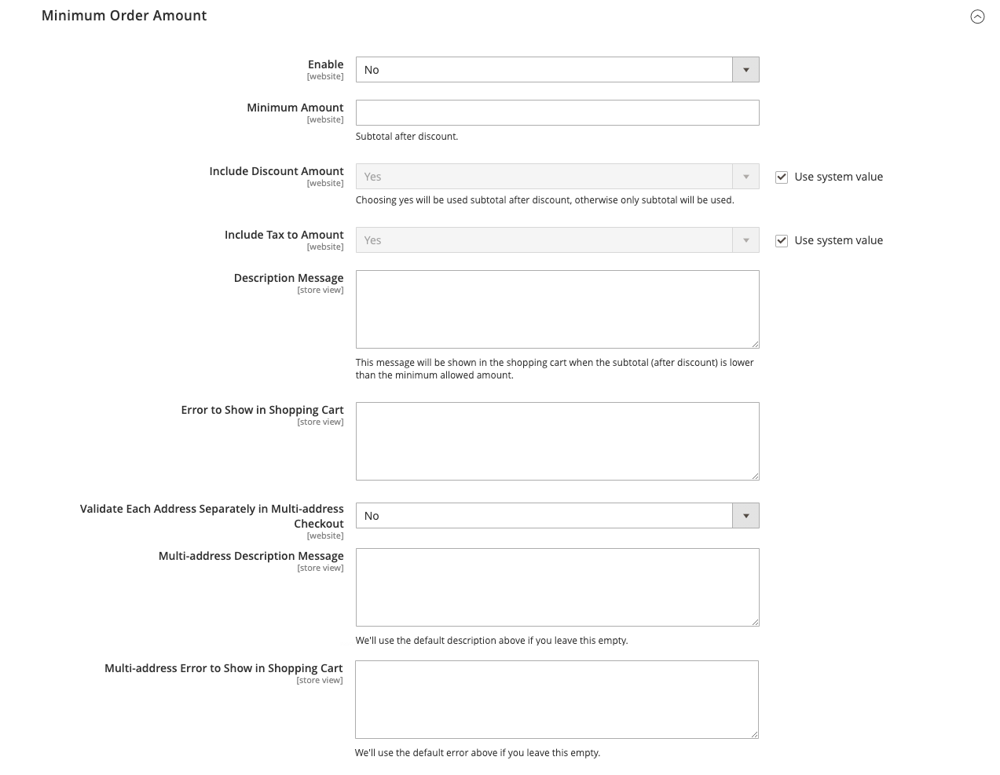
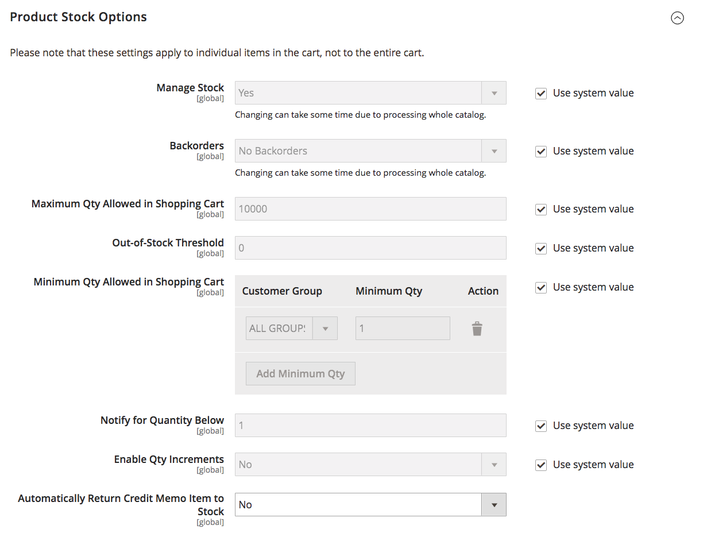
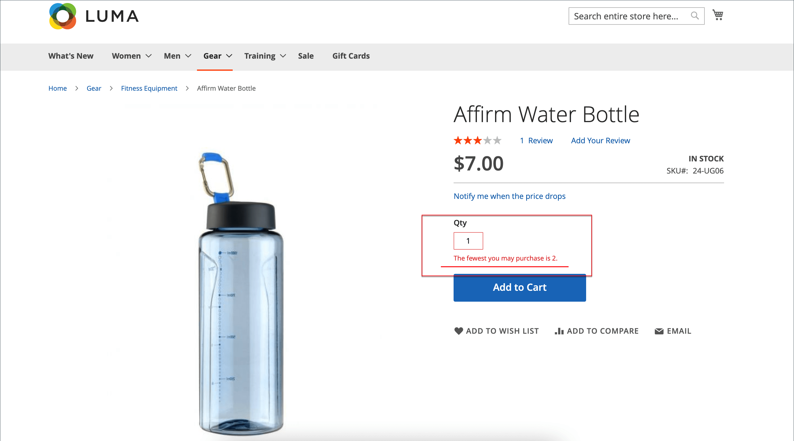
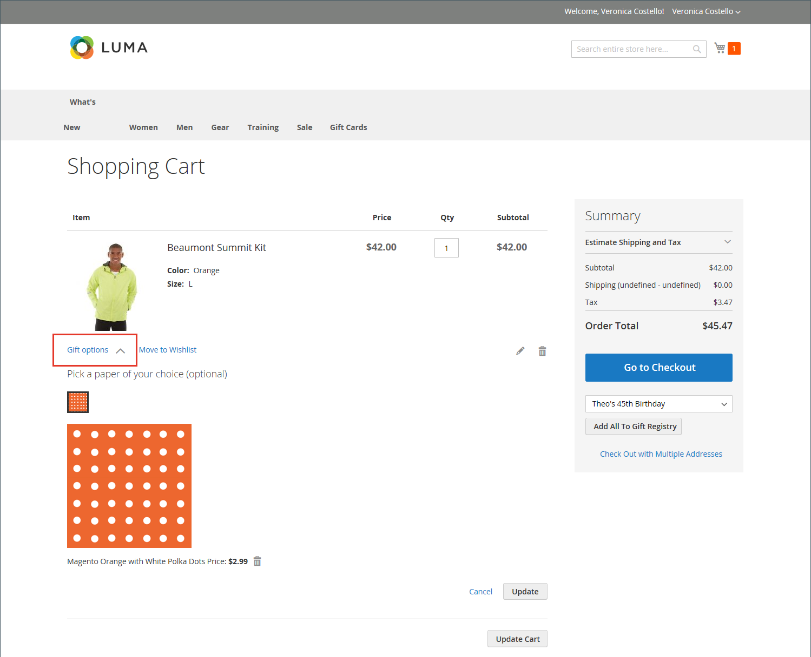

# 買い物かご設定

買い物かご設定は、顧客が買い物かごページにリダイレクトされたタイミングや、製品のサムネールに使用する画像など、店舗の顧客に対する買い物かごの機能を決定します。 また、チェックアウトプロセスが開始される前に最低金額に到達するように注文を要求したり、見積価格が有効である日数を指定したり、_注文の合計_ セクションで品目の順序を指定したりできます。

[**ミニカート**](#mini-cart) – このオプションを設定すると、カートのリンク/アイコンにカート内の異なる製品（または SKU）の数またはすべての項目の合計数が表示されるかどうかを指定できます。

[**ミニ買い物かごリンク**](#configure-the-cart-link) – 顧客がストアページの上部にある買い物かごアイコンの項目数をクリックしたときにミニ買い物かごを表示するかどうかを決定するには、このオプションを設定します。

[**買い物かごにリダイレクト**](#redirect-to-cart) – このオプションを設定すると、買い物かごに項目が追加されたときにのみ、または顧客がページへの移動を選択したときに買い物かごページを表示できます。

[**見積もりの有効期間**](#quote-lifetime) – 価格が有効な期間を指定するには、このオプションを設定します。

[**最小注文金額**](#minimum-order-amount) – 割引が適用された後、注文の小計の達成が必要で、買い物かごに表示されるメッセージの最小金額を指定するには、これらのオプションを設定します。

[**最小注文数量**](#minimum-order-quantity) – これらのオプションを設定して、注文を行うために必要な最小品目数を指定します。

[**買い物かごのサムネール**](#cart-thumbnails) – 買い物かごのサムネールオプションを設定して、グループ化または設定可能な製品に関して買い物かごに表示されるサムネールを決定します。

[**ギフトオプション**](#gift-options) – 顧客がギフトメッセージまたはグリーティングカードを追加できるかどうか、およびギフトラッピングオプションが使用可能かどうかを決定するために、ギフトオプションを設定します。

>[!NOTE]
>
>チェックアウトプロセスの設定について詳しくは、「[&#x200B; チェックアウトオプション &#x200B;](checkout-process.md)」を参照してください。

## ミニカート

_ミニカート_ には、カート内の項目の概要が表示されます。 この機能はデフォルトで有効になっており、ページ上部の「買い物かご」リンクをクリックすると表示されます。
このリンクは、カート内の異なる製品（または SKU）の数や、すべての項目の合計数を表示するように設定できます。

{width="700" zoomable="yes"}

>[!NOTE]
>
>_登録済み_ のお客様の場合、複数のデバイスやブラウザー間でミニカートが自動的に同期されない場合があります。 このような場合にミニカートを同期するには、お客様はデバイスまたはブラウザーで [&#x200B; 買い物かご &#x200B;](cart.md) ページを開くだけです。

### ミニ買い物かごの設定

1. _管理者_ サイドバーで、**[!UICONTROL Stores]**/_[!UICONTROL Settings]_/**[!UICONTROL Configuration]**&#x200B;に移動します。

1. 左側のパネルで「**[!UICONTROL Sales]**」を展開し、「**[!UICONTROL Checkout]**」を選択します。

1. 「」を展開し、「_[!UICONTROL Mini Cart]_」セクションを展開します。

   {width="600" zoomable="yes"}

1. 設定が特定のストア表示の場合は、[&#x200B; ストア表示を選択 &#x200B;](../configuration-reference/scope-change.md#set-the-scope) して設定が適用されます。

   プロンプトが表示されたら、「**[!UICONTROL OK]**」をクリックして続行します。

1. **[!UICONTROL Display Mini Cart]** を次のいずれかに設定します。

   - `Yes` - ストアページにミニカートを表示します。 サイドバーの外観は、テーマによって異なります。
   - `No` - ストアページでのミニカートの表示を無効にします。

1. ディスプレイが有効な場合は、他のオプションを更新してディスプレイを設定します。

   - **[!UICONTROL Number of Items to Display Scrollbar]**：スクロールバーがトリガーされる前にサイドバーに表示できる項目の数を入力します。
   - **[!UICONTROL Maximum Display Recently Added Item(s)]**：ミニ カートに表示する、最近追加されたアイテムの最大数を入力します。

1. 「**[!UICONTROL Save Config]**」をクリックします。

### 買い物かごリンクの設定

1. _管理者_ サイドバーで、**[!UICONTROL Stores]**/_[!UICONTROL Settings]_/**[!UICONTROL Configuration]**&#x200B;に移動します。

1. 左側のパネルで「**[!UICONTROL Sales]**」を展開し、「**[!UICONTROL Checkout]**」を選択します。

1. 「」を展開し、「**[!UICONTROL My Cart Link]**」セクションを展開します。

1. **[!UICONTROL Display Cart Summary]** を次のいずれかの設定に設定します。

   - `Display item quantities` – この設定では、買い物かごにある製品の合計数が表示され、各製品の数量が追加されます。
   - `Display number of items in cart` – この設定では、数量に関係なく、買い物かごの製品項目数が表示されます。

   {width="600" zoomable="yes"}

1. 「**[!UICONTROL Save Config]**」をクリックします。

## 買い物かごにリダイレクト

買い物かごページは、商品が買い物かごに追加されたときまたは顧客がページに移動を選択したときにのみ表示されるように設定できます。 現在カートに入っている商品に関する基本情報は、常に [&#x200B; ミニカート &#x200B;](#mini-cart) で利用できます。 この決定は、顧客が買い物を続けることの利点と、チェックアウトに進むことを促すことの利点とのバランスを取ることです。 それは個人的な好みの単純な問題かもしれません。 ただし、数値でバックアップする場合は、A/B テストを実行して、どのアプローチがより高いコンバージョン率を生み出すかを確認できます。

**_買い物かごが表示されるタイミングを設定するには：_**

1. _管理者_ サイドバーで、**[!UICONTROL Stores]**/_[!UICONTROL Settings]_/**[!UICONTROL Configuration]**&#x200B;に移動します。

1. 左側のパネルで「**[!UICONTROL Sales]**」を展開し、「**[!UICONTROL Checkout]**」を選択します。

1. 「」を展開し、「**[!UICONTROL Shopping Cart]**」セクションを展開します。

   {width="600" zoomable="yes"}

1. 設定が特定のストア表示の場合は、[&#x200B; ストア表示を選択 &#x200B;](../configuration-reference/scope-change.md#set-the-scope) して設定が適用されます。

   プロンプトが表示されたら、「**[!UICONTROL OK]**」をクリックして続行します。

1. **[!UICONTROL After Adding a Product Redirect to Shopping Cart]** を次のいずれかに設定します。

   - `Yes` – 商品が買い物かごに追加された直後に、買い物かごページを表示します。
   - `No` – 買い物かごに製品を追加した後に、買い物かごへのリダイレクトを無効にします。

1. 「**[!UICONTROL Save Config]**」をクリックします。

## 見積もりの有効期間

Adobe Commerce B2B をインストールして有効化すると、_Quotes_ 機能のサポートが追加されます。 この機能を使用すると、権限のある購入者は、買い物かごからリクエストを送信することで、価格ネゴシエーションプロセスを開始できます。 _Quotes_ グリッドには、受け取った各見積が一覧表示され、購入者と販売者の間のコミュニケーションの履歴が保持されます。 B2B 機能について詳しくは、_Adobe Commerce B2B ユーザーガイド [&#128279;](../b2b/quotes.md) の  交渉済みの引用符_ を参照してください。

設定で買い物かごの見積もり有効期間を設定することで、価格の有効期間を決定できます。 例えば、買い物客が数日後に買い物かごを放置した場合、一部の商品の見積価格が同じではなくなる可能性があります。 デフォルトでは、見積もりの有効期間は 30 日に設定されています。

**_見積もりの有効期間を設定するには：_**

1. _管理者_ サイドバーで、**[!UICONTROL Stores]**/_[!UICONTROL Settings]_/**[!UICONTROL Configuration]**&#x200B;に移動します。

1. 左側のパネルで「**[!UICONTROL Sales]**」を展開し、「**[!UICONTROL Checkout]**」を選択します。

1. 「」を展開し、「**[!UICONTROL Shopping Cart]**」セクションを展開します。

   {width="600" zoomable="yes"}

1. 設定が特定のストア表示の場合は、[&#x200B; ストア表示を選択 &#x200B;](../configuration-reference/scope-change.md#set-the-scope) して設定が適用されます。

   プロンプトが表示されたら、「**[!UICONTROL OK]**」をクリックして続行します。

1. **[!UICONTROL Quote Lifetime (days)]** の場合は、見積価格が有効である日数を入力します。

1. 「**[!UICONTROL Save Config]**」をクリックします。

## 最小注文金額

この設定を使用すると、割引が適用された後に、注文の小計が満たされる必要がある最小金額を指定できます。 複数の住所に発送された注文は、住所ごとの最小注文金額を満たすために必要になる場合があります。 「チェックアウト」ボタンは、最小注文金額に達した後にのみ使用できるようになります。

{width="700" zoomable="yes"}

**_最小注文金額を設定するには：_**

1. _管理者_ サイドバーで、**[!UICONTROL Stores]**/_[!UICONTROL Settings]_/**[!UICONTROL Configuration]**&#x200B;に移動します。

1. 左側のパネルで「**[!UICONTROL Sales]**」を展開し、その下の「**[!UICONTROL Sales]**」を選択します。

1. 「」を展開し、「**[!UICONTROL Minimum Order Amount]**」セクションを展開します。

   {width="600" zoomable="yes"}

1. 最小注文額を要求するには、**[!UICONTROL Enable]** を `Yes` に設定します。

1. 最小注文が有効な場合は、次のオプションを設定して要件を設定します。

   - 割引が適用された後の小計に必要な **[!UICONTROL Minimum Amount]** を入力します。

   - **[!UICONTROL Include Discount Amount]** を次のいずれかに設定します。

      - `Yes` – 小計が割引を含む最小金額を満たしている必要があります。 50 ドルの最小値の例では、買い物かごに 60 ドルの上部と 25% の割引が適用された場合、結果の小計は 45 ドルであり、買い物かごは最小値を満たしません。
      - `No` – 小計が割引なしで最小金額を満たす必要があります。

   - **[!UICONTROL Include Tax to Amount]** を次のいずれかに設定します。

      - `Yes` – 税金を含む最小金額を満たすために小計が必要です。
      - `No` – 税金なしで小計が最小金額を満たす必要があります。

1. 必要に応じて、最小注文金額メッセージ設定をカスタマイズします。

   - **[!UICONTROL Description Message]**：小計が最低金額を満たさない場合に買い物かごの上部に表示されるメッセージをカスタマイズするために使用するテキストを入力します。

   - **[!UICONTROL Error to Show in Shopping Cart]**：買い物かごのエラーメッセージをカスタマイズするために使用するテキストを入力します。

   デフォルトのメッセージを使用するには、メッセージの説明フィールドを空のままにします。

1. 必要に応じて、複数アドレスの注文の最小注文金額設定を設定します。

   - 複数アドレス順の各アドレスが最小注文額を満たすことを要求するには、**[!UICONTROL Validate Each Address Separately in Multi-address Checkout]** を `Yes` に設定します。

   - 必要に応じて、最小注文金額メッセージ設定をカスタマイズします。

      - **[!UICONTROL Multi-address Description Message]** – 最小値を満たさない複数アドレスの注文に対して買い物かごの上部に表示されるメッセージをカスタマイズするために使用するテキストを入力します。

      - **[!UICONTROL Multi-address Error to Show in Shopping Cart]** – 最小値を満たさない複数アドレスの注文に対する買い物かごエラーメッセージをカスタマイズするために使用するテキストを入力し、ボックスにテキストを入力します。

     デフォルトのメッセージを使用するには、メッセージの説明フィールドを空のままにします。

1. 「**[!UICONTROL Save Config]**」をクリックします。

## 最小注文数量

注文に許可される最小数量を設定できます。 最小数量は、各顧客グループに応じて設定することもできます。

1. **[!UICONTROL Stores]**/_[!UICONTROL Settings]_/**[!UICONTROL Configuration]**&#x200B;に移動します。

1. 左側のパネルで「**[!UICONTROL Catalog]**」を展開し、「**[!UICONTROL Inventory]**」を選択します。

1. 「」を展開し、「**[!UICONTROL Product Stock Options]**」セクションを展開します。

   {width="600" zoomable="yes"}

1. **[!UICONTROL Minimum Qty Allowed in Shopping Cart]**：注文の商品の最小数量を設定します。

   必要に応じて、「**[!UICONTROL Use system value]**」チェックボックスをオフにして、これらの設定を変更します。

   - **[!UICONTROL Customer Group]** 設定を特定のグループに変更し、そのグループの **[!UICONTROL Minimum Qty]** を入力します。 別のグループおよび数量制限を追加するには、[**[!UICONTROL Add Minimum Qty]**] をクリックします。

   - すべての顧客に同じ最小数量制限を設定するには、`ALL GROUPS` の選択を維持して **[!UICONTROL Minimum Qty]** を入力します。

1. 「**[!UICONTROL Save Config]**」をクリックします。

   {width="700" zoomable="yes"}

## 買い物かごのサムネイル

 （Adobe Commerceのみ）

買い物かごに表示されるサムネール画像には、顧客が購入する商品の概要をすばやく把握できます。 ただし、複数のオプションを持つ製品の場合、画像が買い物かごに入っている製品のバリエーションと一致しない可能性があります。 顧客が特定の色で項目を購入する場合は、買い物かごのサムネールが一致することが理想的です。

グループ化された製品と設定可能な製品の両方のサムネール画像を、「親」製品または製品バリエーションのいずれかから画像を表示するように設定できます。

{width="700" zoomable="yes"}

**_買い物かごのサムネールを設定するには：_**

1. _管理者_ サイドバーで、**[!UICONTROL Stores]**/_[!UICONTROL Settings]_/**[!UICONTROL Configuration]**&#x200B;に移動します。

1. 左側のパネルで「**[!UICONTROL Sales]**」を展開し、「**[!UICONTROL Checkout]**」を選択します。

1. 「」を展開し、「**[!UICONTROL Shopping Cart]**」セクションを展開します。

   {width="600" zoomable="yes"}

1. **[!UICONTROL Grouped Product Image]** を設定して、買い物かごで [&#x200B; グループ化された製品 &#x200B;](../catalog/product-create-grouped.md) に使用するサムネールを決定します。

   - `Product Thumbnail Itself` – 買い物かごに追加された製品バリエーションに割り当てられたサムネールを使用します。
   - `Parent Product Thumbnail` – 親製品に割り当てられたサムネールを使用します。

1. **[!UICONTROL Configurable Product Image]** を設定して、買い物かごで [&#x200B; 設定可能な製品 &#x200B;](../catalog/product-create-configurable.md) に使用するサムネールを決定します。

   - `Product Thumbnail Itself` – 買い物かごに追加された製品バリエーションに割り当てられたサムネールを使用します。
   - `Parent Product Thumbnail` – 親製品に割り当てられたサムネールを使用します。

1. 「**[!UICONTROL Save Config]**」をクリックします。

## ギフトオプション

チェックアウト処理が開始される前に、使用可能なギフトオプションの選択がカートに表示されます。 ギフトオプションの設定によって、顧客がギフトメッセージまたはグリーティングカードを追加できるかどうか、およびギフトラッピングのオプションが利用できるかどうかが決まります。 注文の各項目には、個別のメッセージとギフト包装を含めることができます。 注文全体に適用すると、お客様はギフトレシートとグリーティングカードを追加することもできます。

{width="700" zoomable="yes"}

ギフトオプションの設定は web サイト全体に適用されますが、製品レベルで上書きできます。

### ギフトオプションを有効にする

1. _管理者_ サイドバーで、**[!UICONTROL Stores]**/_[!UICONTROL Settings]_/**[!UICONTROL Configuration]**&#x200B;に移動します。

1. 左側のパネルで「**[!UICONTROL Sales]**」を展開し、その下の「**[!UICONTROL Sales]**」を選択します。

1. ページの **[!UICONTROL Gift Options]** を展開します。

   {width="600" zoomable="yes"}

1. 必要に応じて、ギフトメッセージのオプションを設定します。

   - **[!UICONTROL Allow Gift Messages on Order Level]** の場合、`Yes` を選択すると、注文全体に対して単一のギフトメッセージが有効になります。
   - **[!UICONTROL Allow Gift Messages for Order Items]**：顧客の買い物かご内の個々の商品に対して個別のギフトメッセージを追加するには、「`Yes`」を選択します。

1.  （Adobe Commerceのみ）好みに応じてギフトラッピングのオプションを設定します。

   - **[!UICONTROL Allow Gift Wrapping on Order Level]** の場合、`Yes` を選択すると、注文全体に対して単一のギフトラッピングが有効になります。
   - **[!UICONTROL Allow Gift Wrapping for Order Items]** しくは、「`Yes`」を選択すると、顧客の買い物かごにある各項目に個別にギフトラッピングを追加できます。

   また、様々な [&#x200B; ギフト包装デザイン &#x200B;](#gift-wrap) を定義して、顧客が包装を選択できるようにすることもできます。

1.  （Adobe Commerceのみ）お客様にギフト用レシートを含めるオプションを提供するには、**[!UICONTROL Allow Gift Receipt]** を `Yes` に設定します。

1.  （Adobe Commerceのみ）印刷されたカードを含めるオプションを顧客に提供するには、**[!UICONTROL Allow Printed Card]** を `Yes` に設定します。

1.  （Adobe Commerceのみ） **[!UICONTROL Default Price for Printed Card]** を入力します。

1. 「**[!UICONTROL Save Config]**」をクリックします。

### ギフト用ラップ

 （Adobe Commerceのみ）

ギフトラッピングは、出荷可能な任意の製品で利用でき、個々のアイテムまたは全体の注文に対して提供できます。 ギフトラップデザインごとに別々の価格を請求し、買い物かごに商品のオプションとして表示されるデザインごとにサムネール画像をアップロードできます。 顧客がギフトラップのサムネールをクリックすると、フルサイズの画像が表示されます。 チェックアウトレビュー中、ギフト折り返し料金は、他の [&#x200B; チェックアウトの合計 &#x200B;](checkout-totals-sort-order.md) と共に _注文概要_ セクションに表示されます。

ギフト ラップ画像は、繰り返しパターンを示す見本である必要があり、使用するリボンのサンプルを含めることもできます。 紙をスキャンするか、包装されたパッケージの写真を撮ることができます。 アップロードできる画像はGIF、JPG、PNG 画像で、正方形にする必要があります。 次の例では、アップロードされたギフトラップ画像が 230 x 230 ピクセルです。

{width="700" zoomable="yes"}

#### ギフトラップデザインの追加

1. _管理者_ サイドバーで、**[!UICONTROL Stores]**/_[!UICONTROL Other Settings]_/**[!UICONTROL Gift Wrapping]**&#x200B;に移動します。

   {width="700" zoomable="yes"}

1. 右上隅の「**[!UICONTROL Add Gift Wrapping]**」をクリックします。

1. チェックアウト時に表示する **[!UICONTROL Gift Wrapping Design]** の名前を入力します。

   必要に応じて、**[!UICONTROL Scope]** を変更し、ストア表示ごとに異なる名前を設定できます。

1. ギフトラップデザインを使用できる **[!UICONTROL Websites]** を選択します。

1. **[!UICONTROL Status]** を `Enabled` に設定します。

   季節的なラッピングオプションがある場合、このオプションを使用できないときに `Disabled` に設定できます。

1. ギフトラップデザインの **[!UICONTROL Price]** を入力します。

   この設定は、製品レベルで設定されたギフトラップ価格で上書きできます。

   {width="600" zoomable="yes"}

1. ギフトラッピングのサムネール **[!UICONTROL Image]** をアップロードするには、「**[!UICONTROL Choose File]**」をクリックし、アップロードするファイルをディレクトリから選択します。

   レコードを保存すると、画像のサムネールが _[!UICONTROL Gift Wrapping Information]_&#x200B;に表示されます。

1. 「**[!UICONTROL Save]**」をクリックします。

#### ギフトラップデザインの編集

1. _管理者_ サイドバーで、**[!UICONTROL Stores]**/_[!UICONTROL Other Settings]_/**[!UICONTROL Gift Wrapping]**&#x200B;に移動します。

1. リストでギフト ラップ レコードを検索します。

1. _アクション_ 列の「**[!UICONTROL Edit]**」をクリックします。

   {width="600" zoomable="yes"}

1. 必要な変更を加えます。

1. 「**[!UICONTROL Save]**」をクリックします。

#### ギフトラップデザインの削除

_ギフトラッピング_ グリッドを開いた状態で、これらの方法のいずれかを使用してラップデザインを削除します。

**_方法 1:1 つのギフトラップデザインを削除する_**

1. ギフトラッピングのデザインを編集モードで開きます。

1. ワークスペースの上部にある「**[!UICONTROL Delete]**」をクリックします。

1. プロンプトが表示されたら、「**[!UICONTROL OK]**」をクリックして確認します。

**_方法 2：複数のギフトラップデザインの削除_**

1. _ギフト ラッピング_ グリッドで、削除する各ギフト ラッピング デザインのチェックボックスを選択します。

1. **[!UICONTROL Actions]** コントロールを `Delete` に設定します。

1. 「**[!UICONTROL Submit]**」をクリックします。

### ギフト オプション税

 （Adobe Commerceのみ）

ギフトラッピングと印刷されたギフトカードの価格は、税を含めるか除外するか、両方のオプションを表示するように設定できます。 また、グローバルレベルまたは web サイトレベルで、これらの項目の税クラスを指定することもできます。

**_ギフトオプション税を設定するには：_**

1. _管理者_ サイドバーで、**[!UICONTROL Stores]**/_[!UICONTROL Settings]_/**[!UICONTROL Configuration]**&#x200B;に移動します。

1. 左側のパネルで「**[!UICONTROL Sales]**」を展開し、「**[!UICONTROL Tax]**」を選択します。

1. 「」を展開し、「**[!UICONTROL Tax Classes]**」セクションを展開します。

   {width="600" zoomable="yes"}

1. 該当する税区分に **[!UICONTROL Tax Class for Gift Options]** を設定します。

1. 「」を展開し、「**[!UICONTROL Orders, Invoices, Credit Memos Display Settings]**」セクションを展開します。

   {width="600" zoomable="yes"}

1. **[!UICONTROL Display Gift Wrapping Prices]** を次のいずれかに設定します。

   - `Excluding Tax`
   - `Including Tax`
   - `Including and Excluding Tax`

1. **[!UICONTROL Display Printed Card Prices]** を次のいずれかに設定します。

   - `Excluding Tax`
   - `Including Tax`
   - `Including and Excluding Tax`

1. 「**[!UICONTROL Save Config]**」をクリックします。
