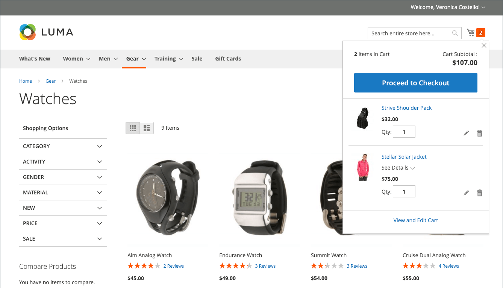
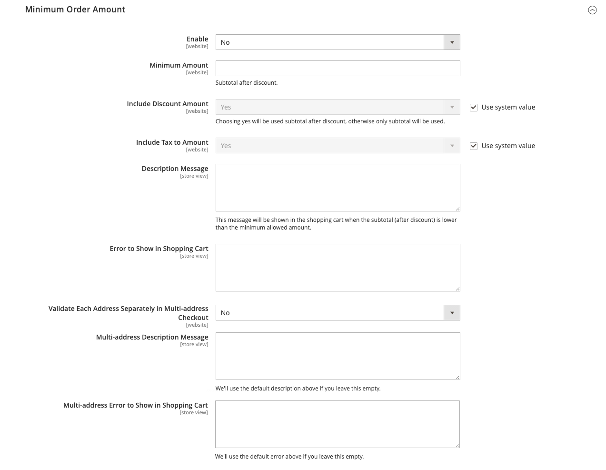
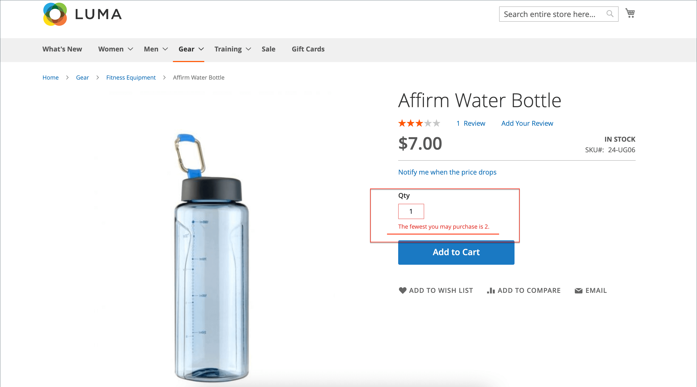
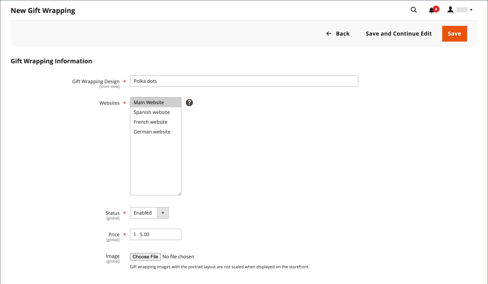
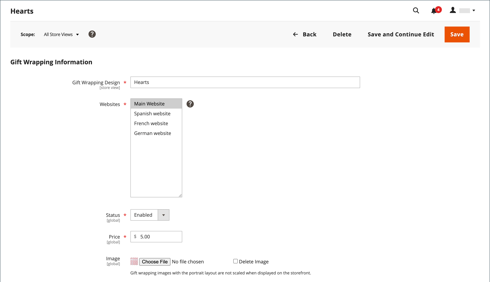

# カート設定

買い物かごの設定は、お客様が買い物かごのページにリダイレクトされるタイミングや、商品のサムネールに使用される画像など、お客様の店舗のお客様の買い物かごの機能を決定します。 また、チェックアウトプロセスを開始する前に最低金額に達するように注文を要求し、見積もられた価格が有効な日数を指定し、_注文合計_ セクションで商品の順序を指定することもできます。

[**ミニカート**](#mini-cart) - カートのリンク/アイコンにカート内の異なる商品（またはSKU）の数が表示されているか、すべての商品の合計数量が表示されているかを判断するには、このオプションを設定します。

[**ミニカートのリンク**](#configure-the-cart-link) – 顧客が店舗ページの上部にあるカートアイコンの項目数をクリックしたときにミニカートが表示されるかどうかを判断するには、このオプションを設定します。

[**カートにリダイレクト**](#redirect-to-cart) – このオプションを設定すると、買い物かごページがカートに追加されるたびに表示されるか、顧客がページに移動することを選択した場合にのみ表示されるかを判断できます。

[**見積書の有効期間**](#quote-lifetime) – 価格が有効な期間を指定するには、このオプションを設定します。

[**最低注文金額**](#minimum-order-amount) – 割引が適用された後、注文の小計が満たすために必要な最低注文金額とショッピングカートに表示されるメッセージを指定するには、これらのオプションを設定します。

[**最低注文数量**](#minimum-order-quantity) – 注文に必要な最低注文数を指定するには、これらのオプションを設定します。

[**カートのサムネール**](#cart-thumbnails) - カートのサムネールオプションを設定して、グループ化された製品または設定可能な製品について、カートに表示されるサムネールを決定します。

[**ギフトオプション**](#gift-options) – 顧客がギフトメッセージまたはグリーティングカードを追加できるかどうか、および使用可能なギフトラッピングオプションがあるかどうかを判断するために、ギフトオプションを設定します。

>[!NOTE]
>
>チェックアウトプロセスの設定について詳しくは、[&#x200B; チェックアウトオプション &#x200B;](checkout-process.md)を参照してください。

## ミニカート

_ミニカート_には、カート内のアイテムの概要が表示されます。デフォルトでは有効になっており、ページの上部にある「買い物かご」リンクをクリックすると表示されます。
このリンクは、カート内の異なる商品（またはSKU）の数、またはすべての商品の合計数量を表示するように設定できます。

{width="700" zoomable="yes"}

>[!NOTE]
>
>_登録済みの_&#x200B;のお客様の場合、ミニカートが複数のデバイスとブラウザー間で自動的に同期されない場合があります。 このような場合にミニカートを同期するには、お客様はそのデバイスまたはブラウザーで[&#x200B; ショッピングカート &#x200B;](cart.md) ページを開くだけです。

### ミニカートの設定

1. _管理者_ サイドバーで、**[!UICONTROL Stores]** > _[!UICONTROL Settings]_>**[!UICONTROL Configuration]**&#x200B;に移動します。

1. 左側のパネルで、**[!UICONTROL Sales]**&#x200B;を展開し、**[!UICONTROL Checkout]**&#x200B;を選択します。

1. _[!UICONTROL Mini Cart]_&#x200B;セクションのを展開します。

   {width="600" zoomable="yes"}

1. 設定が特定のストアビューの場合、[設定が適用されるストアビュー](../configuration-reference/scope-change.md#set-the-scope)を選択します。

   プロンプトが表示されたら、**[!UICONTROL OK]**&#x200B;をクリックして続行します。

1. **[!UICONTROL Display Mini Cart]**&#x200B;を次のいずれかに設定します：

   - `Yes` - ミニカートをストアページに表示します。 サイドバーの外観はテーマによって異なります。
   - `No` - ストアページでのミニカートの表示を無効にします。

1. ディスプレイが有効になっている場合は、他のオプションを更新してディスプレイを設定します。

   - **[!UICONTROL Number of Items to Display Scrollbar]**&#x200B;の場合、スクロールバーがトリガーされる前にサイドバーに表示できる項目の数を入力します。
   - **[!UICONTROL Maximum Display Recently Added Item(s)]**&#x200B;に、ミニカートに表示する最近追加したアイテムの最大数を入力します。

1. **[!UICONTROL Save Config]**&#x200B;をクリックします。

### 買い物かごリンクの設定

1. _管理者_ サイドバーで、**[!UICONTROL Stores]** > _[!UICONTROL Settings]_>**[!UICONTROL Configuration]**&#x200B;に移動しました。

1. 左側のパネルで、**[!UICONTROL Sales]**&#x200B;を展開し、**[!UICONTROL Checkout]**&#x200B;を選択します。

1. **[!UICONTROL My Cart Link]** セクションのを展開します。

1. **[!UICONTROL Display Cart Summary]**&#x200B;を次のいずれかの設定に設定します：

   - `Display item quantities` – この設定は、カート内の合計商品数を表示し、各商品の数量を追加します。
   - `Display number of items in cart` – この設定は、数量に関係なく、カート内の商品アイテムの数を表示します。

   {width="600" zoomable="yes"}

1. **[!UICONTROL Save Config]**&#x200B;をクリックします。

## 買い物かごにリダイレクト

ショッピングカートページは、商品がカートに追加されるたびに、または顧客がページにアクセスすることを選択した場合にのみ表示されるように設定できます。 現在カートにある商品に関する基本情報は、常に[&#x200B; ミニカート &#x200B;](#mini-cart)で入手できます。 顧客が買い物をできるようにする利点と、顧客にチェックアウトに進んでもらう利点のバランスを取る必要があります。 それは個人的な好みの単純な問題かもしれません。 しかし、数値で裏付けたい場合は、A/B テストを実施することで、どのアプローチがコンバージョン率が高いかを確認することができます。

**_買い物かごが表示されるときに設定するには:_**

1. _管理者_ サイドバーで、**[!UICONTROL Stores]** > _[!UICONTROL Settings]_>**[!UICONTROL Configuration]**&#x200B;に移動します。

1. 左側のパネルで、**[!UICONTROL Sales]**&#x200B;を展開し、**[!UICONTROL Checkout]**&#x200B;を選択します。

1. **[!UICONTROL Shopping Cart]** セクションのを展開します。

   {width="600" zoomable="yes"}

1. 設定が特定のストアビューの場合、[設定が適用されるストアビュー](../configuration-reference/scope-change.md#set-the-scope)を選択します。

   プロンプトが表示されたら、**[!UICONTROL OK]**&#x200B;をクリックして続行します。

1. **[!UICONTROL After Adding a Product Redirect to Shopping Cart]**&#x200B;を次のいずれかに設定します：

   - `Yes` – 商品がカートに追加された直後に、ショッピングカートのページを表示します。
   - `No` - カートに商品を追加した後、ショッピングカートへのリダイレクトを無効にします。

1. **[!UICONTROL Save Config]**&#x200B;をクリックします。

## 見積もりの有効期間

Adobe Commerce B2Bのインストールと有効化により、_Quotes_&#x200B;機能のサポートを追加できます。 この機能により、許可された購入者は、ショッピングカートからリクエストを送信することで、価格交渉プロセスを開始できます。 _見積_ グリッドには、受信した各見積もりが一覧表示され、買い手と売り手のコミュニケーションの履歴が保持されます。 B2B機能について詳しくは、_Adobe Commerce B2B ユーザーガイド_&#x200B;の[交渉済み見積もり](../b2b/quotes.md)を参照してください。

設定でカート見積もりの有効期間を設定することで、価格が有効な期間を判断できます。 たとえば、買い物客が数日後にカートを放棄した場合、一部の商品の見積もり価格が同じでなくなることがあります。 デフォルトでは、見積もりの有効期間は30日に設定されています。

**_見積書の有効期間を設定するには:_**

1. _管理者_ サイドバーで、**[!UICONTROL Stores]** > _[!UICONTROL Settings]_>**[!UICONTROL Configuration]**&#x200B;に移動します。

1. 左側のパネルで、**[!UICONTROL Sales]**&#x200B;を展開し、**[!UICONTROL Checkout]**&#x200B;を選択します。

1. **[!UICONTROL Shopping Cart]** セクションのを展開します。

   {width="600" zoomable="yes"}

1. 設定が特定のストアビューの場合、[設定が適用されるストアビュー](../configuration-reference/scope-change.md#set-the-scope)を選択します。

   プロンプトが表示されたら、**[!UICONTROL OK]**&#x200B;をクリックして続行します。

1. **[!UICONTROL Quote Lifetime (days)]**&#x200B;の場合、見積もり価格が有効な日数を入力します。

1. **[!UICONTROL Save Config]**&#x200B;をクリックします。

## 最低注文金額

この設定を使用すると、割引が適用された後、注文の小計が満たすために必要な最小金額を指定できます。 複数の住所に配送された注文は、住所ごとの最低注文金額を満たすために必要な場合があります。 チェックアウトボタンは、最低注文金額に達した後にのみ使用できます。

{width="700" zoomable="yes"}

**_最低注文金額を設定するには:_**

1. _管理者_ サイドバーで、**[!UICONTROL Stores]** > _[!UICONTROL Settings]_>**[!UICONTROL Configuration]**&#x200B;に移動します。

1. 左側のパネルで「**[!UICONTROL Sales]**」を展開し、下の「**[!UICONTROL Sales]**」を選択します。

1. **[!UICONTROL Minimum Order Amount]** セクションのを展開します。

   {width="600" zoomable="yes"}

1. 最低注文金額を要求するには、**[!UICONTROL Enable]**&#x200B;を`Yes`に設定します。

1. 最小注文が有効になっている場合は、次のオプションを設定して要件を設定します。

   - 割引が適用された後、小計に必要な&#x200B;**[!UICONTROL Minimum Amount]**&#x200B;を入力します。

   - **[!UICONTROL Include Discount Amount]**&#x200B;を次のいずれかに設定します：

      - `Yes` – 割引が含まれている場合、小計が最小金額を満たしている必要があります。 最低50 ドルの例を使用すると、カートに60 ドルのトップが含まれ、25%の割引が適用されている場合、結果の小計は45 ドルになり、カートは最低を満たしません。
      - `No` – 小計が割引なしで最小金額を満たす必要があります。

   - **[!UICONTROL Include Tax to Amount]**&#x200B;を次のいずれかに設定します：

      - `Yes` – 税金を含む最低金額を満たすには、小計が必要です。
      - `No` – 小計が税抜き最低金額を満たす必要があります。

1. 必要に応じて、最低注文金額メッセージ設定をカスタマイズします。

   - **[!UICONTROL Description Message]**&#x200B;の場合、小計が最小金額を満たさない場合にカートの上部に表示されるメッセージをカスタマイズするために使用するテキストを入力します。

   - **[!UICONTROL Error to Show in Shopping Cart]**&#x200B;の場合、ショッピングカートのエラーメッセージをカスタマイズするために使用するテキストを入力します。

   デフォルトのメッセージを使用するには、「メッセージの説明」フィールドを空のままにします。

1. 必要に応じて、複数の住所を持つ注文の最低注文金額を設定します。

   - マルチアドレス注文の各アドレスが最低注文金額を満たすようにするには、**[!UICONTROL Validate Each Address Separately in Multi-address Checkout]**&#x200B;を`Yes`に設定します。

   - 必要に応じて、最低注文金額メッセージ設定をカスタマイズします。

      - **[!UICONTROL Multi-address Description Message]** - カートの上部に表示されるメッセージをカスタマイズするために使用するテキストを、最小値を満たさない複数のアドレスの注文に使用します。

      - **[!UICONTROL Multi-address Error to Show in Shopping Cart]** – 最小値を満たさない複数のアドレスの注文に対して、ショッピング カートのエラーメッセージをカスタマイズするために使用するテキストを入力し、ボックスにテキストを入力します。

     デフォルトのメッセージを使用するには、「メッセージの説明」フィールドを空のままにします。

1. **[!UICONTROL Save Config]**&#x200B;をクリックします。

## 最低注文数量

注文に許可される最小数量を設定できます。 最小数量は、各顧客グループに応じて設定することもできます。

1. **[!UICONTROL Stores]** > _[!UICONTROL Settings]_>**[!UICONTROL Configuration]**&#x200B;に移動します。

1. 左側のパネルで、**[!UICONTROL Catalog]**&#x200B;を展開し、**[!UICONTROL Inventory]**&#x200B;を選択します。

1. **[!UICONTROL Product Stock Options]** セクションのを展開します。

   {width="600" zoomable="yes"}

1. **[!UICONTROL Minimum Qty Allowed in Shopping Cart]**&#x200B;の場合、注文の商品の最小数量を設定します。

   必要に応じて、**[!UICONTROL Use system value]** チェックボックスをオフにして、これらの設定を変更します。

   - **[!UICONTROL Customer Group]**&#x200B;設定を特定のグループに変更し、そのグループの&#x200B;**[!UICONTROL Minimum Qty]**&#x200B;を入力します。 別のグループと数量の制限を追加するには、**[!UICONTROL Add Minimum Qty]**&#x200B;をクリックします。

   - すべての顧客に対して同じ最小数量の制限を設定するには、`ALL GROUPS`の選択範囲を維持し、**[!UICONTROL Minimum Qty]**&#x200B;を入力します。

1. **[!UICONTROL Save Config]**&#x200B;をクリックします。

   {width="700" zoomable="yes"}

## 買い物かごのサムネール

 （Adobe Commerceのみ）

カートに表示されるサムネイル画像を通じて、顧客が購入しようとしている商品の概要を素早く確認できます。 ただし、複数のオプションを持つ商品の場合、画像がカート内の商品のバリエーションと一致しない場合があります。 顧客が特定の色で商品を購入した場合、買い物かごのサムネールは一致している必要があります。

グループ化された製品と設定可能な製品の両方のサムネール画像を設定して、「親」製品または製品バリエーションから画像を表示できます。

{width="700" zoomable="yes"}

**_買い物かごのサムネールを設定するには:_**

1. _管理者_ サイドバーで、**[!UICONTROL Stores]** > _[!UICONTROL Settings]_>**[!UICONTROL Configuration]**&#x200B;に移動します。

1. 左側のパネルで、**[!UICONTROL Sales]**&#x200B;を展開し、**[!UICONTROL Checkout]**&#x200B;を選択します。

1. **[!UICONTROL Shopping Cart]** セクションのを展開します。

   {width="600" zoomable="yes"}

1. **[!UICONTROL Grouped Product Image]**&#x200B;を設定して、[&#x200B; グループ化された製品](../catalog/product-create-grouped.md)のカートで使用されるサムネールを決定します。

   - `Product Thumbnail Itself` - カートに追加された製品バリエーションに割り当てられたサムネールを使用します。
   - `Parent Product Thumbnail` – 親製品に割り当てられたサムネールを使用します。

1. **[!UICONTROL Configurable Product Image]**&#x200B;を設定して、[設定可能な製品](../catalog/product-create-configurable.md)のカートで使用されるサムネールを決定します。

   - `Product Thumbnail Itself` - カートに追加された製品バリエーションに割り当てられたサムネールを使用します。
   - `Parent Product Thumbnail` – 親製品に割り当てられたサムネールを使用します。

1. **[!UICONTROL Save Config]**&#x200B;をクリックします。

## ギフトオプション

チェックアウトプロセスが開始される前に、利用可能なギフトオプションの選択がカートに表示されます。 ギフトオプション設定は、顧客がギフトメッセージまたはグリーティングカードを追加できるかどうか、およびギフトラッピングオプションが利用可能かどうかを決定します。 注文の各アイテムには、個別のメッセージとギフトのラッピングを持つことができます。 注文全体に適用される場合、顧客はギフトレシートとグリーティングカードを追加することもできます。

{width="700" zoomable="yes"}

ギフトオプション設定はweb サイト全体に適用されますが、製品レベルで上書きできます。

### ギフトオプションを有効にする

1. _管理者_ サイドバーで、**[!UICONTROL Stores]** > _[!UICONTROL Settings]_>**[!UICONTROL Configuration]**&#x200B;に移動します。

1. 左側のパネルで「**[!UICONTROL Sales]**」を展開し、下の「**[!UICONTROL Sales]**」を選択します。

1. ページの **[!UICONTROL Gift Options]**&#x200B;を展開します。

   {width="600" zoomable="yes"}

1. 好みに応じてギフトメッセージのオプションを設定します。

   - **[!UICONTROL Allow Gift Messages on Order Level]**&#x200B;の場合、`Yes`を選択して、注文全体に対して1つのギフトメッセージを有効にします。
   - **[!UICONTROL Allow Gift Messages for Order Items]**&#x200B;の場合、`Yes`を選択して、カスタマーショッピングカート内の個々のアイテムに対する個別のギフトメッセージを追加できるようにします。

1.  （Adobe Commerceのみ）好みに応じてギフト包装オプションを設定します。

   - **[!UICONTROL Allow Gift Wrapping on Order Level]**&#x200B;の場合、`Yes`を選択して、注文全体に対して1回のギフト包装を有効にします。
   - **[!UICONTROL Allow Gift Wrapping for Order Items]**&#x200B;の場合、`Yes`を選択して、カスタマーショッピングカート内の各商品にギフトラッピングを個別に追加できるようにします。

   また、お客様がラッピングを選択できるように、異なる[&#x200B; ギフトラッピングデザイン &#x200B;](#gift-wrap)を定義することもできます。

1.  （Adobe Commerceのみ）お客様にギフトレシートを含めるオプションを提供するには、**[!UICONTROL Allow Gift Receipt]**&#x200B;から`Yes`に設定します。

1.  （Adobe Commerceのみ）印刷されたカードを含めるオプションをお客様に提供するには、**[!UICONTROL Allow Printed Card]**&#x200B;を`Yes`に設定します。

1.  （Adobe Commerceのみ）「**[!UICONTROL Default Price for Printed Card]**」を入力します。

1. **[!UICONTROL Save Config]**&#x200B;をクリックします。

### ギフトラップ

 （Adobe Commerceのみ）

ギフトラッピングは、発送可能な商品を問わず利用でき、個々の商品または注文全体に対して提供することができます。 ギフトラップのデザインごとに別途料金を請求し、カートに商品のオプションとして表示されるデザインごとにサムネイル画像をアップロードできます。 顧客がギフトのラップのサムネールをクリックすると、フルサイズの画像が表示されます。 チェックアウトレビュー時に、ギフトのラップ料金が他の[&#x200B; チェックアウト合計](checkout-totals-sort-order.md)と共に&#x200B;_注文概要_ セクションに表示されます。

ギフトラップ画像は、繰り返しパターンを示すスウォッチである必要があり、使用するリボンのサンプルも含めることができます。 紙をスキャンするか、包まれたパッケージの写真を撮ることができます。 アップロードする画像は、GIF、JPG、またはPNGの画像で、正方形にする必要があります。 次の例では、アップロードされたギフトラップ画像は230 x 230 ピクセルです。

{width="700" zoomable="yes"}

#### ギフトラップデザインを追加

1. _管理者_ サイドバーで、**[!UICONTROL Stores]** > _[!UICONTROL Other Settings]_>**[!UICONTROL Gift Wrapping]**&#x200B;に移動します。

   {width="700" zoomable="yes"}

1. 右上隅の「**[!UICONTROL Add Gift Wrapping]**」をクリックします。

1. チェックアウト時に表示される&#x200B;**[!UICONTROL Gift Wrapping Design]**&#x200B;の名前を入力します。

   必要に応じて、**[!UICONTROL Scope]**&#x200B;を変更し、各ストアビューに別の名前を設定できます。

1. ギフト包装デザインが使用可能な&#x200B;**[!UICONTROL Websites]**&#x200B;を選択します。

1. **[!UICONTROL Status]**&#x200B;を`Enabled`に設定します。

   季節的なラッピングオプションがある場合は、このオプションを使用しない場合に`Disabled`に設定できます。

1. ギフトラップのデザインの&#x200B;**[!UICONTROL Price]**&#x200B;を入力します。

   この設定は、商品レベルで設定されているギフトラップの価格によって上書きできます。

   {width="600" zoomable="yes"}

1. ギフトのラッピングのサムネール **[!UICONTROL Image]**&#x200B;をアップロードするには、**[!UICONTROL Choose File]**&#x200B;をクリックし、ディレクトリからアップロードするファイルを選択します。

   レコードを保存すると、画像のサムネールが&#x200B;_[!UICONTROL Gift Wrapping Information]_&#x200B;に表示されます。

1. **[!UICONTROL Save]**&#x200B;をクリックします。

#### ギフトラップのデザインの編集

1. _管理者_ サイドバーで、**[!UICONTROL Stores]** > _[!UICONTROL Other Settings]_>**[!UICONTROL Gift Wrapping]**&#x200B;に移動します。

1. リストでギフトのラップのレコードを検索します。

1. _アクション_&#x200B;列で、**[!UICONTROL Edit]**&#x200B;をクリックします。

   {width="600" zoomable="yes"}

1. 必要な変更を加えます。

1. **[!UICONTROL Save]**&#x200B;をクリックします。

#### ギフトラップのデザインを削除

「_ギフトの折り返し_」グリッドを開いた状態で、いずれかの方法を使用して折り返しデザインを削除します。

**_方法1: 1つのギフト包装デザインを削除_**

1. 編集モードでギフトラッピングデザインを開きます。

1. ワークスペースの上部で、**[!UICONTROL Delete]**&#x200B;をクリックします。

1. プロンプトが表示されたら、**[!UICONTROL OK]**&#x200B;をクリックして確認します。

**_方法2：複数のギフトラップのデザインを削除_**

1. 「_ギフトの折り返し_」グリッドで、削除する各ギフトの折り返しデザインのチェックボックスを選択します。

1. **[!UICONTROL Actions]** コントロールを`Delete`に設定します。

1. **[!UICONTROL Submit]**&#x200B;をクリックします。

### ギフトオプション税

 （Adobe Commerceのみ）

ギフトラッピングと印刷されたギフトカードの価格は、税金を含めるか除外するか、両方のオプションを表示するように設定できます。 これらの品目の税区分をグローバル・レベルまたはweb サイト・レベルで指定することもできます。

**_ギフトオプション税を設定するには:_**

1. _管理者_ サイドバーで、**[!UICONTROL Stores]** > _[!UICONTROL Settings]_>**[!UICONTROL Configuration]**&#x200B;に移動します。

1. 左側のパネルで、**[!UICONTROL Sales]**&#x200B;を展開し、**[!UICONTROL Tax]**&#x200B;を選択します。

1. **[!UICONTROL Tax Classes]** セクションのを展開します。

   {width="600" zoomable="yes"}

1. **[!UICONTROL Tax Class for Gift Options]**&#x200B;を該当する税区分に設定します。

1. **[!UICONTROL Orders, Invoices, Credit Memos Display Settings]** セクションのを展開します。

   {width="600" zoomable="yes"}

1. **[!UICONTROL Display Gift Wrapping Prices]**&#x200B;を次のいずれかに設定します：

   - `Excluding Tax`
   - `Including Tax`
   - `Including and Excluding Tax`

1. **[!UICONTROL Display Printed Card Prices]**&#x200B;を次のいずれかに設定します：

   - `Excluding Tax`
   - `Including Tax`
   - `Including and Excluding Tax`

1. **[!UICONTROL Save Config]**&#x200B;をクリックします。
