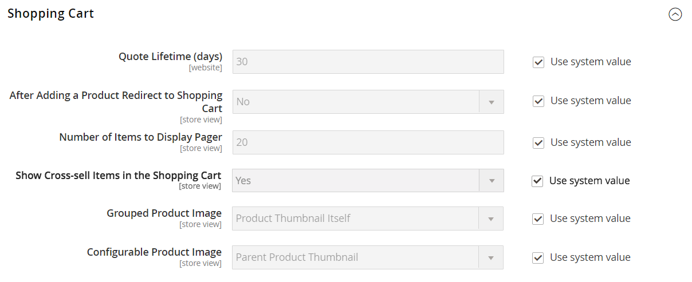

# 買い物かご設定

買い物かご設定は、顧客が買い物かごページにリダイレクトされたタイミングや、製品のサムネールに使用する画像など、店舗の顧客に対する買い物かごの機能を決定します。 また、チェックアウトプロセスが開始される前に最低金額に到達するよう注文を要求したり、見積価格が有効である日数を指定したり、 _注文の合計_ セクション。

[**ミニカート**](#mini-cart)  – このオプションを設定すると、買い物かごのリンクまたはアイコンに、買い物かごに含まれる様々な製品（または SKU）の数またはすべての項目の合計数が表示されるかどうかを決定できます。

[**ミニ買い物かごリンク**](#configure-the-cart-link)  – 顧客がストアページの上部にある買い物かごアイコンの項目数をクリックしたときにミニ買い物かごを表示するかどうかを決定するには、このオプションを設定します。

[**買い物かごにリダイレクト**](#redirect-to-cart) – このオプションを設定すると、買い物かごに商品が追加されたときや、顧客がページに移動を選択したときにのみ買い物かごページが表示されます。

[**見積もりの有効期間**](#quote-lifetime)  – このオプションを設定して、価格が有効な期間を指定します。

[**最小注文金額**](#minimum-order-amount)  – これらのオプションを設定して、割引が適用された後、注文の小計が満たされる必要があり、買い物かごに表示されるメッセージが表示される、最小金額を指定します。

[**最小注文数量**](#minimum-order-quantity)  – これらのオプションを設定して、注文に必要な最小項目数を指定します。

[**買い物かごのサムネイル**](#cart-thumbnails)   – 買い物かごサムネールオプションを設定して、グループ化または設定可能な製品について買い物かごに表示されるサムネールを決定します。

[**ギフトオプション**](#gift-options)  – 顧客がギフトメッセージまたはグリーティングカードを追加できるかどうか、およびギフトラッピングのオプションが利用可能かどうかを決定するには、ギフトオプションを設定します。

>[!NOTE]
>
>チェックアウトプロセスの設定については、を参照してください [チェックアウトオプション](checkout-process.md).

## ミニカート

この _ミニカート_ 買い物かごに入っている商品の概要を表示します。 この機能はデフォルトで有効になっており、ページ上部の「買い物かご」リンクをクリックすると表示されます。
このリンクは、カート内の異なる製品（または SKU）の数や、すべての項目の合計数を表示するように設定できます。

{width="700" zoomable="yes"}

>[!NOTE]
>
>の場合 _登録済み_ お客様によっては、複数のデバイスやブラウザー間でミニカートが自動的に同期されない場合があります。 このような場合にミニカートを同期するには、お客様は以下を開くだけです。 [ショッピングカート](cart.md) そのデバイスまたはブラウザー上のページ。

### ミニ買い物かごの設定

1. 日 _Admin_ サイドバー、に移動 **[!UICONTROL Stores]** > _[!UICONTROL Settings]_>**[!UICONTROL Configuration]**.

1. 左側のパネルで、を展開します **[!UICONTROL Sales]** を選択します **[!UICONTROL Checkout]**.

1. を展開  この _[!UICONTROL Mini Cart]_セクション。

   {width="600" zoomable="yes"}

1. 設定が特定のストア表示の場合、 [ストア表示の選択](../configuration-reference/scope-change.md#set-the-scope) 設定が適用される場所。

   プロンプトが表示されたら、 **[!UICONTROL OK]** 続行します。

1. を設定 **[!UICONTROL Display Mini Cart]** を次のいずれかに変更します。

   - `Yes`  – 店舗ページにミニ カートを表示します。 サイドバーの外観は、テーマによって異なります。
   - `No` - ストアページでのミニ カートの表示を無効にします。

1. ディスプレイが有効な場合は、他のオプションを更新してディスプレイを設定します。

   - の場合 **[!UICONTROL Number of Items to Display Scrollbar]**、スクロールバーがトリガーされるまでサイドバーに表示できる項目の数を入力します。
   - の場合 **[!UICONTROL Maximum Display Recently Added Item(s)]**、ミニ カートに表示する、最近追加されたアイテムの最大数を入力します。

1. クリック **[!UICONTROL Save Config]**.

### 買い物かごリンクの設定

1. 日 _Admin_ サイドバー、に移動 **[!UICONTROL Stores]** > _[!UICONTROL Settings]_>**[!UICONTROL Configuration]**.

1. 左側のパネルで、を展開します **[!UICONTROL Sales]** を選択します **[!UICONTROL Checkout]**.

1. を展開  この **[!UICONTROL My Cart Link]** セクション。

1. を設定 **[!UICONTROL Display Cart Summary]** を次のいずれかの設定に変更します。

   - `Display item quantities`  – この設定では、カート内の製品の合計数が表示され、各製品の数量が追加されます。
   - `Display number of items in cart`  – この設定では、数量に関係なく、買い物かごの製品項目数が表示されます。

   {width="600" zoomable="yes"}

1. クリック **[!UICONTROL Save Config]**.

## 買い物かごにリダイレクト

買い物かごページは、商品が買い物かごに追加されたときまたは顧客がページに移動を選択したときにのみ表示されるように設定できます。 現在カートに入っている商品に関する基本情報は、常にで利用できます。 [ミニカート](#mini-cart). この決定は、顧客が買い物を続けることの利点と、チェックアウトに進むことを促すことの利点とのバランスを取ることです。 それは個人的な好みの単純な問題かもしれません。 ただし、数値でバックアップする場合は、A/B テストを実行して、どのアプローチがより高いコンバージョン率を生み出すかを確認できます。

**_買い物かごが表示されるタイミングを設定するには：_**

1. 日 _Admin_ サイドバー、に移動 **[!UICONTROL Stores]** > _[!UICONTROL Settings]_>**[!UICONTROL Configuration]**.

1. 左側のパネルで、を展開します **[!UICONTROL Sales]** を選択します **[!UICONTROL Checkout]**.

1. を展開  この **[!UICONTROL Shopping Cart]** セクション。

   {width="600" zoomable="yes"}

1. 設定が特定のストア表示の場合、 [ストア表示の選択](../configuration-reference/scope-change.md#set-the-scope) 設定が適用される場所。

   プロンプトが表示されたら、 **[!UICONTROL OK]** 続行します。

1. を設定 **[!UICONTROL After Adding a Product Redirect to Shopping Cart]** を次のいずれかに変更します。

   - `Yes`  – 商品が買い物かごに追加された直後に、買い物かごページを表示します。
   - `No`  – 買い物かごに製品を追加した後に、買い物かごへのリダイレクトを無効にします。

1. クリック **[!UICONTROL Save Config]**.

## 見積もりの有効期間

Adobe Commerce用 B2B をインストールして有効化すると、 _見積もり_ 機能 この機能を使用すると、権限のある購入者は、買い物かごからリクエストを送信することで、価格ネゴシエーションプロセスを開始できます。 この _見積もり_ グリッドには、受け取った各見積もりが一覧表示され、購入者と販売者の間のコミュニケーションの履歴が保持されます。 B2B 機能について詳しくは、を参照してください。 [交渉済みの見積](../b2b/quotes.md) が含まれる _Adobe Commerceの B2B ユーザーガイド_.

設定で買い物かごの見積もり有効期間を設定することで、価格の有効期間を決定できます。 例えば、買い物客が数日後に買い物かごを放置した場合、一部の商品の見積価格が同じではなくなる可能性があります。 デフォルトでは、見積もりの有効期間は 30 日に設定されています。

**_見積の有効期間を構成するには、次の手順に従います。_**

1. 日 _Admin_ サイドバー、に移動 **[!UICONTROL Stores]** > _[!UICONTROL Settings]_>**[!UICONTROL Configuration]**.

1. 左側のパネルで、を展開します **[!UICONTROL Sales]** を選択します **[!UICONTROL Checkout]**.

1. を展開  この **[!UICONTROL Shopping Cart]** セクション。

   {width="600" zoomable="yes"}

1. 設定が特定のストア表示の場合、 [ストア表示の選択](../configuration-reference/scope-change.md#set-the-scope) 設定が適用される場所。

   プロンプトが表示されたら、 **[!UICONTROL OK]** 続行します。

1. の場合 **[!UICONTROL Quote Lifetime (days)]**：見積もり価格が有効である日数を入力します。

1. クリック **[!UICONTROL Save Config]**.

## 最小注文金額

この設定を使用すると、割引が適用された後に、注文の小計が満たされる必要がある最小金額を指定できます。 複数の住所に発送された注文は、住所ごとの最小注文金額を満たすために必要になる場合があります。 「チェックアウト」ボタンは、最小注文金額に達した後にのみ使用できるようになります。

{width="700" zoomable="yes"}

**_最小注文金額を設定するには：_**

1. 日 _Admin_ サイドバー、に移動 **[!UICONTROL Stores]** > _[!UICONTROL Settings]_>**[!UICONTROL Configuration]**.

1. 左側のパネルで、を展開します **[!UICONTROL Sales]** を選択します **[!UICONTROL Sales]** その下に。

1. を展開  この **[!UICONTROL Minimum Order Amount]** セクション。

   {width="600" zoomable="yes"}

1. 最小注文額を要求するには、を設定します **[!UICONTROL Enable]** 対象： `Yes`.

1. 最小注文が有効な場合は、次のオプションを設定して要件を設定します。

   - を入力 **[!UICONTROL Minimum Amount]** これは、割引が適用された後の小計に必要です。

   - を設定 **[!UICONTROL Include Discount Amount]** を次のいずれかに変更します。

      - `Yes`  – 小計が割引を含む最小金額を満たしている必要があります。 50 ドルの最小値の例では、買い物かごに 60 ドルの上部と 25% の割引が適用された場合、結果の小計は 45 ドルであり、買い物かごは最小値を満たしません。
      - `No`  – 小計が割引なしで最小金額を満たしている必要があります。

   - を設定 **[!UICONTROL Include Tax to Amount]** を次のいずれかに変更します。

      - `Yes`  – 税金を含む最低金額を満たすための小計が必要です。
      - `No`  – 税金なしで小計が最小金額を満たす必要があります。

1. 必要に応じて、最小注文金額メッセージ設定をカスタマイズします。

   - の場合 **[!UICONTROL Description Message]**、小計が最小金額を満たさない場合に買い物かごの上部に表示されるメッセージのカスタマイズに使用するテキストを入力します。

   - の場合 **[!UICONTROL Error to Show in Shopping Cart]**&#x200B;を入力し、買い物かごのエラーメッセージのカスタマイズに使用するテキストを入力します。

   デフォルトのメッセージを使用するには、メッセージの説明フィールドを空のままにします。

1. 必要に応じて、複数アドレスの注文の最小注文金額設定を設定します。

   - 複数アドレス順の各アドレスが最小注文金額を満たすことを要求するには、次のように設定します **[!UICONTROL Validate Each Address Separately in Multi-address Checkout]** 対象： `Yes`.

   - 必要に応じて、最小注文金額メッセージ設定をカスタマイズします。

      - **[!UICONTROL Multi-address Description Message]**  – 最小値を満たさない複数アドレスの注文に対して買い物かごの上部に表示されるメッセージをカスタマイズするために使用するテキストを入力します。

      - **[!UICONTROL Multi-address Error to Show in Shopping Cart]**  – 最小値を満たさない複数アドレスの注文に対する買い物かごエラーメッセージをカスタマイズするために使用するテキストを入力し、ボックスにテキストを入力します。

     デフォルトのメッセージを使用するには、メッセージの説明フィールドを空のままにします。

1. クリック **[!UICONTROL Save Config]**.

## 最小注文数量

注文に許可される最小数量を設定できます。 最小数量は、各顧客グループに応じて設定することもできます。

1. に移動 **[!UICONTROL Stores]** > _[!UICONTROL Settings]_>**[!UICONTROL Configuration]**.

1. 左側のパネルで、を展開します **[!UICONTROL Catalog]** を選択します **[!UICONTROL Inventory]**.

1. を展開  この **[!UICONTROL Product Stock Options]** セクション。

   {width="600" zoomable="yes"}

1. の場合 **[!UICONTROL Minimum Qty Allowed in Shopping Cart]**、注文の商品の最小数量を設定します。

   必要に応じて、 **[!UICONTROL Use system value]** チェックボックスをオンにして、これらの設定を変更します。

   - 変更： **[!UICONTROL Customer Group]** を特定のグループに設定し、 **[!UICONTROL Minimum Qty]** そのグループ。 別のグループと数量制限を追加するには、をクリックします **[!UICONTROL Add Minimum Qty]**.

   - すべての顧客に同じ最小数量制限を設定するには、 `ALL GROUPS` を選択し、を入力します **[!UICONTROL Minimum Qty]**.

1. クリック **[!UICONTROL Save Config]**.

   {width="700" zoomable="yes"}

## 買い物かごのサムネイル

 （Adobe Commerceのみ）

買い物かごに表示されるサムネール画像には、顧客が購入する商品の概要をすばやく把握できます。 ただし、複数のオプションを持つ製品の場合、画像が買い物かごに入っている製品のバリエーションと一致しない可能性があります。 顧客が特定の色で項目を購入する場合は、買い物かごのサムネールが一致することが理想的です。

グループ化された製品と設定可能な製品の両方のサムネール画像を、「親」製品または製品バリエーションのいずれかから画像を表示するように設定できます。

{width="700" zoomable="yes"}

**_買い物かごのサムネールを設定するには：_**

1. 日 _Admin_ サイドバー、に移動 **[!UICONTROL Stores]** > _[!UICONTROL Settings]_>**[!UICONTROL Configuration]**.

1. 左側のパネルで、を展開します **[!UICONTROL Sales]** を選択します **[!UICONTROL Checkout]**.

1. を展開  この **[!UICONTROL Shopping Cart]** セクション。

   {width="600" zoomable="yes"}

1. を設定 **[!UICONTROL Grouped Product Image]** 買い物かごで使用されているサムネールを特定するには： [グループ化された製品](../catalog/product-create-grouped.md):

   - `Product Thumbnail Itself`  – 買い物かごに追加された製品バリエーションに割り当てられているサムネールを使用します。
   - `Parent Product Thumbnail`  – 親製品に割り当てられたサムネールを使用します。

1. を設定 **[!UICONTROL Configurable Product Image]** 買い物かごで使用されているサムネールを特定するには： [設定可能な製品](../catalog/product-create-configurable.md):

   - `Product Thumbnail Itself`  – 買い物かごに追加された製品バリエーションに割り当てられているサムネールを使用します。
   - `Parent Product Thumbnail`  – 親製品に割り当てられたサムネールを使用します。

1. クリック **[!UICONTROL Save Config]**.

## ギフトオプション

チェックアウト処理が開始される前に、使用可能なギフトオプションの選択がカートに表示されます。 ギフトオプションの設定によって、顧客がギフトメッセージまたはグリーティングカードを追加できるかどうか、およびギフトラッピングのオプションが利用できるかどうかが決まります。 注文の各項目には、個別のメッセージとギフト包装を含めることができます。 注文全体に適用すると、お客様はギフトレシートとグリーティングカードを追加することもできます。

{width="700" zoomable="yes"}

ギフトオプションの設定は web サイト全体に適用されますが、製品レベルで上書きできます。

### ギフトオプションを有効にする

1. 日 _Admin_ サイドバー、に移動 **[!UICONTROL Stores]** > _[!UICONTROL Settings]_>**[!UICONTROL Configuration]**.

1. 左側のパネルで、を展開します **[!UICONTROL Sales]** を選択します **[!UICONTROL Sales]** その下に。

1. を展開  **[!UICONTROL Gift Options]** ページに移動します。

   {width="600" zoomable="yes"}

1. 必要に応じて、ギフトメッセージのオプションを設定します。

   - の場合 **[!UICONTROL Allow Gift Messages on Order Level]**&#x200B;を選択 `Yes` 注文全体に対して単一のギフトメッセージを可能にする。
   - の場合 **[!UICONTROL Allow Gift Messages for Order Items]**&#x200B;を選択 `Yes` 顧客の買い物かご内の個々のアイテムに対して別個のギフトメッセージを追加できるようにする。

1.  （Adobe Commerceのみ）必要に応じてギフトラッピングのオプションを設定します。

   - の場合 **[!UICONTROL Allow Gift Wrapping on Order Level]**&#x200B;を選択 `Yes` 注文全体に対して単一のギフトラッピングを可能にする。
   - の場合 **[!UICONTROL Allow Gift Wrapping for Order Items]**&#x200B;を選択 `Yes` 顧客の買い物かご内の各品目に個別にギフトラッピングを追加できるようにする。

   異なる値を定義することもできます [ギフト用の包装デザイン](#gift-wrap) お客様が包装を選択できるように。

1.  （Adobe Commerceのみ）お客様にギフトレシートを含めるオプションを提供するには、次のように設定します。 **[!UICONTROL Allow Gift Receipt]** 対象： `Yes`.

1.  （Adobe Commerceのみ）印刷されたカードを含めるオプションを顧客に提供するには、次のように設定します **[!UICONTROL Allow Printed Card]** 対象： `Yes`.

1.  （Adobe Commerceのみ）を入力します **[!UICONTROL Default Price for Printed Card]**.

1. クリック **[!UICONTROL Save Config]**.

### ギフト用ラップ

 （Adobe Commerceのみ）

ギフトラッピングは、出荷可能な任意の製品で利用でき、個々のアイテムまたは全体の注文に対して提供できます。 ギフトラップデザインごとに別々の価格を請求し、買い物かごに商品のオプションとして表示されるデザインごとにサムネール画像をアップロードできます。 顧客がギフトラップのサムネールをクリックすると、フルサイズの画像が表示されます。 チェックアウトレビュー時に、ギフトラップ料金が他の料金と共に表示されます [チェックアウトの合計](checkout-totals-sort-order.md) が含まれる _注文概要_ セクション。

ギフト ラップ画像は、繰り返しパターンを示す見本である必要があり、使用するリボンのサンプルを含めることもできます。 紙をスキャンするか、包装されたパッケージの写真を撮ることができます。 アップロードする画像は、GIF、JPG、PNG 画像のいずれかであり、正方形である必要があります。 次の例では、アップロードされたギフトラップ画像が 230 x 230 ピクセルです。

{width="700" zoomable="yes"}

#### ギフトラップデザインの追加

1. 日 _Admin_ サイドバー、に移動 **[!UICONTROL Stores]** > _[!UICONTROL Other Settings]_>**[!UICONTROL Gift Wrapping]**.

   {width="700" zoomable="yes"}

1. 右上隅のをクリックします。 **[!UICONTROL Add Gift Wrapping]**.

1. の名前を入力 **[!UICONTROL Gift Wrapping Design]** チェックアウト時に表示されます。

   必要に応じて、を変更できます **[!UICONTROL Scope]** ストア表示ごとに異なる名前を設定します。

1. 「」を選択します **[!UICONTROL Websites]** ギフトラップデザインが利用可能な場所。

1. を設定 **[!UICONTROL Status]** 対象： `Enabled`.

   季節的なラッピングオプションがある場合は、に設定できます。 `Disabled` オプションを使用できないとき。

1. を入力 **[!UICONTROL Price]** ギフトラップデザインです。

   この設定は、製品レベルで設定されたギフトラップ価格で上書きできます。

   {width="600" zoomable="yes"}

1. サムネールをアップロードするには **[!UICONTROL Image]** ギフト ラッピングをクリックします。 **[!UICONTROL Choose File]** そして、アップロードするファイルをディレクトリから選択します。

   画像のサムネールがに表示されます _[!UICONTROL Gift Wrapping Information]_レコードが保存された後。

1. クリック **[!UICONTROL Save]**.

#### ギフトラップデザインの編集

1. 日 _Admin_ サイドバー、に移動 **[!UICONTROL Stores]** > _[!UICONTROL Other Settings]_>**[!UICONTROL Gift Wrapping]**.

1. リストでギフト ラップ レコードを検索します。

1. が含まれる _アクション_ 列、クリック **[!UICONTROL Edit]**.

   {width="600" zoomable="yes"}

1. 必要な変更を加えます。

1. クリック **[!UICONTROL Save]**.

#### ギフトラップデザインの削除

（を使用） _ギフト包装_ グリッドが開きます。ラップデザインを削除するには、次のいずれかの方法を使用します。

**_方法 1：単一のギフトラップデザインを削除する_**

1. ギフトラッピングのデザインを編集モードで開きます。

1. ワークスペースの上部で、 **[!UICONTROL Delete]**.

1. プロンプトが表示されたら、 **[!UICONTROL OK]** を確認します。

**_方法 2：複数のギフトラップデザインの削除_**

1. が含まれる _ギフト包装_ グリッドで、削除するギフト ラップ デザインのチェックボックスをオンにします。

1. を **[!UICONTROL Actions]** コントロール先 `Delete`.

1. クリック **[!UICONTROL Submit]**.

### ギフト オプション税

 （Adobe Commerceのみ）

ギフトラッピングと印刷されたギフトカードの価格は、税を含めるか除外するか、両方のオプションを表示するように設定できます。 また、グローバルレベルまたは web サイトレベルで、これらの項目の税クラスを指定することもできます。

**_ギフト・オプション税金を構成する手順は、次のとおりです。_**

1. 日 _Admin_ サイドバー、に移動 **[!UICONTROL Stores]** > _[!UICONTROL Settings]_>**[!UICONTROL Configuration]**.

1. 左側のパネルで、を展開します **[!UICONTROL Sales]** を選択します **[!UICONTROL Tax]**.

1. を展開  この **[!UICONTROL Tax Classes]** セクション。

   {width="600" zoomable="yes"}

1. を設定 **[!UICONTROL Tax Class for Gift Options]** 適用可能な税区分に適用されます。

1. を展開  この **[!UICONTROL Orders, Invoices, Credit Memos Display Settings]** セクション。

   {width="600" zoomable="yes"}

1. を設定 **[!UICONTROL Display Gift Wrapping Prices]** を次のいずれかに変更します。

   - `Excluding Tax`
   - `Including Tax`
   - `Including and Excluding Tax`

1. を設定 **[!UICONTROL Display Printed Card Prices]** を次のいずれかに変更します。

   - `Excluding Tax`
   - `Including Tax`
   - `Including and Excluding Tax`

1. クリック **[!UICONTROL Save Config]**.
