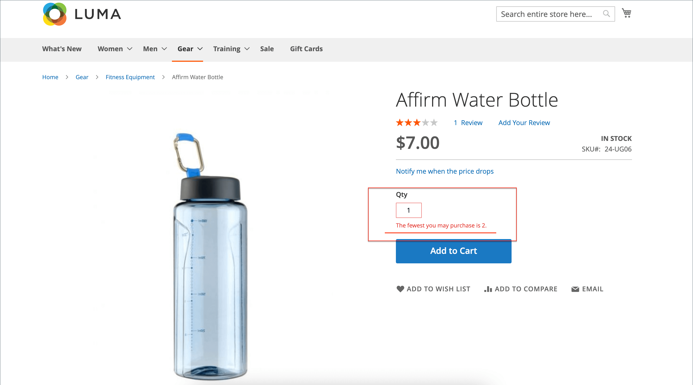

# 買い物かごの設定

買い物かごの設定は、顧客が買い物かごページにリダイレクトされるタイミングや、商品サムネールに使用される画像など、買い物かごの顧客に対する機能を決定します。 また、チェックアウトプロセスが開始する前に、注文が最小金額に達するように要求したり、引用価格が有効である日数を指定したり、 _注文の合計_ 」セクションに入力します。

[**ミニカート**](#mini-cart)  — このオプションを設定して、買い物かごのリンク/アイコンに買い物かご内の様々な製品 (SKU) の数またはすべての品目の合計数が表示されるかどうかを指定します。

[**ミニ買い物かごのリンク**](#configure-the-cart-link)  — 顧客がストアページの上部にある買い物かごの項目数をクリックしたときにミニカートが表示されるかどうかを指定するには、このオプションを設定します。

[**買い物かごにリダイレクト**](#redirect-to-cart) — 買い物かごに品目が追加されたときに買い物かごページを表示するか、顧客がページに移動することを選択したときにのみ表示するかを指定するには、このオプションを設定します。

[**見積もりの有効期間**](#quote-lifetime)  — 価格が有効である期間を指定するには、このオプションを設定します。

[**最小注文額**](#minimum-order-amount)  — 割引が適用された後、注文の小計が満たされ、買い物かごに表示されるメッセージに必要となる最小金額を指定するには、これらのオプションを設定します。

[**最小注文数量**](#minimum-order-quantity)  — これらのオプションを設定して、注文をおこなうのに必要な最小品目数を指定します。

[**買い物かごのサムネール**](#cart-thumbnails)   — 買い物かごのサムネールオプションを設定して、グループ化された製品または設定可能な製品の買い物かごに表示されるサムネールを決定します。

[**ギフトオプション**](#gift-options)  — ギフトオプションを設定して、顧客がギフトメッセージやグリーティングカードを追加できるかどうか、およびギフト用ラッピングのオプションが使用可能かどうかを決定します。

>[!NOTE]
>
>チェックアウトプロセスの設定については、 [チェックアウトオプション](checkout-process.md).

## ミニカート

The _ミニカート_ 買い物かご内の項目の概要を表示します。 これはデフォルトで有効で、ページ上部の「買い物かご」リンクをクリックすると表示されます。
リンクは、買い物かご内の様々な製品 (SKU) の数や、すべての品目の合計数を表示するように設定できます。

{width="700" zoomable="yes"}

>[!NOTE]
>
>の _登録済み_ のお客様によっては、複数のデバイスやブラウザー間でミニカートが自動的に同期されない場合があります。 このような場合にミニカートを同期するには、顧客は [買い物かご](cart.md) ページを設定できます。

### ミニカートの設定

1. 次の日： _管理者_ サイドバー、移動 **[!UICONTROL Stores]** > _[!UICONTROL Settings]_>**[!UICONTROL Configuration]**.

1. 左側のパネルで、を展開します。 **[!UICONTROL Sales]** を選択します。 **[!UICONTROL Checkout]**.

1. 展開  の _[!UICONTROL Mini Cart]_」セクションに入力します。

   {width="600" zoomable="yes"}

1. 設定が特定のストア表示の場合、 [ストア表示を選択](../configuration-reference/scope-change.md#set-the-scope) 設定が適用される場所

   プロンプトが表示されたら、「 **[!UICONTROL OK]** をクリックして続行します。

1. 設定 **[!UICONTROL Display Mini Cart]** を次のいずれかに変更します。

   - `Yes`  — 店舗ページにミニカートを表示します。 サイドバーの外観は、テーマによって異なります。
   - `No`  — ストアページでのミニカートの表示を無効にします。

1. 表示が有効な場合は、他のオプションを更新して表示を設定します。

   - の場合 **[!UICONTROL Number of Items to Display Scrollbar]**」には、スクロールバーをトリガーする前にサイドバーに表示できる項目の数を入力します。
   - の場合 **[!UICONTROL Maximum Display Recently Added Item(s)]**」には、ミニカートに表示する最近追加した項目の最大数を入力します。

1. クリック **[!UICONTROL Save Config]**.

### 買い物かごへのリンクの設定

1. 次の日： _管理者_ サイドバー、に移動 **[!UICONTROL Stores]** > _[!UICONTROL Settings]_>**[!UICONTROL Configuration]**.

1. 左側のパネルで、を展開します。 **[!UICONTROL Sales]** を選択します。 **[!UICONTROL Checkout]**.

1. 展開  の **[!UICONTROL My Cart Link]** 」セクションに入力します。

1. 設定 **[!UICONTROL Display Cart Summary]** を次のいずれかの設定に変更します。

   - `Display item quantities`  — この設定は、買い物かご内の製品の合計数を表示し、各製品の数量を追加します。
   - `Display number of items in cart`  — この設定は、数量に関係なく、買い物かご内の製品項目数を表示します。

   {width="600" zoomable="yes"}

1. クリック **[!UICONTROL Save Config]**.

## 買い物かごにリダイレクト

買い物かごページは、品目が買い物かごに追加されたときに、または顧客がページに移動したときにのみ表示されるように設定できます。 現在買い物かごに入っている品目に関する基本情報は、 [ミニカート](#mini-cart). この決定は、顧客が買い物を続行することの利点と、顧客がチェックアウトに進むよう促すことの利点とのバランスを取ることです。 個人的な好みの単純な問題かもしれません。 ただし、数値でバックアップする場合は、A/B テストを実行して、どのアプローチがより高いコンバージョン率を生み出すかを確認できます。

**_買い物かごが表示されるタイミングを設定するには：_**

1. 次の日： _管理者_ サイドバー、移動 **[!UICONTROL Stores]** > _[!UICONTROL Settings]_>**[!UICONTROL Configuration]**.

1. 左側のパネルで、を展開します。 **[!UICONTROL Sales]** を選択します。 **[!UICONTROL Checkout]**.

1. 展開  の **[!UICONTROL Shopping Cart]** 」セクションに入力します。

   {width="600" zoomable="yes"}

1. 設定が特定のストア表示の場合、 [ストア表示を選択](../configuration-reference/scope-change.md#set-the-scope) 設定が適用される場所

   プロンプトが表示されたら、「 **[!UICONTROL OK]** をクリックして続行します。

1. 設定 **[!UICONTROL After Adding a Product Redirect to Shopping Cart]** を次のいずれかに変更します。

   - `Yes`  — 製品が買い物かごに追加された直後に、買い物かごページを表示します。
   - `No`  — 買い物かごへの製品の追加後に、買い物かごへのリダイレクトを無効にします。

1. クリック **[!UICONTROL Save Config]**.

## 見積もりの有効期間

Adobe Commerce用 B2B のインストールと有効化により、 _引用符_ 機能。 この機能を使用すると、承認済みの購入者は、買い物かごからリクエストを発行して、価格交渉プロセスを開始できます。 The _引用符_ グリッドは、受け取った各見積もりをリストし、購入者と販売者間の通信履歴を維持します。 B2B 機能の詳細については、 [ネゴシエートされた見積もり](../b2b/quotes.md) （内） _B2B for Adobe Commerceユーザーガイド_.

価格が有効である期間は、設定で買い物かごの見積もり有効期間を設定することで判断できます。 例えば、買い物客が数日後に買い物かごを離れた場合、一部の品目の見積もり価格が同じでなくなる場合があります。 デフォルトでは、見積もりの有効期間は 30 日に設定されています。

**_見積もりの有効期間を設定するには、次の手順に従います。_**

1. 次の日： _管理者_ サイドバー、移動 **[!UICONTROL Stores]** > _[!UICONTROL Settings]_>**[!UICONTROL Configuration]**.

1. 左側のパネルで、を展開します。 **[!UICONTROL Sales]** を選択します。 **[!UICONTROL Checkout]**.

1. 展開  の **[!UICONTROL Shopping Cart]** 」セクションに入力します。

   {width="600" zoomable="yes"}

1. 設定が特定のストア表示の場合、 [ストア表示を選択](../configuration-reference/scope-change.md#set-the-scope) 設定が適用される場所

   プロンプトが表示されたら、「 **[!UICONTROL OK]** をクリックして続行します。

1. の場合 **[!UICONTROL Quote Lifetime (days)]**」には、引用価格が有効なままの日数を入力します。

1. クリック **[!UICONTROL Save Config]**.

## 最小注文額

この設定を使用すると、割引が適用された後に、その注文の小計が満たす必要がある最小金額を指定できます。 複数の住所に出荷された注文は、住所ごとの最小注文額を満たす必要がある場合があります。 「チェックアウト」ボタンは、最小注文額に達した場合にのみ使用可能になります。

{width="700" zoomable="yes"}

**_最小注文額を構成する手順は、次のとおりです。_**

1. 次の日： _管理者_ サイドバー、移動 **[!UICONTROL Stores]** > _[!UICONTROL Settings]_>**[!UICONTROL Configuration]**.

1. 左側のパネルで、を展開します。 **[!UICONTROL Sales]** を選択します。 **[!UICONTROL Sales]** の下に

1. 展開  の **[!UICONTROL Minimum Order Amount]** 」セクションに入力します。

   {width="600" zoomable="yes"}

1. 最小注文額を要求するには、 **[!UICONTROL Enable]** から `Yes`.

1. 最小順序が有効な場合は、次のオプションを設定して要件を設定します。

   - 次を入力します。 **[!UICONTROL Minimum Amount]** これは、割引が適用された後の小計に必要です。

   - 設定 **[!UICONTROL Include Discount Amount]** を次のいずれかに変更します。

      - `Yes`  — 小計が、割引が含まれる最小金額を満たしている必要があります。 最小$50 の例を使用すると、買い物かごに$60 の上に 25%の割引が適用されている場合、結果の小計は$45 となり、買い物かごは最小値を満たしません。
      - `No`  — 小計が割引なしで最小金額を満たしている必要があります。

   - 設定 **[!UICONTROL Include Tax to Amount]** を次のいずれかに変更します。

      - `Yes`  — 税込の最小金額を満たすために小計が必要です。
      - `No`  — 税抜きの最小金額を満たすために小計が必要です。

1. 必要に応じて、最小注文額メッセージ設定をカスタマイズします。

   - の場合 **[!UICONTROL Description Message]**」には、小計が最小金額を満たさない場合に買い物かごの上部に表示されるメッセージのカスタマイズに使用するテキストを入力します。

   - の場合 **[!UICONTROL Error to Show in Shopping Cart]**」に、買い物かごのエラーメッセージのカスタマイズに使用するテキストを入力します。

   デフォルトのメッセージを使用するには、メッセージの説明フィールドを空白のままにします。

1. 必要に応じて、複数の住所の注文に対する最小注文額の設定を構成します。

   - 複数アドレス順の各アドレスが最小注文額を満たすように求めるには、 **[!UICONTROL Validate Each Address Separately in Multi-address Checkout]** から `Yes`.

   - 必要に応じて、最小注文額メッセージ設定をカスタマイズします。

      - **[!UICONTROL Multi-address Description Message]**  — 最小値を満たさない複数住所の注文に対して、買い物かごの上部に表示されるメッセージのカスタマイズに使用するテキストを入力します。

      - **[!UICONTROL Multi-address Error to Show in Shopping Cart]**  — 最小数を満たさない複数住所の注文に対する買い物かごのエラーメッセージのカスタマイズに使用するテキストを入力し、ボックスにテキストを入力します。

     デフォルトのメッセージを使用するには、メッセージの説明フィールドを空白のままにします。

1. クリック **[!UICONTROL Save Config]**.

## 最小注文数量

オーダーに許可される最小数量を設定できます。 最小数量は、各顧客グループに応じて設定することもできます。

1. に移動します。 **[!UICONTROL Stores]** > _[!UICONTROL Settings]_>**[!UICONTROL Configuration]**.

1. 左側のパネルで、を展開します。 **[!UICONTROL Catalog]** を選択します。 **[!UICONTROL Inventory]**.

1. 展開  の **[!UICONTROL Product Stock Options]** 」セクションに入力します。

   {width="600" zoomable="yes"}

1. の場合 **[!UICONTROL Minimum Qty Allowed in Shopping Cart]**、注文の商品の最小数量を設定します。

   必要に応じて、 **[!UICONTROL Use system value]** チェックボックスを使用して、これらの設定を変更できます。

   - 次を変更： **[!UICONTROL Customer Group]** を特定のグループに設定し、 **[!UICONTROL Minimum Qty]** そのグループに対して 別のグループと数量制限を追加するには、 **[!UICONTROL Add Minimum Qty]**.

   - すべての顧客に同じ最小数量制限を設定するには、 `ALL GROUPS` 「 」を選択し、 **[!UICONTROL Minimum Qty]**.

1. クリック **[!UICONTROL Save Config]**.

   {width="700" zoomable="yes"}

## 買い物かごのサムネール

 (Adobe Commerceのみ )

買い物かごに表示されるサムネール画像を使用すると、顧客が購入しようとしている品目の概要をすばやく確認できます。 ただし、複数のオプションを持つ製品の場合、画像は、買い物かごに入っている製品のバリエーションと一致しない可能性があります。 顧客が特定の色で品目を購入した場合、理想的には、買い物かご内のサムネールが一致する必要があります。

グループ化されたプロダクトと設定可能なプロダクトの両方のサムネール画像を設定して、「親」プロダクトまたは製品バリエーションのいずれかから画像を表示できます。

{width="700" zoomable="yes"}

**_買い物かごのサムネールを設定するには：_**

1. 次の日： _管理者_ サイドバー、移動 **[!UICONTROL Stores]** > _[!UICONTROL Settings]_>**[!UICONTROL Configuration]**.

1. 左側のパネルで、を展開します。 **[!UICONTROL Sales]** を選択します。 **[!UICONTROL Checkout]**.

1. 展開  の **[!UICONTROL Shopping Cart]** 」セクションに入力します。

   {width="600" zoomable="yes"}

1. 設定 **[!UICONTROL Grouped Product Image]** 買い物かご内で使用されるサムネールを特定するには、以下を実行します。 [グループ化された製品](../catalog/product-create-grouped.md):

   - `Product Thumbnail Itself`  — 買い物かごに追加される製品バリエーションに割り当てられたサムネールを使用します。
   - `Parent Product Thumbnail`  — 親製品に割り当てられたサムネールを使用します。

1. 設定 **[!UICONTROL Configurable Product Image]** 買い物かご内で使用されるサムネールを特定するには、以下を実行します。 [設定可能な製品](../catalog/product-create-configurable.md):

   - `Product Thumbnail Itself`  — 買い物かごに追加される製品バリエーションに割り当てられたサムネールを使用します。
   - `Parent Product Thumbnail`  — 親製品に割り当てられたサムネールを使用します。

1. クリック **[!UICONTROL Save Config]**.

## ギフトオプション

利用可能なギフトオプションの選択は、チェックアウトプロセスが開始する前にカートに表示されます。 ギフトオプションの設定は、顧客がギフトメッセージまたはグリーティングカードを追加できるかどうか、およびギフト用ラッピングのオプションが使用可能かどうかを決定します。 注文の各アイテムには、別々のメッセージとギフト用ラッピングを含めることができます。 注文全体に適用される場合、お客様はギフトレシートとグリーティングカードを追加することもできます。

{width="700" zoomable="yes"}

ギフトオプションの設定は Web サイト全体に適用されますが、製品レベルで上書きできます。

### ギフトオプションを有効にする

1. 次の日： _管理者_ サイドバー、移動 **[!UICONTROL Stores]** > _[!UICONTROL Settings]_>**[!UICONTROL Configuration]**.

1. 左側のパネルで、を展開します。 **[!UICONTROL Sales]** を選択します。 **[!UICONTROL Sales]** の下に

1. 展開  **[!UICONTROL Gift Options]** 」という名前に変更されます。

   {width="600" zoomable="yes"}

1. 希望に応じてギフトメッセージのオプションを設定します。

   - の場合 **[!UICONTROL Allow Gift Messages on Order Level]**&#x200B;を選択します。 `Yes` 1 つのギフトメッセージを注文全体に対して有効にする。
   - の場合 **[!UICONTROL Allow Gift Messages for Order Items]**&#x200B;を選択します。 `Yes` 顧客の買い物かごに個々の品目に対して別々のギフトメッセージを追加できるようにします。

1.  (Adobe Commerceのみ ) 好みに応じてギフト用ラッピングのオプションを設定します。

   - の場合 **[!UICONTROL Allow Gift Wrapping on Order Level]**&#x200B;を選択します。 `Yes` 1 つのギフト用ラッピングを注文全体に対して有効にする。
   - の場合 **[!UICONTROL Allow Gift Wrapping for Order Items]**&#x200B;を選択します。 `Yes` 買い物かご内の各品目に個別にギフト用ラッピングを追加できるようにする。

   また、 [ギフト用ラッピングのデザイン](#gift-wrap) お客様がラッピングを選択できるようにします。

1.  (Adobe Commerceのみ ) お客様にギフトレシートを含めるオプションを提供するには、 **[!UICONTROL Allow Gift Receipt]** から `Yes`.

1.  (Adobe Commerceのみ ) 顧客に対して、印刷されたカードを含めるオプションを提供するには、 **[!UICONTROL Allow Printed Card]** から `Yes`.

1.  (Adobe Commerceのみ ) **[!UICONTROL Default Price for Printed Card]**.

1. クリック **[!UICONTROL Save Config]**.

### ギフト用ラップ

 (Adobe Commerceのみ )

ギフト用ラッピングは、出荷可能な製品に対して使用でき、個々の品目に対して、または注文全体に対して提供できます。 各ギフトラップデザインに対して個別の価格を請求し、買い物かごに商品のオプションとして表示される各デザインのサムネール画像をアップロードできます。 顧客がギフトラップのサムネールをクリックすると、フルサイズの画像が表示されます。 チェックアウトのレビュー時に、ギフト用ラップ料金が他の [チェックアウト合計](checkout-totals-sort-order.md) （内） _注文の概要_ 」セクションに入力します。

ギフトラップ画像は、繰り返しパターンを示すスウォッチである必要があり、使用するリボンのサンプルを含めることもできます。 用紙をスキャンするか、包み込んだパッケージの写真を撮ることができます。 アップロードされる画像は、GIF、JPG、PNG のいずれかで、四角形である必要があります。 次の例では、アップロードされたギフト用ラップ画像は 230 x 230 ピクセルです。

{width="700" zoomable="yes"}

#### ギフト用ラップのデザインを追加

1. 次の日： _管理者_ サイドバー、移動 **[!UICONTROL Stores]** > _[!UICONTROL Other Settings]_>**[!UICONTROL Gift Wrapping]**.

   {width="700" zoomable="yes"}

1. 右上隅で、 **[!UICONTROL Add Gift Wrapping]**.

1. 名前を入力 **[!UICONTROL Gift Wrapping Design]** をチェックアウト時に表示します。

   必要に応じて、 **[!UICONTROL Scope]** ストアビューごとに異なる名前を設定できます。

1. を選択します。 **[!UICONTROL Websites]** ギフトラップデザインを利用できる場所です。

1. 設定 **[!UICONTROL Status]** から `Enabled`.

   季節に応じたラッピングオプションがある場合は、 `Disabled` オプションを使用できないようにする場合。

1. 次を入力します。 **[!UICONTROL Price]** ギフトラップデザインの

   この設定は、製品レベルで設定されたギフトラップ価格で上書きできます。

   {width="600" zoomable="yes"}

1. サムネールをアップロードするには： **[!UICONTROL Image]** ギフト用ラッピングの **[!UICONTROL Choose File]** をクリックし、アップロードするファイルをディレクトリから選択します。

   画像のサムネールが _[!UICONTROL Gift Wrapping Information]_レコードが保存された後。

1. クリック **[!UICONTROL Save]**.

#### ギフトラップデザインの編集

1. 次の日： _管理者_ サイドバー、移動 **[!UICONTROL Stores]** > _[!UICONTROL Other Settings]_>**[!UICONTROL Gift Wrapping]**.

1. リスト内のギフト用ラップレコードを探します。

1. Adobe Analytics の _アクション_ 列、クリック **[!UICONTROL Edit]**.

   {width="600" zoomable="yes"}

1. 必要な変更を加えます。

1. クリック **[!UICONTROL Save]**.

#### ギフトラップデザインを削除

を使用 _ギフト用ラッピング_ グリッドを開くには、次のいずれかの方法を使用してラップデザインを削除します。

**_方法 1：単一のギフトラップデザインを削除する_**

1. ギフト用ラッピングのデザインを編集モードで開きます。

1. ワークスペースの上部で、 **[!UICONTROL Delete]**.

1. プロンプトが表示されたら、「 **[!UICONTROL OK]** をクリックして確定します。

**_方法 2：複数のギフトラップデザインを削除する_**

1. Adobe Analytics の _ギフト用ラッピング_ グリッドで、削除する各ギフトラップデザインのチェックボックスを選択します。

1. を設定します。 **[!UICONTROL Actions]** ～を制御する `Delete`.

1. クリック **[!UICONTROL Submit]**.

### ギフトオプション税

 (Adobe Commerceのみ )

ギフト用ラッピングと印刷されたギフトカードの価格は、税込みまたは除外するか、両方のオプションを表示するように設定できます。 また、これらの品目の税区分をグローバルレベルまたは Web サイトレベルで指定することもできます。

**_ギフトオプション税を設定するには：_**

1. 次の日： _管理者_ サイドバー、移動 **[!UICONTROL Stores]** > _[!UICONTROL Settings]_>**[!UICONTROL Configuration]**.

1. 左側のパネルで、を展開します。 **[!UICONTROL Sales]** を選択します。 **[!UICONTROL Tax]**.

1. 展開  の **[!UICONTROL Tax Classes]** 」セクションに入力します。

   {width="600" zoomable="yes"}

1. 設定 **[!UICONTROL Tax Class for Gift Options]** 適用税区分に追加します。

1. 展開  の **[!UICONTROL Orders, Invoices, Credit Memos Display Settings]** 」セクションに入力します。

   {width="600" zoomable="yes"}

1. 設定 **[!UICONTROL Display Gift Wrapping Prices]** を次のいずれかに変更します。

   - `Excluding Tax`
   - `Including Tax`
   - `Including and Excluding Tax`

1. 設定 **[!UICONTROL Display Printed Card Prices]** を次のいずれかに変更します。

   - `Excluding Tax`
   - `Including Tax`
   - `Including and Excluding Tax`

1. クリック **[!UICONTROL Save Config]**.
