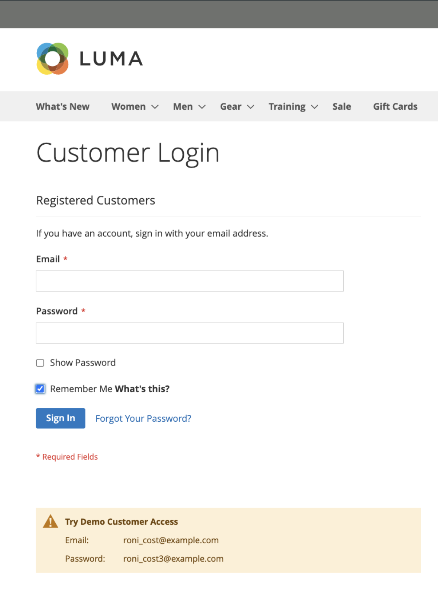
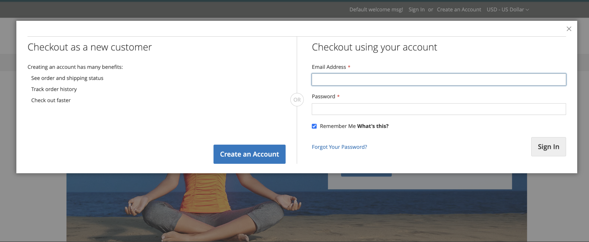
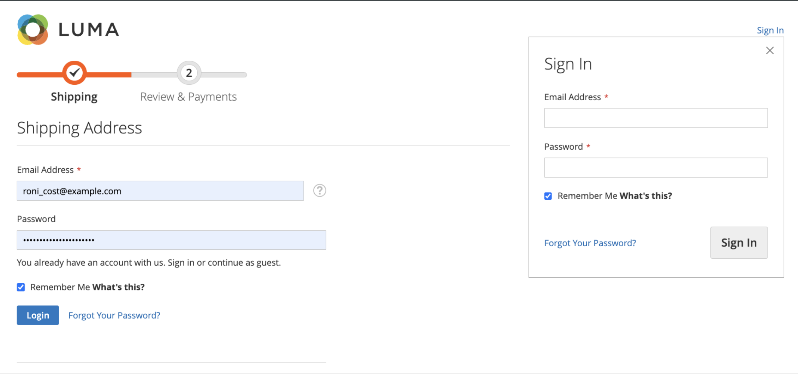

# カートの永続性

永続的なショッピングカートは、現在のデバイス上の顧客アカウントへの参照を保存し、ログインセッションの有効期限が切れたときにカートの内容にアクセスできるようにします。

お客様が&#x200B;_記憶_&#x200B;の場合、ログインセッションの有効期限が切れても、ショッピングカートのコンテンツに現在のデバイスからアクセスできます。 セッションの有効期限が切れると、永続的なカートセッションを使用して、顧客のショッピングカートにアクセスできます。 同じ顧客が別のデバイスまたはブラウザーにログインしてショッピングカートに何かを追加し、アクティブな永続的なセッションを使用してデバイスに戻ると、ショッピングカートに追加されたアイテムが更新されます。

永続的なショッピングカートを利用することで、放棄されたショッピングカートの数を減らし、売上を増加させることができます。 永続的なショッピング カート **は、機密アカウント情報をいつでも公開できません**。

サイトまたは特定のストアビュー内でのカートの永続性の使用を管理するには、[永続的なショッピングカートを設定](#configure-a-persistent-cart)できます。 これらの設定がストアフロントでの買い物客エクスペリエンスにどのような影響を与えるかについては、[永続的なカート ワークフロー](#persistent-cart-workflow)を参照してください。

>[!NOTE]
>
>永続的なショッピングカート機能は、登録およびサインインしている顧客のみが利用できます。 ゲストの買い物客は、永続的なショッピングカート機能を使用できません。

## カートの永続的なワークフロー

永続的なショッピングカートが[有効](#configure-a-persistent-cart)の場合、ワークフローは次の要素に依存します。

- _[!UICONTROL Enable Remember Me]_&#x200B;および&#x200B;_[!UICONTROL Clear Persistence on Log Out]_&#x200B;設定の値
- _[!UICONTROL Remember Me]_&#x200B;チェックボックスを選択またはクリアするお客様の決定
- 永続的なCookieがクリアされると

顧客セッションの有効期限が切れると、次の条件で`Not Jane Smith?` リンクがページヘッダーに表示されます。
- ログインしたお客様が&#x200B;_[!UICONTROL Remember Me]_&#x200B;オプションを選択し、永続的なCookieが適用されます
- システムが&#x200B;_[!UICONTROL Clear Persistence on Sign Out]_&#x200B;で`No`に設定されている場合、お客様はログアウトします。

ログインセッションの有効期限が切れた場合でも、現在のデバイスにショッピングカートの内容の記録が保持されます。 `Not Jane Smith?` リンクを使用すると、お客様は永続的なセッションを終了してゲストとして作業を開始したり、別の顧客または同じ顧客としてログインしたりできます。

顧客がログイン時に「_[!UICONTROL Remember Me]_」チェックボックスをオンにした場合、ストアは別の永続的なCookieを作成および管理します。 このCookieは、顧客がブラウザーを閉じたり、別のサイトに移動したりして、ログインしたセッションの有効期限が切れた後でも、ショッピングカートをアクセスできるようにします。

ログイン中または永続的なセッションがアクティブな間に、同じ顧客が複数のブラウザーを使用してストアにアクセスした場合、ページが更新されたときに、あるブラウザーでショッピングカートのコンテンツに加えた変更は、他のブラウザーに反映されます。

>[!NOTE]
>
>複数のデバイスやブラウザーでカートを同期させるには、顧客はショッピングに使用する新しいデバイスごとにログインする必要があります。 ログインしている顧客の場合、ショッピングカートのコンテンツは、永続的なカート設定に関係なく、同じアカウントでログインしている限り、複数のデバイスやブラウザー間で同期されます。

### &quot;Remember Me&quot; チェックボックスの動作

顧客は、ログインページ、認証ポップアップ、チェックアウトサインイン、または新しいアカウントを作成する際に&#x200B;_[!UICONTROL Remember Me]_&#x200B;チェックボックスを選択して、ログインセッションの有効期限が切れたときに現在のデバイスでショッピングカートの内容にアクセスできるようにすることができます。

| 覚えてる？ | 結果 |
| ------------ |  ------ |
| 選択中 | 永続的なCookieを作成し、顧客ログインセッションの有効期限が切れたときに、現在のデバイスでショッピングカートのコンテンツにアクセスできるようにします。 |
| 未選択 | 永続的なCookieを作成せず、ログインセッションの有効期限が切れると、現在のデバイスでショッピングカートのコンテンツにアクセスできなくなります。 ショッピングカートの内容は、お客様のアカウントに保存され、次回お客様がログインしたときに再読み込みされます。 |

{style="table-layout:auto"}

{width="600" zoomable="yes"}
{width="600" zoomable="yes"}
{width="600" zoomable="yes"}

### ログアウト動作の永続性をクリア

顧客がログインするか、_自分を記憶_ オプションを選択して登録すると、_ログアウト時の永続性を消去_ オプションの設定によって、永続的なカートの動作が決定されます。

|  | 「ログアウト時の永続性を消去」を「はい」に設定 | ログアウト時の永続性を消去を「いいえ」に設定 |
| ------ | ------ | ------ |
| _記憶_&#x200B;のお客様がログアウトしました | セッションと永続的なCookieの両方を削除し、同じ顧客がログインし直すまで、ショッピングカートのコンテンツが現在のデバイスに表示されなくなります。 | セッション Cookieを削除しますが、永続的なCookieは有効なままです。 ショッピングカートのコンテンツは、現在のデバイスから引き続きアクセスできます。 |
| _Remembered_&#x200B;のお客様はログアウトしませんが、セッション Cookieの有効期限が切れます | 永続的なCookieは有効なままであり、ショッピングカートのコンテンツには現在のデバイスからアクセスできます。 | 永続的なCookieは有効なままであり、ショッピングカートのコンテンツには現在のデバイスからアクセスできます。 |

### 共有コンピューターでのオープンセッションの例

Janeは、_記憶_&#x200B;のログイン顧客としてホリデーショッピングを終えています。 彼女はカートにジョンへのプレゼントと、母親へのプレゼントを追加した。 その後、彼女は軽食のためにキッチンに行き、ログインセッションの有効期限が切れます。

ジョンは、ジェーンがキッチンにいる間、少し買い物をするためコンピューターの前に座ります。 ページの上部にある`Not Jane Smith?` リンクに気づかずに、JohnはJaneに素敵なプレゼントを見つけて、カートに追加します。 彼がチェックアウトすると、彼は送料と請求先住所が事前入力されていることに気づき、自分がサインインしていると思います。 Johnさんは急いでおり、_注文審査_&#x200B;中に追加の項目に気づかず、注文を送信します。 ジェーンの買い物かごはもう空っぽで、ジョンは全部の贈り物を買いました。

## 永続的なカートの設定

永続的なショッピングカートの設定中に、Cookieの有効期間と、さまざまな顧客活動に使用できるようにしたいオプションを指定できます。

永続的なショッピングカートを使用するには、顧客のブラウザーをCookieを許可するように設定する必要があります。 買い物かごの操作に使用されるCookieには、次の2種類があります。

- **セッション Cookie** - サイトへの1回の訪問中に、短期的なセッション Cookieが存在します。 このCookieは、お客様がログアウトするか、セッションが期限切れになると期限切れになります。

- **永続的なCookie** - ログインセッションが終了した後も、長期的な永続的なCookieが引き続き存在します。 このCookieは、お客様がログアウトまたはセッションの有効期限が切れたときに、お客様のショッピングカートのコンテンツに引き続きアクセスできるようにします。

これらの設定設定が顧客ワークフローにどのような影響を与えるかについて詳しくは、[永続的な買い物かごワークフロー](#persistent-cart-workflow)を参照してください。

{{$include /help/_includes/persistent-cart-configuration.md}}

<!-- Last updated from includes: 2024-10-31 10:02:14 -->
