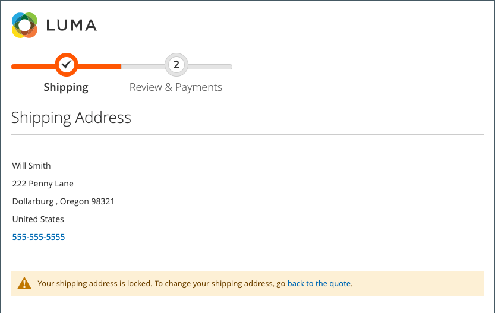

# チェックアウト時のアドレス検索

{{ee-feature}}

顧客のアドレス帳には、保存されたアドレスや情報が多数含まれている場合があります。特に、通常の再訪問者や、複数の注文や発送場所を入力する企業の場合に顕著です。 多数のアドレスを表示すると、チェックアウトの読み込みと処理が大幅に遅くなり、買い物に否定的なエクスペリエンスになる可能性があります。 チェックアウトの応答性を高めるには、サイトのアドレス検索をアクティブにして設定することをお勧めします。

>[!NOTE]
>
>アドレス検索は、デフォルトでは有効になっていません。 この機能を設定して、サイトに機能を組み込むことができます。

この機能が有効になっていて、顧客の保存済みアドレスの数が設定された制限を満たしているか超えている場合、_配送_ および _確認と支払い_ ステップには 1 つのアドレスのみが表示されます（デフォルト）。 お客様は、「住所を変更 **をクリックし、市区町村、都道府県、番地または郵便番号で正しい住所を検索することで** 選択した住所を変更できます。 この機能は、ギフトレジストリチェックアウトのアドレス選択もサポートします。

{width="700" zoomable="yes"}

顧客にデフォルトの配送先住所がない場合、「_配送先_」ページに _住所が選択されていません_ と表示されます。 この場合、顧客は、チェックアウトに進む前に、**住所の変更** をクリックして保存済みの住所を選択するか、**新しい住所** をクリックして住所を追加して選択する必要があります。 顧客にデフォルトの請求先住所がない場合、_確認および支払い_ ページには、出荷用に選択された住所と _住所の変更_ オプションが表示されます。

{width="600" zoomable="yes"}

## 引用符で囲まれたアドレス検索

 （Adobe Commerce B2B でのみ使用可能）

また、住所検索を有効にすると、顧客の保存済み住所の数が設定された制限を満たしているか、超えている見積もりから作成された注文のチェックアウトにも影響します。 見積もりが完了し、顧客がチェックアウトに進むと、選択した配送先住所のみが表示されます。 ページには、配送先住所がロックされていて、見積書でのみ変更できるというメッセージも表示されます。

{width="600" zoomable="yes"}

## アドレス検索を有効にする

1. _管理者_ サイドバーで、**[!UICONTROL Stores]**/_[!UICONTROL Settings]_/**[!UICONTROL Configuration]**&#x200B;に移動します。

1. 左側のパネルで「**[!UICONTROL Sales]**」を展開し、「**[!UICONTROL Checkout]**」を選択します。

1. 「」を展開し、「**[!UICONTROL Checkout Options]**」セクションを展開します。

   {width="700" zoomable="yes"}

   これらの各設定について詳しくは、『設定リファレンスガイド _の [&#x200B; チェックアウトオプション &#x200B;](../configuration-reference/sales/checkout.md#checkout-options) を参照してください_。

1. **[!UICONTROL Enable Address Search]** を `Yes` に設定します。

1. アドレス検索機能を含めるしきい値を指定するには、**[!UICONTROL Number of Customer Addresses Limit]** オプションを設定します。

   必要に応じて、「**[!UICONTROL Use system value]**」チェックボックスをオフにして、この変更を行います。

   保存されているアドレスの数がこの制限を満たしているか、超えている場合、ページでは、「_アドレスを変更_」オプションを使用して、デフォルトのアドレス（顧客にアドレスがある場合）または _アドレスが選択されていません_ と表示されます。 デフォルトの制限は `10` です。

1. 「**[!UICONTROL Save Config]**」をクリックします。
