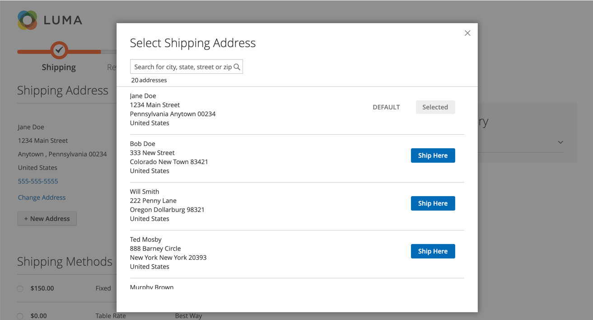

# チェックアウト時のアドレス検索

{{ee-feature}}

顧客は、アドレス帳に多くの保存されたアドレスと情報を持つことができます。特に、定期的なリピート顧客や、複数の注文や配送場所を入力する企業の場合はそうではありません。 多くのアドレスを表示すると、チェックアウトの読み込みやプロセスが大幅に遅くなり、ショッピング体験が低下する可能性があります。 チェックアウトの応答性を高めるために、サイトのアドレス検索をアクティブ化および設定することをお勧めします。

>[!NOTE]
>
>アドレス検索はデフォルトで有効になっていません。 この機能を設定して、サイトに機能を含めることができます。

この機能が有効になっていて、顧客の保存されたアドレス数が設定された制限を満たすか超えている場合、_配送_&#x200B;および&#x200B;_レビューと支払い_&#x200B;の手順には、1つのアドレス（デフォルト）のみが表示されます。 お客様は、「**住所を変更**」をクリックして、市区町村、都道府県、住所、郵便番号で正しい住所を検索して、選択した住所を変更できます。 この機能は、ギフトレジストリチェックアウトのアドレス選択にも対応しています。

{width="700" zoomable="yes"}

お客様がデフォルトの配送先住所を持っていない場合、_配送_ ページに&#x200B;_住所が選択されていません_&#x200B;と表示されます。 この場合、お客様は、**アドレスの変更**&#x200B;をクリックして保存されたアドレスを選択するか、**新しいアドレス**&#x200B;をクリックして追加し、選択してからチェックアウトを続行する必要があります。 お客様がデフォルトの請求先住所を持っていない場合、_Review &amp; Payments_ ページには、出荷用に選択された住所が&#x200B;_Change Address_ オプションとともに表示されます。

{width="600" zoomable="yes"}

## 引用符のロックされたアドレス検索

 （Adobe Commerce B2Bでのみ利用可能）

アドレス検索を有効にすると、お客様の保存されたアドレス数が設定された制限を満たすか超える見積もりから作成された注文のチェックアウトにも影響します。 見積もりが完了し、お客様がチェックアウトに進むと、選択した配送先住所のみが表示されます。 このページには、配送先住所がロックされており、見積もりでのみ変更できるというメッセージも表示されます。

{width="600" zoomable="yes"}

## アドレス検索を有効にする

1. _管理者_ サイドバーで、**[!UICONTROL Stores]** > _[!UICONTROL Settings]_>**[!UICONTROL Configuration]**&#x200B;に移動します。

1. 左側のパネルで、**[!UICONTROL Sales]**&#x200B;を展開し、**[!UICONTROL Checkout]**&#x200B;を選択します。

1. **[!UICONTROL Checkout Options]** セクションのを展開します。

   {width="700" zoomable="yes"}

   これらの各構成設定の詳細については、_構成リファレンスガイド_&#x200B;の[&#x200B; チェックアウトオプション &#x200B;](../configuration-reference/sales/checkout.md#checkout-options)を参照してください。

1. **[!UICONTROL Enable Address Search]**&#x200B;を`Yes`に設定します。

1. アドレス検索機能を含めるしきい値を指定するには、**[!UICONTROL Number of Customer Addresses Limit]** オプションを設定します。

   必要に応じて、**[!UICONTROL Use system value]** チェックボックスをオフにして、この変更を行います。

   お客様の保存済みアドレス数がこの制限を満たすか超える場合、ページにはデフォルトのアドレス（お客様が持っている場合）または&#x200B;_アドレスが選択されていません_、および&#x200B;_アドレスの変更_ オプションが表示されます。 既定の制限は`10`です。

1. **[!UICONTROL Save Config]**&#x200B;をクリックします。
