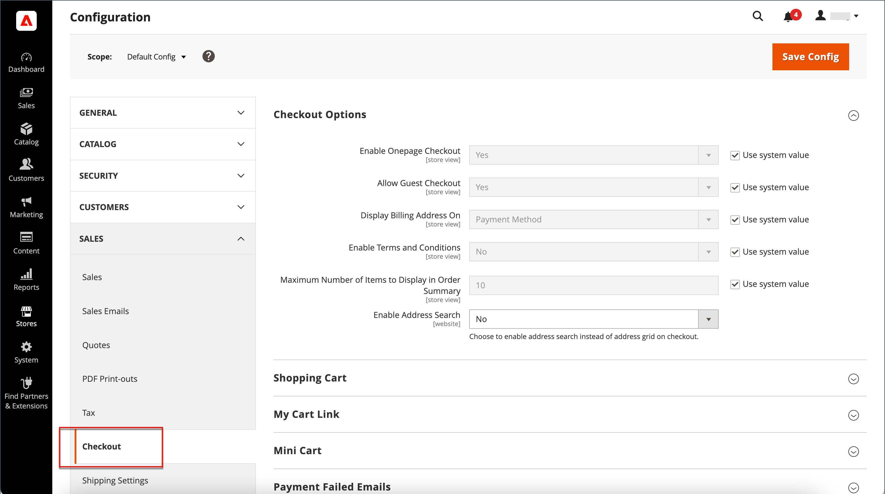

# ゲストのチェックアウト

購入を行う前に買い物客にアカウントの開設を要求するように、ストアを設定できます。 デフォルト設定では、ゲストは購入することができ、チェックアウトプロセスを完了した後にアカウントを登録するオプションがあります。

{width="600" zoomable="yes"}

ゲストのチェックアウトを無効にする **_T:_**

1. _管理者_ サイドバーで、**[!UICONTROL Stores]**/_[!UICONTROL Settings]_/**[!UICONTROL Configuration]**に移動します。

1. 左側のパネルで「**[!UICONTROL Sales]**」を展開し、「**[!UICONTROL Checkout]**」を選択します。

1. 「」を展開し、「**[!UICONTROL Checkout Options]**」セクションを展開します。

   {width="700" zoomable="yes"}

これらの各設定について詳しくは、『設定リファレンスガイド [ の ](../configuration-reference/sales/checkout.md#checkout-options) チェックアウトオプション _を参照してください_。

1. 設定が特定のストア表示の場合は、[ ストア表示を選択 ](../configuration-reference/scope-change.md#set-the-scope) して設定が適用されます。

   プロンプトが表示されたら、「**[!UICONTROL OK]**」をクリックして続行します。

1. **[!UICONTROL Allow Guest Checkout]** を `No` に設定します。

   必要に応じて、「**[!UICONTROL Use system value]**」チェックボックスをオフにして、この設定の変更を有効にします。

1. 「**[!UICONTROL Save Config]**」をクリックします。

## 登録済みの E メールに対するゲスト注文へのアクセスを許可する

[!BADGE SaaS のみ ]{type=Positive url="https://experienceleague.adobe.com/en/docs/commerce/user-guides/product-solutions" tooltip="Adobe Commerce as a Cloud Service プロジェクトにのみ適用されます（Adobeで管理される SaaS インフラストラクチャ）。"}

オプションのストアレベル設定はデフォルトで無効になっており、ゲストの買い物客は、登録済みの顧客アカウントに一致するメールアドレスを使用して行われた注文を追跡できます。

有効にすると、登録済みのメールで行われたゲストのチェックアウト注文に引き続きアクセスできるようになり、顧客の注文履歴にも表示されます。

この機能を有効にするには、**ストア**/設定/**設定**/営業/**営業**/**ゲストのチェックアウト** に移動し、「**ゲストによる登録済みメールへの注文のアクセスを許可**」設定を `Yes` に設定します。
