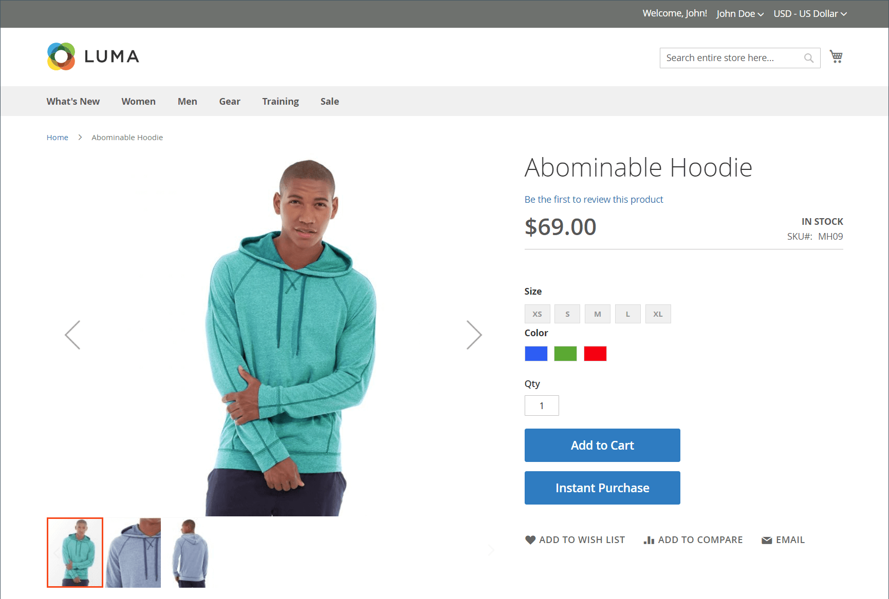

# 今すぐ購入

_インスタント購入_&#x200B;を使用すると、お客様はアカウントに保存されている情報を使用して、チェックアウトプロセスをスピードアップできます。 有効にすると、要件を満たす顧客の製品ページの「_カートに追加_」ボタンの下に「_即時購入_」ボタンが表示されます。

{width="700" zoomable="yes"}

## お客様の要件

- お客様は、アカウントに[ ログイン ](../customers/customer-sign-in.md)しています。

- お客様のアカウントには[ デフォルトの請求先住所と配送先住所](../customers/account-dashboard-address-book.md)があります。

- デフォルトの配送先住所で指定されている国に対して、少なくとも1つの[配送方法](delivery.md)を利用できます。

- お客様のアカウントには、Vaultが有効になっている[ ストアド支払い](../stores-purchase/stored-payment-methods.md)方法があります。

  保存されたクレジットカード情報に安全にアクセスするために、次の支払い方法を使用できます。

   - [Braintree クレジットカード ](braintree.md) （3D セキュアが有効になっている場合、Braintree クレジットカードでは即時の購入はできません）。
   - [PayPalが有効になっているBraintree](braintree.md)
   - [PayPal Payflow Pro](paypal-payflow-pro.md)

## ストアフロントですばやく購入

1. ストアフロントでは、顧客は購入する商品の商品ページにアクセスします。

1. 必要なオプションを選択し、**[!UICONTROL Instant Purchase]**&#x200B;をクリックします。

   {width="500" zoomable="yes"}

1. **[!UICONTROL Instant Purchase Confirmation]**&#x200B;情報を確認し、**[!UICONTROL OK]**&#x200B;をクリックしてトランザクションを完了します。

   商品ページの上部に、確認メッセージと注文番号が表示されます。

## 今すぐ購入を設定

### 手順1：設定ページを開く

1. _管理者_ サイドバーで、**[!UICONTROL Stores]** > _[!UICONTROL Settings]_>**[!UICONTROL Configuration]**に移動します。

### 手順2：支払い方法の保管を設定する

Braintreeでの即時購入またはAdobe CommerceおよびMagento Open Sourceの決済サービスを使用できます。 買い物客が即日購入機能を使用できるようにするには、事前にヴォールティングを有効にする必要があります。

Braintreeまたは決済サービスの決済方法を設定し、ヴォールトを有効にする方法について説明します。

- [Braintree](braintree.md)
- [決済サービスのドキュメント](https://experienceleague.adobe.com/docs/commerce/payment-services/guide-overview.html)

### ステップ 3：即時購入を有効にする

1. _[!UICONTROL Sales]_セクションの下の左側のパネルで、**[!UICONTROL Sales]**を選択します。

1. **[!UICONTROL Instant Purchase]** セクションのを展開します。

1. この変更が特定のストアビューに適用される場合、[設定が適用されるストアビュー](../configuration-reference/scope-change.md#set-the-scope)を選択します。

   プロンプトが表示されたら、**[!UICONTROL OK]**&#x200B;をクリックして続行します。

1. **[!UICONTROL Enabled]**&#x200B;を`Yes`に設定します。

1. ボタンに表示する&#x200B;**[!UICONTROL Button Text]**&#x200B;を入力します。

   ボタンテキストは、ストアビューまたは言語ごとに変更できます。 デフォルトでは、ボタンのテキストは`Instant Purchase`です。

   {width="600" zoomable="yes"}

   これらの各構成設定の詳細については、_構成リファレンスガイド_&#x200B;の[即時購入](../configuration-reference/sales/sales.md#instant-purchase)を参照してください。

1. **[!UICONTROL Save Config]**&#x200B;をクリックします。

1. キャッシュの更新を求めるメッセージが表示されたら、システムメッセージの「**[!UICONTROL Cache Management]**」をクリックし、指示に従ってキャッシュをフラッシュします。
