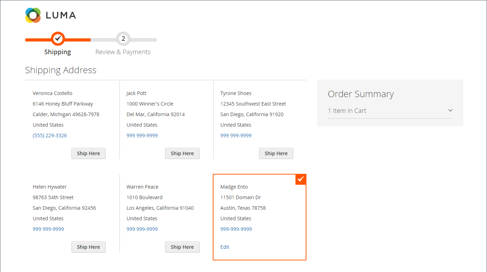

# チェックアウトプロセスとオプション

チェックアウトプロセスが開始されると、トランザクションは、暗号化された安全なチャネルに移動します。 ブラウザーのアドレスバーに南京錠の記号が表示され、URL が `http` から `https` に変わります。

## プロセス

チェックアウトプロセスの目標は、トランザクションの完了に必要な情報を収集することです。 _チェックアウト_ ページでは、プロセスの各ステップを順を追って顧客をリードします。 アカウントにログインしている顧客は、情報の多くが既にアカウントに存在するので、すばやくチェックアウトを完了できます。 発注書を使用する会社アカウントに関連付けられている顧客のワークフローは若干異なります。

### 送料

チェックアウトプロセスの最初の手順は、顧客が配送先住所情報を入力し、配送方法を選択することです。 顧客がアカウントを持っている場合、配送先住所は自動的に入力されますが、必要に応じて変更できます。

 （Adobe Commerceのみ）受信者および送信者の住所の書式は、（customer address 属性 [ のプロパティによって決まり ](../customers/address-attributes.md) す。 入力検証設定は、配送先住所で使用できる有効な文字を決定します。

ページの上部にあるプログレスバーはチェックアウトプロセスの各ステップに従い、注文概要には入力した情報が表示されます。

{width="600" zoomable="yes"}

#### 別の住所に配送

1. アドレス帳に追加のエントリがある場合、顧客は注文が出荷される住所を見つけます。

1. アドレスを選択するには、「**[!UICONTROL Ship Here]**」をクリックします。

#### アドレスを追加

1. 「_[!UICONTROL Shipping Address]_」セクションの下部で、顧客は「**[!UICONTROL + New Address]**」をクリックします。

1. _[!UICONTROL Shipping Address]_&#x200B;フォームに入力します。

   デフォルトでは、顧客の姓と名が最初にフォームに表示されます。

   {width="600" zoomable="yes"}

1. アドレス帳に新しい住所を保存するには、フォームの下部にあるチェックボックスを選択します。

1. **[!UICONTROL Save Address]** をクリックします。

   新しい住所が配送先住所として選択されました。

   {width="600" zoomable="yes"}

#### 配送方法を選択

1. [ 配送 ](delivery.md) 方法のリストで、顧客が使用するオプションを選択します。

   {width="600" zoomable="yes"}

1. **[!UICONTROL Next]** をクリックして続行します。

### レビューと支払い – 通常の注文

チェックアウトプロセスの 2 番目の手順で、顧客は [ 支払い方法 ](payments.md) を選択し、プロモーションコードを含むクーポンを購入に適用します。 すべての情報は、必要に応じて確認および編集できます。 有効にした場合、お客様は注文する前に販売条件に同意する必要があります。

>[!NOTE]
>
>Commerceでは複数のクーポンコードを設定できますが、お客様は 1 つのクーポンコードのみを買い物かごに適用できます。 （詳しくは、[ クーポンコード ](../merchandising-promotions/price-rules-cart-coupon.md) を参照してください。）

{width="700" zoomable="yes"}

### レビューと支払 – 発注

 （Adobe Commerce B2B でのみ使用可能）

顧客が [ 発注書 ](../b2b/purchase-order-flow.md) を有効にしている会社に関連付けられている場合、すべての注文が発注書として処理されます。 利用可能な支払い方法は、会社アカウントの設定によって決まります。

1. 顧客が支払い方法を選択します。

   _分割払い_ 方式を使用する場合、[!UICONTROL Custom Reference Number] フィールドを使用して請求書番号を参照できます。

1. 顧客は「**[!UICONTROL Place Purchase Order]**」をクリックします。

   発注が行われます。

会社が [ 承認ルール ](../b2b/account-dashboard-approval-rules.md) を設定している場合、発注書は承認プロセスを実行します。 それ以外の場合は、直ちに処理されます。

{width="700" zoomable="yes"}

### 注文概要に表示される項目数

管理者ユーザーは、チェックアウト時に注文概要に表示される最大項目数を変更して、より少ない製品で表示を効率化できます。 デフォルトでは、この値は 10 に設定されています。

{width="700" zoomable="yes"}

1. _管理者_ サイドバーで、**[!UICONTROL Stores]**/_[!UICONTROL Settings]_/**[!UICONTROL Configuration]**&#x200B;に移動します。

1. 左側のパネルで「**[!UICONTROL Sales]**」を展開し、「**[!UICONTROL Checkout]**」を選択します。

1. 「」を展開し、「**[!UICONTROL Checkout Options]**」セクションを展開します。

1. **[!UICONTROL Maximum Number of Items to Display in Order Summary]**：表示する項目の最大数を入力します。

1. 「**[!UICONTROL Save Config]**」をクリックします。

   この更新により、チェックアウト時に表示される注文概要は、指定した数量の項目に限定されます。

### 注文確認

注文後、注文確認が表示されます。 登録済みのお客様の場合、ページには、注文番号と、お客様のアカウントへのリンク、およびレシートを生成するためのリンクが含まれます。 登録されたお客様は、メールで注文確認と追跡情報を期待するように言われます。 注文を追跡するためのアカウントを作成することをお勧めします。 登録済みのお客様は、リンクをクリックして領収書を生成できます。

注文確認ページは _成功_ ページとも呼ばれ、Analytics プログラムでコンバージョンを追跡するために使用されます。

{width="700" zoomable="yes"}

## チェックアウトオプション

チェックアウトオプションは、レイアウトなど、チェックアウトページの様々な属性を制御します。 ゲストのチェックアウトを許可したり、利用条件に関する契約を適用するなど、チェックアウトに制約を設定できるオプションがあります。 チェックアウトプロセス中の情報の表示を制御するオプションもあります。

{width="700" zoomable="yes"}

これらの各設定について詳しくは、『設定リファレンスガイド _の [ チェックアウトオプション ](../configuration-reference/sales/checkout.md#checkout-options) を参照してください_。

### チェックアウトオプションの変更

1. _管理者_ サイドバーで、**[!UICONTROL Stores]**/_[!UICONTROL Settings]_/**[!UICONTROL Configuration]**&#x200B;に移動します。
1. 左側のパネルで「**[!UICONTROL Sales]**」を展開し、「**[!UICONTROL Checkout]**」を選択します。
1. 必要に応じて、次のいずれかのオプションを設定します。
1. 「**[!UICONTROL Save Config]**」をクリックします。

1. 「」を展開し、「**[!UICONTROL Checkout Options]**」セクションを展開します。

1. 設定が特定のストア表示のためのものである場合は、[ ストア表示を選択 ](../configuration-reference/scope-change.md#set-the-scope) して、設定が適用されます。

   プロンプトが表示されたら、「**[!UICONTROL OK]**」をクリックして続行します。

1. チェックアウトオプションを設定します。

1. 「**[!UICONTROL Save Config]**」をクリックします。

### 使用可能なチェックアウトオプション

| フィールド | [ 範囲 ](../getting-started/websites-stores-views.md#scope-settings) | 説明 |
|--- |--- |--- |
| [!UICONTROL Enable Onepage Checkout] | ストア表示 | [1 ページチェックアウト ](checkout-one-page.md) がデフォルトのチェックアウト形式かどうかを決定します。 オプション：はい/いいえ |
| [!UICONTROL Allow Guest Checkout] | ストア表示 | ストアのアカウントについて、ゲストが [ 登録せずにチェックアウト ](checkout-guest.md) を実行できるかどうかを決定します。 オプション：`Yes` / `No` |
| [!UICONTROL Enable Terms and Conditions] | ストア表示 | 購入を行う前に、顧客が販売の [ 利用条件 ](terms-and-conditions.md) に同意する必要があるかどうかを決定します。 オプション：`Yes` / `No` |
| [!UICONTROL Display Billing Address On] | ストア表示 | チェックアウト時の請求先住所の場所を決定します。 オプション：`Payment Method` / `Payment Page` |
| [!UICONTROL Maximum Number of Items to Display in Order Summary] | ストア表示 | チェックアウト時に注文概要に表示できる項目の最大数を決定します。 デフォルトは `10` です。 |
| [!UICONTROL Enable Address Search] | Web サイト |  （Adobe Commerceのみ）お客様が [ 配送料 _および_ 確認と支払い _手順に ](checkout-address-search.md) 住所の検索_ 機能を使用できるかどうかを判断します。 この機能が有効な場合は、_[!UICONTROL Number of Customer Addresses Limit]_&#x200B;を使用して、チェックアウト時にこの機能を有効化するために必要な保存済みアドレスの数を設定します。 オプション：`Yes` / `No` |
| [!UICONTROL Number of Customer Addresses Limit] | Web サイト |  （Adobe Commerceのみ） アドレス検索が **[!UICONTROL Enabled]** の場合、は、チェックアウト時にこの機能をアクティブにするために必要な保存済みアドレスの数を決定します。 顧客の保存済みアドレスの数がこの数を超える場合、_配送_ ステップおよび _確認と支払い_ ステップではデフォルトのアドレスのみがレンダリングされます。 お客様は、検索機能を使用して、選択したアドレスを変更できます。 デフォルトは 10 です。 |

{style="table-layout:auto"}
