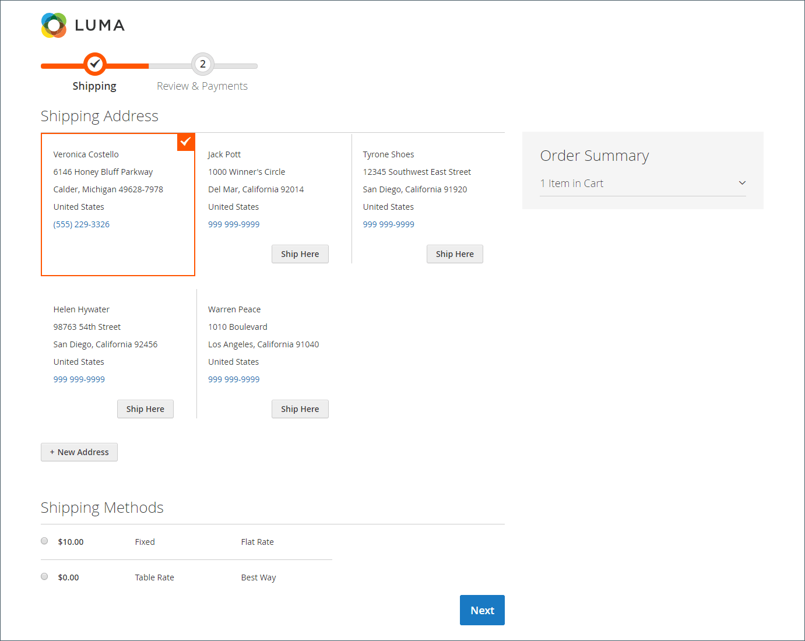
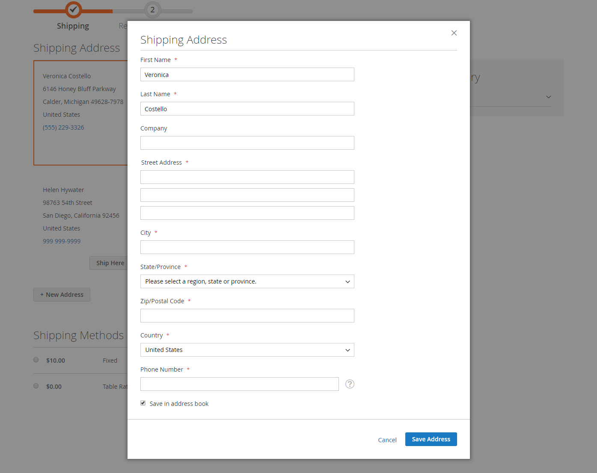
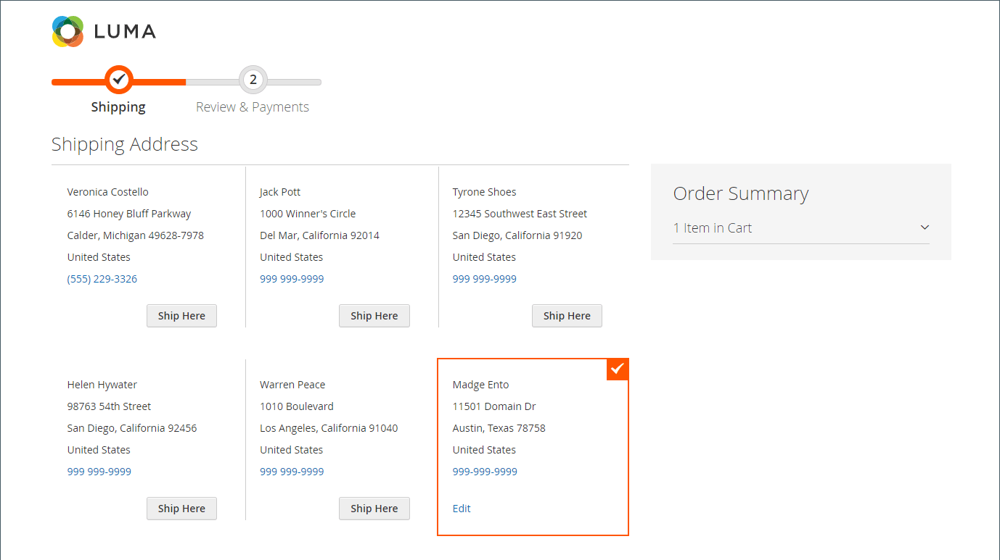
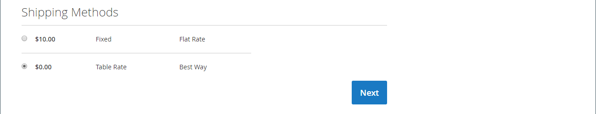
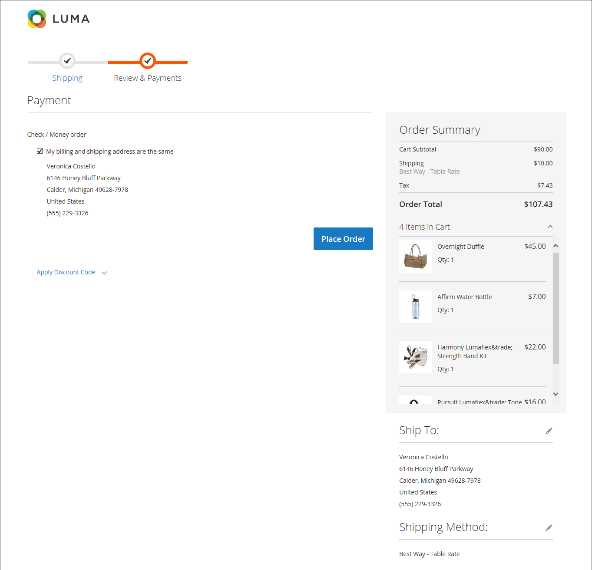
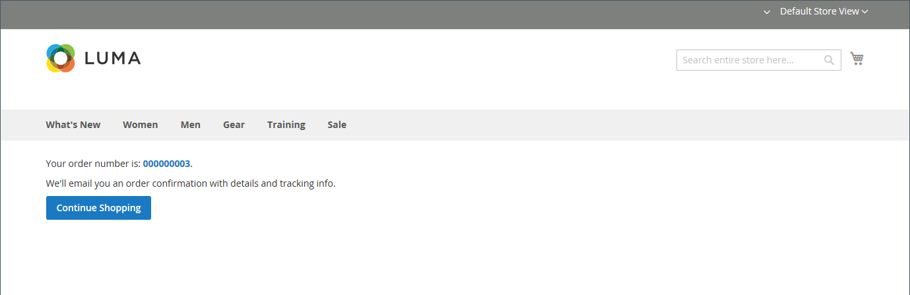

# チェックアウトプロセスとオプション

チェックアウトプロセスが開始されると、トランザクションは安全で暗号化されたチャネルに移行します。 ブラウザーのアドレスバーに南京錠の記号が表示され、URLが`http`から`https`に変更されます。

## プロセス

決済プロセスの目的は、取引を完了するために必要な情報を収集することです。 _チェックアウト_ ページは、プロセスの各ステップを通じてお客様を導きます。 アカウントにログインしている顧客は、多くの情報が既にアカウント内にあるため、チェックアウトをすばやく完了できます。 発注を使用する会社アカウントに関連付けられている顧客のワークフローは、少し異なります。

### 発送

チェックアウトプロセスの最初のステップは、お客様が配送先情報を完了し、配送方法を選択することです。 お客様がアカウントを持っている場合、配送先住所は自動的に入力されますが、必要に応じて変更できます。

 （Adobe Commerceのみ）受信者と送信者の住所の書式は、[顧客アドレス属性](../customers/address-attributes.md)のプロパティによって決まります。 入力検証設定によって、配送先住所で使用できる有効な文字が決まります。

ページ上部のプログレスバーは、チェックアウトプロセスの各ステップに従い、注文概要には、これまでに入力された情報が表示されます。

{width="600" zoomable="yes"}

#### 別の住所への配送

1. アドレス帳に追加のエントリがある場合、顧客は注文が発送されるアドレスを見つけます。

1. アドレスを選択するには、**[!UICONTROL Ship Here]**&#x200B;をクリックします。

#### アドレスを追加

1. _[!UICONTROL Shipping Address]_&#x200B;セクションの下部で、お客様は&#x200B;**[!UICONTROL + New Address]**&#x200B;をクリックします。

1. _[!UICONTROL Shipping Address]_&#x200B;フォームを完了します。

   デフォルトでは、顧客の姓と名は最初にフォームに表示されます。

   {width="600" zoomable="yes"}

1. アドレス帳に新しいアドレスを保存するために、顧客はフォームの下部にあるチェックボックスを選択します。

1. **[!UICONTROL Save Address]**&#x200B;をクリックします。

   新しい住所が配送先住所として選択されます。

   {width="600" zoomable="yes"}

#### 配送方法の選択

1. [配送方法](delivery.md)のリストで、お客様は使用するオプションを選択します。

   {width="600" zoomable="yes"}

1. 続行するには、**[!UICONTROL Next]**&#x200B;をクリックします。

### レビューと支払い – 定期的な注文

チェックアウトプロセスの2番目の手順で、顧客は[支払い方法](payments.md)を選択し、プロモーションコード付きのクーポンを購入に適用します。 必要に応じて、あらゆる情報を確認および編集できます。 有効になっている場合、お客様は注文する前に販売の契約条件に同意する必要があります。

>[!NOTE]
>
>Commerceでは複数のクーポンコードを設定できますが、お客様がカートに適用できるクーポンコードは1つのみです。 （詳しくは、[&#x200B; クーポンコード &#x200B;](../merchandising-promotions/price-rules-cart-coupon.md)を参照してください）。

{width="700" zoomable="yes"}

### レビューと支払い – 発注

 （Adobe Commerce B2Bでのみ利用可能）

顧客が[発注書](../b2b/purchase-order-flow.md)を有効にしている会社に関連付けられている場合、すべての注文は発注書として処理されます。 利用できる支払い方法は、会社のアカウント設定によって決まります。

1. 顧客は支払い方法を選択します。

   アカウント _での支払い方法を使用する場合、[!UICONTROL Custom Reference Number] フィールドを使用して請求書番号を参照できます。_

1. お客様は&#x200B;**[!UICONTROL Place Purchase Order]**&#x200B;をクリックします。

   発注が行われます。

会社が[承認ルール &#x200B;](../b2b/account-dashboard-approval-rules.md)を設定している場合、発注は承認プロセスを経ます。 それ以外の場合は、すぐに処理されます。

{width="700" zoomable="yes"}

### 注文概要に表示されるアイテムの数

管理者ユーザーは、チェックアウト時に注文概要に表示される最大項目数を変更して、より少ない商品で表示を効率化できます。 デフォルトでは、この値は10に設定されています。

{width="700" zoomable="yes"}に表示されるアイテムの数

1. _管理者_ サイドバーで、**[!UICONTROL Stores]** > _[!UICONTROL Settings]_>**[!UICONTROL Configuration]**&#x200B;に移動します。

1. 左側のパネルで、**[!UICONTROL Sales]**&#x200B;を展開し、**[!UICONTROL Checkout]**&#x200B;を選択します。

1. **[!UICONTROL Checkout Options]** セクションのを展開します。

1. **[!UICONTROL Maximum Number of Items to Display in Order Summary]**&#x200B;に、表示するアイテムの最大数を入力します。

1. **[!UICONTROL Save Config]**&#x200B;をクリックします。

   今回のアップデートでは、チェックアウト時に表示される注文概要は、指定された数量の商品に限定されます。

### 注文確認

注文確認書は、注文後に表示されます。 登録済みのお客様の場合、ページには、お客様のアカウントへのリンクと領収書を生成するためのリンクを含む注文番号が含まれます。 登録済みの顧客には、注文確認と追跡情報を電子メールで送信するように指示します。 お客様は、注文を追跡するためのアカウントを作成することをお勧めします。 登録済みの顧客は、リンクをクリックして領収書を生成できます。

注文確認ページは&#x200B;_成功_ ページとも呼ばれ、分析プログラムでコンバージョンを追跡するために使用されます。

{width="700" zoomable="yes"}

## チェックアウトオプション

チェックアウトオプションは、レイアウトを含むチェックアウトページの様々な属性を制御します。 チェックアウト時に制約を設定できるオプションもあります。これには、ゲストチェックアウトの許可や利用条件に関する契約の履行などがあります。 チェックアウトプロセス中に情報の表示を制御するオプションもあります。

{width="700" zoomable="yes"}

これらの各構成設定の詳細については、_構成リファレンスガイド_&#x200B;の[&#x200B; チェックアウトオプション &#x200B;](../configuration-reference/sales/checkout.md#checkout-options)を参照してください。

### チェックアウトオプションの変更

1. _管理者_ サイドバーで、**[!UICONTROL Stores]** > _[!UICONTROL Settings]_>**[!UICONTROL Configuration]**&#x200B;に移動します。
1. 左側のパネルで、**[!UICONTROL Sales]**&#x200B;を展開し、**[!UICONTROL Checkout]**&#x200B;を選択します。
1. 必要な次のいずれかのオプションを設定します。
1. **[!UICONTROL Save Config]**&#x200B;をクリックします。

1. **[!UICONTROL Checkout Options]** セクションのを展開します。

1. 設定が特定のストアビューの場合、[設定が適用されるストアビュー](../configuration-reference/scope-change.md#set-the-scope)を選択します。

   プロンプトが表示されたら、**[!UICONTROL OK]**&#x200B;をクリックして続行します。

1. チェックアウトオプションの設定：

1. **[!UICONTROL Save Config]**&#x200B;をクリックします。

### 利用可能なチェックアウトオプション

| フィールド | [範囲](../getting-started/websites-stores-views.md#scope-settings) | 説明 |
|--- |--- |--- |
| [!UICONTROL Enable Onepage Checkout] | ストアビュー | [1 ページのチェックアウト &#x200B;](checkout-one-page.md)が既定のチェックアウト形式であるかどうかを判断します。 オプション：はい/いいえ |
| [!UICONTROL Allow Guest Checkout] | ストアビュー | ゲストがストアにアカウントを登録せずに[&#x200B; チェックアウトを行えるかどうかを判断します。](checkout-guest.md) オプション：`Yes` / `No` |
| [!UICONTROL Enable Terms and Conditions] | ストアビュー | 顧客が購入する前に、販売の[利用条件](terms-and-conditions.md)に同意する必要があるかどうかを判断します。 オプション：`Yes` / `No` |
| [!UICONTROL Display Billing Address On] | ストアビュー | チェックアウト時の請求先住所の場所を指定します。 オプション：`Payment Method` / `Payment Page` |
| [!UICONTROL Maximum Number of Items to Display in Order Summary] | ストアビュー | チェックアウト時に注文概要に表示できるアイテムの最大数を指定します。 デフォルトは`10`です。 |
| [!UICONTROL Enable Address Search] | web サイト |  （Adobe Commerceのみ）お客様が&#x200B;_配送_&#x200B;と&#x200B;_レビューと支払い_&#x200B;の手順に[&#x200B; アドレス検索](checkout-address-search.md)機能を使用できるかどうかを判断します。 この機能が有効になっている場合は、_[!UICONTROL Number of Customer Addresses Limit]_&#x200B;を使用して、チェックアウト時にこの機能を有効にするために必要な保存済みアドレスの数を設定します。 オプション：`Yes` / `No` |
| [!UICONTROL Number of Customer Addresses Limit] | web サイト |  （Adobe Commerceのみ）アドレス検索が&#x200B;**[!UICONTROL Enabled]**&#x200B;の場合、チェックアウト時にこの機能を有効にするために必要な保存済みアドレスの数が決定されます。 お客様の保存済みアドレス数がこの数を満たすか超える場合、デフォルトのアドレスのみが&#x200B;_送料_&#x200B;および&#x200B;_レビューと支払い_&#x200B;の手順でレンダリングされます。 お客様は、検索機能を使用して、選択したアドレスを変更できます。 デフォルトは10です。 |

{style="table-layout:auto"}
