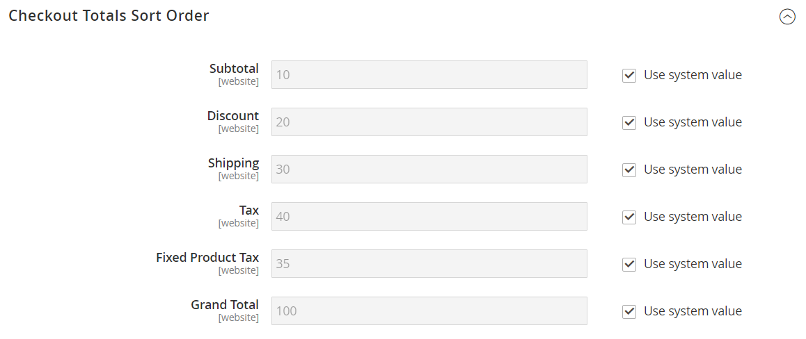

# チェックアウト合計の並べ替え順序

注文の確認時には、合計が注文の下部に表示され、割引、送料、店舗クレジット、税金の調整が行われます。 各項目の順序によって計算の順序が決まり、各項目に割り当てられた番号によって設定されます。 たとえば、小計はセクションの最初の項目で、値 10 が割り当てられます。 総計は最後に表示され、100 の値が割り当てられます。 合計セクション内のその他すべての項目には、これらの値の間に値が割り当てられます。

{width="700" zoomable="yes"}

**_チェックアウト合計の並べ替え順を設定するには：_**

1. 日 _Admin_ サイドバー、に移動 **[!UICONTROL Stores]** > _[!UICONTROL Settings]_>**[!UICONTROL Configuration]**.

1. 左側のパネルで、を展開します **[!UICONTROL Sales]** セクションで選択 **[!UICONTROL Sales]** その下に。

1. を展開  この **[!UICONTROL Checkout Totals Sort Order]** セクション。

   {width="600" zoomable="yes"}

   これらの各設定について詳しくは、を参照してください。 [チェックアウトの合計の並べ替え順序](../configuration-reference/sales/sales.md#checkout-totals-sort-order) が含まれる _設定リファレンスガイド_.

1. 設定が特定のストア表示の場合、 [ストア表示の選択](../configuration-reference/scope-change.md#set-the-scope) 設定が適用される場所。

   プロンプトが表示されたら、 **[!UICONTROL OK]** 続行します。

1. での順序を決定するには _合計_ セクションで、各項目に割り当てる番号を変更します。

   値が小さいほど、リスト内の位置が早くなります。 デフォルト設定では、小計（`10`）が最初の合計で、総計（`100`）が最後です。

   必要に応じて、 **[!UICONTROL Use system value]** チェックボックスをオンにして、これらの変更を完了します。

1. クリック **[!UICONTROL Save Config]**.
