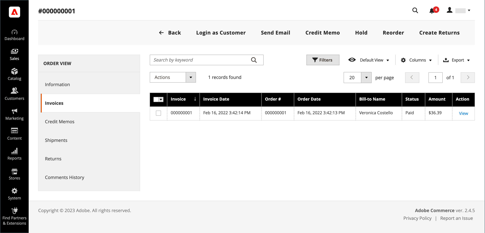
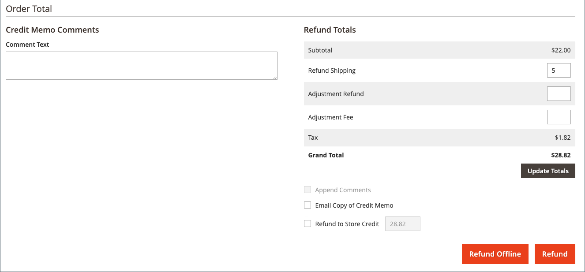
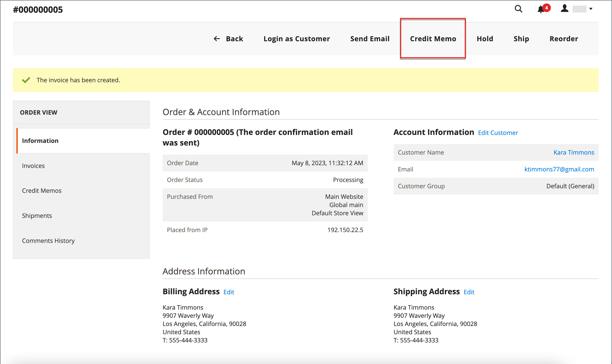
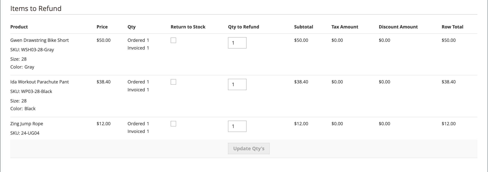
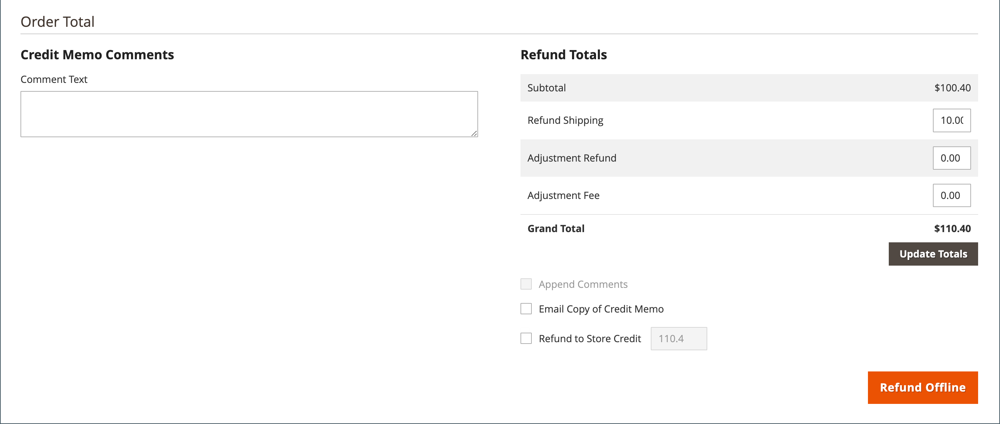

# クレジットメモを発行する

クレジット メモを印刷する前に、 [請求済注文](invoices.md#create-an-invoice). 支払い方法に応じて、オープン・クレジット・メモからオンラインとオフラインの両方の払戻（一部または全部）を発行できます。

-  （Adobe Commerceのみ）返金は店舗クレジットに充当できます。
-  （Adobe Commerce B2B で利用可能）払い戻しは、会社のクレジットに適用できます。
- クレジットカードによる購入は、オンラインまたはオフラインで返金できます。
- 小切手またはマネーオーダーによる購入は、オフラインで返金する必要があります。

を含むすべてのクレジット・メモ [ステータスを開く](order-status.md) 未払いの払い戻しがあります。

クレジット メモを使用すると、次のことができます。

- 請求書の全額を払い戻します。
- 請求書の一部金額を払い戻します。
- 1 つの請求書に対して複数の一部金額を払い戻します。
- 合計注文金額を超えないように、注文ごとに複数の請求書を払い戻します。
- 注文した 5 枚のシャツのうち 3 枚など、1 つの品目の数量の一部を払い戻します。

参照： [請求書の作成](invoices.md#create-an-invoice) を参照してください。

## 支払アクションの設定

クレジットカードで支払われた注文の返金ワークフローは、 [支払いアクションの設定](../configuration-reference/sales/payment-methods.md#payment-actions) 使用可能な各支払方法の設定で。 トランザクションが決済されるまで払い戻しを発行できません。

{width="600" zoomable="yes"}

- 設定した支払方法の支払処理が次のように設定されている場合 `Authorize`を使用する場合、最初に管理者から請求書を生成してから、クレジットメモを作成する必要があります。
- 設定した支払方法の支払処理が次のように設定されている場合 `Authorize and Capture`、請求書は支払プロセッサによって既に生成されていますが、資金はトランザクションが決済されるまで利用できません。 この短い待ち時間は、セキュリティ対策として多くの支払い処理者によって推奨されており、通常は自動的に処理できます。 トランザクションは、支払い処理者のマーチャントアカウントから手動で決済することもできます。
-  （Adobe Commerceのみ）ギフトオプションを含む注文のクレジットメモを作成した場合、ギフト包装や印刷されたカードの返金は、クレジットメモの「返金合計」セクションに表示されます。 これらの費用を払い戻される金額から除外するには、その金額を「調整手数料」として入力します。 同じ注文に対して複数のクレジットメモが発行された場合、ギフトオプションの払い戻しは最初のクレジットメモにのみ表示されます。

## クレジットメモの作成

発行する払い戻しのタイプを決定します [信用購入](#issue-a-refund-for-a-credit-purchase) または [小切手または為替](#issue-an-offline-refund-for-check-or-money-order) – クレジット・メモを生成し、払い戻しを発行します。

### クレジット購入の払い戻しを発行する

1. 日 _Admin_ サイドバー、に移動 **[!UICONTROL Sales]** > **[!UICONTROL Orders]**.

   {width="700" zoomable="yes"}

1. グリッド内の順序を見つけて、 **[!UICONTROL View]**.

1. 次の場合 _[!UICONTROL Credit Memo]_ボタンがボタンバーに表示されたら、次のいずれかの操作を行います。

   - を発行します `offline` 払い戻し、手順#6 に進みます。
   - を発行します `online` 払い戻し、手順#4 に進みます。

   参照： [クレジットメモ](credit-memos.md) オフラインおよびオンラインでの払い戻しの詳細については、こちらを参照してください。

1. クリック **[!UICONTROL Invoices]** 左側のパネルで次の操作を行います。

1. グリッドで請求書を見つけて、 **[!UICONTROL View]**.

   {width="700" zoomable="yes"}

1. にスクロール ダウンします。 **[!UICONTROL Invoice Totals]** 請求書のセクションで、請求書がに設定されていることを確認します `Capture Online`を選択し、 **[!UICONTROL Submit Invoice]**.

   {width="600" zoomable="yes"}

   そのオプションが利用できない場合、請求書は既に作成されています。 次の手順に進みます。

1. 請求書の上部にあるボタン バーで、 **[!UICONTROL Credit Memo]**.

1. の情報を確認します。 **[!UICONTROL Items to Refund]** を参照し、該当する場合は次の手順を実行します。

   - 商品を在庫に戻すには、 **[!UICONTROL Return to Stock]** チェックボックス。

     次の場合、商品は自動的に在庫に戻ります _製品ストックオプション_ はに設定されています。 `Automatically Return Credit Memo Item to Stock`. （を使用） [Inventory management有効](../inventory-management/enable.md)品目が出荷を送信したソースに戻されます。

   - を更新 **[!UICONTROL Qty to Refund]**&#x200B;を選択し、 **[!UICONTROL Update Qty's]**.

     {width="600" zoomable="yes"}

1. を更新 **[!UICONTROL Refunds Totals]** セクションを次のように設定します。

   - の場合 **[!UICONTROL Refund Shipping]**、送料から払い戻す金額を入力します。

     このフィールドには、最初に払い戻し可能な注文の合計出荷金額が表示されます。 注文からの全配送料から、既に払い戻された配送料を差し引いた金額になります。 量と同様に、量を減らすことができますが、増やすことはできません。

   - の場合 **[!UICONTROL Adjustment Refund]**&#x200B;注文の特定の部分（送料、商品、税金）に適用されない追加払い戻しとして、合計払い戻し額に追加する値を入力します。 また、管理者が最初に非仮想支払い方法を払い戻したい場合に、ギフトカードなどの仮想通貨での部分払い戻しに使用することもできます。

     入力した金額は、支払われた金額を超える払戻合計を引き上げることはできません。

   - の場合 **[!UICONTROL Adjustment Fee]**、合計払戻金額から差し引く値を入力します。

     この金額は、注文の特定のセクション（送料、品目、税金など）から減算されません。

1. コメントを追加するには、 **[!UICONTROL Credit Memo Comments]** ボックス。

   - 顧客にメール通知を送信するには、 **[!UICONTROL Email Copy of Credit Memo]** チェックボックス。

1. クリック **[!UICONTROL Update Totals]**.

1. 必要に応じて、次の手順を実行します。

   -  （Adobe Commerceのみ）お客様の店舗クレジットに金額を返金するには、 **[!UICONTROL Refund to Store Credit]** チェックボックス。

   -  （Adobe Commerce B2B で使用可能）お客様の会社のクレジットに金額を返金するには、 **[!UICONTROL Refund to Company Credit]** チェックボックス。

   - オフラインでの払い戻しを発行するには、 **[!UICONTROL Refund Offline]**.

   - オンライン払い戻しを行うには、 **[!UICONTROL Refund]**.

   -  （Adobe Commerce B2B で利用可能）購入が会社のクレジットで支払われた場合は、をクリックします **[!UICONTROL Refund to Company Credit]**.

   参照： [クレジットメモ](credit-memos.md) オフラインおよびオンラインでの払い戻しの詳細については、こちらを参照してください。

   {width="600" zoomable="yes"}

### 小切手または送金用のオフライン払い戻しを発行する

1. 日 _Admin_ サイドバー、に移動 **[!UICONTROL Sales]** > **[!UICONTROL Orders]**.

1. グリッドで完了した注文を見つけ、 **[!UICONTROL View]** リンク。

1. ページ上部のボタン バーで、 **[!UICONTROL Invoice]**.

1. ページの下部まで下にスクロールし、 **[!UICONTROL Submit Invoice]**.

1. 請求書の上部にあるボタン バーで、 **[!UICONTROL Credit Memo]**.

   {width="600" zoomable="yes"}

1. の情報を確認します。 **[!UICONTROL Items to Refund]** を参照し、該当する場合は次の手順を実行します。

   {width="600" zoomable="yes"}

   - 「」を選択します **[!UICONTROL Return to Stock]** 返された商品を在庫に返す場合は、「」チェックボックスをオンにします。

     Inventory managementを有効にすると、在庫数量は出荷を送信したソースに戻ります。 次の場合、商品は自動的に在庫に戻ります [製品ストックオプション](../inventory-management/enable.md) はに設定されています。 `Automatically Return Credit Memo Item to Stock`.

   - を更新 **[!UICONTROL Qty to Refund]** をクリックして、 **[!UICONTROL Update Qty's]**.

     貸方を記入する金額は、払い戻し可能な最大金額を超えることはできません。

1. を更新 **[!UICONTROL Refunds Totals]** 該当するセクション：

   - の場合 **[!UICONTROL Refund Shipping]**、送料から払い戻す金額を入力します。

     このフィールドには、最初に払い戻し可能な注文の合計出荷金額が表示されます。 注文からの全配送料から、既に払い戻された配送料を差し引いた金額になります。 量と同様に、量を減らすことができますが、増やすことはできません。

   - の場合 **[!UICONTROL Adjustment Refund]**&#x200B;注文の特定の部分（送料、商品、税金）に適用されない追加払い戻しとして、合計払い戻し額に追加する値を入力します。 また、管理者が最初に非仮想支払い方法を払い戻したい場合に、ギフトカードなどの仮想通貨での部分払い戻しに使用することもできます。

     入力した金額は、支払われた金額を超える払戻合計を引き上げることはできません。

   - の場合 **[!UICONTROL Adjustment Fee]**、合計払戻金額から差し引く値を入力します。

     この金額は、注文の特定のセクション（送料、品目、税金など）から減算されません。

   - 購入がストアクレジットで支払われた場合は、 **[!UICONTROL Refund to Store Credit]** 顧客勘定残高に金額を貸方に記入するためのチェックボックス。

1. コメントを追加するには、 **[!UICONTROL Credit Memo Comments]** 次の手順を実行します。

   - 顧客にメール通知を送信するには、 **[!UICONTROL Email Copy of Credit Memo]** チェックボックス。

   - 入力したコメントをメールに含めるには、 **[!UICONTROL Append Comments]** チェックボックス。

     クレジット・メモ通知のステータスは、クレジット・メモ番号の横の完了したクレジット・メモに表示されます。

     {width="600" zoomable="yes"}

1. プロセスを完了して払い戻しを発行するには、 **[!UICONTROL Refund Offline]**.

## フィールドの説明

### [!UICONTROL Order & Account Information]

| フィールド | 説明 |
|--- |--- |
| [!UICONTROL Order Number] | 注文番号はに表示されます _注文およびアカウント情報_、その後に確認メールが送信されたかどうかを示すメモ。 |
| [!UICONTROL Order Date] | 注文が行われた日時。 |
| [!UICONTROL Order Status] | 注文ステータスを次のように示します `Complete`. |
| [!UICONTROL Purchased From] | 注文が行われた web サイト、ストア、ストア表示を示します。 |
| [!UICONTROL Placed from IP] | 注文元のコンピューターの IP アドレスを示します。 |

{style="table-layout:auto"}

### [!UICONTROL Account Information]

| フィールド | 説明 |
|--- |--- |
| [!UICONTROL Customer Name] | 注文を行った顧客または購入者の名前。 顧客名が顧客プロファイルにリンクされています。 |
| [!UICONTROL Email] | 顧客または購入者の電子メールアドレス。 このメールアドレスに、新しいメールメッセージを開くリンクが付いています。 |
| [!UICONTROL Customer Group] | 顧客が割り当てられている顧客グループまたは共有カタログの名前。 |
| [!UICONTROL Company Name] |  （Adobe Commerce B2B で使用可能）購入者に関連付けられた会社の名前。その会社に代わって注文が行われます。 会社名は会社プロファイルにリンクされています。 |

{style="table-layout:auto"}

### [!UICONTROL Address Information]

| フィールド | 説明 |
|--- |--- |
| [!UICONTROL Billing Address] | 注文を行った顧客または購入者の名前、続いて請求先住所、電話番号、および [VAT](vat.md)該当する場合。 電話番号は、モバイルデバイスでのオートダイヤルにリンクされています。 |
| [!UICONTROL Shipping Address] | 注文を出荷する必要がある人物の名前、出荷先住所、電話番号。 電話番号は、モバイルデバイスでのオートダイヤルにリンクされています。 |

{style="table-layout:auto"}

### [!UICONTROL Payment & Shipping Method]

| フィールド | 説明 |
|--- |--- |
| [!UICONTROL Payment Information] | 注文に使用される支払い方法、発注書番号（該当する場合）、注文の際に使用された通貨が続きます。 注文が次を使用して会社クレジットに請求される場合 [分割払い](../b2b/enable-basic-features.md#configure-payment-on-account)、アカウントに請求された金額が示されています。 |
| [!UICONTROL Shipping & Handling Information] | 使用する発送方法と、該当する手数料。 |

{style="table-layout:auto"}

### [!UICONTROL Items to Refund]

| フィールド | 説明 |
|--- |--- |
| [!UICONTROL Product] | 製品名、SKU およびオプション（該当する場合）。 |
| [!UICONTROL Price] | 商品の購入価格。 Adobe Commerce B2B の場合、この値は、該当する場合、共有カタログの商品に適用される割引を反映します。 |
| [!UICONTROL Qty] | 注文された数量。 |
| [!UICONTROL Return to Stock] | 返された項目が在庫に返されるかどうかを示すチェックボックス。 |
| [!UICONTROL Qty to Refund] | 商品から返される単位数を示します。 |
| [!UICONTROL Subtotal] | 小計は、購入価格に返品された製品数量を乗算した値です。 |
| [!UICONTROL Tax Amount] | 返された品目に適用される税の金額を小数値で指定します。 |
| [!UICONTROL Tax Percent] | 返品品目に適用される税の割合（パーセント）。 |
| [!UICONTROL Discount Amount] | 返品された品目に適用される割引。 |
| [!UICONTROL Row Total] | 返品された製品レベルに対して支払われる該当する税金を含む明細品目合計（割引を除く）。 |
| _注文の合計_ |  |

{style="table-layout:auto"}

### [!UICONTROL Credit Memo Comments]

| フィールド | 説明 |
|--- |--- |
| [!UICONTROL Comment Text] | クレジット メモに関するコメントを顧客に入力するために使用されるテキスト ボックスです。 |

{style="table-layout:auto"}

### [!UICONTROL Refund Totals]

| フィールド | 説明 |
|--- |--- |
| [!UICONTROL Refund Shipping] | 払い戻される配送料。 |
| [!UICONTROL Adjustment Refund] | 追加払い戻しとして払い戻された金額の合計に加算される金額。注文の特定の部分（送料、商品、税金など）には適用されません。 入力された金額は、支払われた金額を超える払戻合計を引き上げることはできません。 |
| [!UICONTROL Adjustment Fee] | 払い戻された合計金額から差し引かれた金額（例：返品手数料、ギフトラッピングまたはギフトオプションに関連する金額）。 |
| [!UICONTROL Grand Total] | 払い戻される合計金額 |
| [!UICONTROL Append Comments] | コメントをクレジット メモに含めるかどうかを決定するチェックボックスです。 |
| [!UICONTROL Email Copy of Credit Memo] | クレジット メモのコピーを E メールで送信するかどうかを決定するチェックボックスです。 |
| [!UICONTROL Refund to Store Credit] |  （Adobe Commerceのみ）合計を返金するかどうかを指定するチェックボックス [店舗クレジット](../customers/store-credit-using.md). |
| [!UICONTROL Subtotal] |  （Adobe Commerce B2B で利用可能）払い戻されるすべてのライン項目の合計。 |

{style="table-layout:auto"}

### 払い戻しボタン

受注に使用される支払方法によって、クレジット・メモで使用可能な払戻ボタンが決まります。

| ボタン | 説明 |
|--- |--- |
| **[!UICONTROL Refund]** | 元の購入が支払いゲートウェイを通じてクレジットカードによって支払われた場合、払い戻し金額は支払い処理者によって管理されます。 払い戻しを管理するには、支払いプロバイダーが提供するドキュメントを参照してください。 |
| **[!UICONTROL Refund Offline]** | 元の購入が小切手またはマネーオーダーによって支払われた場合、払い戻しは小切手、ギフトカード、または現金を発行することにより、顧客に直接支払われます。 クレジット・メモは、オフライン取引の記録として機能します。 |
| **[!UICONTROL Refund to Company Credit]** |  （Adobe Commerce B2B で利用可能）購入が会社のクレジットに課金された場合、払い戻しは次の場所に返されます [会社アカウント](../b2b/credit-company.md). |

{style="table-layout:auto"}

## クレジット メモの印刷

完了したクレジット メモを印刷または表示するには、PDF リーダーがインストールされている必要があります。 次をダウンロードできます [Adobe Reader][1] 無料です。

1. 日 _Admin_ サイドバー、に移動 **[!UICONTROL Sales]** > _[!UICONTROL Operations]_>**[!UICONTROL Credit Memos]**.

1. クレジット・メモを印刷するには、次のいずれかの方法を使用します。

### 方法 1：現行クレジット・メモの印刷

1. グリッドで、クレジット・メモを開きます。

1. クリック **[!UICONTROL Print]**.

   {width="600" zoomable="yes"}

### 方法 2：複数のクレジット・メモの印刷

1. リストで、印刷する各クレジット・メモのチェックボックスを選択します。

1. を **[!UICONTROL Actions]** コントロール先 `PDF Credit Memos` をクリックして、 **[!UICONTROL Submit]**.

   {width="600" zoomable="yes"}

1. プロンプトが表示されたら、次のいずれかの操作を行います。

   - ドキュメントを保存するには、 **[!UICONTROL Save]** 画面の指示に従って、ファイルをコンピューターに保存します。 ダウンロードが完了したら、Adobe ReaderでPDFを開き、ドキュメントを印刷します。

   - ドキュメントを表示するには、 **[!UICONTROL Open]**. 印刷可能なPDFのクレジットメモがAdobe Readerで開きます。 ここから、クレジットメモを印刷するか、コンピューターに保存できます。

[1]: https://www.adobe.com/acrobat/pdf-reader.html "Adobe Readerの取得"
