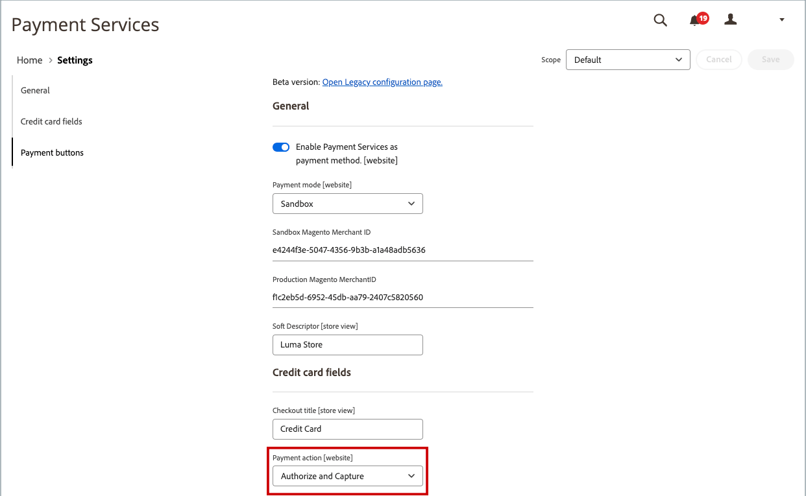
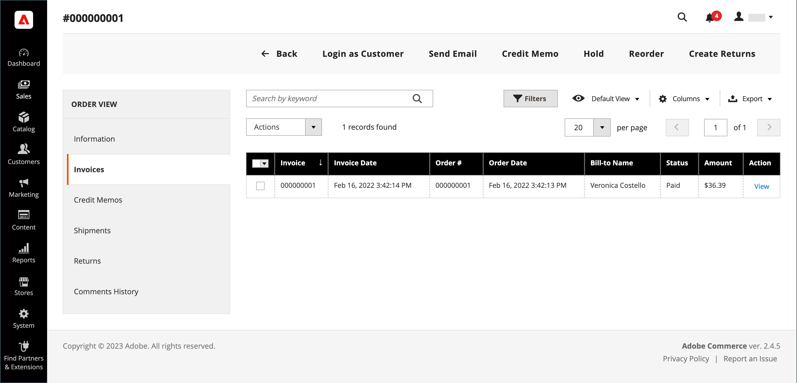
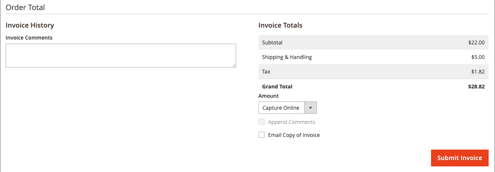
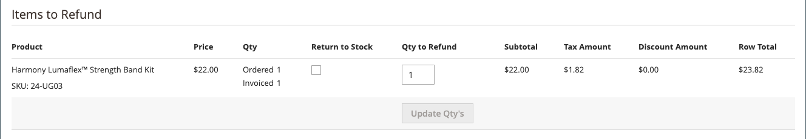
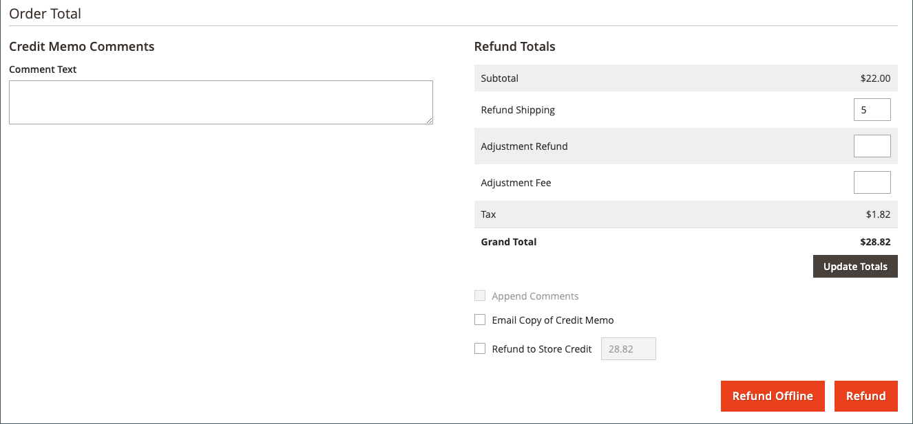
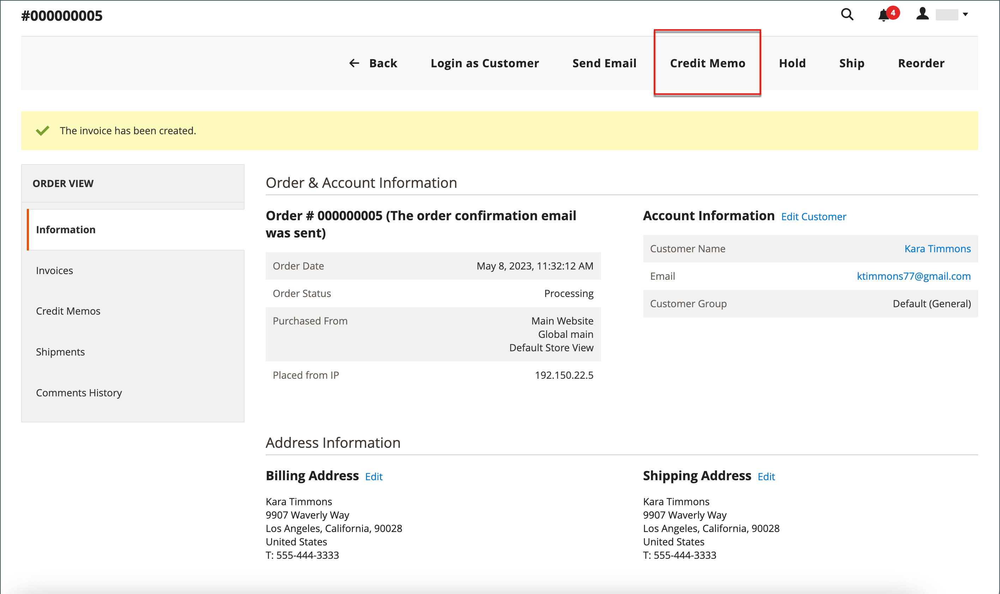
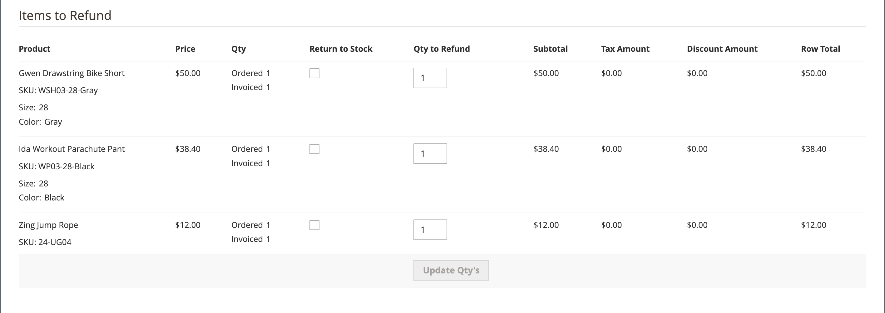
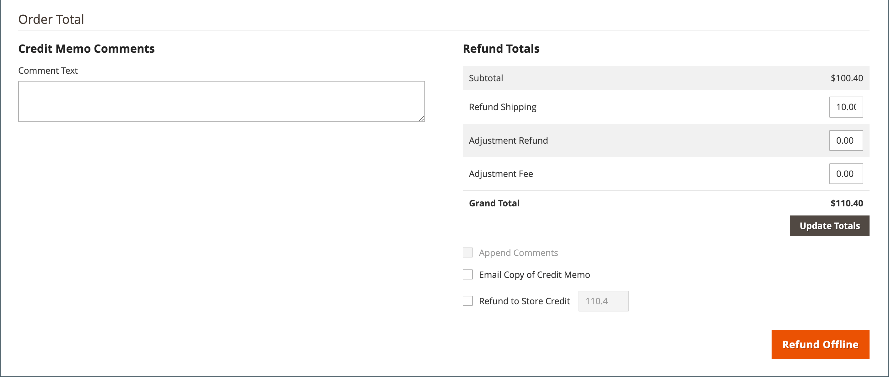
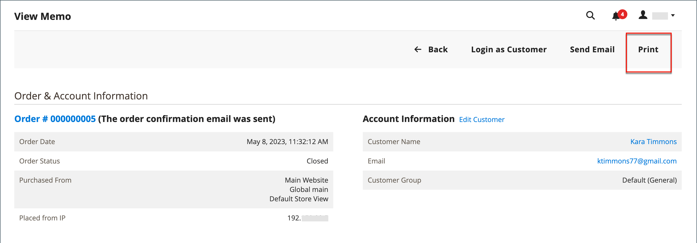
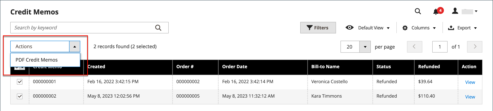

# クレジットメモの発行

クレジットメモを印刷する前に、最初に[請求済み注文](invoices.md#create-an-invoice)に対して生成する必要があります。 支払い方法に応じて、オンラインとオフラインの両方の払い戻し（部分的または完全）をオープンクレジットメモから発行できます。

-  （Adobe Commerceのみ）返金はストアクレジットに適用できます。
-  （Adobe Commerce B2Bで利用可能）払い戻しは、会社のクレジットに適用できます。
- クレジットカードで行った購入は、オンラインまたはオフラインで返金できます。
- 小切手またはマネーオーダーによる購入は、オフラインで返金する必要があります。

[ オープン状態](order-status.md)のクレジットメモには、未処理の返金期限があります。

クレジットメモを使用すると、次のことが可能になります。

- 請求書の全額を返金します。
- 請求書の一部を返金します。
- 請求書の一部を複数返金します。
- 注文ごとに複数の請求書を払い戻します（注文総額を超えない場合）。
- 注文の5枚のシャツのうち3枚など、1つの行項目の数量の一部を返金します。

詳しくは、[請求書の作成](invoices.md#create-an-invoice)を参照してください。

## 支払いアクション設定

クレジットカードで支払われた注文の払い戻しワークフローは、使用可能な各支払い方法の設定の[支払いアクション設定](../configuration-reference/sales/payment-methods.md#payment-actions)によって決まります。 返金は、取引が決済されるまで発行できません。

{width="600" zoomable="yes"}

- 設定した支払い方法の支払いアクションが`Authorize`に設定されている場合は、クレジットメモを作成する前に、まず管理者から請求書を生成する必要があります。
- 設定した支払い方法の支払いアクションが`Authorize and Capture`に設定されている場合、請求書は既に支払い処理業者によって生成されていますが、取引が決済されるまで資金は利用できません。 この短い待ち時間は、多くの決済代行会社がセキュリティ対策として推奨しており、通常は自動的に処理されます。 取引は、決済代行会社の加盟店アカウントから手動で決済することもできます。
-  （Adobe Commerceのみ）ギフトオプションを含む注文のクレジットメモを作成する場合、ギフトラッピングや印刷されたカードの払い戻しは、クレジットメモの「払い戻し合計」セクションに表示されます。 返金する金額からこれらの費用を除外するには、調整手数料として金額を入力します。 同じ注文に対して複数のクレジットメモが発行された場合、ギフトオプションの払い戻しは、最初のクレジットメモにのみ表示されます。

## クレジットメモの作成

発行する払い戻しのタイプ（[ クレジット購入](#issue-a-refund-for-a-credit-purchase)または[小切手またはマネーオーダー](#issue-an-offline-refund-for-check-or-money-order)）を決定し、クレジットメモを生成して払い戻しを発行します。

### クレジット購入の払い戻しを発行

1. _管理者_ サイドバーで、**[!UICONTROL Sales]** > **[!UICONTROL Orders]**&#x200B;に移動します。

   {width="700" zoomable="yes"}

1. グリッドで順序を検索し、**[!UICONTROL View]**&#x200B;をクリックします。

1. _[!UICONTROL Credit Memo]_ボタンがボタンバーに表示されている場合は、次のいずれかの操作を行います。

   - `offline`件の返金を行うには、手順#6に進みます。
   - `online`の返金を発行するには、手順#4に進みます。

   オフラインおよびオンラインでの返金について詳しくは、[ クレジットメモ ](credit-memos.md)を参照してください。

1. 左側のパネルで「**[!UICONTROL Invoices]**」をクリックします。

1. グリッドで請求書を検索し、**[!UICONTROL View]**&#x200B;をクリックします。

   {width="700" zoomable="yes"}

1. 請求書の&#x200B;**[!UICONTROL Invoice Totals]** セクションまで下にスクロールし、請求書が`Capture Online`に設定されていることを確認して、**[!UICONTROL Submit Invoice]**&#x200B;をクリックします。

   {width="600" zoomable="yes"}

   このオプションが使用できない場合は、請求書は既に作成されています。 次の手順に進みます。

1. 請求書の上部にあるボタンバーで、**[!UICONTROL Credit Memo]**&#x200B;をクリックします。

1. **[!UICONTROL Items to Refund]** セクションの情報を確認し、該当する場合は次の操作を行います。

   - 商品を在庫に戻すには、**[!UICONTROL Return to Stock]** チェックボックスを選択します。

     _商品ストックオプション_&#x200B;が`Automatically Return Credit Memo Item to Stock`に設定されている場合、商品は自動的に在庫に戻ります。 [Inventory managementが有効になっている](../inventory-management/enable.md)場合、商品は配送を送信したソースに戻ります。

   - **[!UICONTROL Qty to Refund]**&#x200B;を更新し、**[!UICONTROL Update Qty's]**&#x200B;をクリックします。

     {width="600" zoomable="yes"}

1. 次のように&#x200B;**[!UICONTROL Refunds Totals]** セクションを更新します。

   - **[!UICONTROL Refund Shipping]**&#x200B;について、送料から返金される金額を入力します。

     このフィールドには、最初に、返金可能な注文の合計配送金額が表示されます。 これは、注文の全配送金額に相当します。返金済みの配送金額を差し引きます。 量と同様に、量を減らすことができますが、増やすことはできません。

   - **[!UICONTROL Adjustment Refund]**&#x200B;に、注文の特定の部分（配送、品目、または税金）に適用されない追加払い戻しとして、返金される合計金額に追加する値を入力します。 また、管理者が非仮想決済方法を最初に払い戻したい場合は、ギフトカードなどのバーチャルマネーで部分的な払い戻しに使用することもできます。

     入力された金額は、払い戻された金額を超えて払い戻しの合計金額を引き上げることはできません。

   - **[!UICONTROL Adjustment Fee]**&#x200B;に、返金された合計金額から減算する値を入力します。

     この金額は、発送、商品、税金など、注文の特定のセクションから引き算されるものではありません。

1. コメントを追加するには、**[!UICONTROL Credit Memo Comments]** ボックスにテキストを入力します。

   - お客様にメール通知を送信するには、**[!UICONTROL Email Copy of Credit Memo]** チェックボックスをオンにします。

1. **[!UICONTROL Update Totals]**&#x200B;をクリックします。

1. 必要に応じて、次の操作を行います。

   -  （Adobe Commerceのみ）お客様の店舗クレジットに返金するには、「**[!UICONTROL Refund to Store Credit]**」チェックボックスをオンにします。

   -  （Adobe Commerce B2Bで利用可能）お客様の会社のクレジットに金額を返金するには、**[!UICONTROL Refund to Company Credit]** チェックボックスを選択します。

   - オフラインでの返金を発行するには、**[!UICONTROL Refund Offline]**&#x200B;をクリックします。

   - オンラインで返金するには、**[!UICONTROL Refund]**&#x200B;をクリックしてください。

   -  （Adobe Commerce B2Bで利用可能）購入が会社のクレジットで支払われた場合は、**[!UICONTROL Refund to Company Credit]**&#x200B;をクリックします。

   オフラインおよびオンラインでの返金について詳しくは、[ クレジットメモ ](credit-memos.md)を参照してください。

   {width="600" zoomable="yes"}

### 小切手またはマネーオーダーのオフライン払い戻しを発行

1. _管理者_ サイドバーで、**[!UICONTROL Sales]** > **[!UICONTROL Orders]**&#x200B;に移動します。

1. 完了した注文をグリッドで検索し、**[!UICONTROL View]** リンクをクリックして開きます。

1. ページ上部のボタンバーで、**[!UICONTROL Invoice]**&#x200B;をクリックします。

1. ページの一番下までスクロールして、**[!UICONTROL Submit Invoice]**&#x200B;をクリックします。

1. 請求書の上部にあるボタンバーで、**[!UICONTROL Credit Memo]**&#x200B;をクリックします。

   {width="600" zoomable="yes"}

1. **[!UICONTROL Items to Refund]** セクションの情報を確認し、該当する場合は次の操作を行います。

   {width="600" zoomable="yes"}

   - 返品された商品を在庫に戻す場合は、**[!UICONTROL Return to Stock]** チェックボックスを選択します。

     Inventory managementを有効にすると、在庫量は出荷を送信したソースに戻ります。 [商品ストックオプション ](../inventory-management/enable.md)が`Automatically Return Credit Memo Item to Stock`に設定されている場合、商品は自動的に在庫に戻ります。

   - **[!UICONTROL Qty to Refund]**&#x200B;を更新し、**[!UICONTROL Update Qty's]**&#x200B;をクリックします。

     クレジットする金額は、返金可能な最大金額を超えることはできません。

1. 該当する場合は、**[!UICONTROL Refunds Totals]** セクションを更新します。

   - **[!UICONTROL Refund Shipping]**&#x200B;について、送料から返金される金額を入力します。

     このフィールドには、最初に、返金可能な注文の合計配送金額が表示されます。 これは、注文の全配送金額に相当します。返金済みの配送金額を差し引きます。 量と同様に、量を減らすことができますが、増やすことはできません。

   - **[!UICONTROL Adjustment Refund]**&#x200B;に、注文の特定の部分（配送、品目、または税金）に適用されない追加払い戻しとして、返金される合計金額に追加する値を入力します。 また、管理者が非仮想決済方法を最初に払い戻したい場合は、ギフトカードなどのバーチャルマネーで部分的な払い戻しに使用することもできます。

     入力された金額は、払い戻された金額を超えて払い戻しの合計金額を引き上げることはできません。

   - **[!UICONTROL Adjustment Fee]**&#x200B;に、返金された合計金額から減算する値を入力します。

     この金額は、発送、商品、税金など、注文の特定のセクションから引き算されるものではありません。

   - 購入がストアクレジットで支払われた場合は、**[!UICONTROL Refund to Store Credit]** チェックボックスを選択して、金額を顧客アカウント残高にクレジットします。

1. コメントを追加するには、**[!UICONTROL Credit Memo Comments]** ボックスにテキストを入力し、次の操作を行います。

   - お客様にメール通知を送信するには、**[!UICONTROL Email Copy of Credit Memo]** チェックボックスをオンにします。

   - 電子メールに入力したコメントを含めるには、「**[!UICONTROL Append Comments]**」チェックボックスを選択します。

     クレジットメモ通知のステータスは、クレジットメモ番号の横にある完了したクレジットメモに表示されます。

     {width="600" zoomable="yes"}

1. 処理を完了して払い戻しを発行するには、**[!UICONTROL Refund Offline]**&#x200B;をクリックします。

## フィールドの説明

### [!UICONTROL Order & Account Information]

| フィールド | 説明 |
|--- |--- |
| [!UICONTROL Order Number] | 注文番号は&#x200B;_注文情報とアカウント情報_&#x200B;に表示され、その後に確認メールが送信されたかどうかを示すメモが表示されます。 |
| [!UICONTROL Order Date] | 注文が行われた日時。 |
| [!UICONTROL Order Status] | 注文ステータスを`Complete`として示します。 |
| [!UICONTROL Purchased From] | 注文が行われたweb サイト、ストア、ストアビューを示します。 |
| [!UICONTROL Placed from IP] | 注文が行われたコンピューターのIP アドレスを示します。 |

{style="table-layout:auto"}

### [!UICONTROL Account Information]

| フィールド | 説明 |
|--- |--- |
| [!UICONTROL Customer Name] | 注文した顧客または購入者の名前。 顧客名は顧客プロファイルにリンクされています。 |
| [!UICONTROL Email] | 顧客または購入者のメールアドレス。 メールアドレスがリンクされ、新しいメールメッセージが開きます。 |
| [!UICONTROL Customer Group] | 顧客が割り当てられている顧客グループまたは共有カタログの名前。 |
| [!UICONTROL Company Name] |  （Adobe Commerce B2Bで利用可能）購入者に関連付けられ、注文が行われる会社の名前。 会社名は会社プロファイルにリンクされています。 |

{style="table-layout:auto"}

### [!UICONTROL Address Information]

| フィールド | 説明 |
|--- |--- |
| [!UICONTROL Billing Address] | 注文を行った顧客または購入者の名前の後に、請求先住所、電話番号、および[VAT](vat.md) （該当する場合）が続きます。 電話番号は、モバイルデバイス上のオートダイヤルにリンクされています。 |
| [!UICONTROL Shipping Address] | 注文を発送する担当者の名前の後に、配送先住所と電話番号が続きます。 電話番号は、モバイルデバイス上のオートダイヤルにリンクされています。 |

{style="table-layout:auto"}

### [!UICONTROL Payment & Shipping Method]

| フィールド | 説明 |
|--- |--- |
| [!UICONTROL Payment Information] | 注文に使用する支払い方法、および注文番号（該当する場合）、その後に注文を行うために使用された通貨。 注文がアカウント ](../b2b/enable-basic-features.md#configure-payment-on-account)の[支払いを使用して会社のクレジットに請求された場合、アカウントに請求された金額が表示されます。 |
| [!UICONTROL Shipping & Handling Information] | 使用する配送方法、および適用される処理手数料。 |

{style="table-layout:auto"}

### [!UICONTROL Items to Refund]

| フィールド | 説明 |
|--- |--- |
| [!UICONTROL Product] | 製品名、SKU、オプション（該当する場合）。 |
| [!UICONTROL Price] | 商品の購入価格。 Adobe Commerce B2Bの場合、この値には、共有カタログから商品に適用された割引が反映されます（該当する場合）。 |
| [!UICONTROL Qty] | 注文数量。 |
| [!UICONTROL Return to Stock] | 返品商品を在庫に返品するかどうかを示すチェックボックス。 |
| [!UICONTROL Qty to Refund] | 製品から返されるユニット数を示します。 |
| [!UICONTROL Subtotal] | 小計は、購入価格に返品商品の数量を掛けた値です。 |
| [!UICONTROL Tax Amount] | 返品品目に適用される税額を10進数値として指定します。 |
| [!UICONTROL Tax Percent] | 返品品目に適用される税金の割合（パーセント）。 |
| [!UICONTROL Discount Amount] | 返品商品に適用される割引。 |
| [!UICONTROL Row Total] | 返品商品レベルの支払い期限が迫っている適用税を含む、行項目の合計（割引を除く）。 |
| _注文合計_ |  |

{style="table-layout:auto"}

### [!UICONTROL Credit Memo Comments]

| フィールド | 説明 |
|--- |--- |
| [!UICONTROL Comment Text] | クレジットメモに関する顧客へのコメントを入力するために使用されるテキストボックス。 |

{style="table-layout:auto"}

### [!UICONTROL Refund Totals]

| フィールド | 説明 |
|--- |--- |
| [!UICONTROL Refund Shipping] | 返金される送料金額。 |
| [!UICONTROL Adjustment Refund] | 注文の特定の部分（配送、商品、税金など）には適用されない追加払い戻しとして払い戻される合計金額に追加される金額。 入力された金額は、支払われた金額を超えて払い戻しの合計金額を引き上げることはできません。 |
| [!UICONTROL Adjustment Fee] | 返品手数料など、返金された合計金額から差し引かれる金額、またはギフトの包装またはギフトオプションに関連する金額。 |
| [!UICONTROL Grand Total] | 返金される合計金額 |
| [!UICONTROL Append Comments] | クレジットメモにコメントを含めるかどうかを決定するチェックボックス。 |
| [!UICONTROL Email Copy of Credit Memo] | クレジットメモのコピーを電子メールで送信するかどうかを決定するチェックボックス。 |
| [!UICONTROL Refund to Store Credit] | 合計を[ ストアクレジット ](../customers/store-credit-using.md)に返金するかどうかを判断する （Adobe Commerceのみ）チェックボックス。 |
| [!UICONTROL Subtotal] |  （Adobe Commerce B2Bで利用可能）返金されるすべての明細の合計。 |

{style="table-layout:auto"}

### 返金ボタン

注文に使用される支払い方法によって、クレジットメモで使用できる払い戻しボタンが決まります。

| ボタン | 説明 |
|--- |--- |
| **[!UICONTROL Refund]** | 当初の購入金額が支払いゲートウェイを通じてクレジットカードで支払われた場合、払い戻し金額は決済代行会社が管理します。 払い戻しを管理するには、支払いプロバイダーが提供するドキュメントを参照してください。 |
| **[!UICONTROL Refund Offline]** | 元の購入が小切手またはマネーオーダーで支払われた場合、返金は小切手、ギフトカード、または実店舗がある場合は現金を発行して、顧客に直接支払われます。 クレジットメモは、オフライン取引の記録として機能します。 |
| **[!UICONTROL Refund to Company Credit]** |  （Adobe Commerce B2Bで利用可能）購入が会社のクレジットに請求された場合、払い戻しは[会社口座](../b2b/credit-company.md)に戻されます。 |

{style="table-layout:auto"}

## クレジットメモの印刷

完了したクレジットメモを印刷または表示するには、PDF リーダーがインストールされている必要があります。 [Adobe Reader](https://www.adobe.com/acrobat/pdf-reader.html "Adobe Readerを入手")は無料でダウンロードできます。

1. _管理者_ サイドバーで、**[!UICONTROL Sales]** > _[!UICONTROL Operations]_>**[!UICONTROL Credit Memos]**に移動します。

1. クレジットメモを印刷するには、次のいずれかの方法を使用します。

### 方法1：現在のクレジットメモを印刷する

1. グリッドで、クレジットメモを開きます。

1. **[!UICONTROL Print]**&#x200B;をクリックします。

   {width="600" zoomable="yes"}

### 方法2：複数のクレジットメモを印刷する

1. リストで、印刷する各クレジットメモのチェックボックスをオンにします。

1. **[!UICONTROL Actions]** コントロールを`PDF Credit Memos`に設定し、**[!UICONTROL Submit]**&#x200B;をクリックします。

   {width="600" zoomable="yes"}

1. プロンプトが表示されたら、次のいずれかの操作を行います。

   - ドキュメントを保存するには、**[!UICONTROL Save]**&#x200B;をクリックし、プロンプトに従ってファイルをコンピューターに保存します。 ダウンロードが完了したら、Adobe ReaderでPDFを開き、ドキュメントを印刷します。

   - ドキュメントを表示するには、**[!UICONTROL Open]**&#x200B;をクリックします。 Adobe Readerで印刷可能なPDF クレジットメモが開きます。 ここから、クレジットメモを印刷するか、コンピューターに保存できます。
