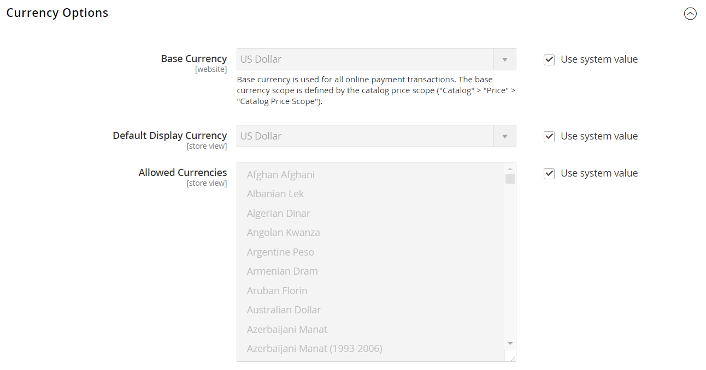
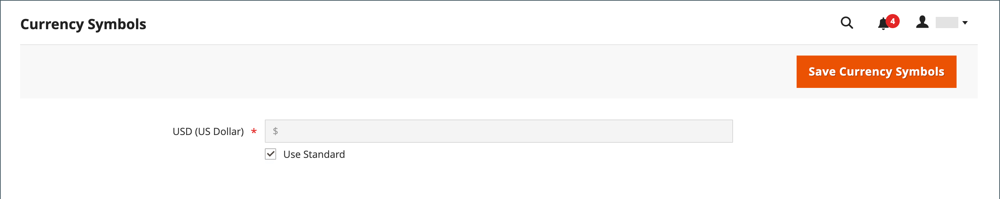

# 通貨設定

各通貨レートを設定する前に、まず[基本通貨](../configuration-reference/general/currency-setup.md)の範囲を設定する必要があります。 デフォルトではグローバルに設定されており、基本通貨設定が[ ストア階層全体](../getting-started/websites-stores-views.md)に適用されます。 マルチサイト Adobe CommerceまたはMagento Open Sourceをインストールしている場合は、スコープをweb サイトレベルに設定することで、複数の基本通貨を管理できます。

また、受け入れる通貨と、ストアでの[価格](../catalog/catalog-price-scope.md)の表示に使用する通貨を指定します。 次の図では、基本通貨の範囲がweb サイトレベルで設定されているので、各web サイトで異なる基本通貨を持つことができます。

{width="600" zoomable="yes"}

## ステップ 1：受け入れられる通貨を選択する

1. _管理者_ サイドバーで、**[!UICONTROL Stores]** > _[!UICONTROL Settings]_>**[!UICONTROL Configuration]**に移動します。

1. 左上隅で、設定が適用されるストアビューに&#x200B;**[!UICONTROL Scope]**&#x200B;を設定します。

1. _General_&#x200B;の下の左側のパネルで、**[!UICONTROL Currency Setup]**&#x200B;を選択します。

1. **[!UICONTROL Currency Options]** セクションのを展開し、次のオプションを設定します。

   - **[!UICONTROL Base Currency]** — オンライン トランザクションに使用するプライマリ通貨に設定します。

   - **[!UICONTROL Default Display Currency]** — ストアビューで価格を表示するために使用する通貨に設定します。

   - **[!UICONTROL Allowed Currencies]** — ストアビューで支払いとして受け入れるすべての通貨を選択します。 プライマリ通貨も選択してください。

     複数の通貨の場合は、Ctrl キー（PC）またはCommand キー（Mac）を押しながら、各オプションをクリックします。

   {width="600" zoomable="yes"}

   これらの各設定設定の詳細については、_設定リファレンスガイド_&#x200B;の[通貨オプション ](../configuration-reference/general/currency-setup.md)を参照してください。

1. キャッシュを更新するように求められたら、システムメッセージの右上隅にある&#x200B;_閉じる_ （）をクリックします。

   後で[ キャッシュを更新できます](../systems/cache-management.md)。

1. 基本通貨の範囲を定義します。

   - 左側のパネルで「**[!UICONTROL Catalog]**」を展開し、下の「**[!UICONTROL Catalog]**」を選択します。

   - 下にスクロールして、**[!UICONTROL Price]** セクションのを展開します。 （このセクションは、スコープが&#x200B;**[!UICONTROL Store View:]** _デフォルト設定_&#x200B;に設定されている場合にのみ表示されます）。

   - **[!UICONTROL Catalog Price Scope]**&#x200B;を`Global`または`Website`のいずれかに設定します。

   {width="600" zoomable="yes"}

## 手順2：読み込み接続の設定

1. ページの先頭までスクロールします。

1. 左側のパネルで、**[!UICONTROL General]**&#x200B;を展開し、**[!UICONTROL Currency Setup]**&#x200B;を選択します。

1. 通貨サービス接続を設定します。

   サービス オプションは3つあります：_[!UICONTROL Fixer.io (legacy)]_、_[!UICONTROL Fixer Api (APILayer)]_、_[!UICONTROL Currency Converter API]_

   >[!IMPORTANT]
   >
   >2.4.6 リリース以降、[[!DNL Fixer.io]](https://fixer.io/) サービスは非推奨となり、[[!DNL Fixer API]  （APILayer） ](https://apilayer.com/marketplace/fixer-api) サービスに置き換えられます。 非推奨の[!DNL Fixer.io] アカウントの代わりにAPILayer アカウントを使用することを強くお勧めします。

   - [fixer.io サービス ](https://fixer.io/):_に接続するには（_T）

      - **[!UICONTROL Fixer.io]** セクションのを展開します。

      - fixer.io **[!UICONTROL API key]**&#x200B;を入力します。

      - **[!UICONTROL Connection Timeout in Seconds]**&#x200B;の場合、接続がタイムアウトするまでに許可する非アクティブな時間の秒数を入力します。

     {width="600" zoomable="yes"}

   - [[!DNL Fixer Api (APILayer)]  サービス ](https://apilayer.com/):_に接続するには（_T）

      - **[!UICONTROL Fixer Api (APILayer)]** セクションのを展開します。

      - [!DNL APILayer] **[!UICONTROL API key]**&#x200B;を入力します。

      - **[!UICONTROL Connection Timeout in Seconds]**&#x200B;の場合、接続がタイムアウトするまでに許可する非アクティブな時間の秒数を入力します。

     {width="600" zoomable="yes"}

   - [[!DNL Currency Convertor API]  サービス ](https://free.currencyconverterapi.com/):_に接続するには（_T）

      - **[!UICONTROL Currency Convertor API]** セクションのを展開します。

      - 通貨コンバータ **[!UICONTROL API key]**&#x200B;を入力します。

      - **[!UICONTROL Connection Timeout in Seconds]**&#x200B;の場合、接続がタイムアウトするまでに許可する非アクティブな時間の秒数を入力します。

     {width="600" zoomable="yes"}

## 手順3：スケジュールされたインポート設定の設定

1. 通貨の設定を続けて、**[!UICONTROL Scheduled Import Settings]** セクションのを展開します。

   {width="600" zoomable="yes"}

1. 通貨レートを自動的に更新するには、**[!UICONTROL Enabled]**&#x200B;を`Yes`に設定します。

1. 更新オプションを設定します。

   - **[!UICONTROL Service]** — レートプロバイダーに設定します。 デフォルト値は`Fixer.io (legacy)`です。

   - **[!UICONTROL Start Time]** — スケジュールに従ってレートが更新される時間、分、秒に設定します。

   - **[!UICONTROL Frequency]** – 料金が更新される頻度を判断するには、次のいずれかに設定します。

      - `Daily`
      - `Weekly`
      - `Monthly`

   - **[!UICONTROL Error Email Recipient]** — インポートプロセス中にエラーが発生した場合にメール通知を受け取るユーザーのメールアドレスを入力します。

     複数のメールアドレスを入力するには、それぞれにコンマで区切ります。

   - **[!UICONTROL Error Email Sender]** — エラー通知の送信者として表示される[ ストア連絡先](../getting-started/store-details.md#store-email-addresses)に設定します。

   - **[!UICONTROL Error Email Template]** — エラー通知に使用する電子メールテンプレートに設定します。

1. 完了したら、**[!UICONTROL Save Config]**&#x200B;をクリックします。

1. キャッシュの更新を求めるメッセージが表示されたら、**[!UICONTROL Cache Management]** リンクをクリックし、無効なキャッシュを更新します。

   {width="600" zoomable="yes"}

## 手順4：通貨レートの更新

通貨レートを有効にする前に、現在の値で更新する必要があります。 [料金を手動で更新するか、料金を自動的に読み込むには、](currency-update.md)してください。

## 手順5：通貨記号のカスタマイズ（オプション）

通貨記号を管理すると、ストアで支払いとして受け入れられる各通貨に関連付けられている記号をカスタマイズできます。

{width="600" zoomable="yes"}

1. _管理者_ サイドバーで、**[!UICONTROL Stores]** > _[!UICONTROL Currency]_>**[!UICONTROL Currency Symbols]**に移動します。

   ストアに対して有効になっている各通貨は、_[!UICONTROL Currency]_リストに表示されます。

1. 必要に応じて、リストの設定を変更します。

   - 使用する各通貨のカスタム記号を入力するか、各通貨の&#x200B;**[!UICONTROL Use Standard]** チェックボックスを選択します。

   - デフォルトのシンボルを上書きするには、_[!UICONTROL Use Standard]_チェックボックスをオフにして、使用するシンボルを入力します。

   >[!NOTE]
   >
   >通貨記号の配置を左から右に変更することはできません。

1. 完了したら、**[!UICONTROL Save Currency Symbols]**&#x200B;をクリックします。

1. キャッシュの更新を求めるメッセージが表示されたら、**[!UICONTROL Cache Management]** リンクをクリックし、無効なキャッシュを更新します。
